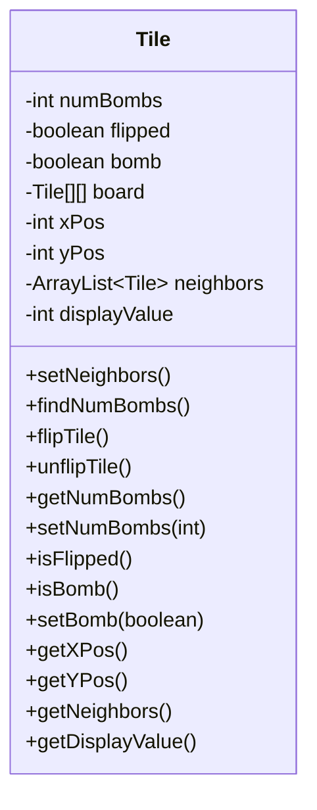
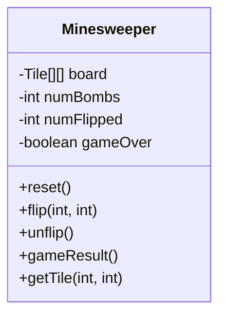
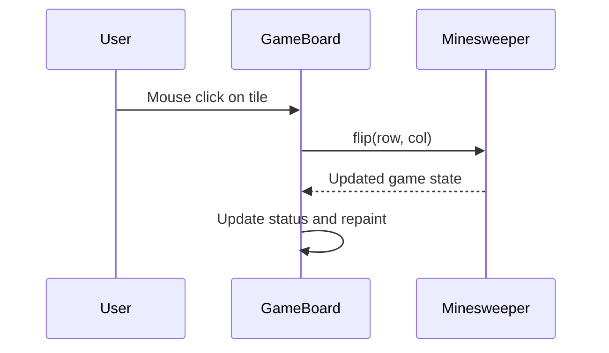
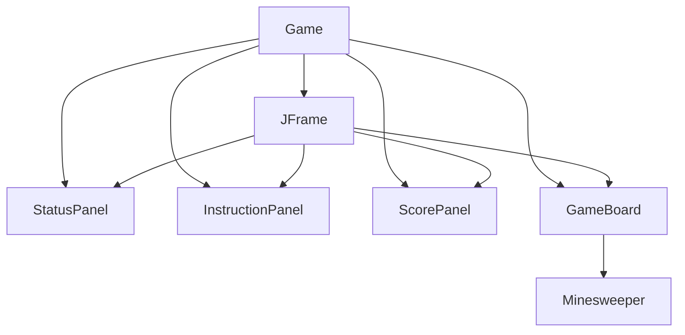
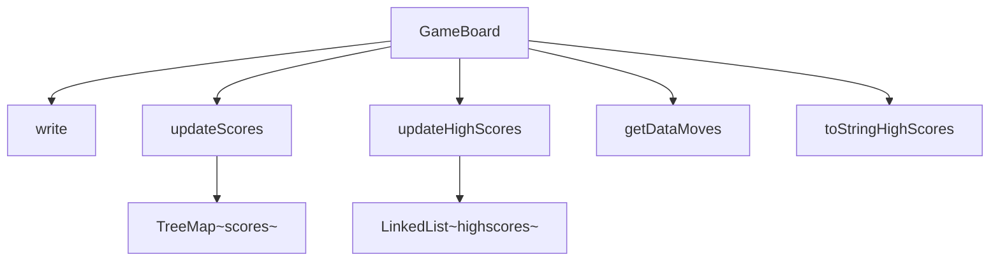
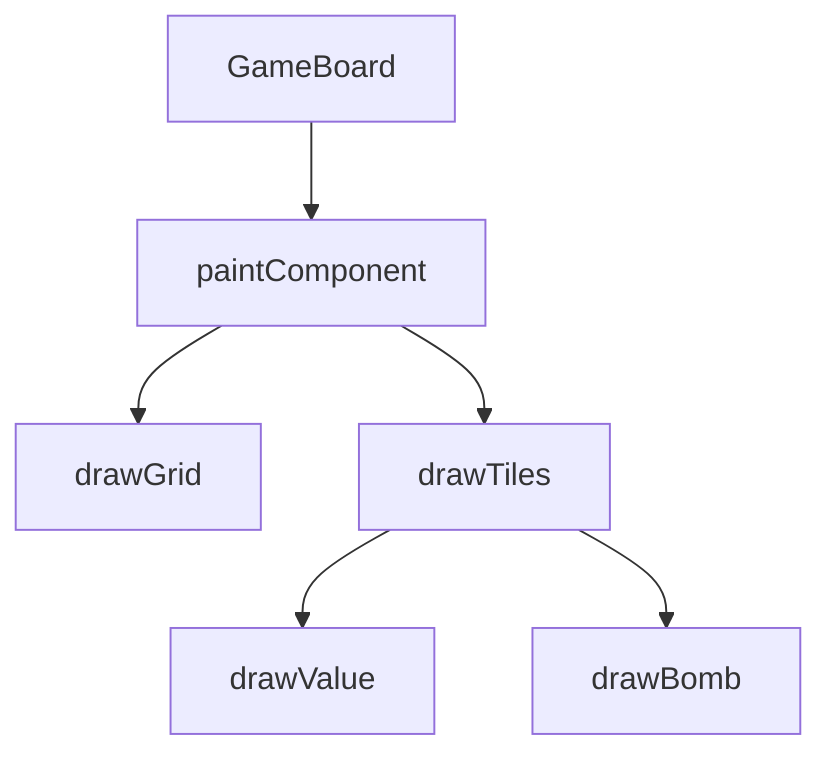

Relevant source files

The following files were used as context for generating this wiki page:

- [Game.java](https://github.com/aanickode/Minesweeper-Project/blob/main/Game.java)
- [GameBoard.java](https://github.com/aanickode/Minesweeper-Project/blob/main/GameBoard.java)
- [Tile.java](https://github.com/aanickode/Minesweeper-Project/blob/main/Tile.java)
- [Minesweeper.java](https://github.com/aanickode/Minesweeper-Project/blob/main/Minesweeper.java)

# Game Logic Implementation

## Introduction

The "Game Logic Implementation" in this project refers to the core functionality and mechanics that govern the behavior of the Minesweeper game. It encompasses the rules, game state management, user interactions, and the underlying data structures and algorithms that drive the game's logic.

The game follows a Model-View-Controller (MVC) design pattern, where the `Minesweeper` class serves as the model, the `GameBoard` class acts as the view and controller, and the `Game` class sets up the top-level frame and initializes the game components.

Sources: [Game.java](https://github.com/aanickode/Minesweeper-Project/blob/main/Game.java), [GameBoard.java](https://github.com/aanickode/Minesweeper-Project/blob/main/GameBoard.java), [Minesweeper.java](https://github.com/aanickode/Minesweeper-Project/blob/main/Minesweeper.java)

## Game Board and Tile Representation

The game board is represented as a 2D array of `Tile` objects, where each `Tile` represents a cell on the board. The `Tile` class encapsulates the state and behavior of an individual tile, including whether it is a bomb, flipped, or the number of adjacent bombs.

The `Tile` class maintains references to its neighboring tiles and provides methods to calculate the number of adjacent bombs, flip or unflip the tile, and access its state.

Sources: [Tile.java](https://github.com/aanickode/Minesweeper-Project/blob/main/Tile.java)

## Game State Management

The `Minesweeper` class serves as the model for the game, managing the game state, board initialization, and game logic. It provides methods to reset the game, flip tiles, and determine the game result (win, lose, or ongoing).

The `Minesweeper` class maintains the game board, the number of bombs, the number of flipped tiles, and the game over state. It exposes methods to reset the game, flip or unflip tiles based on user input, and determine the game result based on the current state.

Sources: [Minesweeper.java](https://github.com/aanickode/Minesweeper-Project/blob/main/Minesweeper.java)

## User Interaction and Game Flow

The `GameBoard` class acts as the view and controller, handling user interactions and updating the game state accordingly. It sets up the game board UI, listens for mouse clicks, and updates the game board based on the model's state.

The `GameBoard` class also manages the game timer, move counter, and leaderboard display. It provides methods to reset the game, undo a move, and update the game status based on the game result.

Sources: [GameBoard.java](https://github.com/aanickode/Minesweeper-Project/blob/main/GameBoard.java)

## Game Setup and Initialization

The `Game` class sets up the top-level frame and initializes the game components, including the status panel, instructions panel, score panel, and the `GameBoard` instance.

The `Game` class also sets up the reset and undo buttons, which trigger the corresponding actions in the `GameBoard` when clicked.

Sources: [Game.java](https://github.com/aanickode/Minesweeper-Project/blob/main/Game.java)

## Leaderboard and Score Management

The `GameBoard` class manages the leaderboard and score tracking functionality. It reads and writes game scores to a file (`FastestTime.txt`) and maintains a `TreeMap` to store the scores sorted by time.

The `write` method writes the current game time and number of moves to the `FastestTime.txt` file. The `updateScores` method reads the file and populates the `scores` `TreeMap` with the game times as keys and the number of moves as values. The `updateHighScores` method sorts the `scores` `TreeMap` and extracts the top 5 scores into the `highscores` `LinkedList`. The `getDataMoves` method retrieves the number of moves for a given game time, and the `toStringHighScores` method converts the `highscores` list into a string for display.

Sources: [GameBoard.java](https://github.com/aanickode/Minesweeper-Project/blob/main/GameBoard.java)

## Game Board Rendering

The `GameBoard` class also handles the rendering of the game board using the `paintComponent` method. It draws the grid lines, flipped tiles with their respective values or bomb symbols, and unflipped tiles as blank cells.

The `paintComponent` method iterates over the game board tiles and renders them based on their state (flipped, bomb, or unflipped). It draws the grid lines, flipped tiles with their respective values or bomb symbols, and unflipped tiles as blank cells.

Sources: [GameBoard.java](https://github.com/aanickode/Minesweeper-Project/blob/main/GameBoard.java)

## Conclusion

The "Game Logic Implementation" in this Minesweeper project follows the Model-View-Controller design pattern, with the `Minesweeper` class serving as the model, the `GameBoard` class acting as the view and controller, and the `Game` class setting up the top-level frame and initializing the game components. The game board is represented as a 2D array of `Tile` objects, and the game state is managed by the `Minesweeper` class. User interactions are handled by the `GameBoard` class, which updates the game state and renders the game board accordingly. Additionally, the `GameBoard` class manages the leaderboard and score tracking functionality, reading and writing game scores to a file and maintaining a sorted list of high scores.