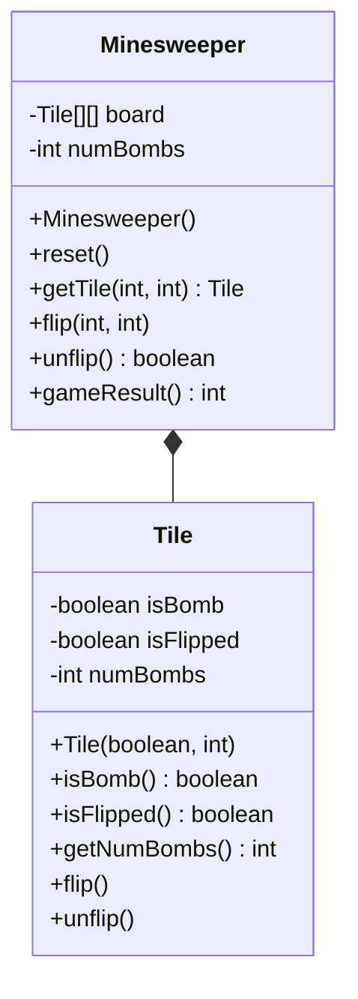
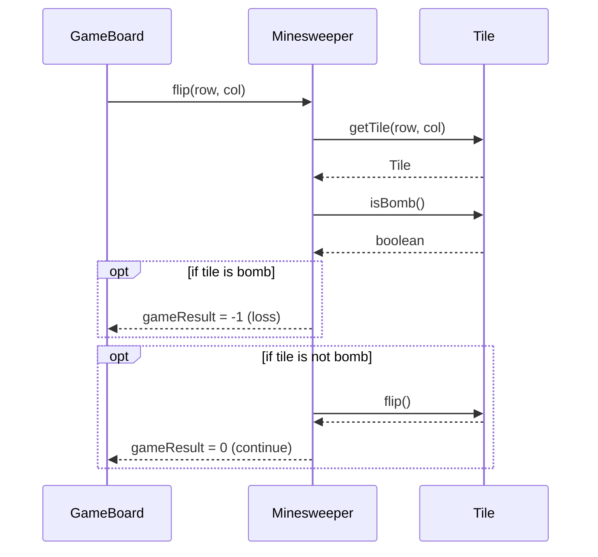

<details>
<summary>Relevant source files</summary>

The following files were used as context for generating this wiki page:

- [Game.java](https://github.com/aanickode/Minesweeper-Project/blob/main/Game.java)
- [GameBoard.java](https://github.com/aanickode/Minesweeper-Project/blob/main/GameBoard.java)
- [Minesweeper.java](https://github.com/aanickode/Minesweeper-Project/blob/main/Minesweeper.java)
- [Tile.java](https://github.com/aanickode/Minesweeper-Project/blob/main/Tile.java)
- [Files/FastestTime.txt](https://github.com/aanickode/Minesweeper-Project/blob/main/Files/FastestTime.txt)

</details>

# Game Logic

## Introduction

The "Game Logic" module is responsible for managing the core gameplay mechanics and rules of the Minesweeper game. It handles the game board initialization, tile flipping, win/loss conditions, and tracking game statistics like time and moves. The primary classes involved are `Minesweeper`, `GameBoard`, and `Tile`.

Sources: [Game.java](https://github.com/aanickode/Minesweeper-Project/blob/main/Game.java), [GameBoard.java](https://github.com/aanickode/Minesweeper-Project/blob/main/GameBoard.java), [Minesweeper.java](https://github.com/aanickode/Minesweeper-Project/blob/main/Minesweeper.java), [Tile.java](https://github.com/aanickode/Minesweeper-Project/blob/main/Tile.java)

## Game Board Initialization

The `Minesweeper` class initializes the game board, which is an 8x8 grid of `Tile` objects. It randomly places 10 bombs on the board and calculates the number of adjacent bombs for each non-bomb tile.



Sources: [Minesweeper.java:12-83](https://github.com/aanickode/Minesweeper-Project/blob/main/Minesweeper.java#L12-L83), [Tile.java:4-41](https://github.com/aanickode/Minesweeper-Project/blob/main/Tile.java#L4-L41)

## Tile Flipping

When the user clicks on a tile, the `GameBoard` class calls the `flip` method in `Minesweeper`, passing the row and column indices. If the clicked tile is a bomb, the game ends with a loss. If it's a non-bomb tile, it gets flipped, revealing the number of adjacent bombs.



Sources: [GameBoard.java:50-61](https://github.com/aanickode/Minesweeper-Project/blob/main/GameBoard.java#L50-L61), [Minesweeper.java:63-77](https://github.com/aanickode/Minesweeper-Project/blob/main/Minesweeper.java#L63-L77), [Tile.java:30-35](https://github.com/aanickode/Minesweeper-Project/blob/main/Tile.java#L30-L35)

## Game State and Win/Loss Conditions

The `gameResult` method in `Minesweeper` determines the current game state based on the board configuration. If all non-bomb tiles are flipped, the game is won. If a bomb tile is flipped, the game is lost.

```mermaid
graph TD
    A[gameResult()] --> B{All non-bomb tiles flipped?}
    B -->|Yes| C[Return 1 (Win)]
    B -->|No| D{Any bomb tile flipped?}
    D -->|Yes| E[Return -1 (Loss)]
    D -->|No| F[Return 0 (Continue)]
```

Sources: [Minesweeper.java:79-83](https://github.com/aanickode/Minesweeper-Project/blob/main/Minesweeper.java#L79-L83)

## Game Statistics Tracking

The `GameBoard` class tracks the game time using a `Timer` and the number of moves made by the player. These statistics are displayed in the game status label and used to calculate high scores.

| Component | Description |
| --- | --- |
| `Timer` | Keeps track of the elapsed time since the game started. |
| `numMoves` | Counts the number of moves (tile flips) made by the player. |
| `status` label | Displays the current game time and number of moves. |

Sources: [GameBoard.java:35-43](https://github.com/aanickode/Minesweeper-Project/blob/main/GameBoard.java#L35-L43), [GameBoard.java:50-61](https://github.com/aanickode/Minesweeper-Project/blob/main/GameBoard.java#L50-L61), [GameBoard.java:93-103](https://github.com/aanickode/Minesweeper-Project/blob/main/GameBoard.java#L93-L103)

## High Score Tracking

The `GameBoard` class maintains a leaderboard of high scores based on the game time and number of moves. It reads and writes high score data from/to a file named `FastestTime.txt`.

```mermaid
graph TD
    A[updateScores()] --> B[Read FastestTime.txt]
    B --> C{File exists?}
    C -->|Yes| D[Parse file contents]
    C -->|No| E[Create empty TreeMap]
    D --> F[Store time and moves in TreeMap]
    F --> G[updateHighScores()]
    G --> H[Sort TreeMap keys]
    H --> I[Select top 5 scores]
    I --> J[Display high scores]
```

Sources: [GameBoard.java:125-172](https://github.com/aanickode/Minesweeper-Project/blob/main/GameBoard.java#L125-L172), [GameBoard.java:181-186](https://github.com/aanickode/Minesweeper-Project/blob/main/GameBoard.java#L181-L186), [Files/FastestTime.txt](https://github.com/aanickode/Minesweeper-Project/blob/main/Files/FastestTime.txt)

## Game Reset and Undo

The `GameBoard` class provides functionality to reset the game or undo the last move.

- `reset()` resets the game board, timer, and move count, and updates the high scores if the previous game was won.
- `undo()` reverts the last tile flip if possible and adjusts the move count accordingly.

Sources: [GameBoard.java:72-89](https://github.com/aanickode/Minesweeper-Project/blob/main/GameBoard.java#L72-L89), [GameBoard.java:91-92](https://github.com/aanickode/Minesweeper-Project/blob/main/GameBoard.java#L91-L92), [Minesweeper.java:85-88](https://github.com/aanickode/Minesweeper-Project/blob/main/Minesweeper.java#L85-L88)

## Conclusion

The "Game Logic" module is the core of the Minesweeper game, handling the game board initialization, tile flipping mechanics, win/loss conditions, and tracking game statistics like time and moves. It also manages high score data persistence and provides functionality for resetting and undoing moves. The module follows a modular design, with the `Minesweeper` class serving as the game model, the `GameBoard` class handling the game view and controller logic, and the `Tile` class representing individual board tiles.