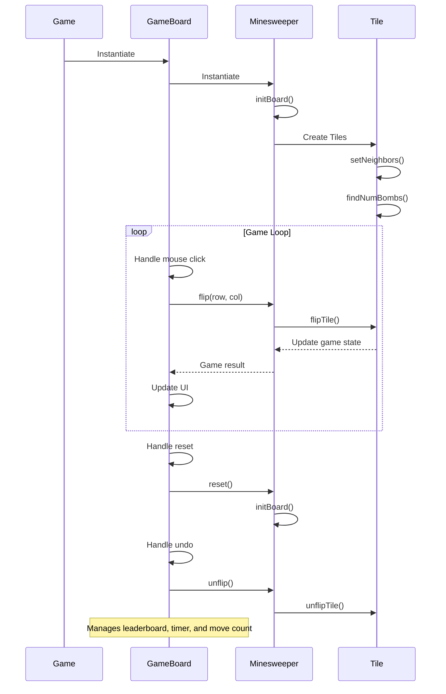

<details>
<summary>Relevant source files</summary>

The following files were used as context for generating this wiki page:

- [Game.java](https://github.com/aanickode/Minesweeper-Project/blob/main/Game.java)
- [GameBoard.java](https://github.com/aanickode/Minesweeper-Project/blob/main/GameBoard.java)
- [Tile.java](https://github.com/aanickode/Minesweeper-Project/blob/main/Tile.java)
- [Minesweeper.java](https://github.com/aanickode/Minesweeper-Project/blob/main/Minesweeper.java)
- [Files/FastestTime.txt](https://github.com/aanickode/Minesweeper-Project/blob/main/Files/FastestTime.txt)
</details>

# Game Logic

## Introduction

The "Game Logic" component is responsible for managing the core gameplay mechanics and rules of the Minesweeper game. It handles the game board initialization, tile flipping, bomb placement, win/loss conditions, and game state management. The game follows a Model-View-Controller (MVC) design pattern, where the `Minesweeper` class serves as the model, the `GameBoard` class acts as the view and controller, and the `Game` class sets up the top-level GUI frame and components.

Sources: [Game.java](https://github.com/aanickode/Minesweeper-Project/blob/main/Game.java), [GameBoard.java](https://github.com/aanickode/Minesweeper-Project/blob/main/GameBoard.java), [Minesweeper.java](https://github.com/aanickode/Minesweeper-Project/blob/main/Minesweeper.java)

## Game Board Initialization

The game board is represented by a 2D array of `Tile` objects, where each `Tile` can be either a bomb or a safe tile. The board is initialized with a fixed size of 8x8 tiles and 10 randomly placed bombs.

```java
public Minesweeper() {
    board = new Tile[8][8];
    initBoard();
}
```

The `initBoard()` method creates a new `Tile` object for each position on the board and randomly assigns 10 of them as bombs. It then sets the number of neighboring bombs for each safe tile using the `setNeighbors()` and `findNumBombs()` methods from the `Tile` class.

Sources: [Minesweeper.java:13-38](https://github.com/aanickode/Minesweeper-Project/blob/main/Minesweeper.java#L13-L38), [Tile.java:11-69](https://github.com/aanickode/Minesweeper-Project/blob/main/Tile.java#L11-L69)

## Tile Flipping

When the player clicks on a tile, the `flip()` method in the `Minesweeper` class is called with the row and column indices of the clicked tile. This method performs the following actions:

1. If the clicked tile is a bomb, the game ends with a loss.
2. If the clicked tile is safe and has no neighboring bombs, it recursively flips all adjacent safe tiles using the `flipTile()` method.
3. If the clicked tile is safe and has neighboring bombs, it flips only that tile and displays the number of neighboring bombs.

```java
public void flip(int row, int col) {
    if (!board[row][col].isFlipped()) {
        if (board[row][col].isBomb()) {
            gameStatus = -1;
        } else {
            flipTile(row, col);
        }
    }
}
```

Sources: [Minesweeper.java:40-50](https://github.com/aanickode/Minesweeper-Project/blob/main/Minesweeper.java#L40-L50), [Tile.java:34-37](https://github.com/aanickode/Minesweeper-Project/blob/main/Tile.java#L34-L37)

## Game State Management

The `Minesweeper` class keeps track of the game's current state (`gameStatus`) and provides a `gameResult()` method to check if the game has been won or lost.

```java
public int gameResult() {
    return gameStatus;
}
```

The `gameStatus` variable is updated based on the following conditions:

- If a bomb is flipped, `gameStatus` is set to -1 (loss).
- If all non-bomb tiles are flipped, `gameStatus` is set to 1 (win).
- Otherwise, `gameStatus` remains 0 (ongoing game).

Sources: [Minesweeper.java:52-66](https://github.com/aanickode/Minesweeper-Project/blob/main/Minesweeper.java#L52-L66)

## Undo and Reset

The `GameBoard` class provides methods to undo the last move (`undo()`) and reset the game (`reset()`).

The `undo()` method calls the `unflip()` method in the `Minesweeper` class, which unflips the last flipped tile and updates the game state accordingly.

```java
public void undo() {
    if (t.unflip()) {
        numMoves += 2;
        myTimer.start();
    }
    repaint();
    requestFocusInWindow();
}
```

Sources: [GameBoard.java:78-85](https://github.com/aanickode/Minesweeper-Project/blob/main/GameBoard.java#L78-L85), [Minesweeper.java:68-79](https://github.com/aanickode/Minesweeper-Project/blob/main/Minesweeper.java#L68-L79)

The `reset()` method resets the game board, timer, and move count, and updates the leaderboard if the previous game was won.

```java
public void reset() {
    if (t.gameResult() == 1) {
        write();
    }
    updateScores();
    updateHighScores();
    leaderBoard.setText(toStringHighScores());
    t.reset();
    startTime = System.currentTimeMillis();
    gameTime = 0;
    myTimer.restart();
    numMoves = 0;
    repaint();
    requestFocusInWindow();
}
```

Sources: [GameBoard.java:58-77](https://github.com/aanickode/Minesweeper-Project/blob/main/GameBoard.java#L58-L77), [Minesweeper.java:81-88](https://github.com/aanickode/Minesweeper-Project/blob/main/Minesweeper.java#L81-L88)

## Leaderboard and High Scores

The `GameBoard` class maintains a leaderboard of high scores based on the time taken to win the game and the number of moves made. The high scores are stored in a text file (`FastestTime.txt`) and loaded into a `TreeMap` data structure during game initialization.

```java
public void updateScores() {
    BufferedReader br = null;
    boolean hasValue = true;
    TreeMap<Integer, Integer> temp = new TreeMap<Integer, Integer>();
    try {
        br = new BufferedReader(new FileReader("Files/FastestTime.txt"));
    } catch (FileNotFoundException e) {
        System.out.println("File not found");
        hasValue = false;
    }
    // ... (read and parse scores from file)
    scores = temp;
}
```

The `updateHighScores()` method sorts the scores and selects the top 5 to display on the leaderboard.

Sources: [GameBoard.java:86-144](https://github.com/aanickode/Minesweeper-Project/blob/main/GameBoard.java#L86-L144), [Files/FastestTime.txt](https://github.com/aanickode/Minesweeper-Project/blob/main/Files/FastestTime.txt)

## Game Timer

The `GameBoard` class also manages a timer that keeps track of the time elapsed during the current game. The timer is implemented using a `Timer` object and an `ActionListener` that updates the game status label every second with the current time and move count.

```java
ActionListener gameTimer = new ActionListener() {
    @Override
    public void actionPerformed(ActionEvent e) {
        gameTime = (System.currentTimeMillis() - startTime) / 1000; 
        status.setText("Keep going!   Time: " + gameTime + "  NumMoves: " + numMoves);
    }
};
```

The timer is started when the game begins, stopped when the game ends, and restarted when the game is reset or an undo operation is performed.

Sources: [GameBoard.java:37-48](https://github.com/aanickode/Minesweeper-Project/blob/main/GameBoard.java#L37-L48), [GameBoard.java:58-77](https://github.com/aanickode/Minesweeper-Project/blob/main/GameBoard.java#L58-L77), [GameBoard.java:78-85](https://github.com/aanickode/Minesweeper-Project/blob/main/GameBoard.java#L78-L85)

## Game Flow

The overall game flow can be represented by the following sequence diagram:



Sources: [Game.java](https://github.com/aanickode/Minesweeper-Project/blob/main/Game.java), [GameBoard.java](https://github.com/aanickode/Minesweeper-Project/blob/main/GameBoard.java), [Minesweeper.java](https://github.com/aanickode/Minesweeper-Project/blob/main/Minesweeper.java), [Tile.java](https://github.com/aanickode/Minesweeper-Project/blob/main/Tile.java)

## Conclusion

The "Game Logic" component is responsible for managing the core gameplay mechanics of the Minesweeper game, including board initialization, tile flipping, game state management, undo/reset functionality, and leaderboard tracking. It follows the Model-View-Controller design pattern, with the `Minesweeper` class serving as the model, the `GameBoard` class acting as the view and controller, and the `Game` class setting up the top-level GUI. The game logic ensures that the game adheres to the rules of Minesweeper and provides a smooth and engaging user experience.

Sources: [Game.java](https://github.com/aanickode/Minesweeper-Project/blob/main/Game.java), [GameBoard.java](https://github.com/aanickode/Minesweeper-Project/blob/main/GameBoard.java), [Minesweeper.java](https://github.com/aanickode/Minesweeper-Project/blob/main/Minesweeper.java), [Tile.java](https://github.com/aanickode/Minesweeper-Project/blob/main/Tile.java)