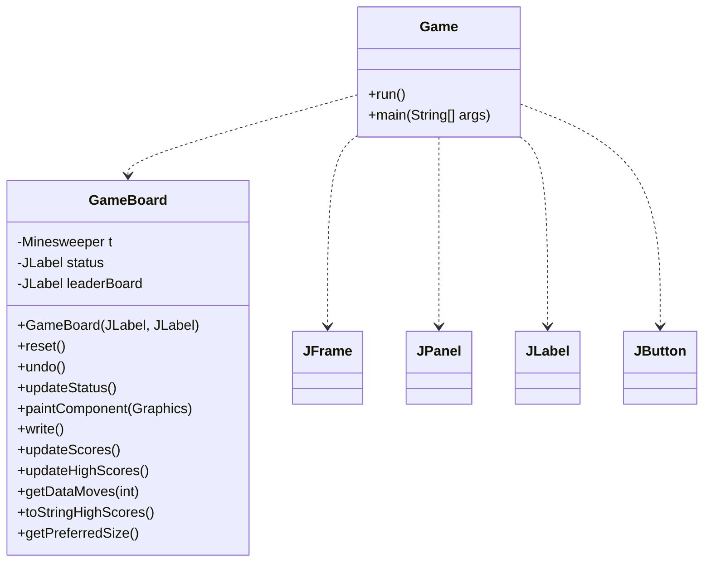
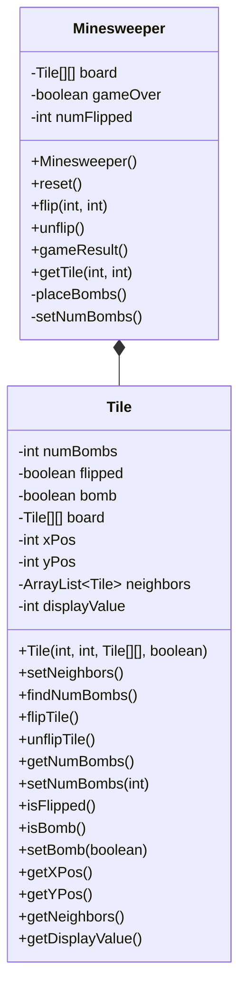
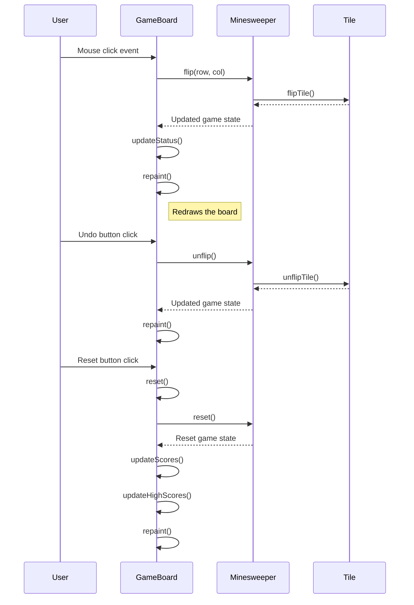
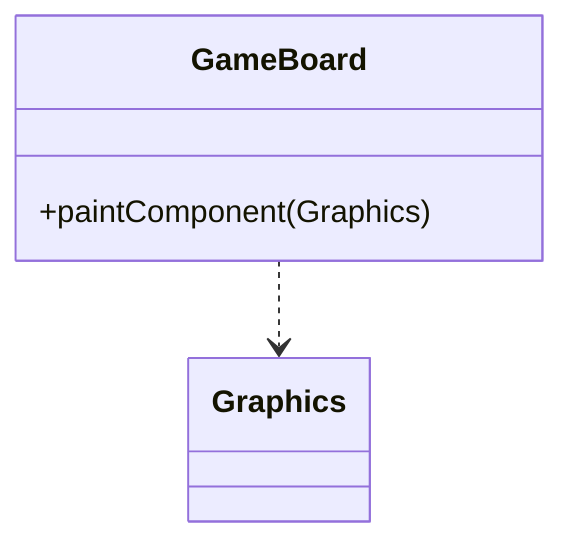
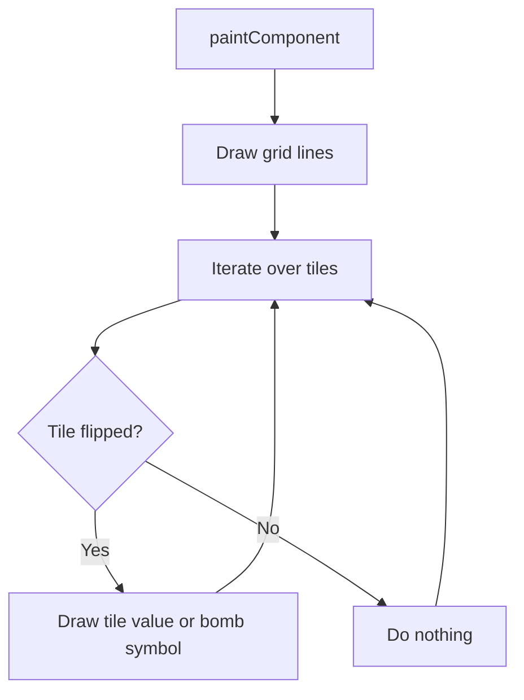
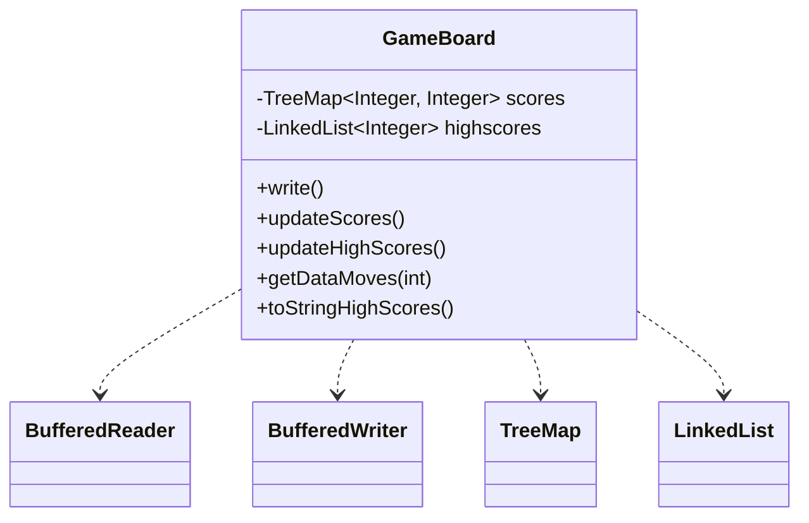

Relevant source files

The following files were used as context for generating this wiki page:

- [Game.java](https://github.com/aanickode/Minesweeper-Project/blob/main/Game.java)
- [GameBoard.java](https://github.com/aanickode/Minesweeper-Project/blob/main/GameBoard.java)
- [Tile.java](https://github.com/aanickode/Minesweeper-Project/blob/main/Tile.java)
- [Minesweeper.java](https://github.com/aanickode/Minesweeper-Project/blob/main/Minesweeper.java)
- [Files/FastestTime.txt](https://github.com/aanickode/Minesweeper-Project/blob/main/Files/FastestTime.txt)

# Game Logic

## Introduction

The game logic in this project revolves around the classic Minesweeper game, where the objective is to flip over all non-bomb tiles on a grid without detonating any bombs. The game follows a Model-View-Controller (MVC) design pattern, with the `Minesweeper` class serving as the model, the `GameBoard` class handling the view and controller responsibilities, and the `Game` class initializing the GUI and game components.

The game board consists of an 8x8 grid of `Tile` objects, each representing a single cell on the board. The `Minesweeper` class manages the game state, including the placement of bombs, tracking flipped tiles, and determining the game's outcome.

Sources: [Game.java](), [GameBoard.java](), [Tile.java](), [Minesweeper.java]()

## Game Initialization

The game is initialized in the `Game` class, which sets up the top-level frame and GUI components. The `GameBoard` instance is created and added to the frame's center, while other components like the status panel, instructions panel, and control panel are added to the respective layout positions.

The `GameBoard` constructor initializes the `Minesweeper` model and sets up event listeners for mouse clicks and timer events. The `reset()` method resets the game state, updates the high scores, and repaints the board.

Sources: [Game.java](), [GameBoard.java:15-196]()

## Game Model

The `Minesweeper` class represents the game model and manages the game state, including the board, tile states, and game outcome.

The `Minesweeper` class initializes the game board with `Tile` objects and places 10 bombs randomly on the board. It provides methods to flip and unflip tiles, check the game result, and retrieve tile information.

The `Tile` class represents a single cell on the game board and maintains its state (flipped, bomb, number of neighboring bombs) and position. It provides methods to set neighbors, find the number of neighboring bombs, flip/unflip the tile, and access its properties.

Sources: [Minesweeper.java](), [Tile.java]()

## Game Flow

The game flow is driven by the `GameBoard` class, which handles user interactions (mouse clicks) and updates the game state accordingly.

When the user clicks on a tile, the `GameBoard` calls the `flip()` method in the `Minesweeper` class, which updates the tile's state and checks for the game's outcome. The `GameBoard` then updates the status label and repaints the board to reflect the changes.

The undo button allows the user to revert the last move by calling the `unflip()` method in the `Minesweeper` class, which unflips the previously flipped tile.

The reset button triggers the `reset()` method in the `GameBoard` class, which resets the game state, updates the high scores, and repaints the board.

Sources: [GameBoard.java:38-63, 67-77, 81-91, 95-196](), [Minesweeper.java:19-21, 25-27, 31-33, 37-39, 43-45, 49-51, 55-57, 61-63, 67-69, 73-75, 79-81, 85-87]()

## Game Rendering

The `GameBoard` class is responsible for rendering the game board and its components using the `paintComponent()` method.

The `paintComponent()` method draws the grid lines, flipped tiles (with their respective values or bomb symbols), and any other visual elements on the game board.

Sources: [GameBoard.java:127-167]()

## High Score Management

The `GameBoard` class manages the high scores for the game, storing and retrieving them from a file named `FastestTime.txt`.

The `write()` method appends the current game's time and number of moves to the `FastestTime.txt` file.

The `updateScores()` method reads the `FastestTime.txt` file and populates a `TreeMap` with the time taken to win as the key and the number of moves as the value.

The `updateHighScores()` method sorts the scores in the `TreeMap` and selects the top 5 scores to be stored in a `LinkedList`.

The `getDataMoves()` method retrieves the number of moves for a given game time from the `TreeMap`.

The `toStringHighScores()` method converts the high scores in the `LinkedList` to a formatted string for display.

Sources: [GameBoard.java:199-276](), [Files/FastestTime.txt]()

## Conclusion

The game logic in this project follows the MVC design pattern, with the `Minesweeper` class serving as the model, the `GameBoard` class handling the view and controller responsibilities, and the `Game` class initializing the GUI and game components. The game flow is driven by user interactions (mouse clicks and button presses) in the `GameBoard` class, which updates the game state in the `Minesweeper` model and repaints the board accordingly. The high score management functionality is also implemented in the `GameBoard` class, allowing the game to persist and display the top scores across multiple sessions.