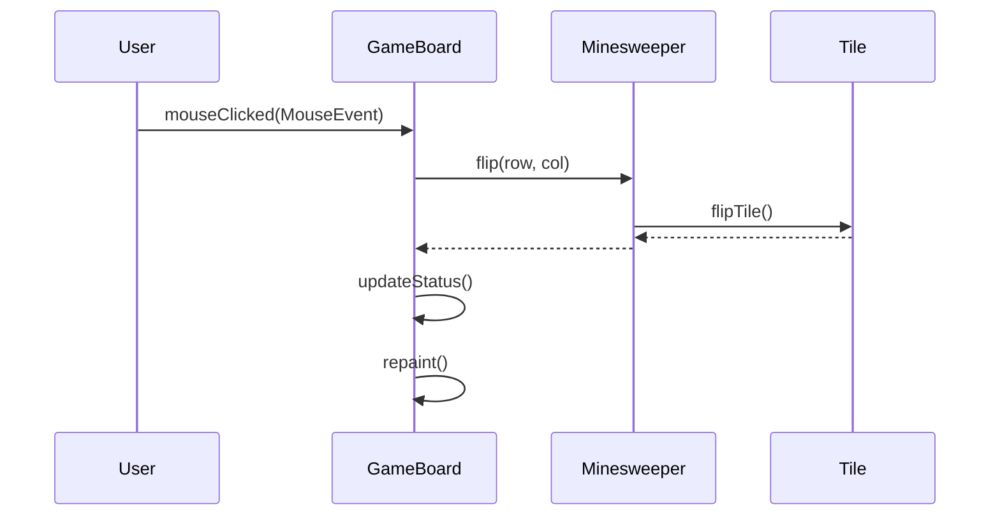
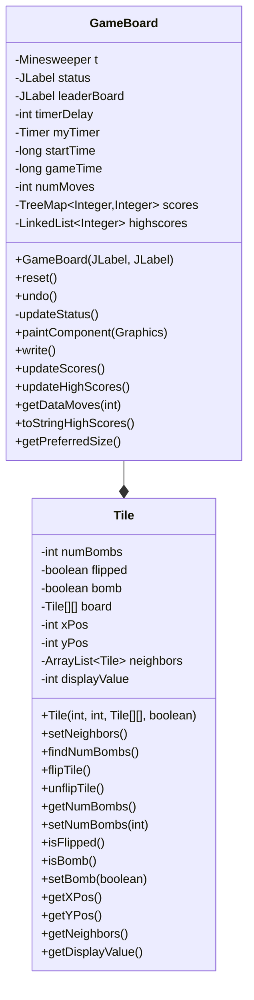

<details>
<summary>Relevant source files</summary>

The following files were used as context for generating this wiki page:

- [GameBoard.java](https://github.com/aanickode/Minesweeper-Project/blob/main/GameBoard.java)
- [Tile.java](https://github.com/aanickode/Minesweeper-Project/blob/main/Tile.java)

</details>

# Game Logic

## Introduction

The "Game Logic" module is responsible for managing the core gameplay mechanics and rules of the Minesweeper game. It handles the game board, tile interactions, win/loss conditions, and scoring. This module serves as the central component that orchestrates the overall game flow and state transitions.

## Game Board Initialization

The `GameBoard` class is the main entry point for the game logic. It initializes the game board, sets up the user interface components, and handles user interactions.

```java
public GameBoard(JLabel statusInit, JLabel leaderboardInit) {
    // ...
    t = new Minesweeper(); // initializes model for the game
    // ...
}
```

The `Minesweeper` class (not shown) likely represents the game model, which manages the game state and board configuration.

Sources: [GameBoard.java:34-41]()

## Tile Representation

The `Tile` class encapsulates the properties and behavior of individual tiles on the game board. Each tile can be in one of the following states:

- Flipped or unflipped
- Bomb or non-bomb
- Surrounded by a certain number of bombs (if non-bomb)

```java
public class Tile {
    private int numBombs;
    private boolean flipped;
    private boolean bomb;
    // ...
}
```

Sources: [Tile.java:5-8]()

## Game Board Rendering

The `GameBoard` class overrides the `paintComponent` method to render the game board and its tiles. It draws the grid lines and represents flipped tiles with their corresponding values or bomb symbols.

```java
@Override
public void paintComponent(Graphics g) {
    // ...
    for (int row = 0; row < 8; row++) {
        for (int col = 0; col < 8; col++) {
            Tile tile = t.getTile(row, col);
            if (tile.isFlipped() && !tile.isBomb()) {
                String s = String.valueOf(tile.getNumBombs());
                g.drawString(s, 50 * col + 25, 50 * row + 25);
            }
            if (tile.isFlipped() && tile.isBomb()) {
                g.drawLine(50 * col, 50 * row, 50 * col + 50, 50 * row + 50);
                g.drawLine(50 * col, 50 * row + 50, 50 * col + 50, 50 * row);
            }
        }
    }
}
```

Sources: [GameBoard.java:90-106]()

## Tile Interactions

The `GameBoard` class listens for mouse click events and updates the game state accordingly. When a tile is clicked, the `flip` method is called on the game model, which likely updates the tile's state and checks for win/loss conditions.

```java
addMouseListener(new MouseAdapter() {
    @Override
    public void mouseClicked(MouseEvent e) {
        Point p = e.getPoint();
        t.flip(p.y / 50, p.x / 50); // updates the model
        // ...
    }
});
```

Sources: [GameBoard.java:45-53]()

## Game State and Win/Loss Conditions

The `GameBoard` class keeps track of the game state and updates the user interface accordingly. The `gameResult` method (not shown) likely checks for win or loss conditions based on the game model's state.

```java
private void updateStatus() {
    int gameStatus = t.gameResult();
    if (gameStatus == 1) {
        // Game won
        myTimer.stop();
        status.setText("You won!!!  Time: " + gameTime + "  NumMoves: " + (numMoves + 1));
    } else if (gameStatus == -1) {
        // Game lost
        myTimer.stop();
        status.setText("You lost   Time: " + gameTime + "  NumMoves: " + (numMoves + 1));
    }
}
```

Sources: [GameBoard.java:71-82]()

## Tile Neighborhood and Bomb Counting

The `Tile` class provides methods to determine the neighboring tiles and count the number of surrounding bombs for non-bomb tiles.

```java
public void setNeighbors() {
    // ...
    for (int row = -1; row <= 1; row++) {
        for (int col = -1; col <= 1; col++) {
            // ...
            neighbors.add(board[y][x]);
        }
    }
}

public int findNumBombs() {
    if (!this.isBomb()) {
        int count = 0;
        for (Tile t : neighbors) {
            if (t.isBomb()) {
                count++;
            }
        }
        return count;
    }
    return -1;
}
```

Sources: [Tile.java:15-38](), [Tile.java:41-51]()

## Game Scoring and Leaderboard

The `GameBoard` class maintains a leaderboard of high scores based on the time taken to win the game and the number of moves made. It reads and writes score data from a file (`FastestTime.txt`) and updates the leaderboard UI component accordingly.

```java
public void write() {
    try {
        BufferedWriter bw = new BufferedWriter(new FileWriter("Files/FastestTime.txt", true));
        bw.write("" + gameTime + " " + (numMoves + 1));
        bw.newLine();
        bw.flush();
        bw.close();
    } catch (IOException e) {
        System.out.println("Could not write");
    }
}

public void updateScores() {
    // ...
    scores = temp;
}

public void updateHighScores() {
    // ...
    highscores = tempscores;
}
```

Sources: [GameBoard.java:120-130](), [GameBoard.java:132-163](), [GameBoard.java:165-180]()

## Game Timer and Move Tracking

The `GameBoard` class uses a timer to track the elapsed time during gameplay and updates the game status with the current time and number of moves made.

```java
ActionListener gameTimer = new ActionListener() {
    @Override
    public void actionPerformed(ActionEvent e) {
        gameTime = (System.currentTimeMillis() - startTime) / 1000;
        status.setText("Keep going!   Time: " + gameTime + "  NumMoves: " + numMoves);
    }
};
```

Sources: [GameBoard.java:57-64]()

## Sequence Diagram: Tile Interaction



This sequence diagram illustrates the flow of interactions when a user clicks on a tile:

1. The user triggers a `mouseClicked` event on the `GameBoard`.
2. The `GameBoard` calls the `flip` method on the `Minesweeper` model, passing the row and column of the clicked tile.
3. The `Minesweeper` model interacts with the corresponding `Tile` object and calls its `flipTile` method to update its state.
4. The `Tile` object updates its internal state and returns control to the `Minesweeper` model.
5. The `Minesweeper` model returns control to the `GameBoard`.
6. The `GameBoard` updates the game status by calling the `updateStatus` method, which checks for win/loss conditions and updates the UI accordingly.
7. The `GameBoard` repaints itself to reflect the updated game state.

Sources: [GameBoard.java:45-53](), [GameBoard.java:71-82](), [Tile.java:27]()

## Class Diagram



This class diagram illustrates the relationships and key members of the `GameBoard` and `Tile` classes:

- The `GameBoard` class manages the game state, UI components, timer, scoring, and leaderboard. It has a composition relationship with the `Minesweeper` model (not shown) and an aggregation relationship with `Tile` objects.
- The `Tile` class represents an individual tile on the game board, with properties such as its position, bomb status, flipped state, and the number of surrounding bombs.
- The `GameBoard` class interacts with `Tile` objects to update their states and render the game board.

Sources: [GameBoard.java](), [Tile.java]()

## Configuration Options

The `GameBoard` class defines the following configuration options:

| Option | Type | Default Value | Description |
|--------|------|----------------|-------------|
| `BOARD_WIDTH` | `int` | `400` | The width of the game board in pixels. |
| `BOARD_HEIGHT` | `int` | `400` | The height of the game board in pixels. |

Sources: [GameBoard.java:18-19]()

## Conclusion

The "Game Logic" module is the core component that manages the gameplay mechanics and rules of the Minesweeper game. It handles the game board initialization, tile interactions, win/loss conditions, scoring, and leaderboard management. The module is designed to be modular and extensible, with separate classes for the game board and tiles, allowing for future enhancements or modifications to the game logic.