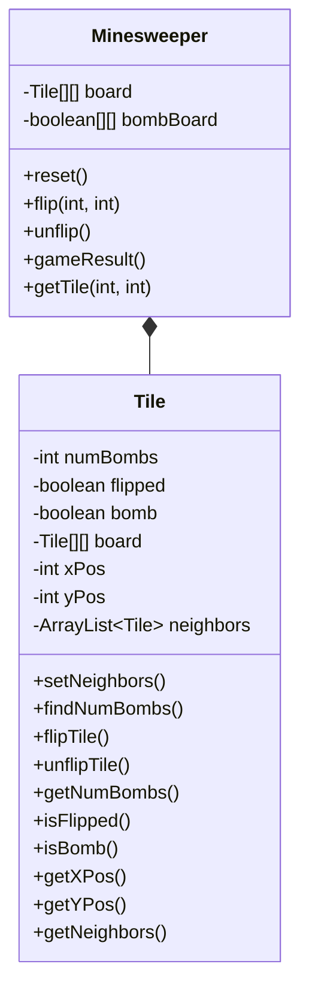
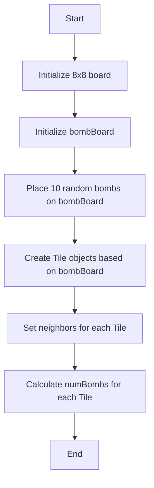
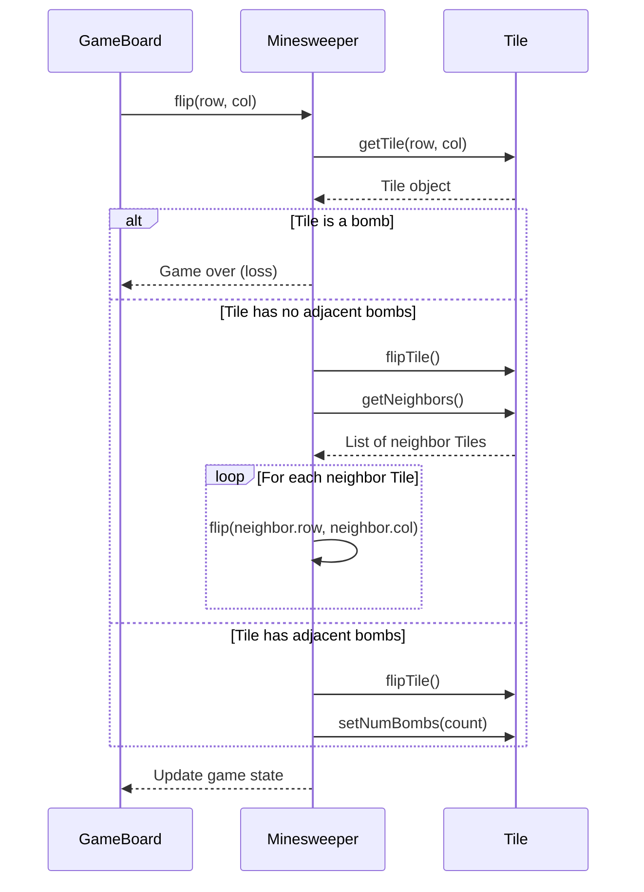
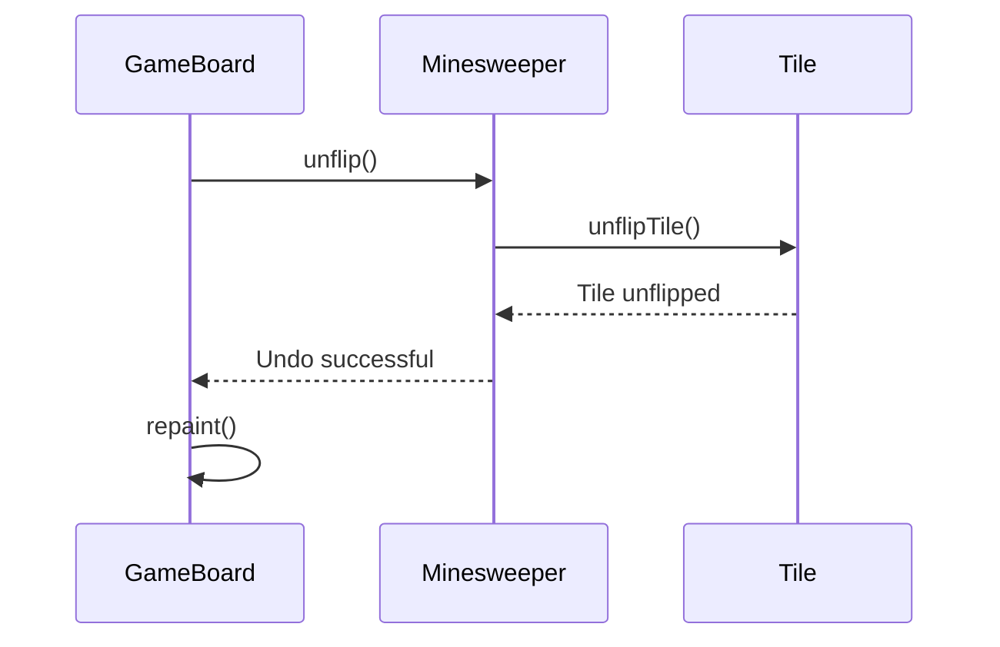
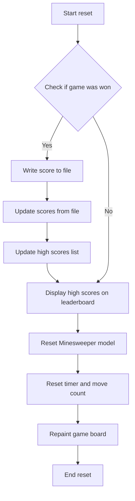
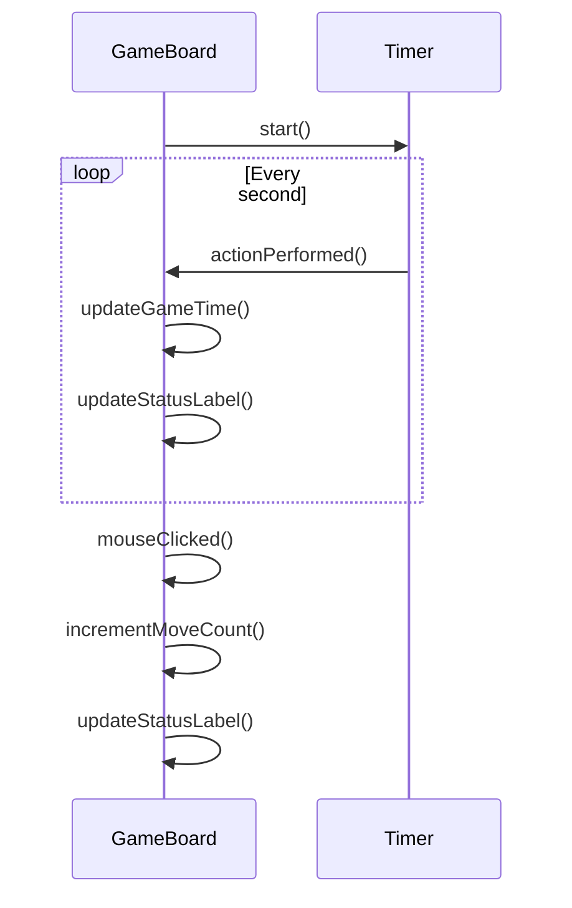
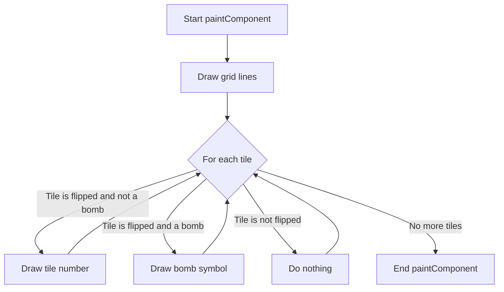

<details>
<summary>Relevant source files</summary>

The following files were used as context for generating this wiki page:

- [Game.java](https://github.com/aanickode/Minesweeper-Project/blob/main/Game.java)
- [GameBoard.java](https://github.com/aanickode/Minesweeper-Project/blob/main/GameBoard.java)
- [Tile.java](https://github.com/aanickode/Minesweeper-Project/blob/main/Tile.java)
- [Minesweeper.java](https://github.com/aanickode/Minesweeper-Project/blob/main/Minesweeper.java)
- [Files/FastestTime.txt](https://github.com/aanickode/Minesweeper-Project/blob/main/Files/FastestTime.txt)
</details>

# Game Logic

## Introduction

The "Game Logic" module is responsible for managing the core gameplay mechanics and rules of the Minesweeper game. It handles the game board initialization, tile flipping, bomb placement, win/loss conditions, and game state tracking. The primary components involved in the game logic are the `Minesweeper` class, which serves as the model, and the `GameBoard` class, which acts as the controller and view.

Sources: [Game.java](https://github.com/aanickode/Minesweeper-Project/blob/main/Game.java), [GameBoard.java](https://github.com/aanickode/Minesweeper-Project/blob/main/GameBoard.java), [Minesweeper.java](https://github.com/aanickode/Minesweeper-Project/blob/main/Minesweeper.java)

## Game Board Initialization

The game board is initialized with a fixed size of 8x8 tiles. The `Minesweeper` class creates a 2D array of `Tile` objects, representing the game board. Each `Tile` object stores information about its state (flipped or not, bomb or not), position on the board, and the number of adjacent bombs.



Sources: [Minesweeper.java:10-13](https://github.com/aanickode/Minesweeper-Project/blob/main/Minesweeper.java#L10-L13), [Tile.java](https://github.com/aanickode/Minesweeper-Project/blob/main/Tile.java)

## Bomb Placement

During the game board initialization, the `Minesweeper` class randomly places 10 bombs on the board. It uses a separate 2D boolean array (`bombBoard`) to keep track of the bomb locations.



Sources: [Minesweeper.java:15-35](https://github.com/aanickode/Minesweeper-Project/blob/main/Minesweeper.java#L15-L35)

## Tile Flipping

When the player clicks on a tile, the `GameBoard` class calls the `flip` method of the `Minesweeper` class, passing the row and column indices of the clicked tile. The `flip` method updates the game state based on the following rules:

- If the clicked tile is a bomb, the game ends with a loss.
- If the clicked tile is not a bomb and has no adjacent bombs, it recursively flips all neighboring tiles that are not bombs.
- If the clicked tile is not a bomb and has adjacent bombs, it flips the tile and displays the number of adjacent bombs.



Sources: [Minesweeper.java:37-69](https://github.com/aanickode/Minesweeper-Project/blob/main/Minesweeper.java#L37-L69), [Tile.java](https://github.com/aanickode/Minesweeper-Project/blob/main/Tile.java)

## Game State Tracking

The `Minesweeper` class keeps track of the game state and determines when the game is won or lost. The `gameResult` method returns an integer value representing the game state:

- 0: Game is still in progress
- 1: Player has won the game
- -1: Player has lost the game

```mermaid
graph TD
    A[Start gameResult] --> B{Check if any tile is unflipped and not a bomb}
    B -->|Yes| C[Return 0 (game in progress)]
    B -->|No| D{Check if any unflipped tile is a bomb}
    D -->|Yes| E[Return -1 (game lost)]
    D -->|No| F[Return 1 (game won)]
```

Sources: [Minesweeper.java:71-82](https://github.com/aanickode/Minesweeper-Project/blob/main/Minesweeper.java#L71-L82)

## Undo Move

The `GameBoard` class provides an "Undo" button that allows the player to undo the last move. When the "Undo" button is clicked, the `undo` method of `GameBoard` calls the `unflip` method of `Minesweeper`, which reverts the last tile flip operation.



Sources: [GameBoard.java:77-83](https://github.com/aanickode/Minesweeper-Project/blob/main/GameBoard.java#L77-L83), [Minesweeper.java:84-91](https://github.com/aanickode/Minesweeper-Project/blob/main/Minesweeper.java#L84-L91)

## Game Reset

The `GameBoard` class provides a "Reset" button that allows the player to start a new game. When the "Reset" button is clicked, the `reset` method of `GameBoard` is called, which performs the following actions:

1. Writes the current game's score (time and moves) to a file (`FastestTime.txt`) if the player won the game.
2. Updates the high scores list by reading from the `FastestTime.txt` file and sorting the scores.
3. Displays the updated high scores list on the leaderboard.
4. Calls the `reset` method of `Minesweeper` to initialize a new game board with randomly placed bombs.
5. Resets the timer, move count, and repaints the game board.



Sources: [GameBoard.java:62-114](https://github.com/aanickode/Minesweeper-Project/blob/main/GameBoard.java#L62-L114), [Files/FastestTime.txt](https://github.com/aanickode/Minesweeper-Project/blob/main/Files/FastestTime.txt)

## Game Timer and Move Counter

The `GameBoard` class keeps track of the elapsed time and the number of moves made by the player during the game. A `Timer` object is used to update the game time every second, and the move count is incremented whenever the player flips a tile (except when the game is won or lost).



Sources: [GameBoard.java:35-51](https://github.com/aanickode/Minesweeper-Project/blob/main/GameBoard.java#L35-L51), [GameBoard.java:116-129](https://github.com/aanickode/Minesweeper-Project/blob/main/GameBoard.java#L116-L129)

## Game Board Rendering

The `GameBoard` class is responsible for rendering the game board and updating the visual representation based on the game state. The `paintComponent` method draws the grid lines, flipped tiles (with numbers or bombs), and unflipped tiles.



Sources: [GameBoard.java:130-160](https://github.com/aanickode/Minesweeper-Project/blob/main/GameBoard.java#L130-L160)

## Conclusion

The "Game Logic" module is the core component of the Minesweeper game, responsible for managing the game board, handling user interactions, tracking game state, and rendering the game board. It follows a Model-View-Controller architecture, with the `Minesweeper` class acting as the model, the `GameBoard` class serving as the controller and view, and the `Tile` class representing the individual tiles on the game board.

The game logic handles various aspects of the gameplay, including bomb placement, tile flipping, win/loss conditions, undo functionality, game reset, and high score tracking. It also provides a visual representation of the game board and updates the user interface based on the game state.

Sources: [Game.java](https://github.com/aanickode/Minesweeper-Project/blob/main/Game.java), [GameBoard.java](https://github.com/aanickode/Minesweeper-Project/blob/main/GameBoard.java), [Minesweeper.java](https://github.com/aanickode/Minesweeper-Project/blob/main/Minesweeper.java), [Tile.java](https://github.com/aanickode/Minesweeper-Project/blob/main/Tile.java)