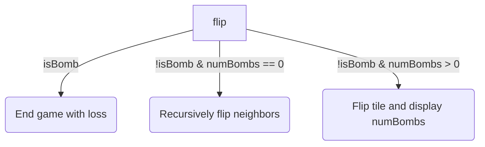
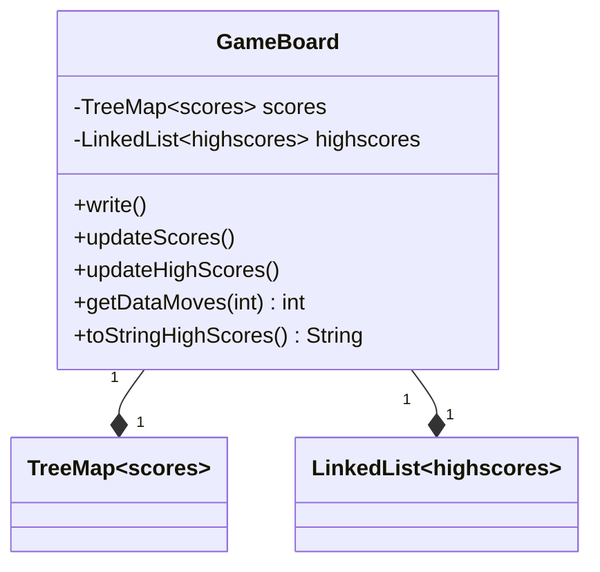

<details>
<summary>Relevant source files</summary>

The following files were used as context for generating this wiki page:

- [Game.java](https://github.com/aanickode/Minesweeper-Project/blob/main/Game.java)
- [GameBoard.java](https://github.com/aanickode/Minesweeper-Project/blob/main/GameBoard.java)
- [Tile.java](https://github.com/aanickode/Minesweeper-Project/blob/main/Tile.java)
- [Minesweeper.java](https://github.com/aanickode/Minesweeper-Project/blob/main/Minesweeper.java)
- [Files/FastestTime.txt](https://github.com/aanickode/Minesweeper-Project/blob/main/Files/FastestTime.txt)

</details>

# Game Logic

## Introduction

The "Game Logic" module is responsible for managing the core gameplay mechanics and rules of the Minesweeper game. It handles the game board initialization, tile flipping, bomb placement, win/loss conditions, and game state management. The game follows a Model-View-Controller (MVC) design pattern, where the `Minesweeper` class acts as the model, `GameBoard` serves as the view and controller, and `Game` sets up the top-level GUI frame.

Sources: [Game.java](https://github.com/aanickode/Minesweeper-Project/blob/main/Game.java), [GameBoard.java](https://github.com/aanickode/Minesweeper-Project/blob/main/GameBoard.java), [Minesweeper.java](https://github.com/aanickode/Minesweeper-Project/blob/main/Minesweeper.java)

## Game Board Initialization

The game board is initialized with a fixed size of 8x8 tiles. The `Minesweeper` class creates a 2D array of `Tile` objects, representing the game board.

```java
private Tile[][] board = new Tile[8][8];
```

Sources: [Minesweeper.java:12](https://github.com/aanickode/Minesweeper-Project/blob/main/Minesweeper.java#L12)

During the initialization process, the `reset()` method is called, which sets up the game board with 10 randomly placed bombs and calculates the number of bombs surrounding each non-bomb tile.

```java
public void reset() {
    // ...
    placeBombs();
    for (int row = 0; row < 8; row++) {
        for (int col = 0; col < 8; col++) {
            if (!board[row][col].isBomb()) {
                board[row][col].setNeighbors();
                board[row][col].setNumBombs(board[row][col].findNumBombs());
            }
        }
    }
    // ...
}
```

Sources: [Minesweeper.java:34-46](https://github.com/aanickode/Minesweeper-Project/blob/main/Minesweeper.java#L34-L46)

## Tile Flipping

When the player clicks on a tile, the `GameBoard` class handles the mouse event and updates the game model accordingly. The `flip()` method in the `Minesweeper` class is called with the row and column indices of the clicked tile.

```java
addMouseListener(new MouseAdapter() {
    @Override
    public void mouseClicked(MouseEvent e) {
        Point p = e.getPoint();
        t.flip(p.y / 50, p.x / 50); // Update the model
        // ...
    }
});
```

Sources: [GameBoard.java:43-51](https://github.com/aanickode/Minesweeper-Project/blob/main/GameBoard.java#L43-L51)

The `flip()` method in the `Minesweeper` class performs the following actions:

1. If the clicked tile is a bomb, the game ends with a loss.
2. If the clicked tile is not a bomb and has no surrounding bombs, it recursively flips all neighboring non-bomb tiles.
3. If the clicked tile is not a bomb and has surrounding bombs, it flips the tile and displays the number of surrounding bombs.



Sources: [Minesweeper.java:48-67](https://github.com/aanickode/Minesweeper-Project/blob/main/Minesweeper.java#L48-L67)

## Win/Loss Conditions

The `gameResult()` method in the `Minesweeper` class determines the current state of the game. It returns:

- `1` if all non-bomb tiles are flipped (win condition)
- `-1` if a bomb tile is flipped (loss condition)
- `0` if the game is still in progress

```java
public int gameResult() {
    for (int row = 0; row < 8; row++) {
        for (int col = 0; col < 8; col++) {
            if (board[row][col].isBomb() && board[row][col].isFlipped()) {
                return -1;
            }
            if (!board[row][col].isBomb() && !board[row][col].isFlipped()) {
                return 0;
            }
        }
    }
    return 1;
}
```

Sources: [Minesweeper.java:69-81](https://github.com/aanickode/Minesweeper-Project/blob/main/Minesweeper.java#L69-L81)

## Undo Move

The `GameBoard` class provides an "Undo" button that allows the player to undo the last move. The `undo()` method in the `GameBoard` class calls the `unflip()` method in the `Minesweeper` class, which reverts the last tile flip if possible.

```java
public void undo() {
    if (t.unflip()) {
        numMoves += 2;
        myTimer.start();
    }
    repaint();
    requestFocusInWindow();
}
```

Sources: [GameBoard.java:67-74](https://github.com/aanickode/Minesweeper-Project/blob/main/GameBoard.java#L67-L74)

The `unflip()` method in the `Minesweeper` class keeps track of the last flipped tile and unflips it if it's not a bomb and has no surrounding bombs flipped.

```java
public boolean unflip() {
    if (lastFlipped != null && !lastFlipped.isBomb()) {
        boolean canUnflip = true;
        for (Tile t : lastFlipped.getNeighbors()) {
            if (t.isFlipped()) {
                canUnflip = false;
                break;
            }
        }
        if (canUnflip) {
            lastFlipped.unflipTile();
            return true;
        }
    }
    return false;
}
```

Sources: [Minesweeper.java:83-98](https://github.com/aanickode/Minesweeper-Project/blob/main/Minesweeper.java#L83-L98)

## Game Timer and Move Counter

The `GameBoard` class keeps track of the elapsed time and the number of moves made by the player. A `Timer` object is used to update the game time every second, and the `numMoves` variable keeps track of the number of moves made.

```java
private int timerDelay;
private final Timer myTimer;
private long startTime;
private long gameTime;
private int numMoves;
```

Sources: [GameBoard.java:21-25](https://github.com/aanickode/Minesweeper-Project/blob/main/GameBoard.java#L21-L25)

The `gameTimer` `ActionListener` updates the game time and status label every second.

```java
ActionListener gameTimer = new ActionListener() {
    @Override
    public void actionPerformed(ActionEvent e) {
        gameTime = (System.currentTimeMillis() - startTime) / 1000;
        status.setText("Keep going!   Time: " + gameTime + "  NumMoves: " + numMoves);
    }
};
```

Sources: [GameBoard.java:46-53](https://github.com/aanickode/Minesweeper-Project/blob/main/GameBoard.java#L46-L53)

The `numMoves` variable is incremented whenever a non-winning or non-losing move is made.

```java
if (!(t.gameResult() == 1 || t.gameResult() == -1)) {
    numMoves++;
}
```

Sources: [GameBoard.java:49](https://github.com/aanickode/Minesweeper-Project/blob/main/GameBoard.java#L49)

## Leaderboard and High Scores

The `GameBoard` class maintains a leaderboard of high scores based on the time taken to win the game and the number of moves made. The high scores are stored in a text file named `FastestTime.txt`.



Sources: [GameBoard.java](https://github.com/aanickode/Minesweeper-Project/blob/main/GameBoard.java)

When the player wins the game, the `write()` method is called to append the game time and number of moves to the `FastestTime.txt` file.

```java
public void write() {
    try {
        BufferedWriter bw = new BufferedWriter(new FileWriter("Files/FastestTime.txt", true));
        bw.write("" + gameTime + " " + (numMoves + 1));
        bw.newLine();
        bw.flush();
        bw.close();
    } catch (IOException e) {
        System.out.println("Could not write");
    }
}
```

Sources: [GameBoard.java:78-88](https://github.com/aanickode/Minesweeper-Project/blob/main/GameBoard.java#L78-L88)

The `updateScores()` method reads the `FastestTime.txt` file and populates the `scores` `TreeMap` with the game time as the key and the number of moves as the value.

```java
public void updateScores() {
    BufferedReader br = null;
    boolean hasValue = true;
    TreeMap<Integer, Integer> temp = new TreeMap<Integer, Integer>();
    // ...
    scores = temp;
}
```

Sources: [GameBoard.java:90-120](https://github.com/aanickode/Minesweeper-Project/blob/main/GameBoard.java#L90-L120)

The `updateHighScores()` method sorts the `scores` `TreeMap` by the game time and selects the top 5 scores to be stored in the `highscores` `LinkedList`.

```java
public void updateHighScores() {
    Object[] temp = scores.keySet().toArray();
    LinkedList<Integer> tempscores = new LinkedList<Integer>();
    Arrays.sort(temp);
    int i = 0;
    while (i < 5 && i < temp.length) {
        int x = (int) temp[i];
        tempscores.add(x);
        i++;
    }
    highscores = tempscores;
}
```

Sources: [GameBoard.java:122-132](https://github.com/aanickode/Minesweeper-Project/blob/main/GameBoard.java#L122-L132)

The `toStringHighScores()` method converts the `highscores` `LinkedList` into a formatted string for display in the leaderboard panel.

```java
public String toStringHighScores() {
    String s = "Top 5 Scores: ";
    for (int i = 0; i < highscores.size(); i++) {
        s += highscores.get(i) + " " + scores.get(highscores.get(i)) + ", ";
    }
    return s;
}
```

Sources: [GameBoard.java:134-140](https://github.com/aanickode/Minesweeper-Project/blob/main/GameBoard.java#L134-L140)

## Game Reset

The `GameBoard` class provides a "Reset" button that resets the game to its initial state. The `reset()` method is called when the button is clicked or when the game starts.

```java
final JButton reset = new JButton("Reset");
reset.addActionListener(new ActionListener() {
    public void actionPerformed(ActionEvent e) {
        board.reset();
    }
});
```

Sources: [Game.java:51-57](https://github.com/aanickode/Minesweeper-Project/blob/main/Game.java#L51-L57)

The `reset()` method in the `GameBoard` class performs the following actions:

1. If the player won the previous game, it writes the game time and number of moves to the `FastestTime.txt` file.
2. Updates the `scores` `TreeMap` and `highscores` `LinkedList` based on the contents of the `FastestTime.txt` file.
3. Resets the game model by calling the `reset()` method in the `Minesweeper` class.
4. Resets the game timer, move counter, and status label.
5. Repaints the game board.

```java
public void reset() {
    if (t.gameResult() == 1) {
        write();
    }
    updateScores();
    updateHighScores();
    leaderBoard.setText(toStringHighScores());
    t.reset();
    startTime = System.currentTimeMillis();
    gameTime = 0;
    myTimer.restart();
    numMoves = 0;
    repaint();
    requestFocusInWindow();
}
```

Sources: [GameBoard.java:57-66](https://github.com/aanickode/Minesweeper-Project/blob/main/GameBoard.java#L57-L66)

## Game Board Rendering

The `GameBoard` class is responsible for rendering the game board and its components. The `paintComponent()` method is overridden to draw the game board grid, flipped tiles, and bomb tiles.

```java
@Override
public void paintComponent(Graphics g) {
    super.paintComponent(g);

    // Draws board grid
    // ...

    // Draws X's and O's
    for (int row = 0; row < 8; row++) {
        for (int col = 0; col < 8; col++) {
            Tile tile = t.getTile(row, col);
            if (tile.isFlipped() && !tile.isBomb()) {
                String s = String.valueOf(tile.getNumBombs());
                g.drawString(s, 50 * col + 25, 50 * row + 25);
            }
            if (tile.isFlipped() && tile.isBomb()) {
                g.drawLine(50 * col, 50 * row, 50 * col + 50, 50 * row + 50);
                g.drawLine(50 * col, 50 * row + 50, 50 * col + 50, 50 * row);
            }
        }
    }
}
```

Sources: [GameBoard.java:142-167](https://github.com/aanickode/Minesweeper-Project/blob/main/GameBoard.java#L142-L167)

## Conclusion

The "Game Logic" module is the core component of the Minesweeper game, handling the game board initialization, tile flipping, bomb placement, win/loss conditions, and game state management. It follows the Model-View-Controller design pattern, with the `Minesweeper