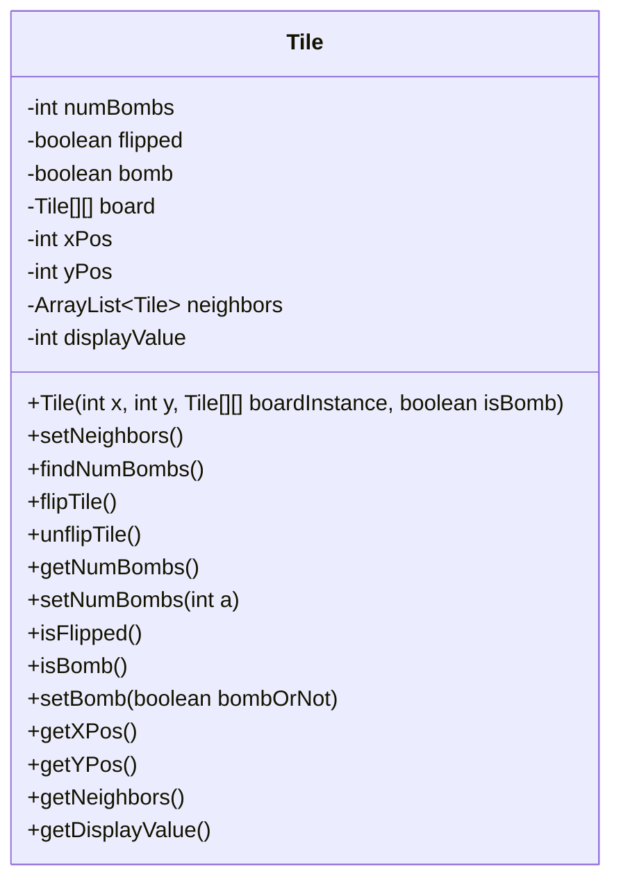
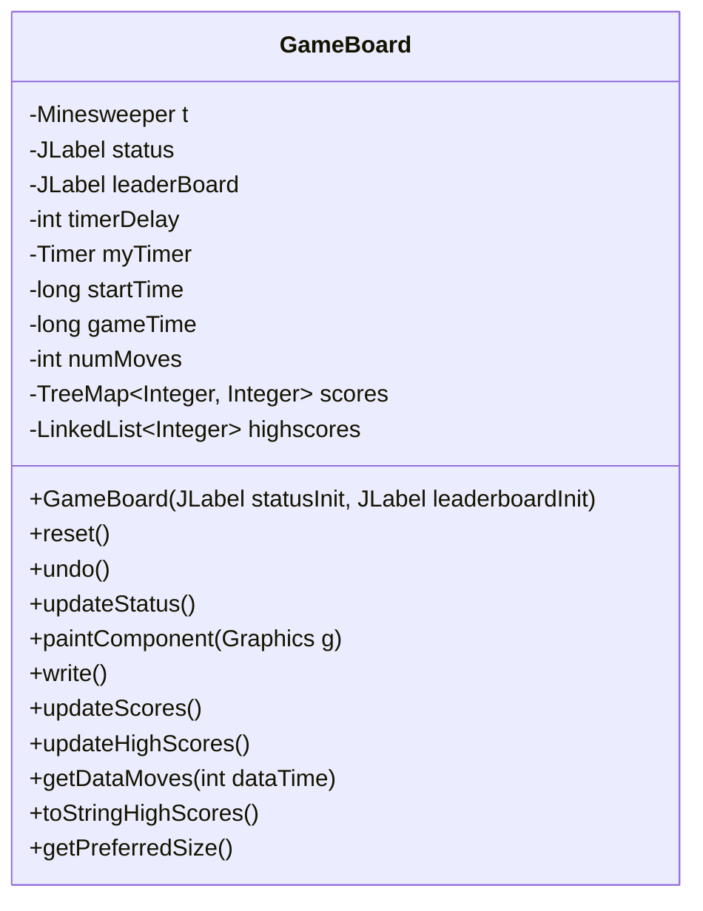
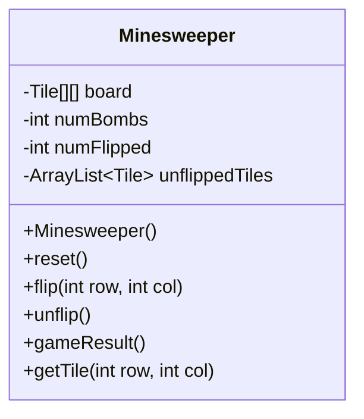
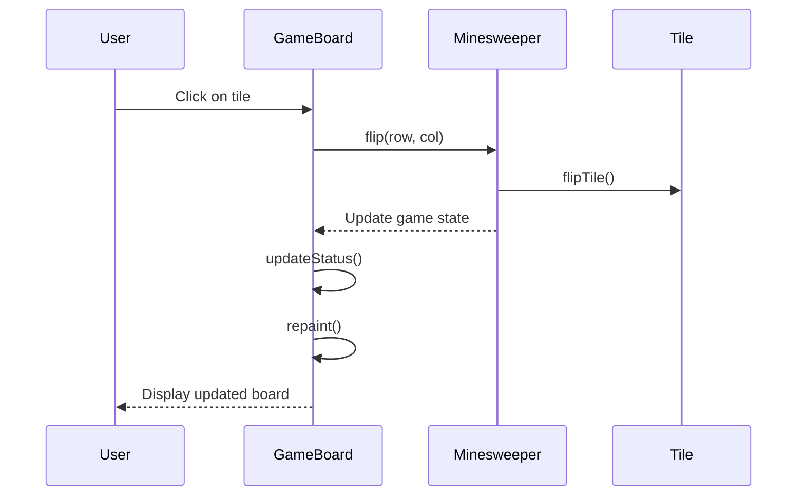
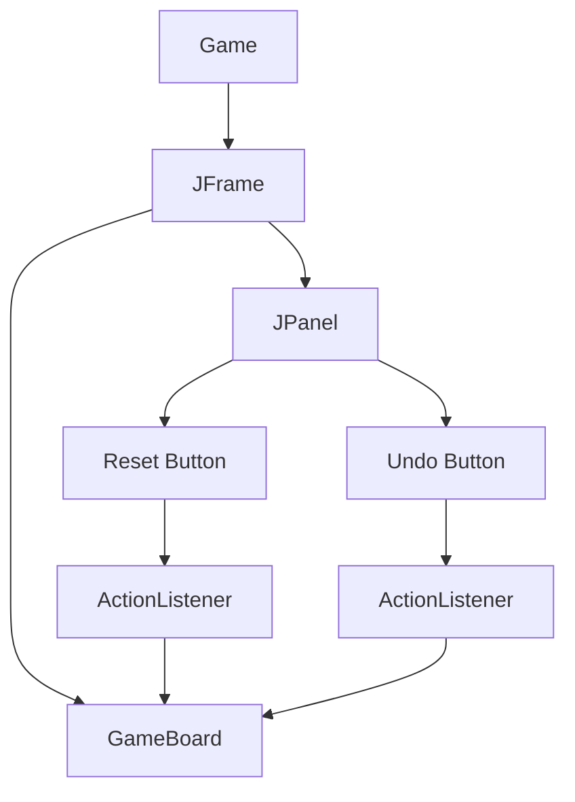

<details>
<summary>Relevant source files</summary>

The following files were used as context for generating this wiki page:

- [Game.java](https://github.com/aanickode/Minesweeper-Project/blob/main/Game.java)
- [GameBoard.java](https://github.com/aanickode/Minesweeper-Project/blob/main/GameBoard.java)
- [Tile.java](https://github.com/aanickode/Minesweeper-Project/blob/main/Tile.java)
- [Minesweeper.java](https://github.com/aanickode/Minesweeper-Project/blob/main/Minesweeper.java)
- [Files/FastestTime.txt](https://github.com/aanickode/Minesweeper-Project/blob/main/Files/FastestTime.txt)

</details>

# Game Mechanics

## Introduction

The Minesweeper project is a Java implementation of the classic Minesweeper game. The game mechanics revolve around a grid-based board where the player must uncover all non-mine tiles without detonating any mines. This page provides an overview of the game mechanics, including the game board, tile management, game logic, and user interactions.

Sources: [Game.java](https://github.com/aanickode/Minesweeper-Project/blob/main/Game.java), [GameBoard.java](https://github.com/aanickode/Minesweeper-Project/blob/main/GameBoard.java), [Tile.java](https://github.com/aanickode/Minesweeper-Project/blob/main/Tile.java), [Minesweeper.java](https://github.com/aanickode/Minesweeper-Project/blob/main/Minesweeper.java)

## Game Board and Tiles

The game board is represented by a 2D array of `Tile` objects, with each tile having properties such as its position, whether it's a mine, whether it's flipped (revealed), and the number of adjacent mines.



Sources: [Tile.java](https://github.com/aanickode/Minesweeper-Project/blob/main/Tile.java)

The `GameBoard` class manages the game board, handling user interactions, updating the game state, and rendering the board on the GUI.



Sources: [GameBoard.java](https://github.com/aanickode/Minesweeper-Project/blob/main/GameBoard.java)

## Game Logic

The `Minesweeper` class encapsulates the game logic, including initializing the board, placing mines, flipping tiles, and determining the game result.



Sources: [Minesweeper.java](https://github.com/aanickode/Minesweeper-Project/blob/main/Minesweeper.java)

The game flow can be represented by the following sequence diagram:



Sources: [GameBoard.java](https://github.com/aanickode/Minesweeper-Project/blob/main/GameBoard.java), [Minesweeper.java](https://github.com/aanickode/Minesweeper-Project/blob/main/Minesweeper.java), [Tile.java](https://github.com/aanickode/Minesweeper-Project/blob/main/Tile.java)

## User Interactions

The `Game` class sets up the top-level GUI frame and handles user interactions, such as resetting the game and undoing moves.



Sources: [Game.java](https://github.com/aanickode/Minesweeper-Project/blob/main/Game.java), [GameBoard.java](https://github.com/aanickode/Minesweeper-Project/blob/main/GameBoard.java)

## Scoring and Leaderboard

The game keeps track of the time taken and the number of moves made by the player. When the player wins, the game writes the score to a file (`FastestTime.txt`). The `GameBoard` class reads this file, updates a `TreeMap` with the scores, and displays the top 5 scores on a leaderboard.

```mermaid
graph TD
    A[GameBoard] --> B[write()]
    B --> C[FastestTime.txt]
    A --> D[updateScores()]
    D --> C
    A --> E[updateHighScores()]
    E --> F[TreeMap scores]
    A --> G[toStringHighScores()]
    G --> H[JLabel leaderBoard]
```

Sources: [GameBoard.java](https://github.com/aanickode/Minesweeper-Project/blob/main/GameBoard.java), [Files/FastestTime.txt](https://github.com/aanickode/Minesweeper-Project/blob/main/Files/FastestTime.txt)

## Conclusion

The Minesweeper project implements the classic Minesweeper game mechanics using Java and the Swing GUI library. The game board is represented by a 2D array of `Tile` objects, and the `Minesweeper` class manages the game logic. The `GameBoard` class handles user interactions, updates the game state, and renders the board on the GUI. The game also keeps track of scores and displays a leaderboard with the top 5 scores.

Sources: [Game.java](https://github.com/aanickode/Minesweeper-Project/blob/main/Game.java), [GameBoard.java](https://github.com/aanickode/Minesweeper-Project/blob/main/GameBoard.java), [Tile.java](https://github.com/aanickode/Minesweeper-Project/blob/main/Tile.java), [Minesweeper.java](https://github.com/aanickode/Minesweeper-Project/blob/main/Minesweeper.java), [Files/FastestTime.txt](https://github.com/aanickode/Minesweeper-Project/blob/main/Files/FastestTime.txt)