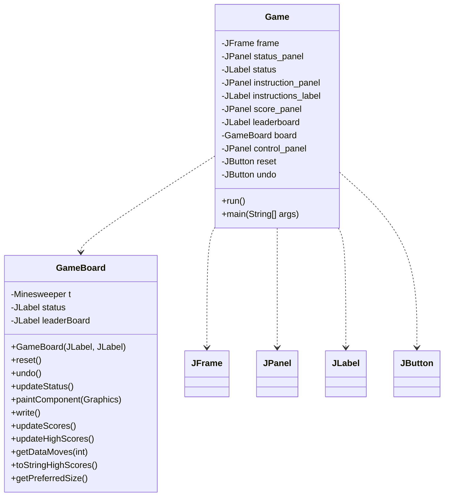
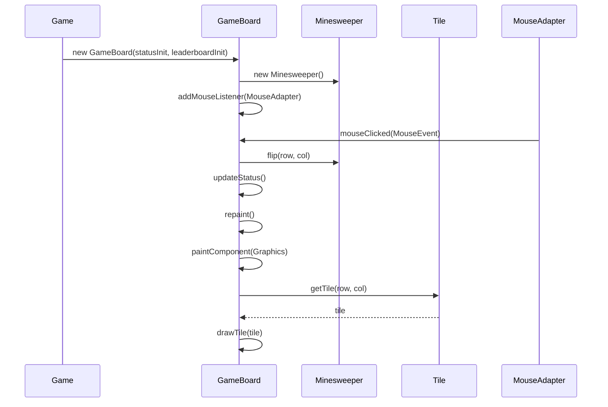
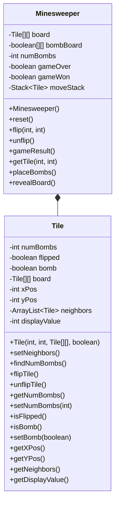
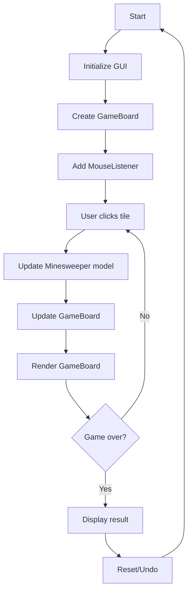
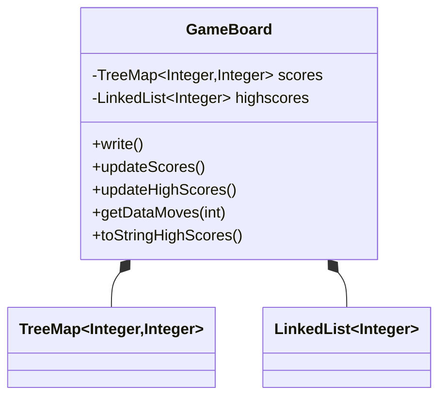

Relevant source files

The following files were used as context for generating this wiki page:

- [Game.java](https://github.com/aanickode/Minesweeper-Project/blob/main/Game.java)
- [GameBoard.java](https://github.com/aanickode/Minesweeper-Project/blob/main/GameBoard.java)
- [Tile.java](https://github.com/aanickode/Minesweeper-Project/blob/main/Tile.java)
- [Minesweeper.java](https://github.com/aanickode/Minesweeper-Project/blob/main/Minesweeper.java)

# Game Mechanics

## Introduction

The provided source files implement a Minesweeper game, a classic puzzle game where the player aims to reveal all non-mine tiles on a grid while avoiding mines. This wiki page covers the game mechanics, including the overall architecture, key components, data flow, and logic behind the game's functionality.

The game follows a Model-View-Controller (MVC) design pattern, separating the game logic (model), user interface (view), and control flow (controller). The main components are:

- `Game`: Sets up the top-level frame and GUI components, acting as the entry point and controller.
- `GameBoard`: Handles the game board rendering, user input, and game state updates, serving as the view and part of the controller.
- `Minesweeper`: Represents the game model, managing the game board, tiles, and game logic.
- `Tile`: Encapsulates the state and behavior of individual tiles on the game board.

Sources: [Game.java](https://github.com/aanickode/Minesweeper-Project/blob/main/Game.java), [GameBoard.java](https://github.com/aanickode/Minesweeper-Project/blob/main/GameBoard.java), [Minesweeper.java](https://github.com/aanickode/Minesweeper-Project/blob/main/Minesweeper.java), [Tile.java](https://github.com/aanickode/Minesweeper-Project/blob/main/Tile.java)

## Game Setup and GUI

The `Game` class sets up the top-level GUI frame and components, including the game board, status panel, instructions panel, score panel, and control buttons (reset and undo).

The `Game` class initializes the GUI components, sets up event listeners for the reset and undo buttons, and starts the game by calling `board.reset()`.

Sources: [Game.java:15-105](https://github.com/aanickode/Minesweeper-Project/blob/main/Game.java#L15-L105)

## Game Board Rendering

The `GameBoard` class extends `JPanel` and is responsible for rendering the game board and handling user input (mouse clicks).

The `GameBoard` class:

1. Initializes the `Minesweeper` model and GUI components.
2. Adds a `MouseAdapter` to handle mouse click events.
3. In the `mouseClicked` event, updates the `Minesweeper` model with the clicked tile coordinates using `flip(row, col)`.
4. Updates the game status label and repaints the board.
5. In the `paintComponent` method, iterates over the tiles and draws them based on their state (flipped, bomb, or number of adjacent bombs).

Sources: [GameBoard.java:31-171](https://github.com/aanickode/Minesweeper-Project/blob/main/GameBoard.java#L31-L171)

## Game Model and Logic

The `Minesweeper` class represents the game model, managing the game board, tiles, and game logic.

The `Minesweeper` class:

1. Initializes the game board as a 2D array of `Tile` objects.
2. Places bombs randomly on the board using the `placeBombs` method.
3. Calculates the number of adjacent bombs for each non-bomb tile using the `Tile.findNumBombs` method.
4. Provides methods to flip (`flip`) and unflip (`unflip`) tiles, check the game result (`gameResult`), and reset the game (`reset`).
5. Maintains a stack of moves (`moveStack`) to support the undo functionality.

The `Tile` class represents an individual tile on the game board, encapsulating its state (flipped, bomb, number of adjacent bombs) and behavior (flipping, setting neighbors, calculating adjacent bombs).

Sources: [Minesweeper.java](https://github.com/aanickode/Minesweeper-Project/blob/main/Minesweeper.java), [Tile.java](https://github.com/aanickode/Minesweeper-Project/blob/main/Tile.java)

## Game Flow

The overall game flow can be summarized as follows:

1. The `Game` class initializes the GUI components, including the `GameBoard`.
2. The `GameBoard` adds a `MouseListener` to handle user clicks.
3. When the user clicks a tile, the `GameBoard` updates the `Minesweeper` model with the clicked tile coordinates.
4. The `GameBoard` updates its state based on the model and repaints itself.
5. The `GameBoard` checks the game result (`gameResult`) from the `Minesweeper` model.
6. If the game is over, the result is displayed. Otherwise, the game continues.
7. The user can reset or undo the game using the respective buttons.

Sources: [Game.java](https://github.com/aanickode/Minesweeper-Project/blob/main/Game.java), [GameBoard.java](https://github.com/aanickode/Minesweeper-Project/blob/main/GameBoard.java), [Minesweeper.java](https://github.com/aanickode/Minesweeper-Project/blob/main/Minesweeper.java)

## Game Scoring and Leaderboard

The `GameBoard` class also handles game scoring and maintains a leaderboard of high scores.

The `GameBoard` class:

1. Maintains a `TreeMap` called `scores` to store game outcomes, with the time to win as the key and the number of moves as the value.
2. Reads game outcomes from a file (`FastestTime.txt`) and populates the `scores` map using the `updateScores` method.
3. Sorts the `scores` map and selects the top 5 scores as high scores using the `updateHighScores` method.
4. Provides methods to write the current game score to the file (`write`), get the number of moves for a given time (`getDataMoves`), and convert the high scores to a string for display (`toStringHighScores`).

Sources: [GameBoard.java:172-245](https://github.com/aanickode/Minesweeper-Project/blob/main/GameBoard.java#L172-L245)

## Conclusion

The provided source files implement a Minesweeper game following the Model-View-Controller design pattern. The game mechanics involve initializing the GUI, rendering the game board, handling user input, updating the game model, checking the game result, and maintaining a leaderboard of high scores. The key components are the `Game`, `GameBoard`, `Minesweeper`, and `Tile` classes, which work together to provide the game's functionality and user experience.