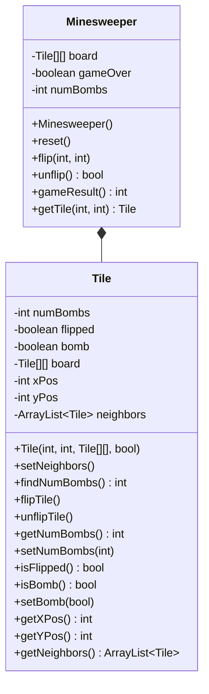
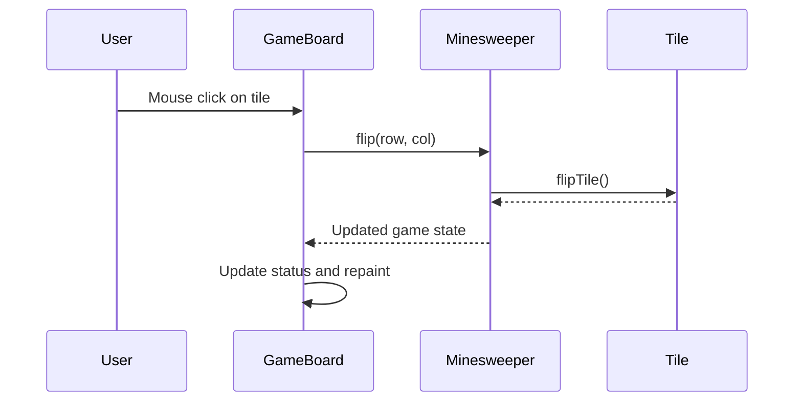
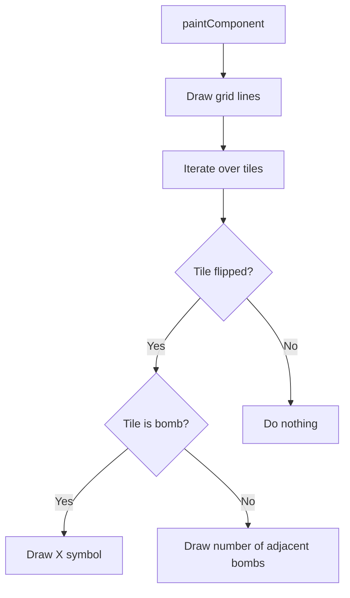
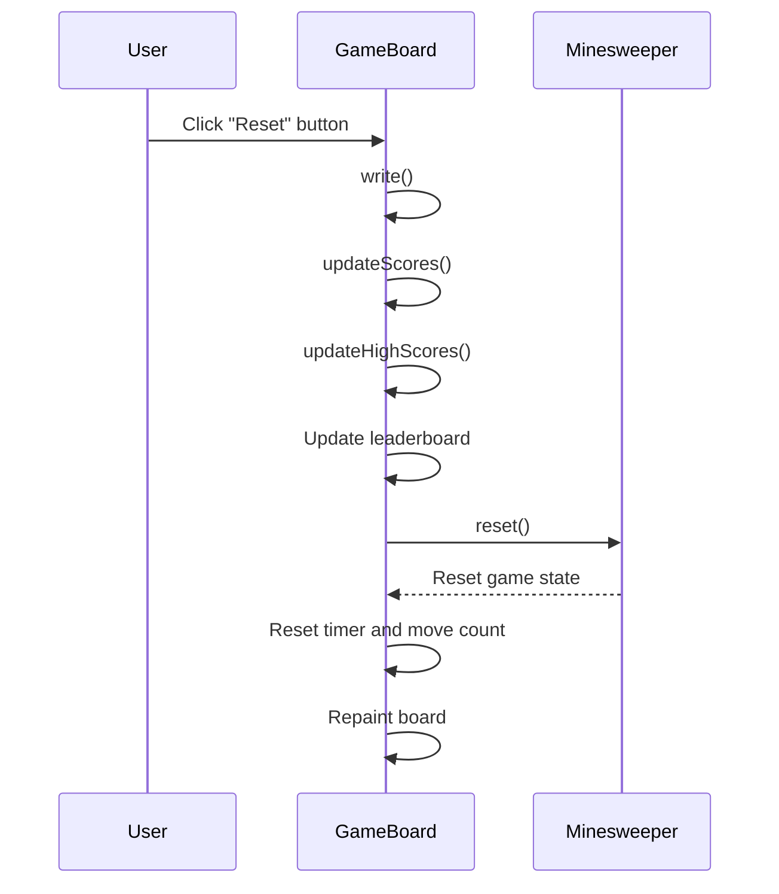
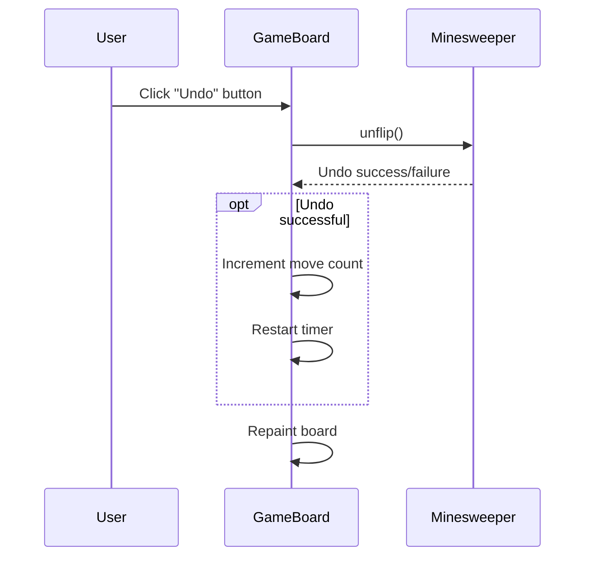

Relevant source files

The following files were used as context for generating this wiki page:

- [Game.java](https://github.com/aanickode/Minesweeper-Project/blob/main/Game.java)
- [GameBoard.java](https://github.com/aanickode/Minesweeper-Project/blob/main/GameBoard.java)
- [Tile.java](https://github.com/aanickode/Minesweeper-Project/blob/main/Tile.java)
- [Minesweeper.java](https://github.com/aanickode/Minesweeper-Project/blob/main/Minesweeper.java)

# Game Mechanics

## Introduction

This wiki page covers the game mechanics of a Minesweeper implementation. The project follows a Model-View-Controller (MVC) design pattern, where the `Minesweeper` class serves as the game model, the `GameBoard` class handles the view and controller logic, and the `Game` class initializes the top-level GUI components.

The game mechanics revolve around a grid-based board where the player must uncover all non-bomb tiles by flipping them. The objective is to win the game by successfully revealing all safe tiles without detonating any bombs. The game also keeps track of the player's time and move count, aiming for the fastest completion time with the fewest moves.

Sources: [Game.java](https://github.com/aanickode/Minesweeper-Project/blob/main/Game.java), [GameBoard.java](https://github.com/aanickode/Minesweeper-Project/blob/main/GameBoard.java), [Minesweeper.java](https://github.com/aanickode/Minesweeper-Project/blob/main/Minesweeper.java)

## Game Board Initialization

The game board is initialized with a fixed size of 8x8 tiles, and 10 randomly placed bombs. The `Minesweeper` class sets up the game board and manages the game state.

Sources: [Minesweeper.java:1-93](https://github.com/aanickode/Minesweeper-Project/blob/main/Minesweeper.java#L1-L93), [Tile.java:1-91](https://github.com/aanickode/Minesweeper-Project/blob/main/Tile.java#L1-L91)

## Game Flow

The game flow is controlled by the `GameBoard` class, which handles user input, updates the game state, and renders the board on the GUI.

1. The user clicks on a tile on the game board.
2. The `GameBoard` class receives the mouse click event and calls the `flip` method on the `Minesweeper` instance, passing the row and column of the clicked tile.
3. The `Minesweeper` class updates the corresponding `Tile` object by calling its `flipTile` method.
4. The `Minesweeper` class returns the updated game state to the `GameBoard`.
5. The `GameBoard` updates the status label and repaints the board to reflect the new game state.

Sources: [GameBoard.java:31-51](https://github.com/aanickode/Minesweeper-Project/blob/main/GameBoard.java#L31-L51), [Minesweeper.java:45-63](https://github.com/aanickode/Minesweeper-Project/blob/main/Minesweeper.java#L45-L63), [Tile.java:29-32](https://github.com/aanickode/Minesweeper-Project/blob/main/Tile.java#L29-L32)

## Game Rendering

The `GameBoard` class is responsible for rendering the game board on the GUI. It draws the grid lines and displays the appropriate symbols or numbers on each tile based on the game state.

1. The `paintComponent` method is called to render the game board.
2. Grid lines are drawn to create the 8x8 board.
3. The method iterates over each tile on the board.
4. If the tile is flipped:
   - If the tile is a bomb, an "X" symbol is drawn.
   - If the tile is not a bomb, the number of adjacent bombs is drawn.
5. If the tile is not flipped, nothing is drawn for that tile.

Sources: [GameBoard.java:86-118](https://github.com/aanickode/Minesweeper-Project/blob/main/GameBoard.java#L86-L118)

## Game Reset and Undo

The `GameBoard` class provides functionality to reset the game and undo the last move.

### Reset

1. The user clicks the "Reset" button.
2. The `GameBoard` writes the current game score to a file (`write`).
3. The `GameBoard` updates the scores data structure (`updateScores`).
4. The `GameBoard` updates the high scores list (`updateHighScores`).
5. The leaderboard is updated with the new high scores.
6. The `GameBoard` calls the `reset` method on the `Minesweeper` instance to reset the game state.
7. The `GameBoard` resets the timer, move count, and repaints the board.

Sources: [GameBoard.java:62-85](https://github.com/aanickode/Minesweeper-Project/blob/main/GameBoard.java#L62-L85), [GameBoard.java:119-165](https://github.com/aanickode/Minesweeper-Project/blob/main/GameBoard.java#L119-L165)

### Undo

1. The user clicks the "Undo" button.
2. The `GameBoard` calls the `unflip` method on the `Minesweeper` instance to undo the last move.
3. The `Minesweeper` class returns whether the undo operation was successful or not.
4. If the undo was successful:
   - The `GameBoard` increments the move count.
   - The `GameBoard` restarts the timer.
5. The `GameBoard` repaints the board to reflect the updated game state.

Sources: [GameBoard.java:52-61](https://github.com/aanickode/Minesweeper-Project/blob/main/GameBoard.java#L52-L61), [Minesweeper.java:65-83](https://github.com/aanickode/Minesweeper-Project/blob/main/Minesweeper.java#L65-L83)

## Game Status and Scoring

The `GameBoard` class keeps track of the game status, time, and move count. It updates the status label accordingly and manages the high score leaderboard.

### Game Status

The game status is determined by the `gameResult` method in the `Minesweeper` class, which returns an integer value representing the game state:

- `1`: Player has won the game by flipping all non-bomb tiles.
- `-1`: Player has lost the game by flipping a bomb tile.
- `0`: Game is still in progress.

The `GameBoard` class updates the status label based on the game result and stops the timer when the game is won or lost.

Sources: [GameBoard.java:74-84](https://github.com/aanickode/Minesweeper-Project/blob/main/GameBoard.java#L74-L84), [Minesweeper.java:85-93](https://github.com/aanickode/Minesweeper-Project/blob/main/Minesweeper.java#L85-L93)

### Scoring

The `GameBoard` class keeps track of the time elapsed and the number of moves made by the player. This information is used to calculate the player's score and update the high score leaderboard.

The scoring system prioritizes faster completion times and fewer moves. The high score leaderboard displays the top 5 scores, showing the time and move count for each score.

| Feature | Description |
| --- | --- |
| Time | The elapsed time in seconds from the start of the game until completion. |
| Move Count | The number of tiles flipped by the player until the game is won or lost. |
| High Score Leaderboard | Displays the top 5 scores, sorted by time and move count. |

Sources: [GameBoard.java:21-25](https://github.com/aanickode/Minesweeper-Project/blob/main/GameBoard.java#L21-L25), [GameBoard.java:119-165](https://github.com/aanickode/Minesweeper-Project/blob/main/GameBoard.java#L119-L165)

## Conclusion

The Minesweeper implementation follows the Model-View-Controller design pattern, with the `Minesweeper` class serving as the game model, the `GameBoard` class handling the view and controller logic, and the `Game` class initializing the top-level GUI components. The game mechanics revolve around a grid-based board where the player must uncover all non-bomb tiles by flipping them, aiming for the fastest completion time with the fewest moves. The game also provides functionality to reset the game, undo moves, and track high scores.