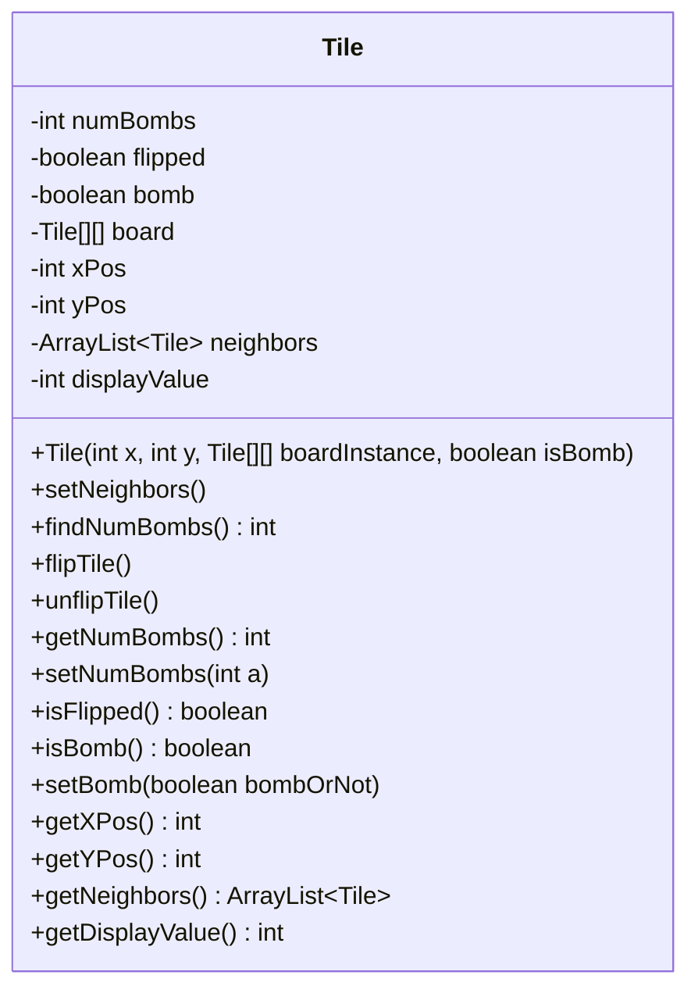
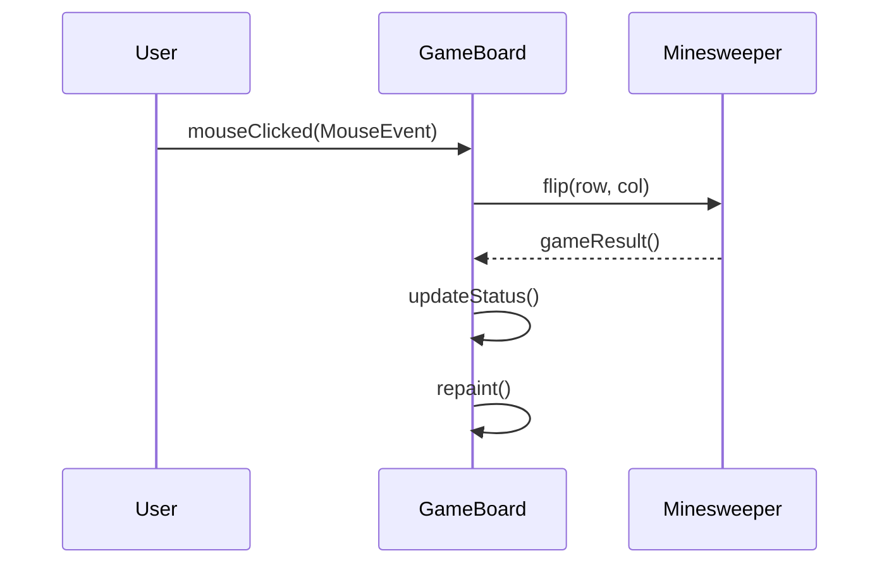
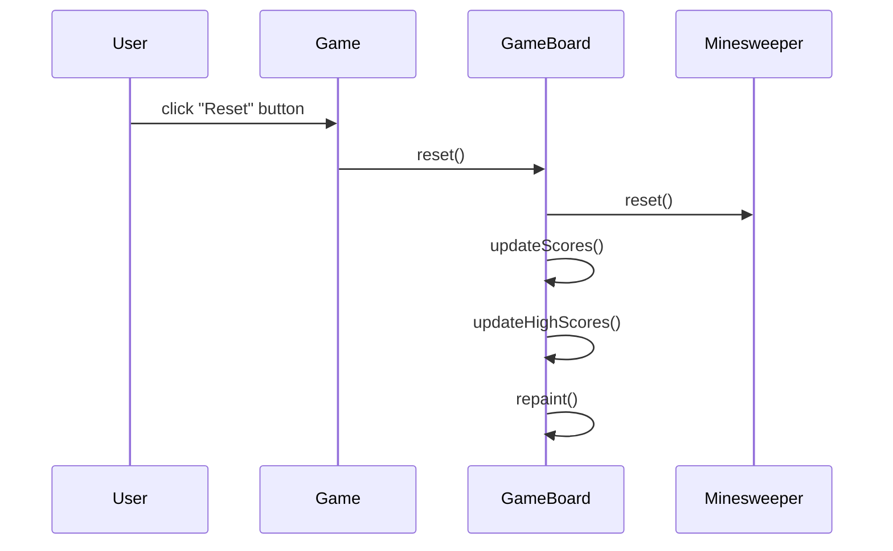
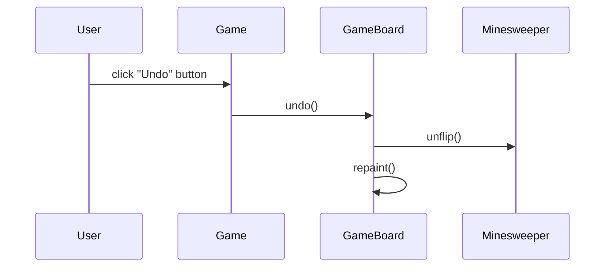

<details>
<summary>Relevant source files</summary>

The following files were used as context for generating this wiki page:

- [Game.java](https://github.com/aanickode/Minesweeper-Project/blob/main/Game.java)
- [GameBoard.java](https://github.com/aanickode/Minesweeper-Project/blob/main/GameBoard.java)
- [Tile.java](https://github.com/aanickode/Minesweeper-Project/blob/main/Tile.java)
- [Minesweeper.java](https://github.com/aanickode/Minesweeper-Project/blob/main/Minesweeper.java)

</details>

# Game Mechanics

## Introduction

The provided source files implement a Minesweeper game, a classic puzzle game where the player aims to uncover all non-mine tiles on a grid without detonating any mines. The game mechanics revolve around the `Minesweeper` class, which represents the game model, and the `GameBoard` class, which handles the game's view and user interactions.

The `Game` class sets up the top-level frame and GUI components, including the game board, status panel, instructions panel, and control buttons (Reset and Undo). It follows the Model-View-Controller (MVC) design pattern, where the `Minesweeper` class acts as the model, the `GameBoard` class handles the view and controller logic, and the `Game` class initializes and connects these components.

Sources: [Game.java](https://github.com/aanickode/Minesweeper-Project/blob/main/Game.java), [GameBoard.java](https://github.com/aanickode/Minesweeper-Project/blob/main/GameBoard.java), [Minesweeper.java](https://github.com/aanickode/Minesweeper-Project/blob/main/Minesweeper.java)

## Game Board and Tiles

The game board is represented by a 2D array of `Tile` objects in the `Minesweeper` class. Each `Tile` object stores information about its state (flipped or not, bomb or not), position on the board, and the number of adjacent bombs.



Sources: [Tile.java](https://github.com/aanickode/Minesweeper-Project/blob/main/Tile.java)

The `GameBoard` class is responsible for rendering the game board and handling user interactions. It extends the `JPanel` class and uses the `Minesweeper` instance as the game model. The `GameBoard` constructor sets up event listeners for mouse clicks, initializes a timer for tracking game time, and loads high scores from a file.

Sources: [GameBoard.java](https://github.com/aanickode/Minesweeper-Project/blob/main/GameBoard.java)

## Game Flow

The game flow is driven by user interactions with the game board. When the user clicks on a tile, the `GameBoard` class updates the `Minesweeper` model by calling the `flip()` method with the clicked tile's coordinates.



Sources: [GameBoard.java:52-63](https://github.com/aanickode/Minesweeper-Project/blob/main/GameBoard.java#L52-L63), [Minesweeper.java](https://github.com/aanickode/Minesweeper-Project/blob/main/Minesweeper.java)

The `flip()` method in the `Minesweeper` class updates the state of the clicked tile and performs necessary actions based on the tile's state and the game's rules. If the clicked tile is not a bomb, it recursively flips all adjacent non-bomb tiles until it reaches tiles with adjacent bombs.

```mermaid
flowchart TD
    start(flip) --> isBomb{Is tile a bomb?}
    isBomb -->|Yes| gameOver>Game Over]
    isBomb -->|No| flipTile(Flip tile)
    flipTile --> numBombs{numBombs == 0?}
    numBombs -->|Yes| flipNeighbors(Flip neighbors)
    numBombs -->|No| setNumBombs(Set numBombs)
    flipNeighbors --> recurse{Any unflipped neighbors?}
    recurse -->|Yes| flip(Flip neighbor)
    recurse -->|No| end
```

Sources: [Minesweeper.java](https://github.com/aanickode/Minesweeper-Project/blob/main/Minesweeper.java)

After updating the game state, the `GameBoard` class updates the status label and repaints the board to reflect the new state. If the game is won or lost, the timer is stopped, and the final status is displayed.

Sources: [GameBoard.java:97-110](https://github.com/aanickode/Minesweeper-Project/blob/main/GameBoard.java#L97-L110)

## Game Reset and Undo

The `Game` class provides two buttons: "Reset" and "Undo". The "Reset" button calls the `reset()` method in the `GameBoard` class, which resets the game board, timer, and move count, and updates the high scores display.



Sources: [Game.java:48-57](https://github.com/aanickode/Minesweeper-Project/blob/main/Game.java#L48-L57), [GameBoard.java:75-92](https://github.com/aanickode/Minesweeper-Project/blob/main/GameBoard.java#L75-L92)

The "Undo" button calls the `undo()` method in the `GameBoard` class, which reverts the last move made by the player if possible.



Sources: [Game.java:61-67](https://github.com/aanickode/Minesweeper-Project/blob/main/Game.java#L61-L67), [GameBoard.java:94-96](https://github.com/aanickode/Minesweeper-Project/blob/main/GameBoard.java#L94-L96), [Minesweeper.java](https://github.com/aanickode/Minesweeper-Project/blob/main/Minesweeper.java)

## High Scores and File I/O

The `GameBoard` class maintains a leaderboard of high scores, which are read from and written to a file named "FastestTime.txt". When the game is won, the time taken and the number of moves are written to the file using the `write()` method.

```java
public void write() {
    try {
        BufferedWriter bw = new BufferedWriter(new FileWriter("Files/FastestTime.txt", true));
        bw.write("" + gameTime + " " + (numMoves + 1));
        bw.newLine();
        bw.flush();
        bw.close();
    } catch (IOException e) {
        System.out.println("Could not write");
    }
}
```

Sources: [GameBoard.java:125-136](https://github.com/aanickode/Minesweeper-Project/blob/main/GameBoard.java#L125-L136)

The `updateScores()` method reads the contents of the "FastestTime.txt" file and populates a `TreeMap` with the game times as keys and the number of moves as values.

```java
public void updateScores() {
    BufferedReader br = null;
    boolean hasValue = true;
    TreeMap<Integer, Integer> temp = new TreeMap<Integer, Integer>();
    // ... (read file and populate TreeMap)
    scores = temp;
}
```

Sources: [GameBoard.java:138-169](https://github.com/aanickode/Minesweeper-Project/blob/main/GameBoard.java#L138-L169)

The `updateHighScores()` method sorts the `TreeMap` keys (game times) and selects the top 5 scores to be displayed as high scores.

```java
public void updateHighScores() {
    Object[] temp = scores.keySet().toArray();
    LinkedList<Integer> tempscores = new LinkedList<Integer>();
    Arrays.sort(temp);
    int i = 0;
    while (i < 5 && i < temp.length) {
        int x = (int) temp[i];
        tempscores.add(x);
        i++;
    }
    highscores = tempscores;
}
```

Sources: [GameBoard.java:171-183](https://github.com/aanickode/Minesweeper-Project/blob/main/GameBoard.java#L171-L183)

The high scores are displayed in the leaderboard panel using the `toStringHighScores()` method.

Sources: [GameBoard.java:185-193](https://github.com/aanickode/Minesweeper-Project/blob/main/GameBoard.java#L185-L193)

## Conclusion

The provided source files implement a Minesweeper game with a graphical user interface, game board rendering, tile flipping logic, game reset and undo functionality, and a high scores system with file I/O operations. The game follows the Model-View-Controller design pattern, separating the game logic, user interface, and control flow into different components. The key classes involved are `Game`, `GameBoard`, `Minesweeper`, and `Tile`.