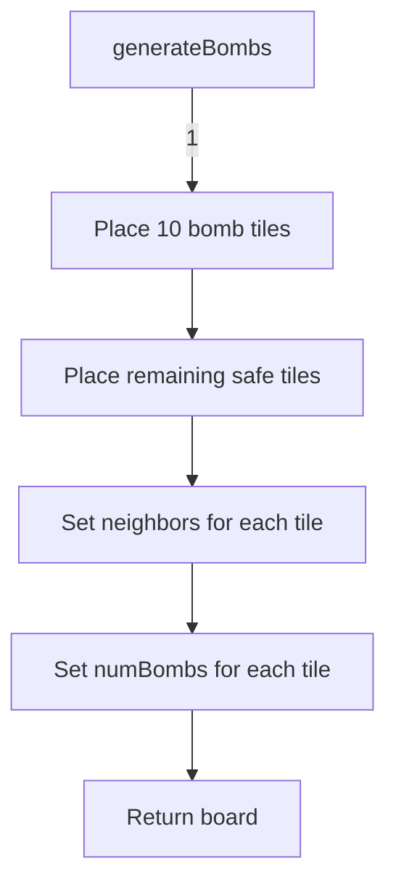
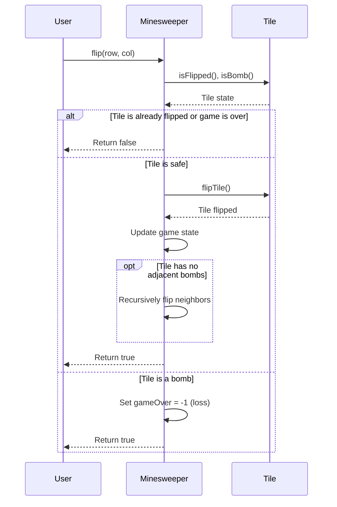
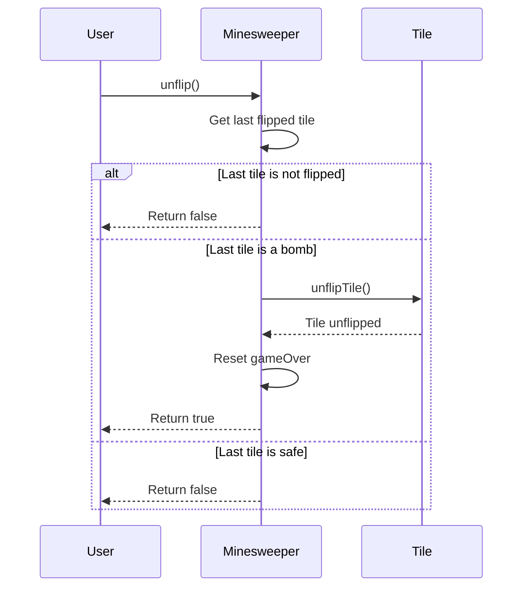
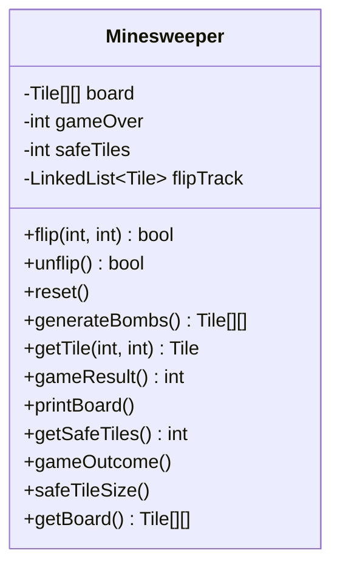

Relevant source files

The following file was used as context for generating this wiki page:

- [Minesweeper.java](https://github.com/aanickode/Minesweeper-Project/blob/main/Minesweeper.java)

# User Interface

## Introduction

The Minesweeper project is a classic implementation of the Minesweeper game, where the player's objective is to uncover all safe tiles on a grid without detonating any hidden mines. The User Interface (UI) component of this project is responsible for managing the game board, handling user interactions, and displaying the game's state and outcome.

The UI is primarily contained within the `Minesweeper` class, which serves as the main entry point and controller for the game logic. This class encapsulates the game board, game state, and provides methods for interacting with the board and tracking the game's progress.

## Game Board Initialization

The game board is represented as a 2D array of `Tile` objects, where each `Tile` represents a single cell on the board. The board is initialized with a fixed size of 8x8 tiles.

### Board Generation

The `generateBombs()` method is responsible for generating the initial game board by randomly placing 10 bomb tiles (`Tile` objects with `isBomb` set to `true`) and the remaining 54 safe tiles (`Tile` objects with `isBomb` set to `false).

Sources: [Minesweeper.java:69-103]()

For testing purposes, the `generateBombsforTest()` method is provided, which places all 10 bomb tiles in the first row of the board, making it easier to test specific scenarios.

## User Interactions

The `flip(int r, int c)` method is the primary entry point for user interactions with the game board. It handles the logic of flipping a tile at the specified row and column coordinates.

Sources: [Minesweeper.java:24-53]()

The `unflip()` method allows the player to unflip the most recently flipped tile if it was a bomb, effectively allowing them to continue playing even after a loss.

Sources: [Minesweeper.java:54-68]()

## Game State Management

The `Minesweeper` class maintains the game state through the following variables:

- `gameOver`: An integer representing the game's outcome (-1 for loss, 0 for ongoing, 1 for win).
- `safeTiles`: An integer tracking the number of remaining safe tiles to be uncovered.
- `flipTrack`: A `LinkedList` that keeps track of the order in which tiles were flipped.

The `gameResult()` method returns the current value of `gameOver`, indicating the game's outcome.

Sources: [Minesweeper.java:8-19, 24-53, 54-68, 69-103, 104-110, 111-114, 115-118, 119-122, 123-126, 127-130, 131-134, 135-138]()

## Utility Methods

The `Minesweeper` class provides several utility methods for debugging and testing purposes:

- `printBoard()`: Prints the game board with the number of adjacent bombs for each tile.
- `gameOutcome()`: Prints the current value of `gameOver`.
- `safeTileSize()`: Prints the number of remaining safe tiles.
- `getBoard()`: Returns the game board as a 2D array of `Tile` objects.

Sources: [Minesweeper.java:115-118, 119-122, 123-126, 131-134]()

## Conclusion

The User Interface component of the Minesweeper project is responsible for managing the game board, handling user interactions, and tracking the game's state. It provides methods for initializing the board, flipping tiles, and checking the game's outcome. The `Minesweeper` class serves as the central controller, encapsulating the game logic and exposing methods for interacting with the game.