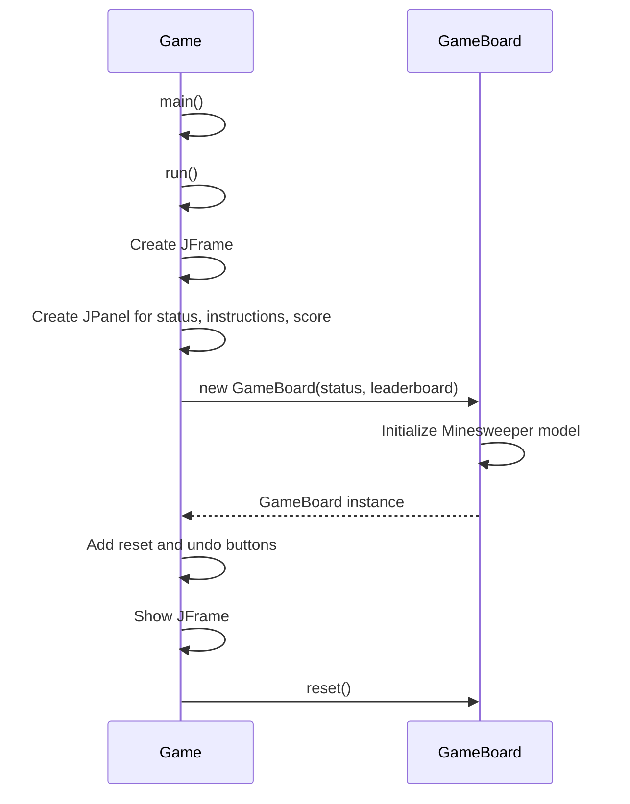
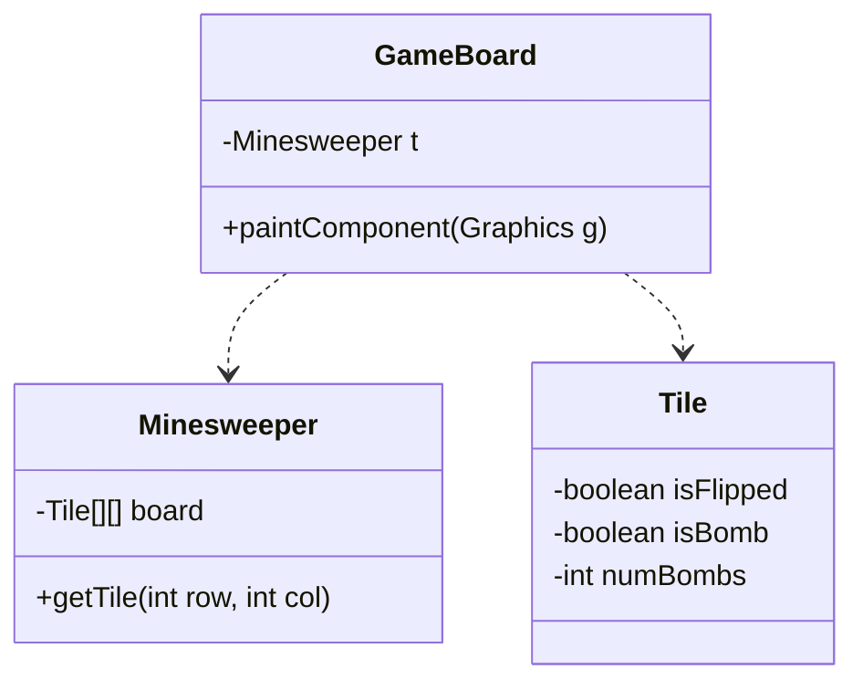
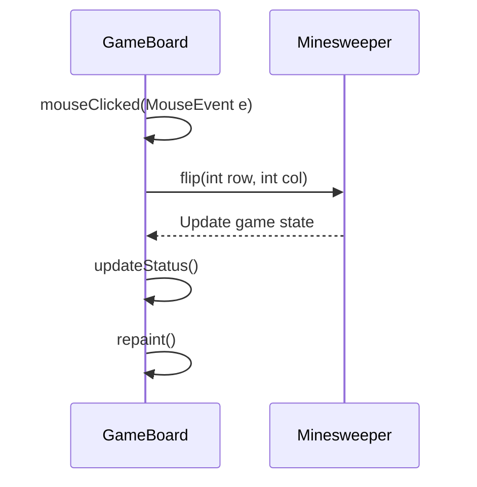
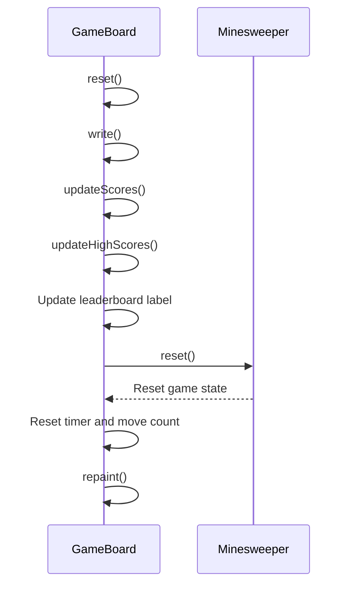
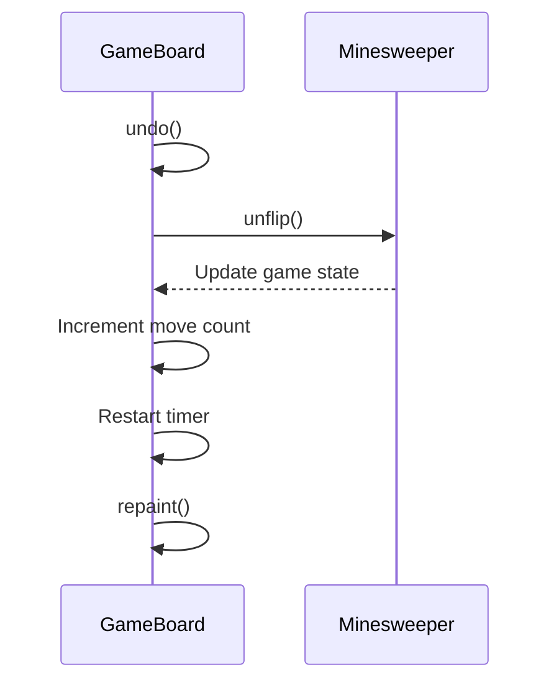
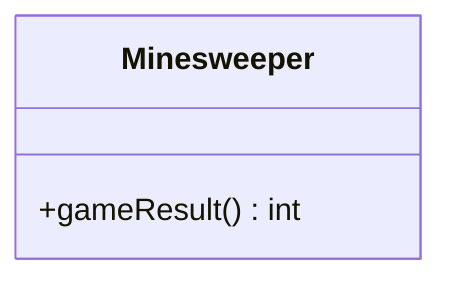
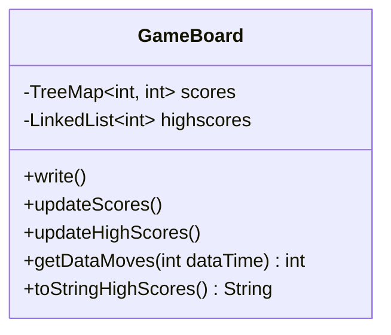

Relevant source files

The following files were used as context for generating this wiki page:

- [Game.java](https://github.com/aanickode/Minesweeper-Project/blob/main/Game.java)
- [GameBoard.java](https://github.com/aanickode/Minesweeper-Project/blob/main/GameBoard.java)
- [Minesweeper.java](https://github.com/aanickode/Minesweeper-Project/blob/main/Minesweeper.java)
- [Tile.java](https://github.com/aanickode/Minesweeper-Project/blob/main/Tile.java)
- [Files/FastestTime.txt](https://github.com/aanickode/Minesweeper-Project/blob/main/Files/FastestTime.txt)

# Game State Management

## Introduction

Game State Management is a crucial aspect of the Minesweeper project, responsible for handling the overall game flow, tracking the game's progress, and determining the win or loss conditions. It encompasses various components and functionalities that work together to provide a seamless gaming experience.

The primary classes involved in Game State Management are `Game`, `GameBoard`, and `Minesweeper`. The `Game` class sets up the top-level frame and GUI components, while the `GameBoard` class manages the game board's rendering, user interactions, and game logic. The `Minesweeper` class acts as the model, representing the game's state and providing methods to manipulate and query that state.

Sources: [Game.java](https://github.com/aanickode/Minesweeper-Project/blob/main/Game.java), [GameBoard.java](https://github.com/aanickode/Minesweeper-Project/blob/main/GameBoard.java), [Minesweeper.java](https://github.com/aanickode/Minesweeper-Project/blob/main/Minesweeper.java)

## Game Initialization

The game initialization process is handled by the `Game` class, which sets up the main frame and various GUI components, including the game board, status panel, instructions panel, and control panel.

The `GameBoard` constructor initializes the `Minesweeper` model, which represents the game state. It also sets up event listeners for mouse clicks and a timer for tracking the game time.

Sources: [Game.java:37-100](https://github.com/aanickode/Minesweeper-Project/blob/main/Game.java#L37-L100), [GameBoard.java:33-76](https://github.com/aanickode/Minesweeper-Project/blob/main/GameBoard.java#L33-L76)

## Game Board Rendering

The `GameBoard` class is responsible for rendering the game board and updating the board's visual representation based on the game state.

The `paintComponent` method in `GameBoard` iterates over the `Tile` objects in the `Minesweeper` model and draws the corresponding visual representation on the game board based on the tile's state (flipped, bomb, or number of adjacent bombs).

Sources: [GameBoard.java:77-126](https://github.com/aanickode/Minesweeper-Project/blob/main/GameBoard.java#L77-L126), [Minesweeper.java](https://github.com/aanickode/Minesweeper-Project/blob/main/Minesweeper.java), [Tile.java](https://github.com/aanickode/Minesweeper-Project/blob/main/Tile.java)

## User Interactions

The `GameBoard` class handles user interactions through mouse click events. When the user clicks on a tile, the corresponding tile in the `Minesweeper` model is flipped, and the game board is updated accordingly.

The `updateStatus` method updates the game status label based on the current game result (win, lose, or ongoing). The `repaint` method triggers the `paintComponent` method to redraw the game board with the updated state.

Sources: [GameBoard.java:44-62](https://github.com/aanickode/Minesweeper-Project/blob/main/GameBoard.java#L44-L62), [Minesweeper.java:44-45](https://github.com/aanickode/Minesweeper-Project/blob/main/Minesweeper.java#L44-L45)

## Game Reset and Undo

The `GameBoard` class provides functionality to reset the game or undo the last move.

### Game Reset

The `reset` method is called when the user clicks the "Reset" button. It performs the following actions:

1. If the game was won, it writes the game time and move count to a file (`FastestTime.txt`) using the `write` method.
2. It updates the high scores by reading the `FastestTime.txt` file and sorting the scores using the `updateScores` and `updateHighScores` methods.
3. It updates the leaderboard label with the top 5 high scores.
4. It resets the `Minesweeper` model by calling its `reset` method.
5. It resets the game timer and move count.
6. It repaints the game board to reflect the reset state.

Sources: [GameBoard.java:107-125](https://github.com/aanickode/Minesweeper-Project/blob/main/GameBoard.java#L107-L125), [GameBoard.java:127-190](https://github.com/aanickode/Minesweeper-Project/blob/main/GameBoard.java#L127-L190)

### Undo Move

The `undo` method is called when the user clicks the "Undo" button. It performs the following actions:

1. It calls the `unflip` method of the `Minesweeper` model to undo the last move.
2. It increments the move count by 2 (since undoing a move counts as two moves).
3. It restarts the game timer.
4. It repaints the game board to reflect the updated state.

Sources: [GameBoard.java:101-105](https://github.com/aanickode/Minesweeper-Project/blob/main/GameBoard.java#L101-L105), [Minesweeper.java:47-52](https://github.com/aanickode/Minesweeper-Project/blob/main/Minesweeper.java#L47-L52)

## Game Result Handling

The `Minesweeper` class provides methods to determine the game result (win or lose) based on the current state of the game board.

The `gameResult` method returns an integer value representing the game result:

- 1: The game is won (all non-bomb tiles are flipped)
- -1: The game is lost (a bomb tile is flipped)
- 0: The game is ongoing

The `GameBoard` class uses the `gameResult` method to update the game status label and stop the game timer when the game is won or lost.

Sources: [Minesweeper.java:54-67](https://github.com/aanickode/Minesweeper-Project/blob/main/Minesweeper.java#L54-L67), [GameBoard.java:63-71](https://github.com/aanickode/Minesweeper-Project/blob/main/GameBoard.java#L63-L71)

## High Score Management

The `GameBoard` class manages the high scores for the game by reading and writing to a file called `FastestTime.txt`.

The `write` method appends the current game time and move count to the `FastestTime.txt` file when the game is won.

The `updateScores` method reads the `FastestTime.txt` file and populates a `TreeMap` called `scores`, where the keys are the game times, and the values are the corresponding move counts.

The `updateHighScores` method sorts the `scores` `TreeMap` by game time and selects the top 5 scores to be stored in a `LinkedList` called `highscores`.

The `getDataMoves` method retrieves the move count for a given game time from the `scores` `TreeMap`.

The `toStringHighScores` method generates a string representation of the top 5 high scores, which is displayed in the leaderboard label.

Sources: [GameBoard.java:127-190](https://github.com/aanickode/Minesweeper-Project/blob/main/GameBoard.java#L127-L190), [Files/FastestTime.txt](https://github.com/aanickode/Minesweeper-Project/blob/main/Files/FastestTime.txt)

## Conclusion

The Game State Management in the Minesweeper project is a collaborative effort between the `Game`, `GameBoard`, and `Minesweeper` classes. It handles the game's initialization, board rendering, user interactions, game reset and undo functionality, game result determination, and high score management. By effectively managing the game state, the project provides a smooth and enjoyable gaming experience for the user.