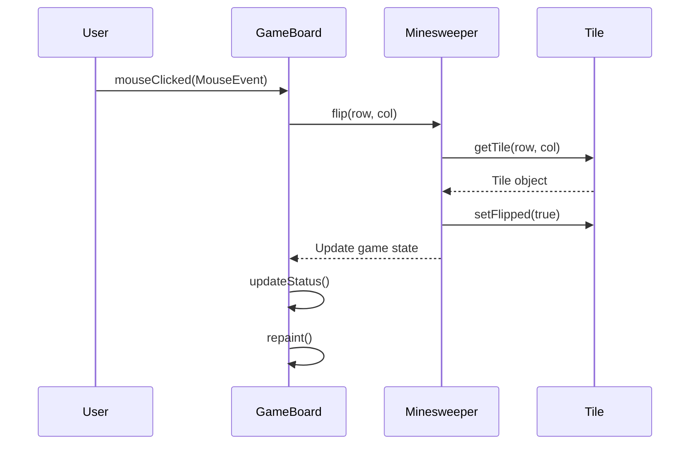
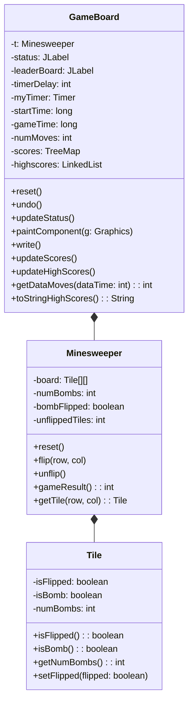

<details>
<summary>Relevant source files</summary>

The following files were used as context for generating this wiki page:

- [Game.java](https://github.com/aanickode/Minesweeper-Project/blob/main/Game.java)
- [GameBoard.java](https://github.com/aanickode/Minesweeper-Project/blob/main/GameBoard.java)
- [Minesweeper.java](https://github.com/aanickode/Minesweeper-Project/blob/main/Minesweeper.java)
- [Tile.java](https://github.com/aanickode/Minesweeper-Project/blob/main/Tile.java)
- [Files/FastestTime.txt](https://github.com/aanickode/Minesweeper-Project/blob/main/Files/FastestTime.txt)

</details>

# Game State Management

## Introduction

The "Game State Management" in this Minesweeper project refers to the mechanisms and components responsible for tracking and updating the game's state, handling user interactions, and determining the game's outcome. It encompasses the core logic that drives the gameplay experience, including board initialization, tile flipping, bomb detection, and win/loss conditions.

The primary classes involved in game state management are `Minesweeper`, `GameBoard`, and `Tile`. The `Minesweeper` class serves as the model, maintaining the game board and its state, while `GameBoard` acts as the controller, handling user input and updating the view. The `Tile` class represents individual cells on the game board, storing their state (flipped, bomb, or number of adjacent bombs).

Sources: [Minesweeper.java](), [GameBoard.java](), [Tile.java]()

## Game Board Initialization

The game board is initialized in the `GameBoard` constructor, where a new instance of the `Minesweeper` class is created to represent the game model.

```java
public GameBoard(JLabel statusInit, JLabel leaderboardInit) {
    // ...
    t = new Minesweeper(); // initializes model for the game
    // ...
}
```

The `Minesweeper` class sets up the initial state of the game board, including the placement of bombs and the calculation of adjacent bomb counts for each tile.

Sources: [GameBoard.java:31-32](), [Minesweeper.java]()

## User Input Handling

The `GameBoard` class listens for mouse click events and updates the game state accordingly. When a user clicks on a tile, the `mouseClicked` event handler is triggered, which calls the `flip` method of the `Minesweeper` class with the corresponding tile coordinates.

```java
addMouseListener(new MouseAdapter() {
    @Override
    public void mouseClicked(MouseEvent e) {
        Point p = e.getPoint();
        t.flip(p.y / 50, p.x / 50); // updates the model
        // ...
    }
});
```

The `flip` method in the `Minesweeper` class handles the logic of revealing a tile and updating the game state based on whether the tile is a bomb or not.

Sources: [GameBoard.java:40-50](), [Minesweeper.java:flip()]()

## Game State Tracking

The `Minesweeper` class maintains the game state by keeping track of the flipped tiles and the remaining unflipped tiles that are not bombs. It provides a `gameResult` method that determines the current state of the game (in progress, won, or lost).

```java
public int gameResult() {
    // ...
    if (unflippedTiles == 0) {
        return 1; // Game won
    } else if (bombFlipped) {
        return -1; // Game lost
    } else {
        return 0; // Game in progress
    }
}
```

The `GameBoard` class updates the game status and performs necessary actions based on the game result returned by the `gameResult` method.

Sources: [Minesweeper.java:gameResult()](), [GameBoard.java:updateStatus()]()

## Undo Functionality

The game also provides an "Undo" feature, which allows the user to revert the last move. This is implemented in the `undo` method of the `GameBoard` class, which calls the `unflip` method of the `Minesweeper` class to restore the previous state of the game board.

```java
public void undo() {
    if (t.unflip()) {
        numMoves += 2;
        myTimer.start();
    }
    repaint();
    requestFocusInWindow();
}
```

The `unflip` method in the `Minesweeper` class reverts the state of the last flipped tile and updates the game state accordingly.

Sources: [GameBoard.java:64-70](), [Minesweeper.java:unflip()]()

## Game Timer and Move Counter

The `GameBoard` class keeps track of the elapsed time and the number of moves made by the user. A timer is started when the game begins, and its value is updated every second using an `ActionListener`. The number of moves is incremented whenever a tile is flipped, except when the game is won or lost.

```java
ActionListener gameTimer = new ActionListener() {
    @Override
    public void actionPerformed(ActionEvent e) {
        gameTime = (System.currentTimeMillis() - startTime) / 1000;
        status.setText("Keep going!   Time: " + gameTime + "  NumMoves: " + numMoves);
    }
};
```

Sources: [GameBoard.java:53-61](), [GameBoard.java:40-50]()

## Leaderboard and High Score Tracking

The game keeps track of high scores by writing the game time and the number of moves to a file (`FastestTime.txt`) whenever the user wins a game. The `GameBoard` class reads this file and maintains a `TreeMap` of scores, ordered by the game time as the key and the number of moves as the value.

```java
public void write() {
    try {
        BufferedWriter bw = new BufferedWriter(new FileWriter("Files/FastestTime.txt", true));
        bw.write("" + gameTime + " " + (numMoves + 1));
        bw.newLine();
        bw.flush();
        bw.close();
    } catch (IOException e) {
        System.out.println("Could not write");
    }
}
```

The top 5 high scores are displayed on the leaderboard panel, which is updated whenever the game is reset.

Sources: [GameBoard.java:91-94](), [GameBoard.java:101-131](), [GameBoard.java:133-140](), [GameBoard.java:142-146]()

## Game Reset

The `reset` method of the `GameBoard` class is called when the user wants to start a new game. It resets the game state by creating a new instance of the `Minesweeper` class, updates the leaderboard with the top 5 high scores, and resets the timer and move counter.

```java
public void reset() {
    if (t.gameResult() == 1) {
        write();
    }
    updateScores();
    updateHighScores();
    leaderBoard.setText(toStringHighScores());
    t.reset();
    startTime = System.currentTimeMillis();
    gameTime = 0;
    myTimer.restart();
    numMoves = 0;
    repaint();
    requestFocusInWindow();
}
```

Sources: [GameBoard.java:74-90]()

## Sequence Diagram: Tile Flipping

The following sequence diagram illustrates the flow of events when a user clicks on a tile to flip it:



1. The user clicks on a tile, triggering the `mouseClicked` event in the `GameBoard` class.
2. The `GameBoard` calls the `flip` method of the `Minesweeper` class, passing the row and column of the clicked tile.
3. The `Minesweeper` class retrieves the `Tile` object at the specified coordinates using the `getTile` method.
4. The `Minesweeper` class sets the `isFlipped` property of the `Tile` object to `true`.
5. The `Minesweeper` class updates the game state based on the flipped tile and returns the updated state to the `GameBoard`.
6. The `GameBoard` updates the status label and repaints the game board to reflect the new state.

Sources: [GameBoard.java:40-50](), [Minesweeper.java:flip()](), [Tile.java]()

## Class Diagram

The following class diagram illustrates the relationships between the key classes involved in game state management:



The `Minesweeper` class represents the game model and manages the game board, bomb placement, and game state. It has a composition relationship with the `Tile` class, which represents individual tiles on the game board.

The `GameBoard` class acts as the controller, handling user input, updating the game state through the `Minesweeper` class, and managing the game view. It has a composition relationship with the `Minesweeper` class and maintains references to various UI components and game data structures.

Sources: [Minesweeper.java](), [Tile.java](), [GameBoard.java]()

## Conclusion

The "Game State Management" in this Minesweeper project is a crucial aspect that governs the gameplay experience. It involves the coordination of various components, including the game board, tiles, user input handling, game state tracking, and win/loss conditions. The `Minesweeper` class serves as the model, maintaining the game board and its state, while the `GameBoard` class acts as the controller, handling user interactions and updating the view. The `Tile` class represents individual cells on the game board, storing their state and properties. Together, these components work in harmony to provide a seamless and engaging gameplay experience for the user.