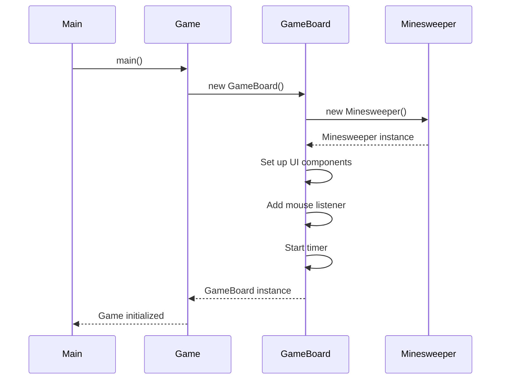
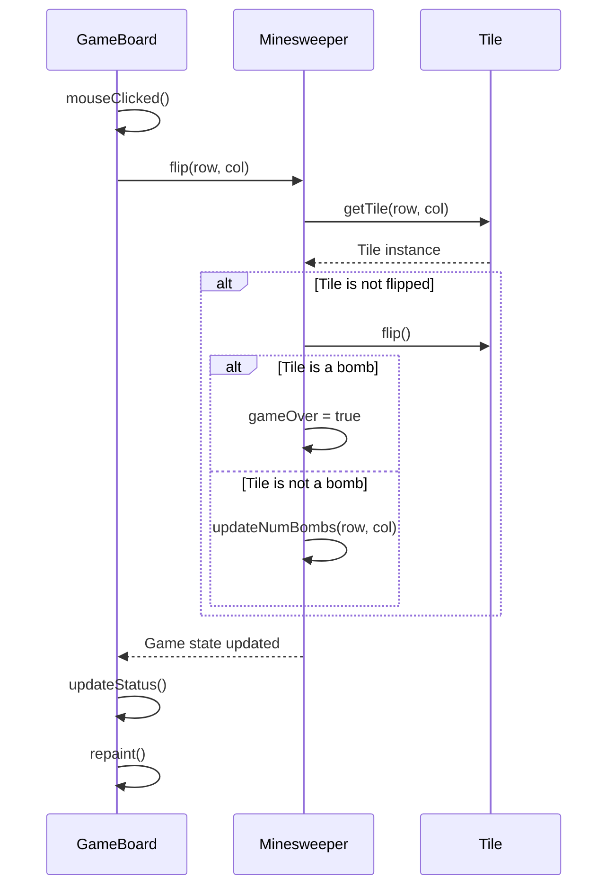
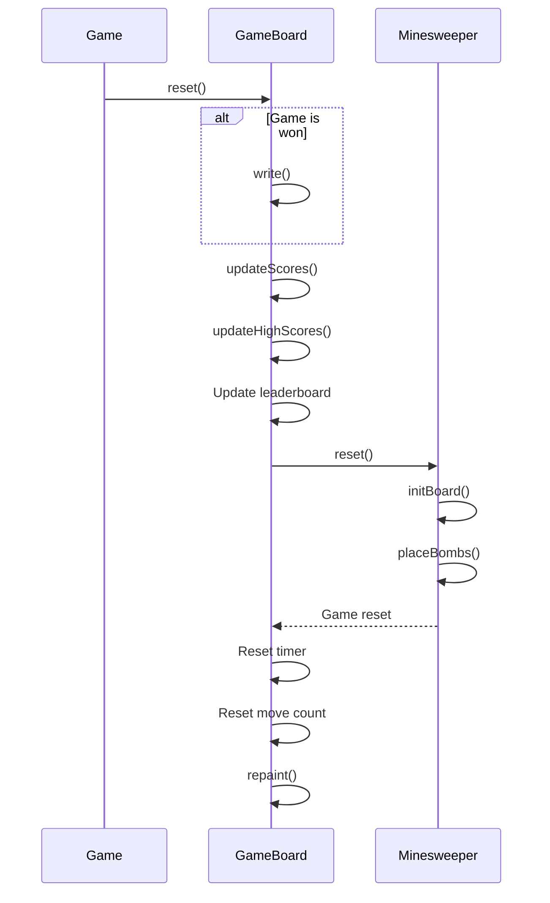

<details>
<summary>Relevant source files</summary>

The following files were used as context for generating this wiki page:

- [Game.java](https://github.com/aanickode/Minesweeper-Project/blob/main/Game.java)
- [GameBoard.java](https://github.com/aanickode/Minesweeper-Project/blob/main/GameBoard.java)
- [Minesweeper.java](https://github.com/aanickode/Minesweeper-Project/blob/main/Minesweeper.java)
- [Tile.java](https://github.com/aanickode/Minesweeper-Project/blob/main/Tile.java)
- [Files/FastestTime.txt](https://github.com/aanickode/Minesweeper-Project/blob/main/Files/FastestTime.txt)
</details>

# Game State Management

## Introduction

The "Game State Management" in this Minesweeper project refers to the handling and tracking of various game states, such as the board configuration, player moves, game status (win/lose), and high scores. It is a crucial aspect of the game's logic and user experience. The primary components responsible for managing the game state are the `Minesweeper` class, which serves as the model, and the `GameBoard` class, which acts as the controller and view.

Sources: [Minesweeper.java](), [GameBoard.java]()

## Game Board Initialization

The `GameBoard` class is responsible for initializing the game board and setting up the user interface components. It creates a new instance of the `Minesweeper` class, which represents the game model, and sets up event listeners for mouse clicks and timer updates.

```java
public GameBoard(JLabel statusInit, JLabel leaderboardInit) {
    // ...
    t = new Minesweeper(); // initializes model for the game
    // ...
    addMouseListener(new MouseAdapter() {
        @Override
        public void mouseClicked(MouseEvent e) {
            // ...
            t.flip(p.y / 50, p.x / 50); // updates the model
            // ...
        }
    });
    // ...
    myTimer = new Timer(timerDelay, gameTimer);
    // ...
}
```

Sources: [GameBoard.java:36-75]()

## Game Model (`Minesweeper` Class)

The `Minesweeper` class represents the game model and manages the state of the game board, including the placement of bombs, flipping tiles, and determining the game result.

### Board Initialization

The `Minesweeper` class initializes the game board with a fixed size (8x8) and randomly places 10 bombs on the board.

```java
public Minesweeper() {
    board = new Tile[8][8];
    initBoard();
    placeBombs();
}
```

Sources: [Minesweeper.java:11-15]()

### Tile Flipping

The `flip` method in the `Minesweeper` class is responsible for flipping a tile on the board based on the provided row and column indices. It updates the tile's state and checks for the game's win or lose condition.

```java
public void flip(int row, int col) {
    // ...
    if (!board[row][col].isFlipped()) {
        board[row][col].flip();
        if (board[row][col].isBomb()) {
            gameOver = true;
        } else {
            updateNumBombs(row, col);
        }
    }
    // ...
}
```

Sources: [Minesweeper.java:58-73]()

### Game Result

The `gameResult` method in the `Minesweeper` class determines the current state of the game based on the board configuration and player moves. It returns an integer value representing the game status: 1 for a win, -1 for a loss, and 0 for an ongoing game.

```java
public int gameResult() {
    if (gameOver) {
        return -1;
    }
    int count = 0;
    for (int row = 0; row < 8; row++) {
        for (int col = 0; col < 8; col++) {
            if (board[row][col].isFlipped()) {
                count++;
            }
        }
    }
    if (count == 64 - numBombs) {
        return 1;
    }
    return 0;
}
```

Sources: [Minesweeper.java:75-92]()

### Undo Move

The `unflip` method in the `Minesweeper` class allows the player to undo the last move by resetting the state of the previously flipped tile.

```java
public boolean unflip() {
    if (lastFlipped != null) {
        lastFlipped.unflip();
        lastFlipped = null;
        return true;
    }
    return false;
}
```

Sources: [Minesweeper.java:94-102]()

### Game Reset

The `reset` method in the `Minesweeper` class resets the game board to its initial state, clearing all flipped tiles and randomly placing new bombs.

```java
public void reset() {
    initBoard();
    placeBombs();
    gameOver = false;
}
```

Sources: [Minesweeper.java:104-109]()

## Game Board Rendering

The `GameBoard` class is responsible for rendering the game board and updating the user interface based on the game state.

### Rendering the Board

The `paintComponent` method in the `GameBoard` class draws the game board grid and renders the tiles based on their state (flipped/unflipped, bomb/non-bomb).

```java
@Override
public void paintComponent(Graphics g) {
    super.paintComponent(g);
    
    // Draws board grid
    // ...
    
    // Draws X's and O's
    for (int row = 0; row < 8; row++) {
        for (int col = 0; col < 8; col++) {
            Tile tile = t.getTile(row, col);
            if (tile.isFlipped() && !tile.isBomb()) {
                String s = String.valueOf(tile.getNumBombs());
                g.drawString(s, 50 * col + 25, 50 * row + 25);
            }
            if (tile.isFlipped() && tile.isBomb()) {
                g.drawLine(50 * col, 50 * row, 50 * col + 50, 50 * row + 50);
                g.drawLine(50 * col, 50 * row + 50, 50 * col + 50, 50 * row);
            } 
        }
    }
}
```

Sources: [GameBoard.java:124-150]()

### Updating Game Status

The `updateStatus` method in the `GameBoard` class updates the game status label based on the current game result (win, lose, or ongoing).

```java
private void updateStatus() {
    int gameStatus = t.gameResult();
    if (gameStatus == 1) {
        myTimer.stop();
        status.setText("You won!!!  Time: " + gameTime + "  NumMoves: " + (numMoves + 1));
    } else if (gameStatus == -1) {
        myTimer.stop();
        status.setText("You lost   Time: " + gameTime + "  NumMoves: " + (numMoves + 1));
    } 
}
```

Sources: [GameBoard.java:93-103]()

## High Score Management

The `GameBoard` class also handles the management of high scores, which are stored in a text file (`FastestTime.txt`).

### Writing High Scores

The `write` method in the `GameBoard` class writes the current game's time and number of moves to the `FastestTime.txt` file.

```java
public void write() {
    try {
        BufferedWriter bw = new BufferedWriter(new FileWriter("Files/FastestTime.txt", true));
        bw.write("" + gameTime + " " + (numMoves + 1));
        bw.newLine();
        bw.flush();
        bw.close();
    } catch (IOException e) {
        System.out.println("Could not write");
    }
}
```

Sources: [GameBoard.java:152-162]()

### Reading High Scores

The `updateScores` method in the `GameBoard` class reads the high scores from the `FastestTime.txt` file and stores them in a `TreeMap` data structure, where the key is the time taken to win the game, and the value is the number of moves.

```java
public void updateScores() {
    BufferedReader br = null;
    boolean hasValue = true;
    TreeMap<Integer, Integer> temp = new TreeMap<Integer, Integer>();
    try {
        br = new BufferedReader(new FileReader("Files/FastestTime.txt"));
    } catch (FileNotFoundException e) {
        System.out.println("File not found");
        hasValue = false;
    }
    if (hasValue) {
        try {
            String line = br.readLine();
            line = br.readLine();
            while (line != null) {
                String[] split = line.split(" ");
                int dataTime = 0;
                int dataMoves = 0;
                try {
                    dataTime = Integer.parseInt(split[0]);
                    dataMoves = Integer.parseInt(split[1]);
                } catch (NumberFormatException e) {
                    System.out.println("No such data");
                }
                if (dataTime != 0 && dataMoves != 0) {
                    temp.put(dataTime, dataMoves);
                }
                line = br.readLine();
            }
        } catch (IOException e) {
            System.out.println("Could not update");
        }
        try {
            br.close();
        } catch (IOException e) {
            System.out.println("Could not close");
        }
    }
    scores = temp;
}
```

Sources: [GameBoard.java:164-199]()

### Updating High Scores

The `updateHighScores` method in the `GameBoard` class sorts the high scores stored in the `TreeMap` and selects the top 5 scores to be displayed on the leaderboard.

```java
public void updateHighScores() {
    Object[] temp = scores.keySet().toArray();
    LinkedList<Integer> tempscores = new LinkedList<Integer>();
    Arrays.sort(temp);
    int i = 0;
    while (i < 5 && i < temp.length) {
        int x = (int) temp[i];
        tempscores.add(x);
        i++;
    }
    highscores = tempscores;
}
```

Sources: [GameBoard.java:201-212]()

### Displaying High Scores

The `toStringHighScores` method in the `GameBoard` class converts the high scores stored in the `LinkedList` to a formatted string for display on the leaderboard.

```java
public String toStringHighScores() {
    String s = "Top 5 Scores: ";
    for (int i = 0; i < highscores.size(); i++) {
        s += highscores.get(i) + " " + scores.get(highscores.get(i)) + ", ";
    }
    return s;
}
```

Sources: [GameBoard.java:220-226]()

## Sequence Diagram: Game Initialization



This sequence diagram illustrates the initialization process of the game, where the `Main` class creates an instance of the `Game` class, which in turn creates an instance of the `GameBoard` class. The `GameBoard` class initializes the `Minesweeper` model and sets up the user interface components, including the game board, status label, and event listeners.

Sources: [Game.java:65-92](), [GameBoard.java:36-75](), [Minesweeper.java:11-15]()

## Sequence Diagram: Tile Flipping



This sequence diagram illustrates the process of flipping a tile on the game board. When the user clicks on a tile, the `mouseClicked` event is triggered in the `GameBoard` class, which calls the `flip` method in the `Minesweeper` class with the corresponding row and column indices. The `Minesweeper` class retrieves the `Tile` instance at the given coordinates and checks if it is not already flipped. If the tile is not flipped, it updates the tile's state by calling the `flip` method on the `Tile` instance. If the flipped tile is a bomb, the `gameOver` flag is set to true. If the flipped tile is not a bomb, the `updateNumBombs` method is called to update the number of adjacent bombs for that tile. After updating the game state, the `GameBoard` class updates the game status label and repaints the board to reflect the changes.

Sources: [GameBoard.java:48-62, 93-103, 124-150](), [Minesweeper.java:58-73](), [Tile.java:11-19]()

## Sequence Diagram: Game Reset



This sequence diagram illustrates the process of resetting the game, which can be triggered by the user clicking the "Reset" button or after winning the game. When the `reset` method is called in the `GameBoard` class, it first checks if the game was won and writes the game time and move count to the `FastestTime.txt` file using the `write` method. It then updates the high scores by calling the `updateScores` and `updateHighScores` methods, and updates the leaderboard display. The `reset` method is then called on the `Minesweeper` instance, which initializes a new game board and randomly places the bombs. The `GameBoard` class resets the timer, move count, and repaints the board to reflect the new game state.

Sources: [Game.java:65-92](), [GameBoard.java:77-91, 152-162, 164-199, 201-212, 220-226](), [Minesweeper.java:104-109, 11-15, 16-29]()

## Sequence Diagram: Undo Move

```mermaid
sequenceDiagram
    participant Game
    participant GameBoard
    participant M