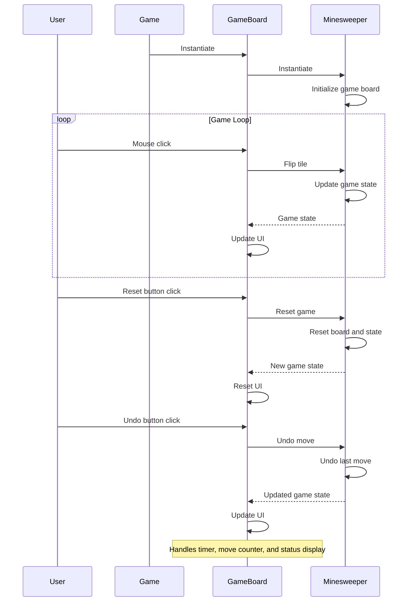
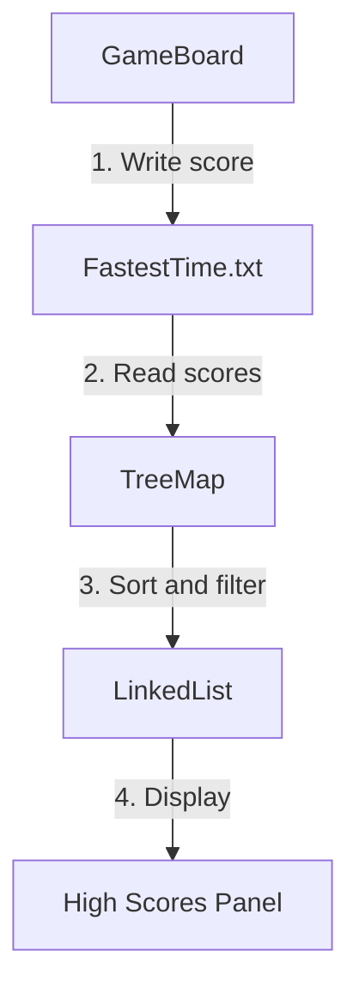

<details>
<summary>Relevant source files</summary>

The following files were used as context for generating this wiki page:

- [Game.java](https://github.com/aanickode/Minesweeper-Project/blob/main/Game.java)
- [GameBoard.java](https://github.com/aanickode/Minesweeper-Project/blob/main/GameBoard.java)
- [Tile.java](https://github.com/aanickode/Minesweeper-Project/blob/main/Tile.java)
- [Minesweeper.java](https://github.com/aanickode/Minesweeper-Project/blob/main/Minesweeper.java)
- [Files/FastestTime.txt](https://github.com/aanickode/Minesweeper-Project/blob/main/Files/FastestTime.txt)

</details>

# Game State Management

## Introduction

The "Game State Management" in this Minesweeper project refers to the system responsible for maintaining and updating the current state of the game, including the game board, player moves, game status (win, lose, or ongoing), and other relevant data. It serves as the central component that orchestrates the game logic and facilitates interactions between the user interface and the underlying game mechanics.

Sources: [Game.java](https://github.com/aanickode/Minesweeper-Project/blob/main/Game.java), [GameBoard.java](https://github.com/aanickode/Minesweeper-Project/blob/main/GameBoard.java), [Minesweeper.java](https://github.com/aanickode/Minesweeper-Project/blob/main/Minesweeper.java)

## Game Board Representation

The game board is represented by a 2D array of `Tile` objects, where each `Tile` contains information about its state (flipped or not, bomb or not), position on the board, and the number of adjacent bombs.

```java
private Tile[][] board;
```

Sources: [Minesweeper.java:18](https://github.com/aanickode/Minesweeper-Project/blob/main/Minesweeper.java#L18)

## Game State Components

### Minesweeper Class

The `Minesweeper` class serves as the model for the game, encapsulating the game board and its state. It provides methods to initialize the board, flip tiles, check the game result, reset the game, and undo moves.

```java
public class Minesweeper {
    // Game board and state management methods
}
```

Sources: [Minesweeper.java](https://github.com/aanickode/Minesweeper-Project/blob/main/Minesweeper.java)

### GameBoard Class

The `GameBoard` class is responsible for rendering the game board and handling user interactions. It maintains a reference to the `Minesweeper` model and updates the game state based on user actions (mouse clicks). It also manages the game timer, move counter, and displays the current status.

```java
public class GameBoard extends JPanel {
    private Minesweeper t; // model for the game
    // Game board rendering and user interaction handling
}
```

Sources: [GameBoard.java](https://github.com/aanickode/Minesweeper-Project/blob/main/GameBoard.java)

### Game Class

The `Game` class sets up the top-level frame and widgets for the GUI, including the game board, status panel, instructions panel, and control buttons (reset and undo). It initializes the `GameBoard` instance and starts the game.

```java
public class Game implements Runnable {
    // GUI setup and game initialization
}
```

Sources: [Game.java](https://github.com/aanickode/Minesweeper-Project/blob/main/Game.java)

## Game Flow

The game flow and state management can be summarized as follows:



1. The `Game` class initializes the `GameBoard` instance, which in turn instantiates the `Minesweeper` model and initializes the game board.
2. The user interacts with the game by clicking on tiles in the `GameBoard`.
3. The `GameBoard` handles the mouse click event and calls the `flip` method in the `Minesweeper` model, passing the tile coordinates.
4. The `Minesweeper` model updates the game state based on the flipped tile and returns the updated state to the `GameBoard`.
5. The `GameBoard` updates the UI to reflect the new game state, including rendering the board and updating the status, timer, and move counter.
6. The user can reset the game by clicking the "Reset" button, which triggers the `reset` method in the `GameBoard`. This, in turn, calls the `reset` method in the `Minesweeper` model to reset the board and game state.
7. The user can undo a move by clicking the "Undo" button, which triggers the `undo` method in the `GameBoard`. This calls the `unflip` method in the `Minesweeper` model to revert the last move, and the `GameBoard` updates the UI accordingly.

Sources: [Game.java](https://github.com/aanickode/Minesweeper-Project/blob/main/Game.java), [GameBoard.java](https://github.com/aanickode/Minesweeper-Project/blob/main/GameBoard.java), [Minesweeper.java](https://github.com/aanickode/Minesweeper-Project/blob/main/Minesweeper.java)

## Key Components and Features

| Component | Description |
| --- | --- |
| `Minesweeper` | The model class that manages the game board, game state, and game logic. |
| `GameBoard` | The view and controller class that renders the game board, handles user interactions, and updates the UI based on the game state. |
| `Tile` | A class representing an individual tile on the game board, containing information about its state (flipped, bomb, number of adjacent bombs). |
| Game Timer | A timer that keeps track of the elapsed time since the start of the game. |
| Move Counter | A counter that tracks the number of moves made by the player. |
| Game Status | Displays the current status of the game (win, lose, or ongoing). |
| Reset Button | Allows the user to reset the game and start a new one. |
| Undo Button | Allows the user to undo the last move made. |
| High Scores | Displays the top 5 high scores based on the fastest times and fewest moves. |

Sources: [Game.java](https://github.com/aanickode/Minesweeper-Project/blob/main/Game.java), [GameBoard.java](https://github.com/aanickode/Minesweeper-Project/blob/main/GameBoard.java), [Minesweeper.java](https://github.com/aanickode/Minesweeper-Project/blob/main/Minesweeper.java), [Tile.java](https://github.com/aanickode/Minesweeper-Project/blob/main/Tile.java)

## High Scores Management

The project includes a feature to track and display the top 5 high scores based on the fastest times and fewest moves. The high scores are stored in a text file (`FastestTime.txt`) and loaded into a `TreeMap` data structure during runtime.



1. When the player wins the game, the `GameBoard` writes the game time and number of moves to the `FastestTime.txt` file.
2. The `GameBoard` reads the scores from the `FastestTime.txt` file and stores them in a `TreeMap` with the time as the key and the number of moves as the value.
3. The `GameBoard` sorts the `TreeMap` keys (times) and selects the top 5 scores to store in a `LinkedList`.
4. The `GameBoard` displays the top 5 high scores in the "High Scores Panel" of the GUI.

Sources: [GameBoard.java](https://github.com/aanickode/Minesweeper-Project/blob/main/GameBoard.java), [Files/FastestTime.txt](https://github.com/aanickode/Minesweeper-Project/blob/main/Files/FastestTime.txt)

## Conclusion

The "Game State Management" system in this Minesweeper project follows the Model-View-Controller (MVC) design pattern. The `Minesweeper` class serves as the model, managing the game board and game state. The `GameBoard` class acts as the view and controller, rendering the game board, handling user interactions, and updating the UI based on the game state. The `Game` class sets up the top-level GUI and initializes the game components. This separation of concerns and the use of the MVC pattern facilitate maintainability, extensibility, and testability of the codebase.

Sources: [Game.java](https://github.com/aanickode/Minesweeper-Project/blob/main/Game.java), [GameBoard.java](https://github.com/aanickode/Minesweeper-Project/blob/main/GameBoard.java), [Minesweeper.java](https://github.com/aanickode/Minesweeper-Project/blob/main/Minesweeper.java), [Tile.java](https://github.com/aanickode/Minesweeper-Project/blob/main/Tile.java)