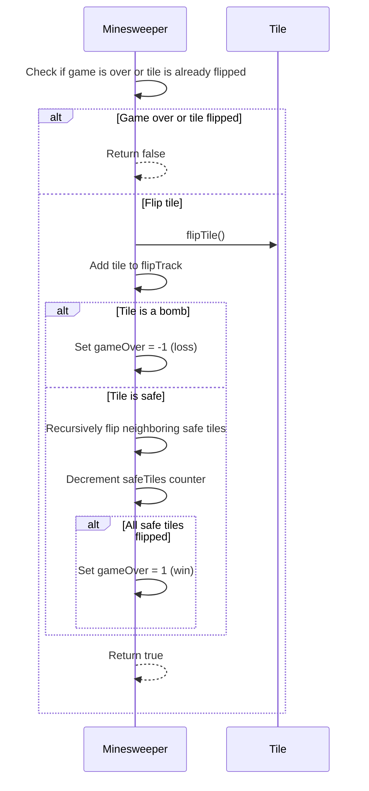

<details>
<summary>Relevant source files</summary>

The following file was used as context for generating this wiki page:

- [Minesweeper.java](https://github.com/aanickode/Minesweeper-Project/blob/main/Minesweeper.java)

</details>

# Running the Game

## Introduction

The `Minesweeper` class is the core component of the Minesweeper game implementation. It manages the game board, tile flipping logic, game state, and other essential functionalities. This wiki page covers the process of running the game, including board initialization, tile flipping, game outcome determination, and relevant methods and data structures involved.

## Game Board Initialization

The game board is represented by a 2D array of `Tile` objects, stored in the `board` field. The board is initialized during the game reset process, which can be triggered by calling the `reset()` or `resetForTest()` methods.

### Board Generation

The `generateBombs()` method is responsible for generating the game board with bombs and safe tiles. Here's how it works:

1. It creates a new 8x8 `Tile` array for the board.
2. It randomly places 10 bomb tiles (`Tile` objects with `isBomb` set to `true`) on the board.
3. It populates the remaining tiles as safe tiles (`Tile` objects with `isBomb` set to `false`).
4. For each tile, it sets the neighboring tiles and calculates the number of adjacent bombs using the `setNeighbors()` and `setNumBombs()` methods.

```mermaid
graph TD
    A[generateBombs()] --> B[Create 8x8 Tile array]
    B --> C[Place 10 bomb tiles randomly]
    C --> D[Create remaining safe tiles]
    D --> E[Set neighbors and bomb counts for each tile]
    E --> F[Return initialized board]
```

Sources: [Minesweeper.java:36-80]()

The `resetForTest()` method follows a similar approach but places all bombs in the first row for testing purposes.

## Tile Flipping

The `flip(int r, int c)` method is responsible for flipping a tile at the given row and column coordinates. Here's how it works:

1. It checks if the game is already over or if the tile is already flipped. If so, it returns `false`.
2. It flips the tile using the `flipTile()` method and adds it to the `flipTrack` list.
3. If the flipped tile is a bomb, it sets the `gameOver` flag to `-1` (loss).
4. If the flipped tile is a safe tile with no adjacent bombs, it recursively flips all neighboring safe tiles.
5. It decrements the `safeTiles` counter.
6. If all safe tiles have been flipped, it sets the `gameOver` flag to `1` (win).
7. It returns `true` if the flip operation was successful.



Sources: [Minesweeper.java:16-44]()

## Game Outcome

The `gameResult()` method returns the current game outcome, which can be one of the following values:

- `0`: Game is in progress
- `-1`: Game is lost (a bomb was flipped)
- `1`: Game is won (all safe tiles have been flipped)

```mermaid
graph TD
    A[gameResult()] --> B{gameOver value}
    B-->|0| C[Game in progress]
    B-->|-1| D[Game lost]
    B-->|1| E[Game won]
```

Sources: [Minesweeper.java:83]()

The `gameOutcome()` method simply prints the value of the `gameOver` flag, which represents the game outcome.

## Unflipping Tiles

The `unflip()` method allows the player to unflip the most recently flipped tile, but only if that tile is a bomb. This feature enables the player to continue playing even after losing the game. Here's how it works:

1. It retrieves the last flipped tile from the `flipTrack` list.
2. If the tile is not flipped or is not a bomb, it returns `false`.
3. If the tile is a bomb, it unflips the tile using the `unflipTile()` method, removes it from the `flipTrack` list, and resets the `gameOver` flag to `0` (game in progress).
4. It returns `true` if the unflip operation was successful.

```mermaid
graph TD
    A[unflip()] --> B[Get last flipped tile]
    B --> C{Tile is flipped and a bomb?}
    C -->|No| D[Return false]
    C -->|Yes| E[Unflip tile]
    E --> F[Remove tile from flipTrack]
    F --> G[Set gameOver = 0]
    G --> H[Return true]
```

Sources: [Minesweeper.java:45-59]()

## Utility Methods

The `Minesweeper` class also provides several utility methods:

- `getTile(int x, int y)`: Returns the `Tile` object at the given row and column coordinates.
- `getSafeTiles()`: Returns the number of remaining safe tiles.
- `printBoard()`: Prints the game board with the number of adjacent bombs for each tile.
- `getBoard()`: Returns the 2D `Tile` array representing the game board.

## Main Method

The `main()` method in the `Minesweeper` class demonstrates how to run the game. It creates a new `Minesweeper` instance, prints the initial board, flips several tiles, and prints the game outcome.

```java
public static void main(String[] args) {
    Minesweeper t = new Minesweeper();
    t.printBoard();
    t.flip(7, 0);
    t.flip(7, 1);
    // ... (flipping more tiles)
    t.gameOutcome();
    t.flip(7, 7);
    t.gameOutcome();
}
```

This method is primarily for testing and demonstration purposes and should not be considered the primary entry point for running the game in a production environment.

Sources: [Minesweeper.java:89-102]()