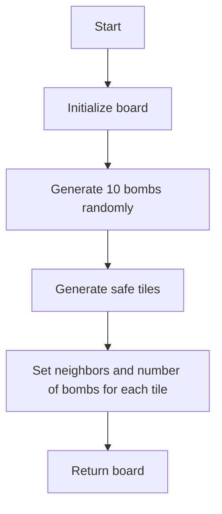
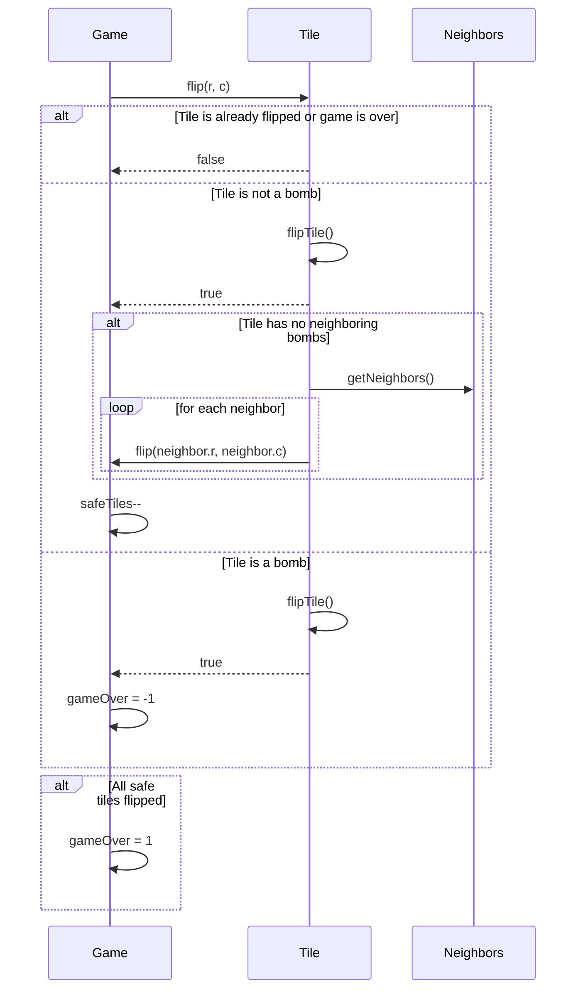

<details>
<summary>Relevant source files</summary>

The following file was used as context for generating this wiki page:

- [Minesweeper.java](https://github.com/aanickode/Minesweeper-Project/blob/main/Minesweeper.java)

</details>

# Running the Game

## Introduction

The `Minesweeper` class is the core component of the Minesweeper game implementation. It manages the game board, tile flipping, game state, and other essential functionalities. This page provides an overview of how to run and interact with the Minesweeper game.

## Game Initialization

The game is initialized by creating an instance of the `Minesweeper` class. There are two constructors available:

1. `Minesweeper()`: This constructor initializes a new game with a default 8x8 board.
2. `Minesweeper(boolean b)`: This constructor is used for testing purposes and generates a specific board configuration.

```java
// Initialize a new game
Minesweeper game = new Minesweeper();

// Initialize a game for testing
Minesweeper testGame = new Minesweeper(true);
```

Sources: [Minesweeper.java:14-20](), [Minesweeper.java:24-28]()

## Game Board Generation

The game board is represented by a 2D array of `Tile` objects. The `generateBombs()` method is responsible for generating the board with 10 randomly placed bombs and 54 safe tiles.

```java
public Tile[][] generateBombs() {
    // ...
    // Generate 10 bombs randomly
    // ...

    // Generate safe tiles
    // ...

    // Set neighbors and number of bombs for each tile
    // ...

    return board;
}
```

For testing purposes, the `generateBombsforTest()` method generates a specific board configuration with all bombs placed in the first row.

Sources: [Minesweeper.java:65-97]()

### Board Generation Flowchart



Sources: [Minesweeper.java:65-97]()

## Tile Flipping

The `flip(int r, int c)` method is used to flip a tile at the specified row and column indices. It performs the following actions:

1. Check if the game is over or the tile is already flipped.
2. Flip the tile and add it to the `flipTrack` list.
3. If the flipped tile is a bomb, set the game state to "lost" (`gameOver = -1`).
4. If the flipped tile is safe and has no neighboring bombs, recursively flip all its neighbors.
5. Decrement the `safeTiles` counter.
6. If all safe tiles have been flipped, set the game state to "won" (`gameOver = 1`).

```java
public boolean flip(int r, int c) {
    // ...
    if (board[r][c].isBomb()) {
        gameOver = -1;
    } else {
        if (board[r][c].getNumBombs() == 0) {
            // Recursively flip neighbors
        }
        safeTiles--;
    }
    if (safeTiles == 0) {
        gameOver = 1;
    }
    // ...
}
```

Sources: [Minesweeper.java:30-52]()

### Tile Flipping Sequence Diagram



Sources: [Minesweeper.java:30-52]()

## Unflipping Tiles

The `unflip()` method allows the player to unflip the most recently flipped tile if it was a bomb. This functionality enables the player to continue playing even after losing the game.

```java
public boolean unflip() {
    Tile tile = flipTrack.getLast();
    if (!tile.isFlipped()) {
        return false;
    }
    if (tile.isBomb()) {
        tile.unflipTile();
        flipTrack.remove(tile);
        gameOver = 0;
        return true;
    }
    return false;
}
```

Sources: [Minesweeper.java:54-66]()

## Game Reset

The `reset()` method is used to reset the game and start a new one. It initializes a new board, resets the game state, and clears the `flipTrack` list.

```java
public void reset() {
    board = new Tile[8][8];
    safeTiles = 0;
    board = generateBombs();
    gameOver = 0;
    flipTrack = new LinkedList<Tile>();
}
```

Sources: [Minesweeper.java:68-75]()

## Game State and Outcome

The `gameResult()` method returns the current game state, which can be one of the following values:

- `0`: Game is in progress
- `-1`: Game is lost (a bomb was flipped)
- `1`: Game is won (all safe tiles have been flipped)

```java
public int gameResult() {
    return gameOver;
}
```

Sources: [Minesweeper.java:94]()

The `gameOutcome()` method prints the game outcome based on the `gameOver` value.

```java
public void gameOutcome() {
    String s = String.valueOf(gameOver);
    System.out.println(s);
}
```

Sources: [Minesweeper.java:100-103]()

## Utility Methods

The `Minesweeper` class provides several utility methods for debugging, testing, and accessing game data:

- `printBoard()`: Prints the board with all tile values (number of neighboring bombs) shown.
- `getSafeTiles()`: Returns the number of remaining safe tiles.
- `safeTileSize()`: Prints the number of remaining safe tiles.
- `getBoard()`: Returns the game board (2D array of `Tile` objects).

Sources: [Minesweeper.java:86-92](), [Minesweeper.java:96-99](), [Minesweeper.java:105]()

## Conclusion

The `Minesweeper` class is the core component of the Minesweeper game implementation. It manages the game board, tile flipping, game state, and other essential functionalities. By creating an instance of this class and using its methods, you can initialize, play, and reset the Minesweeper game.