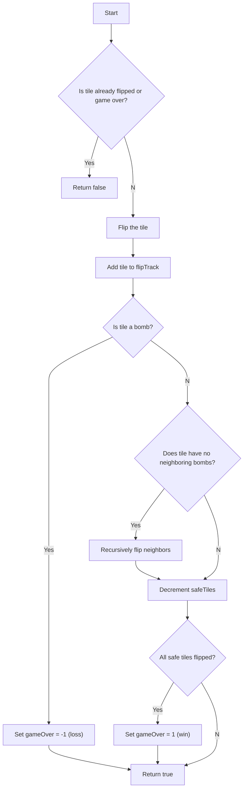
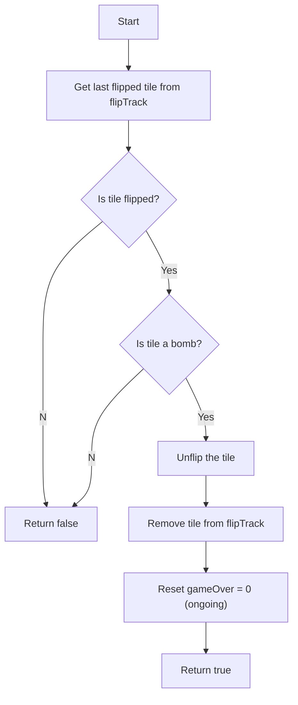

<details>
<summary>Relevant source files</summary>

The following file was used as context for generating this wiki page:

- [Minesweeper.java](https://github.com/aanickode/Minesweeper-Project/blob/main/Minesweeper.java)

</details>

# Running the Game

## Introduction

The `Minesweeper` class is the core component of the Minesweeper game implementation. It manages the game board, tile flipping, game state, and other essential functionalities. This wiki page provides an overview of how the game is executed and the key methods involved in running the Minesweeper game.

## Game Initialization

The game can be initialized in two ways:

1. **Default Constructor**: `public Minesweeper()` - This constructor calls the `reset()` method to set up a new game.
2. **Test Constructor**: `public Minesweeper(boolean b)` - This constructor calls the `resetForTest()` method, which generates a specific board configuration for testing purposes.

Both constructors ultimately call the `generateBombs()` or `generateBombsforTest()` methods to create the game board with randomly placed bombs and safe tiles.

Sources: [Minesweeper.java:15-22](), [Minesweeper.java:61-72](), [Minesweeper.java:76-93]()

## Game Board Generation

The game board is represented as a 2D array of `Tile` objects, where each tile can be either a bomb or a safe tile.

### Bomb Generation

The `generateBombs()` method generates 10 random bomb locations on the 8x8 board. It iterates until 10 bombs are placed, ensuring no duplicates.

```mermaid
flowchart TD
    start[Start] --> randomRow["Generate random row (0-7)"]
    randomRow --> randomCol["Generate random col (0-7)"]
    randomCol --> checkTile{"Is tile at (row, col) null?"}
    checkTile --Yes--> createBomb["Create Bomb Tile at (row, col)"]
    createBomb --> incrementCount["Increment bomb count"]
    incrementCount --> checkCount{"Bomb count == 10?"}
    checkCount --No--> randomRow
    checkCount --Yes--> createSafeTiles[Create safe tiles for remaining positions]
    createSafeTiles --> setNeighbors["Set neighbors and bomb counts for all tiles"]
    setNeighbors --> end[End]
    checkTile --No--> randomRow
```

Sources: [Minesweeper.java:76-93]()

### Safe Tile Generation

After placing the bombs, the `generateBombs()` method creates safe tiles for the remaining positions on the board. It then sets the neighbors and bomb counts for each tile using the `setNeighbors()` and `findNumBombs()` methods from the `Tile` class.

Sources: [Minesweeper.java:76-93]()

## Tile Flipping

The `flip(int r, int c)` method is responsible for flipping a tile at the given row and column coordinates. It performs the following actions:

1. Check if the tile is already flipped or if the game is over. If so, return `false`.
2. Flip the tile and add it to the `flipTrack` list for potential unflipping.
3. If the flipped tile is a bomb, set the game over state to -1 (loss).
4. If the flipped tile is safe and has no neighboring bombs, recursively flip all its neighbors using the `getNeighbors()` method from the `Tile` class.
5. Decrement the `safeTiles` counter.
6. If all safe tiles have been flipped, set the game over state to 1 (win).
7. Return `true` to indicate a successful flip.



Sources: [Minesweeper.java:26-48]()

## Unflipping Tiles

The `unflip()` method allows the player to unflip the most recently flipped tile if it was a bomb. This method is useful for continuing the game after a loss. It performs the following actions:

1. Get the last flipped tile from the `flipTrack` list.
2. Check if the tile is flipped and is a bomb.
3. If both conditions are met, unflip the tile, remove it from `flipTrack`, and reset the game over state to 0 (ongoing).
4. Return `true` if the unflip was successful, `false` otherwise.



Sources: [Minesweeper.java:50-59]()

## Game Reset

The `reset()` method is used to reset the game to its initial state. It performs the following actions:

1. Create a new 8x8 `Tile` array for the board.
2. Reset the `safeTiles` counter to 0.
3. Call the `generateBombs()` method to generate a new board with bombs and safe tiles.
4. Reset the `gameOver` state to 0 (ongoing).
5. Create a new `LinkedList` for `flipTrack`.

The `resetForTest()` method follows a similar process but calls `generateBombsforTest()` instead, which generates a specific board configuration for testing purposes.

Sources: [Minesweeper.java:61-72](), [Minesweeper.java:76-93]()

## Game State and Outcome

The `gameResult()` method returns the current game state, which can be -1 (loss), 0 (ongoing), or 1 (win).

The `gameOutcome()` method prints the game outcome based on the `gameOver` state.

The `getSafeTiles()` method returns the number of remaining safe tiles.

The `safeTileSize()` method prints the number of remaining safe tiles.

Sources: [Minesweeper.java:97-104](), [Minesweeper.java:108-110]()

## Board Printing

The `printBoard()` method prints the entire game board, displaying the number of neighboring bombs for each tile. This method is useful for debugging and testing purposes.

Sources: [Minesweeper.java:94-96]()

## Conclusion

The `Minesweeper` class provides the core functionality for running the Minesweeper game. It manages the game board, tile flipping, game state, and other essential operations. The key methods involved in running the game include `flip()`, `unflip()`, `reset()`, `gameResult()`, `gameOutcome()`, `getSafeTiles()`, and `printBoard()`. These methods work together to facilitate the game flow and provide the necessary functionality for the player to interact with the Minesweeper game.