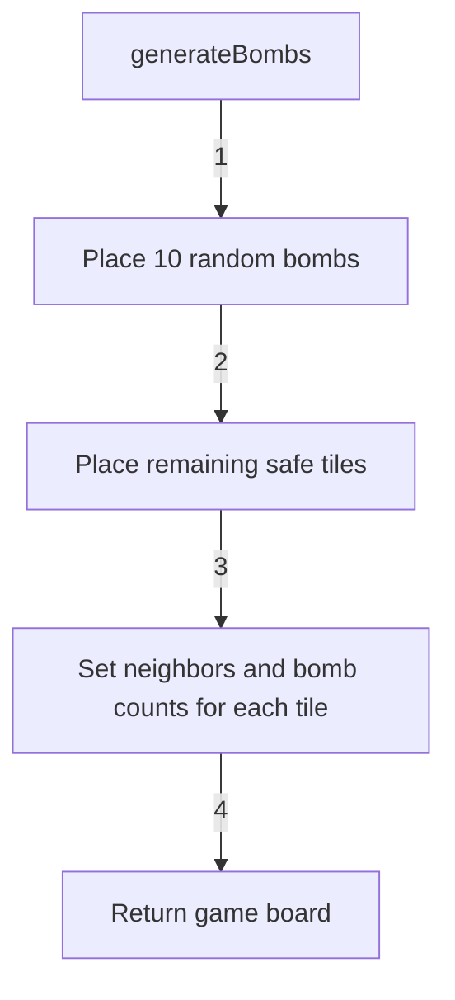
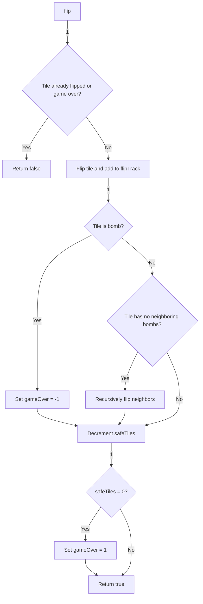
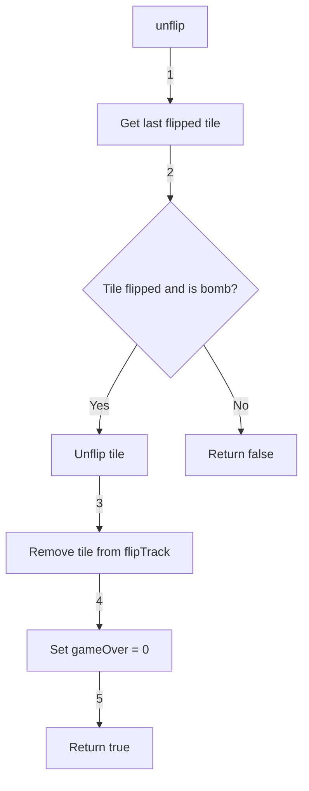
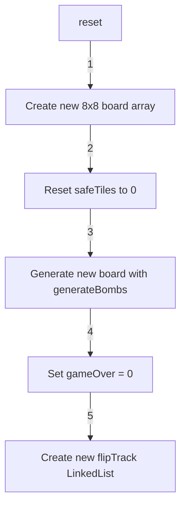

<details>
<summary>Relevant source files</summary>

The following file was used as context for generating this wiki page:

- [Minesweeper.java](https://github.com/aanickode/Minesweeper-Project/blob/main/Minesweeper.java)
</details>

# User Interface

## Introduction

The "User Interface" in the Minesweeper project refers to the console-based interface for playing the Minesweeper game. The game is implemented in Java, and the `Minesweeper` class serves as the main entry point and controller for the game logic. The user interface is primarily text-based, with the game board being printed to the console and user input being accepted through command-line arguments.

Sources: [Minesweeper.java]()

## Game Board Representation

The game board is represented as a 2D array of `Tile` objects, where each `Tile` represents a cell on the board. The board size is fixed at 8x8 cells.

```java
private Tile[][] board;
```

Sources: [Minesweeper.java:13]()

## Game State

The game state is tracked using the following variables:

- `gameOver`: An integer value representing the game's outcome. It can have three possible values:
  - `0`: The game is ongoing.
  - `-1`: The game is lost (a bomb was flipped).
  - `1`: The game is won (all safe tiles have been flipped).

```java
private int gameOver;
```

Sources: [Minesweeper.java:14]()

- `safeTiles`: An integer value representing the number of remaining safe tiles (non-bomb tiles) on the board.

```java
private int safeTiles;
```

Sources: [Minesweeper.java:15]()

- `flipTrack`: A `LinkedList` that keeps track of the tiles that have been flipped during the game. This is used for the "unflip" functionality, which allows the player to undo the most recent flip if it revealed a bomb.

```java
private LinkedList<Tile> flipTrack;
```

Sources: [Minesweeper.java:16]()

## Game Initialization

The game board is initialized in the constructor of the `Minesweeper` class. The `reset()` method is called to generate a new game board with 10 randomly placed bombs and 54 safe tiles.

```java
public Minesweeper() {
    reset();
}
```

Sources: [Minesweeper.java:20-22]()

The `generateBombs()` method is responsible for creating the game board with the specified number of bombs and safe tiles.



Sources: [Minesweeper.java:76-107]()

## Tile Flipping

The `flip(int r, int c)` method is used to flip a tile at the specified row and column coordinates. It performs the following actions:

1. Check if the game is over or if the tile has already been flipped. If so, return `false`.
2. Flip the tile and add it to the `flipTrack` list.
3. If the flipped tile is a bomb, set `gameOver` to `-1` (game lost).
4. If the flipped tile is safe and has no neighboring bombs, recursively flip all its neighbors.
5. Decrement the `safeTiles` count.
6. If `safeTiles` reaches 0, set `gameOver` to `1` (game won).
7. Return `true` to indicate a successful flip.



Sources: [Minesweeper.java:28-54]()

## Unflipping Tiles

The `unflip()` method allows the player to undo the most recent tile flip if it revealed a bomb. It performs the following actions:

1. Get the last flipped tile from the `flipTrack` list.
2. Check if the tile is flipped and is a bomb.
3. If both conditions are met, unflip the tile, remove it from `flipTrack`, and set `gameOver` to `0` (ongoing game).
4. Return `true` if the unflip was successful, `false` otherwise.



Sources: [Minesweeper.java:58-70]()

## Game Reset

The `reset()` method is used to reset the game and start a new one. It performs the following actions:

1. Create a new 8x8 `Tile` array for the game board.
2. Reset the `safeTiles` count to 0.
3. Generate a new game board with bombs and safe tiles using the `generateBombs()` method.
4. Reset `gameOver` to 0 (ongoing game).
5. Create a new `LinkedList` for `flipTrack`.



Sources: [Minesweeper.java:74-75, 108-114]()

## Game Outcome

The `gameOutcome()` method prints the current game outcome (`gameOver` value) to the console.

```java
public void gameOutcome() {
    String s = String.valueOf(gameOver);
    System.out.println(s);
}
```

Sources: [Minesweeper.java:136-139]()

## Board Printing

The `printBoard()` method prints the game board to the console, displaying the number of neighboring bombs for each tile.

```java
public void printBoard() {
    for (int row = 0; row < board.length; row++) {
        for (int col = 0; col < board[0].length; col++) {
            System.out.print(" " + board[row][col].getNumBombs());
        }
        System.out.println();
    }
}
```

Sources: [Minesweeper.java:128-135]()

## Main Method

The `main()` method is the entry point of the program and serves as a simple example of how to play the game. It creates a new `Minesweeper` instance, prints the initial board, flips several tiles, and prints the game outcome.

```java
public static void main(String[] args) {
    Minesweeper t = new Minesweeper();
    t.printBoard();
    t.flip(7, 0);
    t.flip(7, 1);
    t.flip(7, 2);
    t.flip(7, 3);
    t.flip(7, 4);
    t.flip(7, 5);
    t.flip(7, 6);
    t.gameOutcome();
    t.flip(7, 7);
    t.gameOutcome();
}
```

Sources: [Minesweeper.java:142-154]()

## Conclusion

The "User Interface" in the Minesweeper project is a console-based interface that allows the user to play the game by flipping tiles, undoing moves, and resetting the game. The game board is represented as a 2D array of `Tile` objects, and the game state is tracked using variables such as `gameOver` and `safeTiles`. The user can interact with the game by calling methods like `flip()`, `unflip()`, and `reset()`, and the game outcome and board state can be printed to the console using the `gameOutcome()` and `printBoard()` methods, respectively.