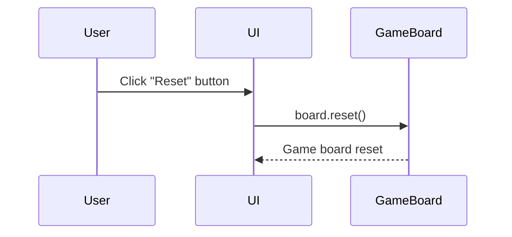
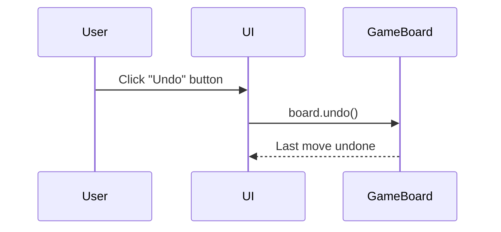

Relevant source files

The following file was used as context for generating this wiki page:

- [Game.java](https://github.com/aanickode/Minesweeper-Project/blob/main/Game.java)

# User Interface

## Introduction

The User Interface (UI) of the Minesweeper game is implemented using Java Swing components. It provides a graphical environment for the user to interact with the game, including the game board, status display, instructions, and control buttons. The UI is designed to be user-friendly and intuitive, allowing players to easily navigate and play the game.

## Main Frame

The main frame of the application is created using the `JFrame` class. It serves as the top-level container for all other UI components and is initialized with the title "Minesweeper". The frame's location is set to (400, 400) on the screen.

Sources: [Game.java:27](https://github.com/aanickode/Minesweeper-Project/blob/main/Game.java#L27)

## Status Panel

The status panel is a `JPanel` located at the bottom of the main frame. It displays the current status of the game using a `JLabel` component. Initially, the status label shows the text "Setting up...".

Sources: [Game.java:31-34](https://github.com/aanickode/Minesweeper-Project/blob/main/Game.java#L31-L34)

## Instructions Panel

The instructions panel is a `JPanel` located on the right side of the main frame. It provides instructions on how to play the game using a multi-line `JLabel` component. The instructions cover various aspects of the game, including the objective, bomb count, winning conditions, and the functionality of the reset and undo buttons.

Sources: [Game.java:38-48](https://github.com/aanickode/Minesweeper-Project/blob/main/Game.java#L38-L48)

## Leaderboard Panel

The leaderboard panel is a `JPanel` located at the top of the main frame. It displays a "leaderboard" label, which presumably will be used to show high scores or player rankings in the future.

Sources: [Game.java:52-54](https://github.com/aanickode/Minesweeper-Project/blob/main/Game.java#L52-L54)

## Game Board

The game board is a custom `GameBoard` component that extends `JPanel`. It is added to the center of the main frame and handles the rendering and interaction of the game board itself. The `GameBoard` instance is created and passed the status label and leaderboard label as arguments.

Sources: [Game.java:58](https://github.com/aanickode/Minesweeper-Project/blob/main/Game.java#L58)

## Control Panel

The control panel is a `JPanel` located on the left side of the main frame. It contains two buttons: "Reset" and "Undo".

### Reset Button

The reset button is a `JButton` component with the text "Reset". When clicked, it triggers the `reset()` method of the `GameBoard` instance, effectively resetting the game board to its initial state.

Sources: [Game.java:63-69](https://github.com/aanickode/Minesweeper-Project/blob/main/Game.java#L63-L69)

### Undo Button

The undo button is a `JButton` component with the text "Undo". When clicked, it triggers the `undo()` method of the `GameBoard` instance, allowing the user to undo their last move on the game board.

Sources: [Game.java:72-78](https://github.com/aanickode/Minesweeper-Project/blob/main/Game.java#L72-L78)

## UI Initialization

The `Game` class sets up the main frame and all UI components. It adds the status panel, instructions panel, leaderboard panel, game board, and control panel to the appropriate layout positions within the main frame. After setting up the UI components, the `pack()` method is called to size the frame according to its components, and the frame is made visible using `setVisible(true)`.

Finally, the `reset()` method of the `GameBoard` instance is called to initialize the game board and start the game.

Sources: [Game.java:81-89](https://github.com/aanickode/Minesweeper-Project/blob/main/Game.java#L81-L89)

## Main Method

The `main` method is the entry point of the application. It creates an instance of the `Game` class and runs it on the Event Dispatch Thread using `SwingUtilities.invokeLater(...)`. This ensures that the UI components are created and updated on the correct thread, preventing potential threading issues.

Sources: [Game.java:96-99](https://github.com/aanickode/Minesweeper-Project/blob/main/Game.java#L96-L99)