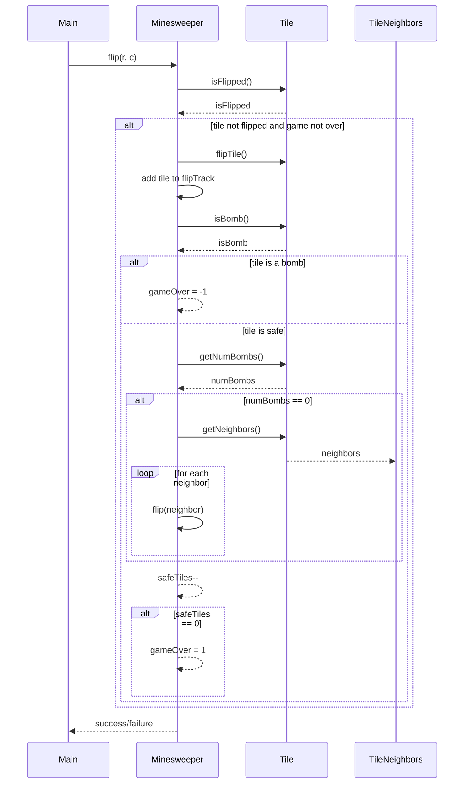

<details>
<summary>Relevant source files</summary>

The following file was used as context for generating this wiki page:

- [Minesweeper.java](https://github.com/aanickode/Minesweeper-Project/blob/main/Minesweeper.java)

</details>

# Getting Started

## Introduction

The `Minesweeper` class is the core component of a Minesweeper game implementation in Java. It manages the game board, tile flipping logic, bomb generation, and game state tracking. The class provides methods to initialize the game, flip tiles, reset the game, and retrieve game information.

## Game Board and Tile Representation

The game board is represented as a 2D array of `Tile` objects, where each `Tile` represents a single cell on the board. The `Tile` class (not shown in the provided code) likely encapsulates the state of a tile, such as whether it is a bomb, its position, and the number of adjacent bombs.

```java
private Tile[][] board;
```

## Game State and Tracking

The `Minesweeper` class maintains several variables to track the game state:

- `gameOver`: An integer representing the game's outcome (-1 for loss, 0 for ongoing, 1 for win).
- `safeTiles`: The number of remaining safe (non-bomb) tiles on the board.
- `flipTrack`: A `LinkedList` that keeps track of the tiles flipped during the game.

```java
private int gameOver;
private int safeTiles;
private LinkedList<Tile> flipTrack;
```

## Game Initialization

The `Minesweeper` class provides two constructors:

1. `Minesweeper()`: Initializes a new game by calling the `reset()` method.
2. `Minesweeper(boolean b)`: Initializes a new game for testing purposes by calling the `resetForTest()` method.

Both `reset()` and `resetForTest()` methods create a new 8x8 game board, generate bombs and safe tiles, and initialize the game state variables.

```java
public Minesweeper() {
    reset();
}

public Minesweeper(boolean b) {
    resetForTest();
}
```

The `generateBombs()` and `generateBombsforTest()` methods are responsible for generating the game board with bombs and safe tiles. They place 10 bombs randomly on the board and create safe tiles for the remaining positions. Additionally, they set up the neighbors and the number of adjacent bombs for each tile.

```java
public Tile[][] generateBombs() {
    // ...
}

public Tile[][] generateBombsforTest() {
    // ...
}
```

Sources: [Minesweeper.java:10-33](), [Minesweeper.java:36-42](), [Minesweeper.java:85-125]()

## Tile Flipping

The `flip(int r, int c)` method is the core logic for flipping a tile on the game board. It performs the following actions:

1. Check if the tile is already flipped, or if the game is over.
2. Flip the tile and add it to the `flipTrack` list.
3. If the flipped tile is a bomb, set `gameOver` to -1 (loss).
4. If the flipped tile is safe and has no adjacent bombs, recursively flip all its neighbors.
5. Decrement the `safeTiles` count.
6. If all safe tiles have been flipped, set `gameOver` to 1 (win).

```java
public boolean flip(int r, int c) {
    if (board[r][c].isFlipped() || gameOver == -1 || gameOver == 1) {
        return false;
    }
    board[r][c].flipTile();
    flipTrack.add(board[r][c]);
    if (board[r][c].isBomb()) {
        gameOver = -1;
    } else {
        if (board[r][c].getNumBombs() == 0) {
            ArrayList<Tile> neighbors = board[r][c].getNeighbors();
            for (Tile t : neighbors) {
                int x = t.getXPos();
                int y = t.getYPos();
                flip(x, y);
            }
        }
        safeTiles--;
    }
    if (safeTiles == 0) {
        gameOver = 1;
    }
    return true;
}
```

Sources: [Minesweeper.java:45-68]()

### Sequence Diagram: Tile Flipping



Sources: [Minesweeper.java:45-68]()

## Unflipping Tiles

The `unflip()` method allows the player to undo the most recent tile flip, but only if that tile was a bomb. This method is useful for allowing the player to continue playing after losing the game.

```java
public boolean unflip() {
    Tile tile = flipTrack.getLast();
    if (!tile.isFlipped()) {
        return false;
    }
    if (tile.isBomb()) {
        tile.unflipTile();
        flipTrack.remove(tile);
        gameOver = 0;
        return true;
    }
    return false;
}
```

Sources: [Minesweeper.java:70-82]()

## Game Result and Board Printing

The `Minesweeper` class provides several methods for retrieving game information and printing the board:

- `gameResult()`: Returns the current game outcome (-1 for loss, 0 for ongoing, 1 for win).
- `printBoard()`: Prints the board with all tile values (likely for debugging purposes).
- `getSafeTiles()`: Returns the number of remaining safe tiles.
- `gameOutcome()`: Prints the game outcome.
- `safeTileSize()`: Prints the number of remaining safe tiles.
- `getBoard()`: Returns the game board (2D array of `Tile` objects).

```java
public int gameResult() {
    return gameOver;
}

public void printBoard() {
    for (int row = 0; row < board.length; row++) {
        for (int col = 0; col < board[0].length; col++) {
            System.out.print(" " + board[row][col].getNumBombs());
        }
        System.out.println();
    }
}

public int getSafeTiles() {
    return safeTiles;
}

public void gameOutcome() {
    String s = String.valueOf(gameOver);
    System.out.println(s);
}

public void safeTileSize() {
    System.out.print(" " + safeTiles);
}

public Tile[][] getBoard() {
    return board;
}
```

Sources: [Minesweeper.java:127-144](), [Minesweeper.java:146-151]()

## Main Method

The `main` method in the `Minesweeper` class demonstrates a simple usage of the game logic. It creates a new `Minesweeper` instance, flips several tiles, and prints the game outcome and remaining safe tiles.

```java
public static void main(String[] args) {
    Minesweeper t = new Minesweeper();
    t.printBoard();
    t.flip(7, 0);
    t.flip(7, 1);
    t.flip(7, 2);
    t.flip(7, 3);
    t.flip(7, 4);
    t.flip(7, 5);
    t.flip(7, 6);
    t.gameOutcome();
    t.flip(7, 7);
    t.gameOutcome();
}
```

Sources: [Minesweeper.java:153-165]()

## Conclusion

The `Minesweeper` class provides the core functionality for a Minesweeper game implementation in Java. It manages the game board, tile flipping logic, bomb generation, and game state tracking. The class offers methods to initialize the game, flip tiles, reset the game, and retrieve game information. While the provided code does not include the implementation of the `Tile` class, it demonstrates the overall architecture and flow of the Minesweeper game.