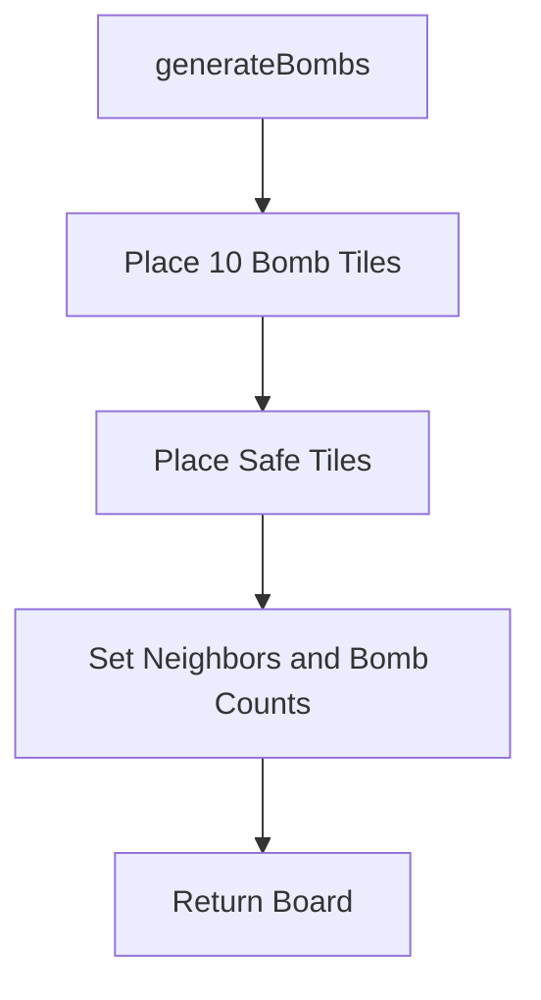
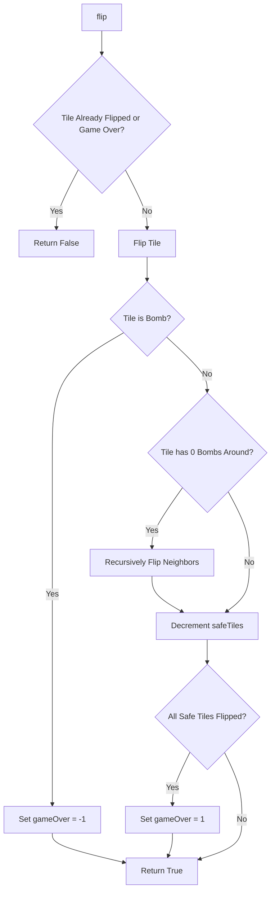
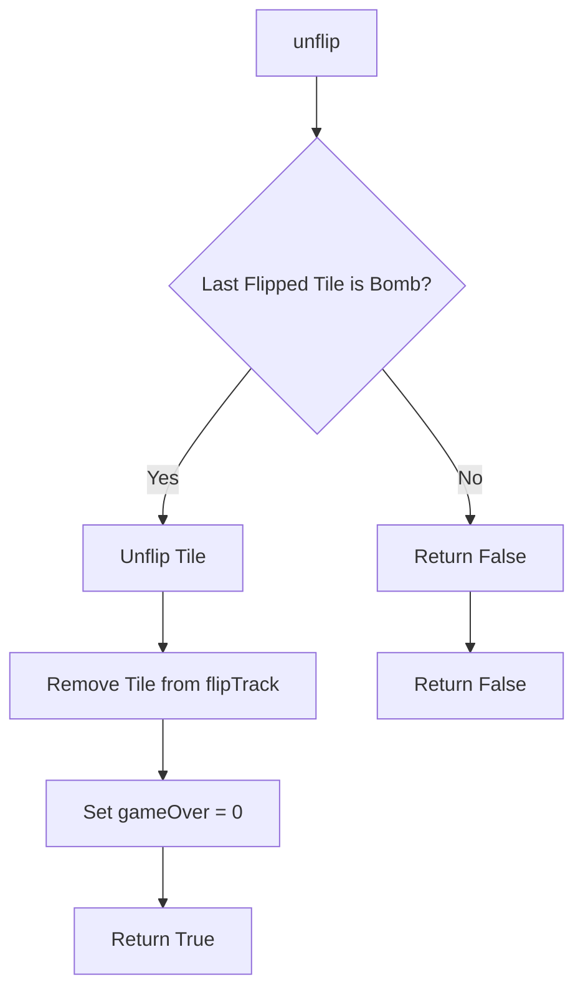
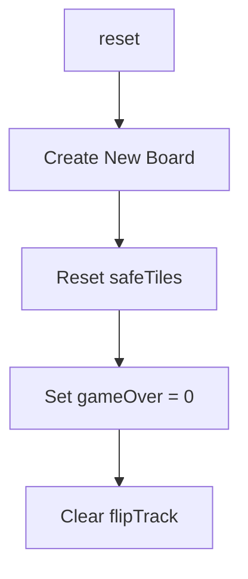

Relevant source files

The following file was used as context for generating this wiki page:

- [Minesweeper.java](https://github.com/aanickode/Minesweeper-Project/blob/main/Minesweeper.java)

# Getting Started

## Introduction

The `Minesweeper` class is the core component of a Minesweeper game implementation in Java. It manages the game board, tile flipping, bomb generation, and game state tracking. This class provides methods to initialize the game, flip tiles, reset the game, and retrieve information about the game's progress and outcome.

## Game Board Initialization

The game board is represented by a 2D array of `Tile` objects, where each `Tile` represents a cell on the board. The board is initialized with a fixed size of 8x8 tiles.

### Board Generation

The `generateBombs()` method is responsible for generating the game board with bombs and safe tiles. It follows these steps:

1. Randomly place 10 bomb tiles on the board.
2. Fill the remaining tiles with safe tiles.
3. Set the neighbors and the number of surrounding bombs for each tile.

Sources: [Minesweeper.java:67-97]()

There is also a `generateBombsforTest()` method that generates the board in a specific pattern for testing purposes.

## Tile Flipping

The `flip(int r, int c)` method is the core game logic for flipping a tile at the given row and column coordinates. It performs the following actions:

1. Check if the game is over or the tile is already flipped.
2. Flip the tile and add it to the `flipTrack` list.
3. If the flipped tile is a bomb, set the game state to "lost" (`gameOver = -1`).
4. If the flipped tile is safe and has no surrounding bombs, recursively flip all its neighbors.
5. Decrement the `safeTiles` counter.
6. If all safe tiles have been flipped, set the game state to "won" (`gameOver = 1`).

Sources: [Minesweeper.java:23-53]()

### Unflipping Tiles

The `unflip()` method allows the player to unflip the most recently flipped tile, but only if it was a bomb tile. This method is useful for continuing the game after losing.

Sources: [Minesweeper.java:56-66]()

## Game State Management

The `Minesweeper` class maintains the game state using the following variables:

- `gameOver`: An integer representing the game state (-1 for lost, 0 for ongoing, 1 for won).
- `safeTiles`: The number of remaining safe tiles to be flipped.
- `flipTrack`: A linked list that keeps track of the flipped tiles.

The `reset()` method resets the game state by initializing a new board and resetting the game state variables.

Sources: [Minesweeper.java:69-73, 99-104]()

## Utility Methods

The `Minesweeper` class provides several utility methods for retrieving game information and debugging:

- `getTile(int x, int y)`: Returns the `Tile` object at the given row and column coordinates.
- `gameResult()`: Returns the current game state (-1 for lost, 0 for ongoing, 1 for won).
- `printBoard()`: Prints the board with the number of surrounding bombs for each tile.
- `getSafeTiles()`: Returns the number of remaining safe tiles.
- `gameOutcome()`: Prints the game outcome (-1 for lost, 0 for ongoing, 1 for won).
- `safeTileSize()`: Prints the number of remaining safe tiles.
- `getBoard()`: Returns the 2D array representing the game board.

Sources: [Minesweeper.java:106-141]()

## Conclusion

The `Minesweeper` class is the central component of the Minesweeper game implementation. It manages the game board, tile flipping logic, game state tracking, and provides utility methods for retrieving game information and debugging. By utilizing this class, developers can create a functional Minesweeper game with the ability to initialize the board, flip tiles, and track the game's progress and outcome.