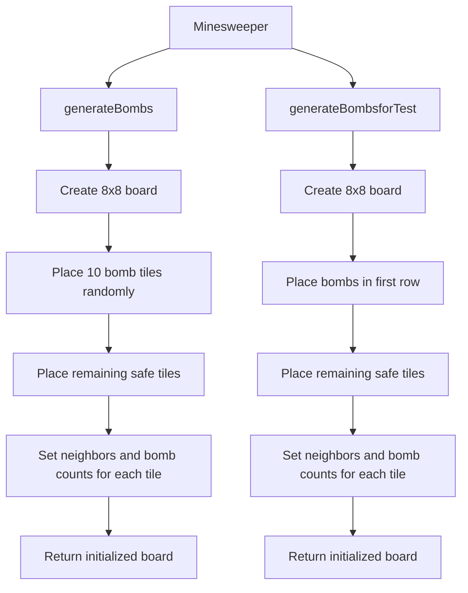
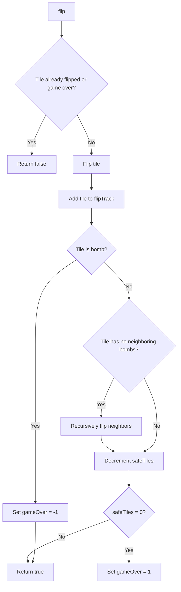
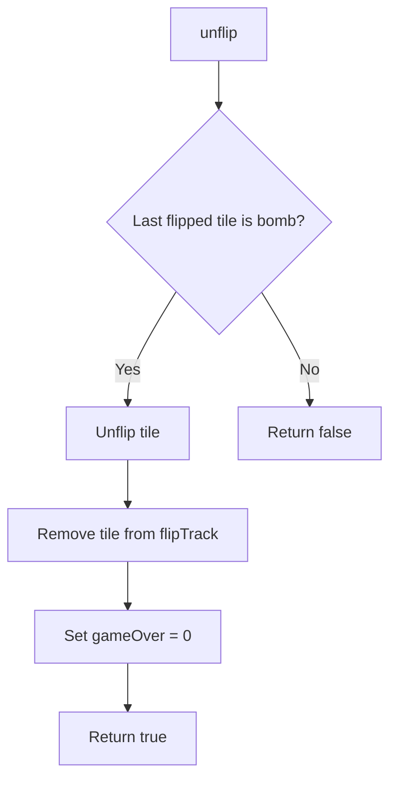
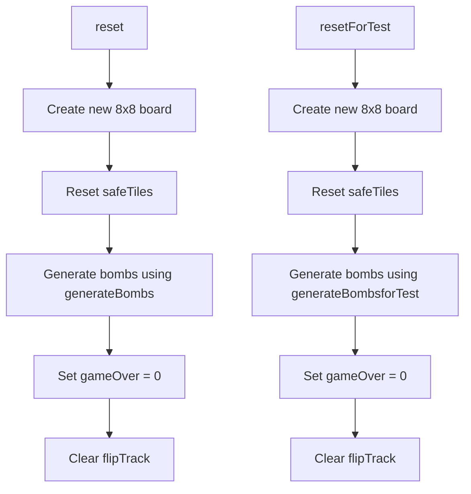
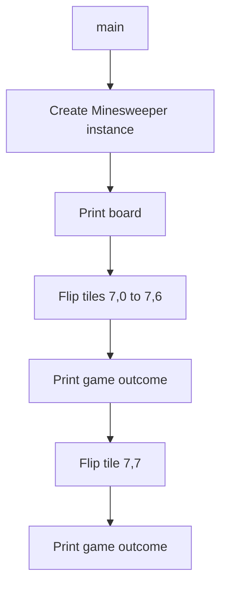

Relevant source files

The following file was used as context for generating this wiki page:

- [Minesweeper.java](https://github.com/aanickode/Minesweeper-Project/blob/main/Minesweeper.java)

# Getting Started

## Introduction

The Minesweeper class is the core component of the Minesweeper game implementation. It manages the game board, tile flipping, bomb generation, and game state tracking. The class provides methods to initialize the game, flip tiles, reset the game, and retrieve game information.

## Game Board and Tiles

The game board is represented by a 2D array of `Tile` objects, where each `Tile` represents a position on the board. The `Tile` class (not shown in the provided code) likely encapsulates the state of a single tile, such as whether it is a bomb, its position, and the number of neighboring bombs.

### Board Initialization

The board is initialized in the `generateBombs()` and `generateBombsforTest()` methods. These methods create a new 8x8 board and randomly place 10 bomb tiles (`Tile` objects with `isBomb` set to `true`). The remaining tiles are initialized as safe tiles (`isBomb` set to `false`).

After placing the bombs and safe tiles, the methods iterate through the board and set the neighbors and number of neighboring bombs for each tile using the `setNeighbors()` and `findNumBombs()` methods of the `Tile` class.

Sources: [Minesweeper.java:43-99]()

## Game Play

The `flip()` method is responsible for flipping a tile at the specified row and column positions. It performs the following actions:

1. Check if the game is already over or if the tile is already flipped. If so, return without any action.
2. Flip the tile and add it to the `flipTrack` list, which keeps track of the flipped tiles.
3. If the flipped tile is a bomb, set the game state to "lost" (`gameOver = -1`).
4. If the flipped tile is a safe tile with no neighboring bombs, recursively flip all its neighboring tiles.
5. Decrement the `safeTiles` counter, which keeps track of the remaining safe tiles.
6. If there are no more safe tiles left, set the game state to "won" (`gameOver = 1`).

Sources: [Minesweeper.java:18-49]()

The `unflip()` method allows the player to unflip the most recently flipped tile if it was a bomb. This method is useful for continuing the game after losing. It checks if the last tile in the `flipTrack` list is a bomb, and if so, unflips it and resets the game state to "ongoing" (`gameOver = 0`).

Sources: [Minesweeper.java:53-65]()

The `reset()` and `resetForTest()` methods are used to reset the game board and game state. They create a new 8x8 board, reset the `safeTiles` counter, generate bombs using the respective `generateBombs()` or `generateBombsforTest()` method, reset the game state (`gameOver = 0`), and clear the `flipTrack` list.

Sources: [Minesweeper.java:68-74, 77-83]()

## Game State and Utility Methods

The `Minesweeper` class provides several utility methods to retrieve game information and print the board or game outcome.

- `getTile(int x, int y)`: Returns the `Tile` object at the specified row and column positions.
- `gameResult()`: Returns the current game state (`gameOver` value).
- `printBoard()`: Prints the board with the number of neighboring bombs for each tile.
- `getSafeTiles()`: Returns the number of remaining safe tiles.
- `gameOutcome()`: Prints the game outcome (win or loss) based on the `gameOver` value.
- `safeTileSize()`: Prints the number of remaining safe tiles.
- `getBoard()`: Returns the 2D array representing the game board.

These methods are likely used for debugging, testing, or displaying game information to the user.

Sources: [Minesweeper.java:101-126]()

## Main Method

The `main()` method in the `Minesweeper` class demonstrates a sample game execution. It creates a new `Minesweeper` instance, prints the board, flips a sequence of tiles, and prints the game outcome after each flip.

This `main()` method is likely used for testing purposes and would not be present in a production environment where the game logic is integrated into a user interface or other application.

Sources: [Minesweeper.java:129-142]()

## Conclusion

The `Minesweeper` class encapsulates the core logic of the Minesweeper game, including board initialization, tile flipping, game state tracking, and utility methods for retrieving game information. It provides a solid foundation for building a complete Minesweeper game application with a user interface or other components for user interaction and game visualization.