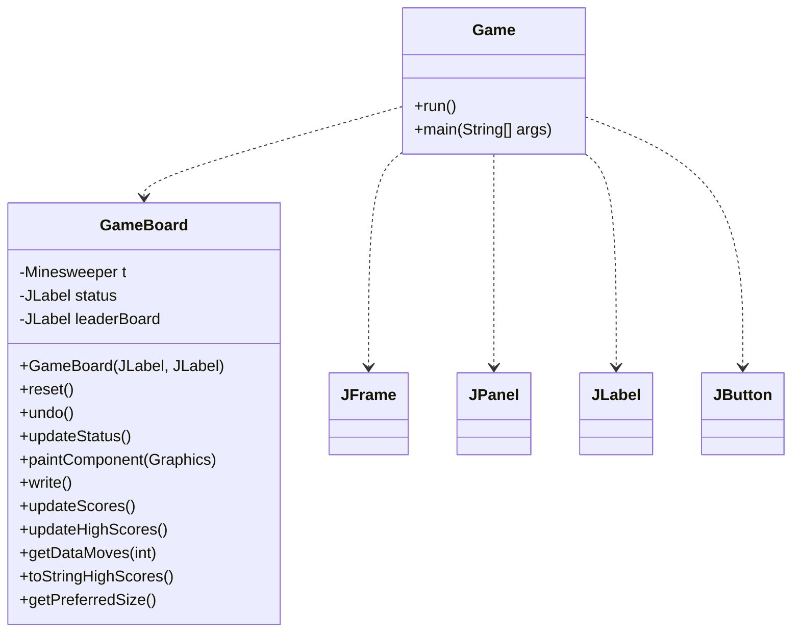
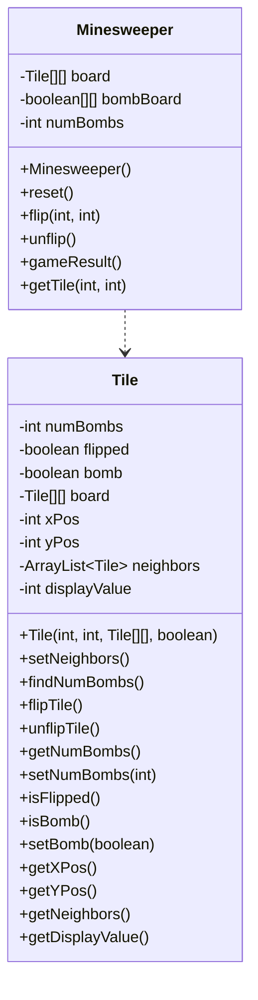
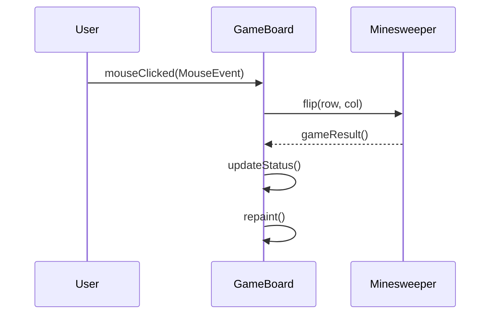
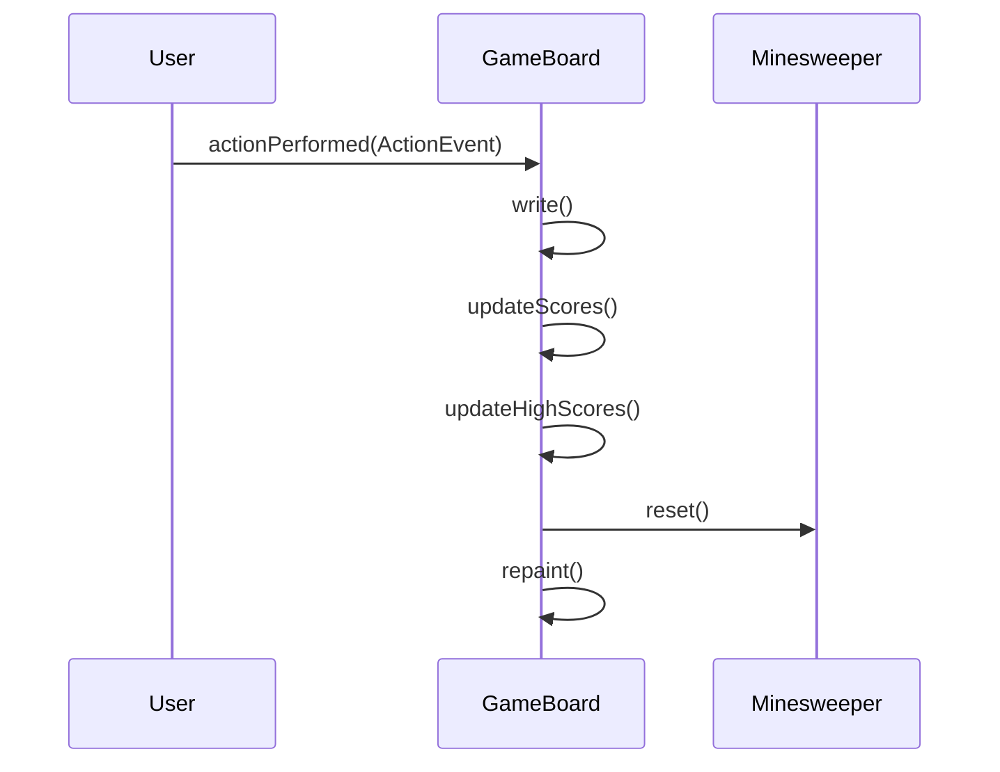
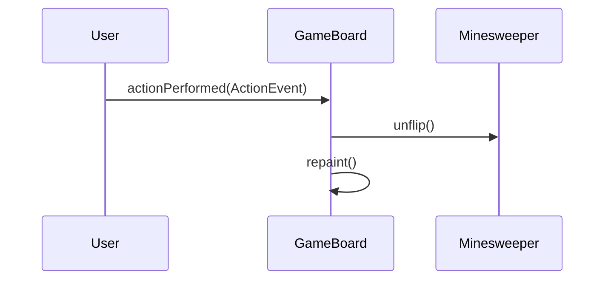
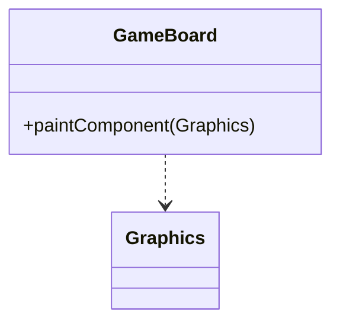
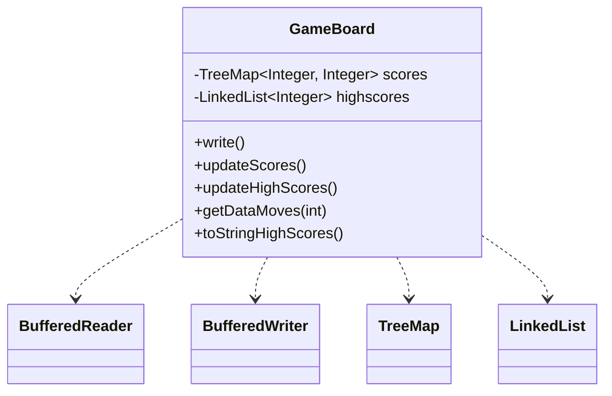

Relevant source files

The following files were used as context for generating this wiki page:

- [Game.java](https://github.com/aanickode/Minesweeper-Project/blob/main/Game.java)
- [GameBoard.java](https://github.com/aanickode/Minesweeper-Project/blob/main/GameBoard.java)
- [Tile.java](https://github.com/aanickode/Minesweeper-Project/blob/main/Tile.java)
- [Minesweeper.java](https://github.com/aanickode/Minesweeper-Project/blob/main/Minesweeper.java)
- [Files/FastestTime.txt](https://github.com/aanickode/Minesweeper-Project/blob/main/Files/FastestTime.txt)

# Architecture Overview

## Introduction

The provided source files implement a Minesweeper game using Java Swing for the graphical user interface (GUI). The game follows a Model-View-Controller (MVC) architecture pattern, where the `Minesweeper` class serves as the model, the `GameBoard` class acts as the view and controller, and the `Game` class sets up the top-level frame and components.

The game board consists of a grid of tiles, where some tiles are randomly assigned as bombs. The objective is to flip all non-bomb tiles without detonating any bombs. The game tracks the time taken and the number of moves made by the player, and it maintains a leaderboard of the top scores.

Sources: [Game.java](https://github.com/aanickode/Minesweeper-Project/blob/main/Game.java), [GameBoard.java](https://github.com/aanickode/Minesweeper-Project/blob/main/GameBoard.java), [Tile.java](https://github.com/aanickode/Minesweeper-Project/blob/main/Tile.java), [Minesweeper.java](https://github.com/aanickode/Minesweeper-Project/blob/main/Minesweeper.java)

## Game Setup and GUI

The `Game` class is the entry point of the application. It sets up the top-level `JFrame` and initializes the main components of the GUI, including the game board, status panel, instructions panel, score panel, and control panel.

Sources: [Game.java:17-101](https://github.com/aanickode/Minesweeper-Project/blob/main/Game.java#L17-L101)

The `GameBoard` class is responsible for rendering the game board and handling user interactions. It initializes the `Minesweeper` model and sets up event listeners for mouse clicks and timer events.

Sources: [GameBoard.java](https://github.com/aanickode/Minesweeper-Project/blob/main/GameBoard.java)

## Game Model

The `Minesweeper` class represents the game model. It manages the state of the game board, including the placement of bombs, flipping tiles, and determining the game result.

The `Minesweeper` class maintains a 2D array of `Tile` objects, representing the game board. Each `Tile` object stores information about its state (flipped or not, bomb or not), position on the board, and the number of neighboring bombs.

Sources: [Minesweeper.java](https://github.com/aanickode/Minesweeper-Project/blob/main/Minesweeper.java), [Tile.java](https://github.com/aanickode/Minesweeper-Project/blob/main/Tile.java)

## Game Flow

The game flow is driven by user interactions with the game board and the control buttons.

### Mouse Click Handling

When the user clicks on a tile, the `GameBoard` class handles the mouse event and updates the game model accordingly.

Sources: [GameBoard.java:41-57](https://github.com/aanickode/Minesweeper-Project/blob/main/GameBoard.java#L41-L57)

### Game Reset

The "Reset" button allows the user to start a new game. When clicked, the `GameBoard` resets the game model, updates the leaderboard, and repaints the game board.

Sources: [GameBoard.java:60-78](https://github.com/aanickode/Minesweeper-Project/blob/main/GameBoard.java#L60-L78), [GameBoard.java:105-137](https://github.com/aanickode/Minesweeper-Project/blob/main/GameBoard.java#L105-L137)

### Undo Move

The "Undo" button allows the user to undo the last move. When clicked, the `GameBoard` calls the `unflip()` method on the `Minesweeper` model and repaints the game board.

Sources: [GameBoard.java:80-86](https://github.com/aanickode/Minesweeper-Project/blob/main/GameBoard.java#L80-L86)

## Game Rendering

The `GameBoard` class is responsible for rendering the game board using the `paintComponent()` method. It draws the grid lines and renders the tiles based on their state (flipped or not, bomb or not).

Sources: [GameBoard.java:139-172](https://github.com/aanickode/Minesweeper-Project/blob/main/GameBoard.java#L139-L172)

## Leaderboard and Score Tracking

The `GameBoard` class maintains a leaderboard of the top scores. It reads and writes the scores to a file named `FastestTime.txt`.

The `write()` method appends the current game's time and number of moves to the `FastestTime.txt` file.

The `updateScores()` method reads the `FastestTime.txt` file and populates a `TreeMap` with the time as the key and the number of moves as the value.

The `updateHighScores()` method sorts the scores and selects the top 5 scores to be displayed as the leaderboard.

Sources: [GameBoard.java:105-137](https://github.com/aanickode/Minesweeper-Project/blob/main/GameBoard.java#L105-L137), [Files/FastestTime.txt](https://github.com/aanickode/Minesweeper-Project/blob/main/Files/FastestTime.txt)

## Conclusion

The Minesweeper game follows the Model-View-Controller architecture pattern, with the `Minesweeper` class serving as the model, the `GameBoard` class acting as the view and controller, and the `Game` class setting up the top-level GUI components. The game board is represented by a 2D array of `Tile` objects, and the game logic is implemented in the `Minesweeper` and `GameBoard` classes. The game also maintains a leaderboard of the top scores, which is persisted in a file.

Sources: [Game.java](https://github.com/aanickode/Minesweeper-Project/blob/main/Game.java), [GameBoard.java](https://github.com/aanickode/Minesweeper-Project/blob/main/GameBoard.java), [Tile.java](https://github.com/aanickode/Minesweeper-Project/blob/main/Tile.java), [Minesweeper.java](https://github.com/aanickode/Minesweeper-Project/blob/main/Minesweeper.java)