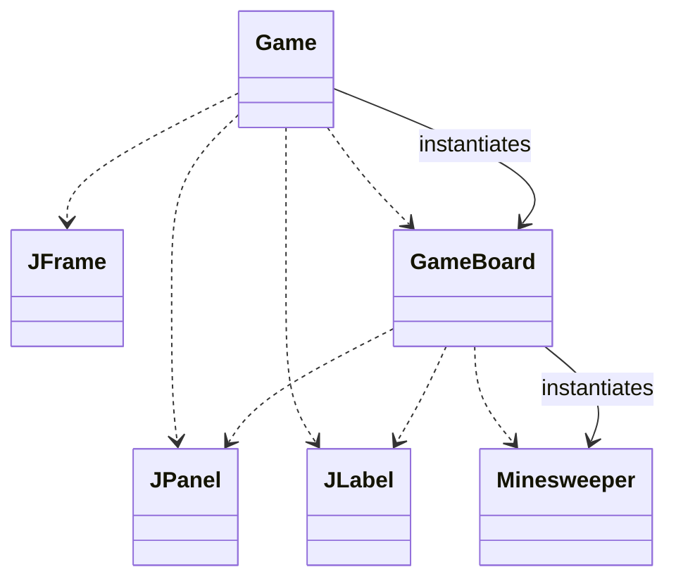
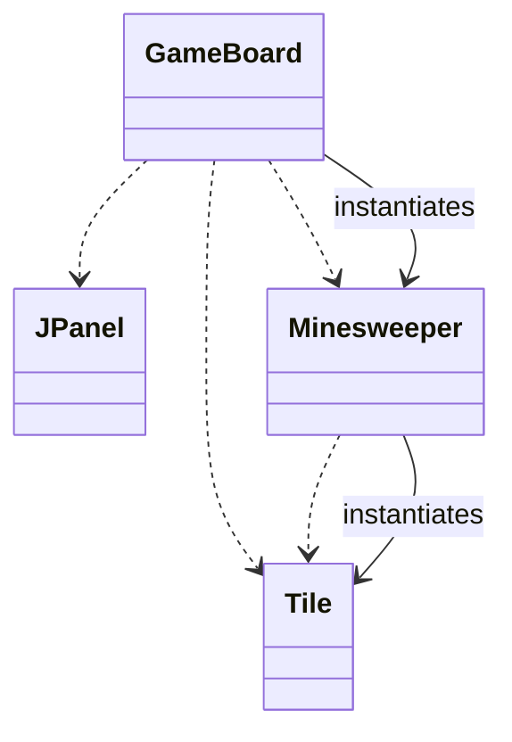
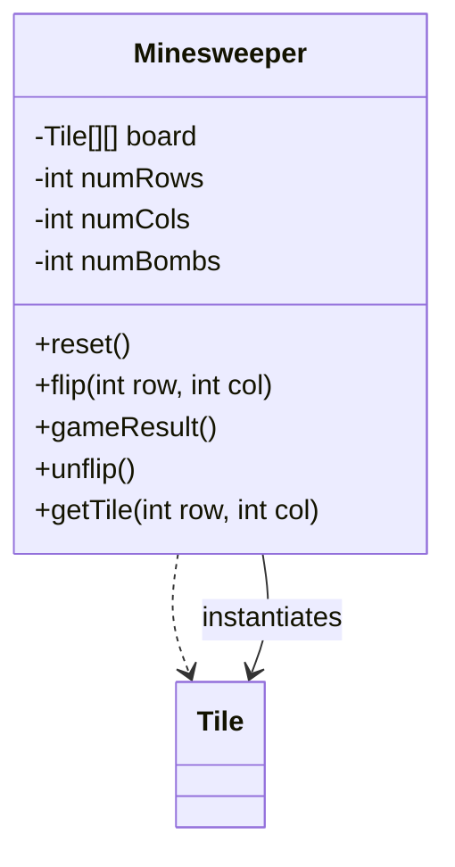
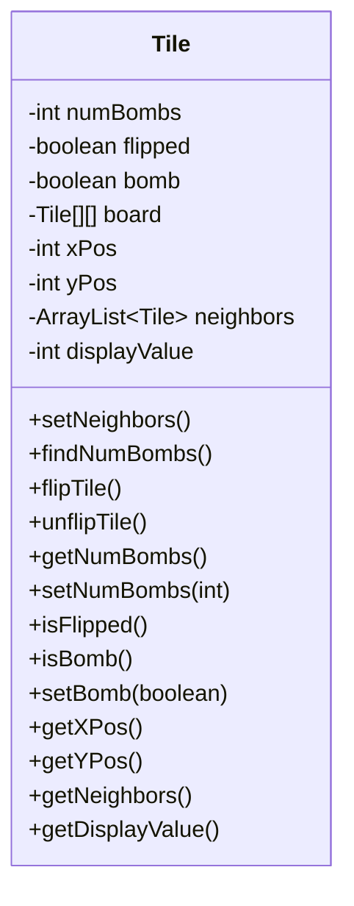
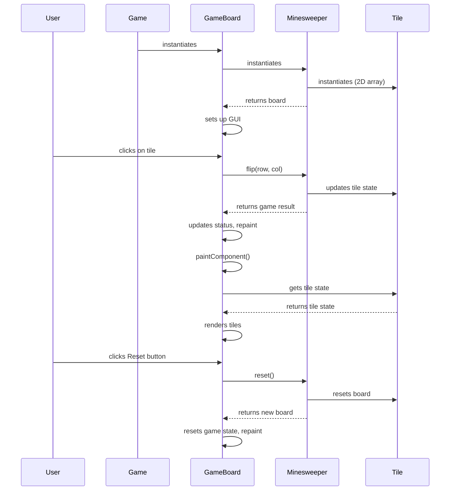
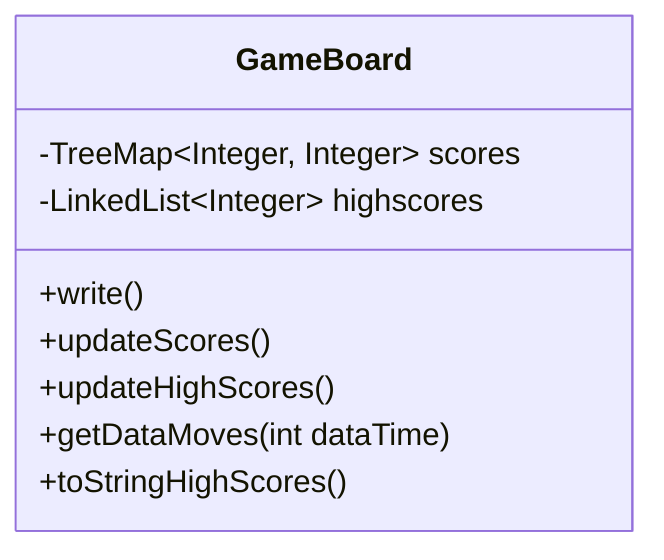

Relevant source files

The following files were used as context for generating this wiki page:

- [Game.java](https://github.com/aanickode/Minesweeper-Project/blob/main/Game.java)
- [GameBoard.java](https://github.com/aanickode/Minesweeper-Project/blob/main/GameBoard.java)
- [Tile.java](https://github.com/aanickode/Minesweeper-Project/blob/main/Tile.java)
- [Minesweeper.java](https://github.com/aanickode/Minesweeper-Project/blob/main/Minesweeper.java)
- [Files/FastestTime.txt](https://github.com/aanickode/Minesweeper-Project/blob/main/Files/FastestTime.txt)

# Architecture Overview

## Introduction

The provided source files implement a Minesweeper game using Java and the Swing library for the graphical user interface (GUI). The game follows the classic Minesweeper rules, where the player must uncover all non-mine tiles on a grid without detonating any mines. The architecture is based on the Model-View-Controller (MVC) design pattern, separating the game logic, user interface, and control flow.

The main components of the architecture are:

- `Game`: The top-level class that initializes the GUI components and sets up the game board.
- `GameBoard`: Handles the game board rendering, user input, and game state updates.
- `Minesweeper`: Represents the game model, managing the game board, tiles, and game logic.
- `Tile`: Represents an individual tile on the game board, with properties like its position, neighbor tiles, and whether it's a mine or not.

Sources: [Game.java](), [GameBoard.java](), [Minesweeper.java](), [Tile.java]()

## Game Setup and GUI

The `Game` class is the entry point of the application and sets up the main GUI components using Swing. It creates the top-level `JFrame` window and adds various panels and labels for displaying the game board, status, instructions, and high scores.

The `Game` class also sets up action listeners for the "Reset" and "Undo" buttons, which trigger the corresponding methods in the `GameBoard` class.

Sources: [Game.java]()

## Game Board and Rendering

The `GameBoard` class is responsible for rendering the game board and handling user input (mouse clicks). It extends the `JPanel` class and uses the `Minesweeper` class as the game model.

The `GameBoard` class has the following key responsibilities:

1. **Rendering**: The `paintComponent` method draws the game board grid and tiles based on the current game state from the `Minesweeper` model.
2. **User Input**: The class listens for mouse click events and updates the game model (`Minesweeper`) accordingly.
3. **Game State Management**: It updates the game status label, handles game reset and undo operations, and manages the game timer and move counter.
4. **High Score Management**: It reads and writes high scores to a file (`FastestTime.txt`) and displays the top 5 scores in the GUI.

Sources: [GameBoard.java](), [Minesweeper.java](), [Tile.java](), [Files/FastestTime.txt]()

## Game Model and Logic

The `Minesweeper` class represents the game model and encapsulates the game logic. It manages the game board, tiles, and their states (flipped, mines, etc.).

The `Minesweeper` class has the following key responsibilities:

1. **Board Initialization**: It creates a 2D array of `Tile` objects, randomly placing mines on the board.
2. **Game Logic**: It implements methods for flipping tiles, checking the game result (win, lose, or ongoing), and undoing moves.
3. **Tile Management**: It provides methods to access and modify individual `Tile` objects on the board.

Sources: [Minesweeper.java](), [Tile.java]()

## Tile Representation

The `Tile` class represents an individual tile on the game board. It encapsulates the tile's properties, such as its position, whether it's a mine, whether it's flipped, and the number of neighboring mines.

The `Tile` class has the following key responsibilities:

1. **Tile Properties**: It stores and manages the tile's state, such as whether it's a mine, flipped, and the number of neighboring mines.
2. **Neighbor Management**: It calculates and stores the neighboring tiles for each tile on the board.
3. **Tile Operations**: It provides methods for flipping, unflipping, and accessing tile properties.

Sources: [Tile.java]()

## Game Flow

The game flow can be summarized as follows:

1. The `Game` class instantiates the `GameBoard` and sets up the GUI components.
2. The `GameBoard` instantiates the `Minesweeper` model, which in turn creates a 2D array of `Tile` objects representing the game board.
3. The user interacts with the game by clicking on tiles in the `GameBoard`.
4. The `GameBoard` updates the `Minesweeper` model based on the user's actions (flipping tiles).
5. The `Minesweeper` model updates the state of the corresponding `Tile` objects.
6. The `GameBoard` updates the game status, timer, and move counter based on the game result from the `Minesweeper` model.
7. The `GameBoard` repaints itself, rendering the updated game board by retrieving the tile states from the `Minesweeper` model.
8. The user can reset the game or undo moves using the corresponding buttons, which trigger the respective methods in the `GameBoard` and `Minesweeper` classes.

Sources: [Game.java](), [GameBoard.java](), [Minesweeper.java](), [Tile.java]()

## High Score Management

The `GameBoard` class is responsible for managing high scores in the game. It reads and writes high scores to a file named `FastestTime.txt` in the `Files` directory.

The high score management process follows these steps:

1. When the user wins a game, the `write` method is called to append the game time and number of moves to the `FastestTime.txt` file.
2. The `updateScores` method reads the `FastestTime.txt` file and populates a `TreeMap` called `scores`, where the key is the game time, and the value is the number of moves.
3. The `updateHighScores` method sorts the `scores` map by game time and selects the top 5 scores, storing them in a `LinkedList` called `highscores`.
4. The `toStringHighScores` method converts the `highscores` list into a formatted string for display in the GUI.

Sources: [GameBoard.java](), [Files/FastestTime.txt]()

## Conclusion

The provided source files implement a Minesweeper game using the Model-View-Controller (MVC) design pattern. The `Game` class sets up the GUI, the `GameBoard` class handles user input and rendering, the `Minesweeper` class manages the game logic and board state, and the `Tile` class represents individual tiles on the board. The architecture separates concerns and follows good object-oriented design principles, making it easier to maintain and extend the codebase.