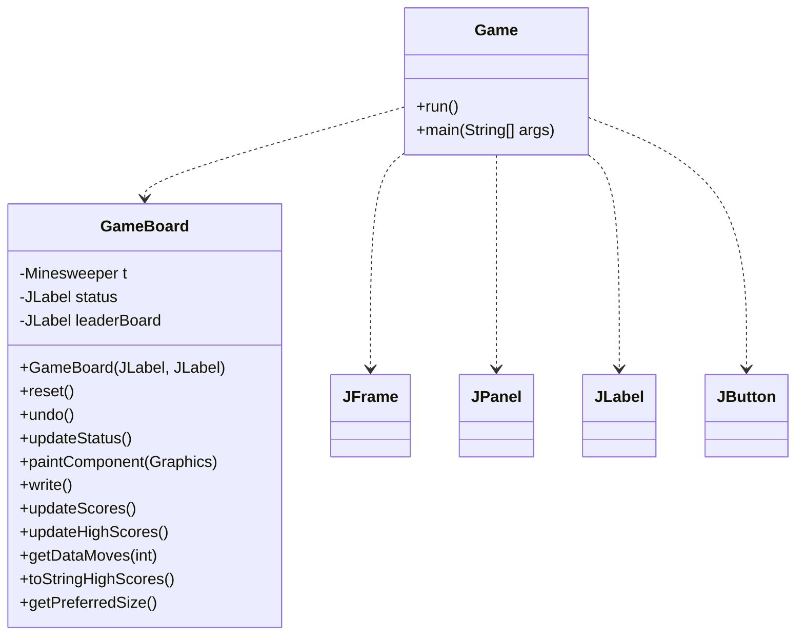
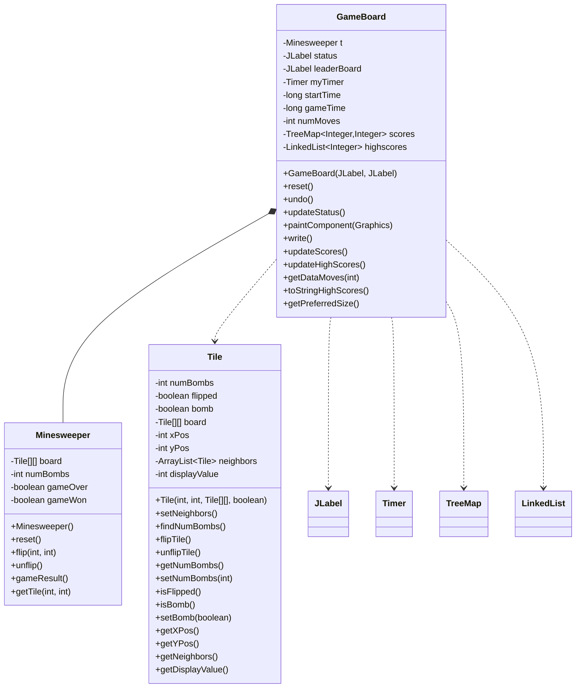
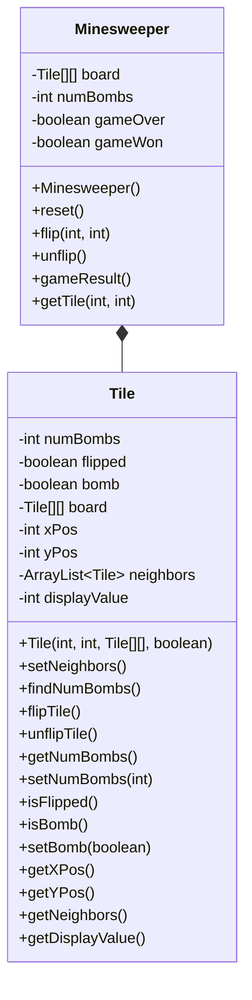
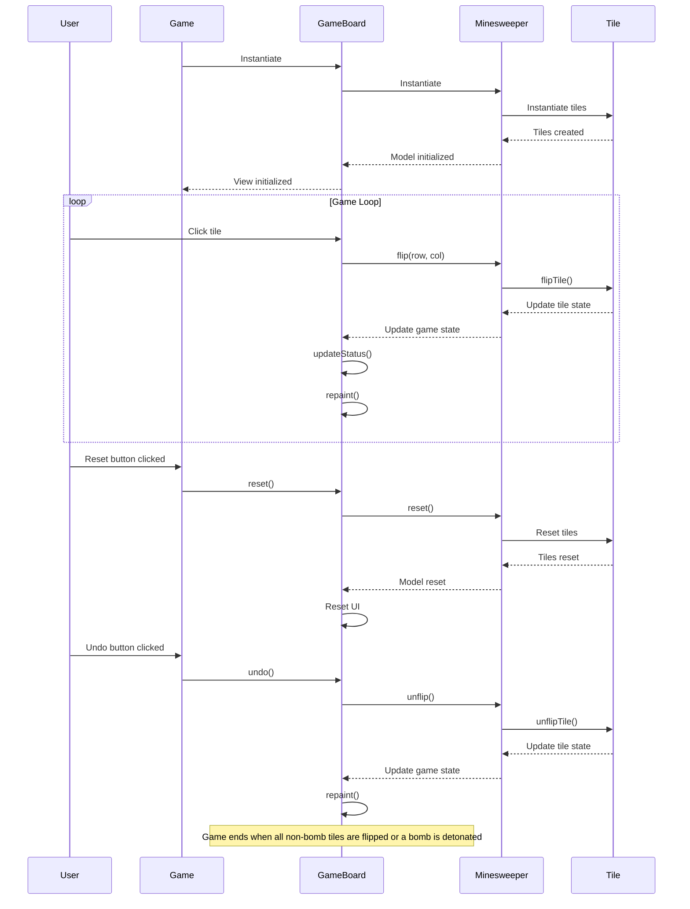
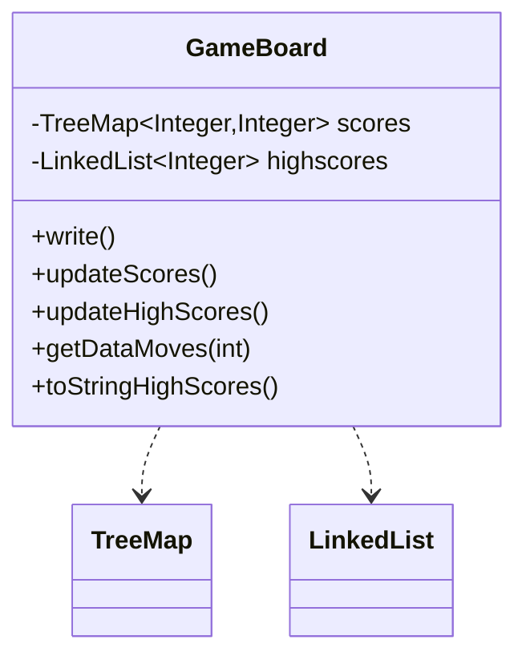

Relevant source files

The following files were used as context for generating this wiki page:

- [Game.java](https://github.com/aanickode/Minesweeper-Project/blob/main/Game.java)
- [GameBoard.java](https://github.com/aanickode/Minesweeper-Project/blob/main/GameBoard.java)
- [Tile.java](https://github.com/aanickode/Minesweeper-Project/blob/main/Tile.java)
- [Minesweeper.java](https://github.com/aanickode/Minesweeper-Project/blob/main/Minesweeper.java)
- [Files/FastestTime.txt](https://github.com/aanickode/Minesweeper-Project/blob/main/Files/FastestTime.txt)

# Architecture Overview

## Introduction

This project is a Java implementation of the classic Minesweeper game. The game's objective is to flip over all non-bomb tiles on a grid without detonating any of the hidden bombs. The architecture follows a Model-View-Controller (MVC) design pattern, separating the game logic, user interface, and control flow into distinct components.

The main components of the architecture are:

- `Game`: The top-level class that initializes the GUI and game components.
- `GameBoard`: Handles the game board's view and user interactions.
- `Minesweeper`: Represents the game model, managing the game state and logic.
- `Tile`: Represents an individual tile on the game board, tracking its state and neighboring tiles.

Sources: [Game.java](), [GameBoard.java](), [Minesweeper.java](), [Tile.java]()

## Game Initialization and GUI

The `Game` class serves as the entry point and sets up the top-level frame and components for the graphical user interface (GUI). It follows the MVC pattern by initializing the view (`GameBoard`) and providing a reset button for controller functionality.

The `Game` class creates the main window (`JFrame`), status panel (`JPanel`), instructions panel, and score panel. It then instantiates the `GameBoard` and adds it to the center of the frame. The reset and undo buttons are added to a control panel, with their respective action listeners defined as anonymous inner classes.

Sources: [Game.java:18-93]()

## Game Board and User Interaction

The `GameBoard` class extends `JPanel` and handles the game board's view and user interactions. It maintains an instance of the `Minesweeper` model and provides methods for resetting, undoing moves, and updating the game status.

The `GameBoard` class listens for mouse clicks on the game board and updates the `Minesweeper` model accordingly. It also handles the game timer, move counter, and leaderboard display. The `paintComponent` method draws the game board grid and tiles based on the current game state.

Sources: [GameBoard.java]()

## Game Model and Logic

The `Minesweeper` class represents the game model, managing the game state and logic. It maintains a 2D array of `Tile` objects representing the game board and keeps track of the number of bombs, game over status, and whether the game is won.

The `Minesweeper` class provides methods for resetting the game, flipping and unflipping tiles, and checking the game result (win, lose, or ongoing). The `Tile` class represents an individual tile on the game board, tracking its state (flipped, bomb, number of neighboring bombs) and neighboring tiles.

Sources: [Minesweeper.java](), [Tile.java]()

## Game Flow

The overall game flow can be represented by the following sequence diagram:

The game flow starts with the `Game` class instantiating the `GameBoard`, which in turn instantiates the `Minesweeper` model and its `Tile` objects. The user interacts with the game board by clicking on tiles, triggering the `flip` method in the `Minesweeper` model. The model updates the tile states, and the `GameBoard` updates the UI accordingly.

The reset button triggers the `reset` method in the `GameBoard`, which resets the `Minesweeper` model and the UI. The undo button calls the `undo` method in the `GameBoard`, which in turn calls the `unflip` method in the `Minesweeper` model to undo the last move.

The game ends when all non-bomb tiles are flipped (win) or a bomb is detonated (lose).

Sources: [Game.java](), [GameBoard.java](), [Minesweeper.java](), [Tile.java]()

## Leaderboard and High Scores

The `GameBoard` class maintains a leaderboard and high scores functionality. It reads game results from a file (`FastestTime.txt`) and stores them in a `TreeMap` with the time taken to win as the key and the number of moves as the value.

The `write` method appends the current game's time and number of moves to the `FastestTime.txt` file. The `updateScores` method reads the file and populates the `scores` `TreeMap`. The `updateHighScores` method sorts the scores and selects the top 5 as high scores, stored in the `highscores` `LinkedList`.

The `toStringHighScores` method converts the high scores to a string for display in the leaderboard panel.

Sources: [GameBoard.java:162-223]()

## Conclusion

The Minesweeper project follows a Model-View-Controller architecture, separating the game logic, user interface, and control flow into distinct components. The `Game` class initializes the GUI and game components, the `GameBoard` class handles the game board's view and user interactions, and the `Minesweeper` class represents the game model and logic. The `Tile` class represents individual tiles on the game board, tracking their state and neighboring tiles. The project also includes a leaderboard and high scores functionality, reading and writing game results to a file.