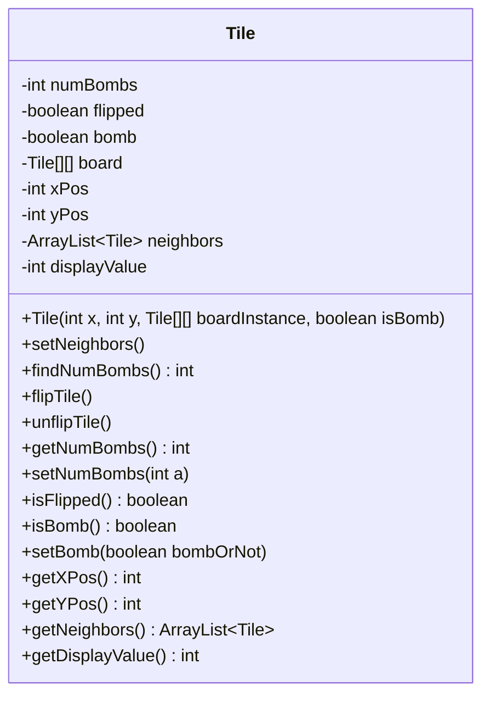
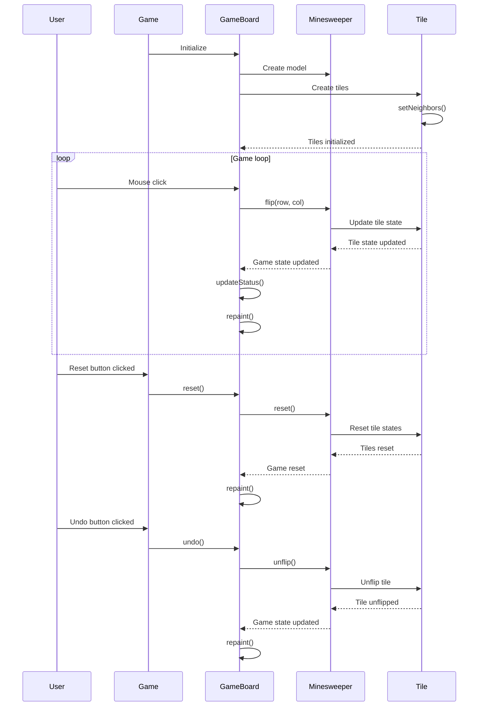

<details>
<summary>Relevant source files</summary>

The following files were used as context for generating this wiki page:

- [Game.java](https://github.com/aanickode/Minesweeper-Project/blob/main/Game.java)
- [GameBoard.java](https://github.com/aanickode/Minesweeper-Project/blob/main/GameBoard.java)
- [Tile.java](https://github.com/aanickode/Minesweeper-Project/blob/main/Tile.java)
</details>

# Architecture Overview

## Introduction

The provided source files implement a Minesweeper game using Java and the Swing library for the graphical user interface (GUI). The game follows the classic Minesweeper rules, where the player must uncover all non-mine tiles on a grid without detonating any mines.

The architecture is structured around the Model-View-Controller (MVC) design pattern, separating the game logic (model), user interface (view), and user interactions (controller). The main components are:

- `Game` class: Sets up the top-level frame and GUI components, initializing the `GameBoard` and handling user actions like reset and undo.
- `GameBoard` class: Manages the game board view, handles user input (mouse clicks), updates the game status, and interacts with the `Minesweeper` model.
- `Minesweeper` class (not provided): Represents the game model, handling the game logic and board state.
- `Tile` class: Represents an individual tile on the game board, storing its state (flipped, bomb, neighbors) and providing methods to interact with the tile.

Sources: [Game.java](), [GameBoard.java](), [Tile.java]()

## Game Setup and GUI

The `Game` class is the entry point of the application and sets up the main GUI components using Swing. It creates a `JFrame` window and adds various panels and components to it, including:

1. **Status Panel**: Displays the current game status (e.g., "Setting up...", "You won!", "You lost!") and the elapsed time and number of moves.
2. **Instructions Panel**: Displays the game instructions for the user.
3. **Score Panel**: Intended to display a leaderboard with high scores (not fully implemented).
4. **Game Board**: The main game board area, represented by the `GameBoard` class.
5. **Control Panel**: Contains buttons for resetting the game and undoing the last move.

The `GameBoard` is added to the center of the frame, and the `reset` and `undo` buttons are set up with action listeners to handle user interactions.

Sources: [Game.java:25-92]()

## Game Board and User Interactions

The `GameBoard` class extends `JPanel` and is responsible for rendering the game board and handling user interactions. It maintains an instance of the `Minesweeper` model and a reference to the status label for updating the game status.

### Rendering the Game Board

The `paintComponent` method in `GameBoard` is responsible for rendering the game board. It draws the grid lines and iterates over the tiles in the `Minesweeper` model. For each tile, it either displays the number of adjacent mines (if the tile is flipped and not a mine) or draws an "X" (if the tile is flipped and a mine).

```java
@Override
public void paintComponent(Graphics g) {
    // ...
    for (int row = 0; row < 8; row++) {
        for (int col = 0; col < 8; col++) {
            Tile tile = t.getTile(row, col);
            if (tile.isFlipped() && !tile.isBomb()) {
                String s = String.valueOf(tile.getNumBombs());
                g.drawString(s, 50 * col + 25, 50 * row + 25);
            }
            if (tile.isFlipped() && tile.isBomb()) {
                g.drawLine(50 * col, 50 * row, 50 * col + 50, 50 * row + 50);
                g.drawLine(50 * col, 50 * row + 50, 50 * col + 50, 50 * row);
            }
        }
    }
}
```

Sources: [GameBoard.java:125-149]()

### Handling User Input

The `GameBoard` class listens for mouse click events using a `MouseAdapter`. When a click occurs, it updates the `Minesweeper` model by calling the `flip` method with the clicked tile coordinates. If the game is not over, it increments the move counter. Finally, it updates the status label and repaints the board to reflect the changes.

```java
addMouseListener(new MouseAdapter() {
    @Override
    public void mouseClicked(MouseEvent e) {
        Point p = e.getPoint();
        t.flip(p.y / 50, p.x / 50);
        if (!(t.gameResult() == 1 || t.gameResult() == -1)) {
            numMoves++;
        }
        updateStatus();
        repaint();
    }
});
```

Sources: [GameBoard.java:47-59]()

### Game Timer and Status Updates

The `GameBoard` class also manages a timer that updates the game status label with the elapsed time and the number of moves made by the player. The timer is started when the game board is initialized and is stopped when the game is won or lost.

```java
ActionListener gameTimer = new ActionListener() {
    @Override
    public void actionPerformed(ActionEvent e) {
        gameTime = (System.currentTimeMillis() - startTime) / 1000;
        status.setText("Keep going!   Time: " + gameTime + "  NumMoves: " + numMoves);
    }
};
```

The `updateStatus` method checks the game result from the `Minesweeper` model and updates the status label accordingly, stopping the timer when the game is over.

Sources: [GameBoard.java:62-71](), [GameBoard.java:94-105]()

## Tile Representation

The `Tile` class represents an individual tile on the game board. It stores the tile's state (flipped, bomb, number of adjacent mines) and provides methods to interact with the tile.



The `Tile` class has the following key methods:

- `setNeighbors()`: Finds all neighboring tiles on the board and stores them in the `neighbors` list.
- `findNumBombs()`: Counts the number of bomb tiles among the neighboring tiles.
- `flipTile()` and `unflipTile()`: Flip or unflip the tile, respectively.
- Getter and setter methods for accessing and modifying the tile's state (flipped, bomb, number of adjacent mines, position, neighbors).

Sources: [Tile.java]()

## Game Flow and Interactions

The overall game flow and interactions between the components can be summarized as follows:



1. The `Game` class initializes the `GameBoard`, which in turn creates the `Minesweeper` model and `Tile` objects.
2. The `Tile` objects set their neighbors using the `setNeighbors` method.
3. In the game loop, the user interacts with the `GameBoard` by clicking on tiles.
4. The `GameBoard` updates the `Minesweeper` model with the clicked tile coordinates using the `flip` method.
5. The `Minesweeper` model updates the state of the corresponding `Tile` object.
6. The `GameBoard` updates the game status and repaints the board to reflect the changes.
7. When the user clicks the "Reset" button, the `Game` class calls the `reset` method on the `GameBoard`, which in turn resets the `Minesweeper` model and `Tile` objects.
8. When the user clicks the "Undo" button, the `Game` class calls the `undo` method on the `GameBoard`, which in turn calls the `unflip` method on the `Minesweeper` model to undo the last move.

Sources: [Game.java](), [GameBoard.java](), [Tile.java]()

## Scoring and Leaderboard

The `GameBoard` class includes functionality for tracking and displaying high scores. It maintains a `TreeMap` called `scores` that stores the game time as the key and the number of moves as the value.

When the game is won, the `write` method is called, which appends the game time and number of moves to a file called `FastestTime.txt`.

```java
public void write() {
    try {
        BufferedWriter bw = new BufferedWriter(new FileWriter("Files/FastestTime.txt", true));
        bw.write("" + gameTime + " " + (numMoves + 1));
        bw.newLine();
        bw.flush();
        bw.close();
    } catch (IOException e) {
        System.out.println("Could not write");
    }
}
```

The `updateScores` method reads the `FastestTime.txt` file and populates the `scores` `TreeMap` with the game times and move counts.

The `updateHighScores` method sorts the `scores` `TreeMap` by the game time (key) and selects the top 5 scores to be displayed as high scores.

The `toStringHighScores` method formats the high scores as a string for display in the score panel.

```java
public String toStringHighScores() {
    String s = "Top 5 Scores: ";
    for (int i = 0; i < highscores.size(); i++) {
        s += highscores.get(i) + " " + scores.get(highscores.get(i)) + ", ";
    }
    return s;
}
```

However, the provided code does not fully implement the display of the high scores in the GUI. The `leaderBoard` label in the score panel is intended for this purpose, but it is not updated with the high scores.

Sources: [GameBoard.java:161-210]()

## Conclusion

The provided source files implement a Minesweeper game using Java and the Swing library. The architecture follows the Model-View-Controller (MVC) design pattern, separating the game logic, user interface, and user interactions into different components.

The `Game` class sets up the main GUI components, including the game board, status panel, instructions panel, and control buttons. The `GameBoard` class handles rendering the game board, updating the game status, and processing user input (mouse clicks).

The `Tile` class represents individual tiles on the game board, storing their state (flipped, bomb, number of adjacent mines) and providing methods to interact with the tiles.

The game flow involves the user interacting with the `GameBoard` by clicking on tiles, which updates the `Minesweeper` model (not provided) and repaints the board to reflect the changes. The "Reset" and "Undo" buttons allow the user to restart the game or undo the last move, respectively.

The `GameBoard` class also includes functionality for tracking and displaying high scores based on the game time and number of moves. However, the display of high scores in the GUI is not fully implemented in the provided code.

Overall, the architecture separates concerns and follows the MVC pattern, making it easier to maintain and extend the game's functionality.