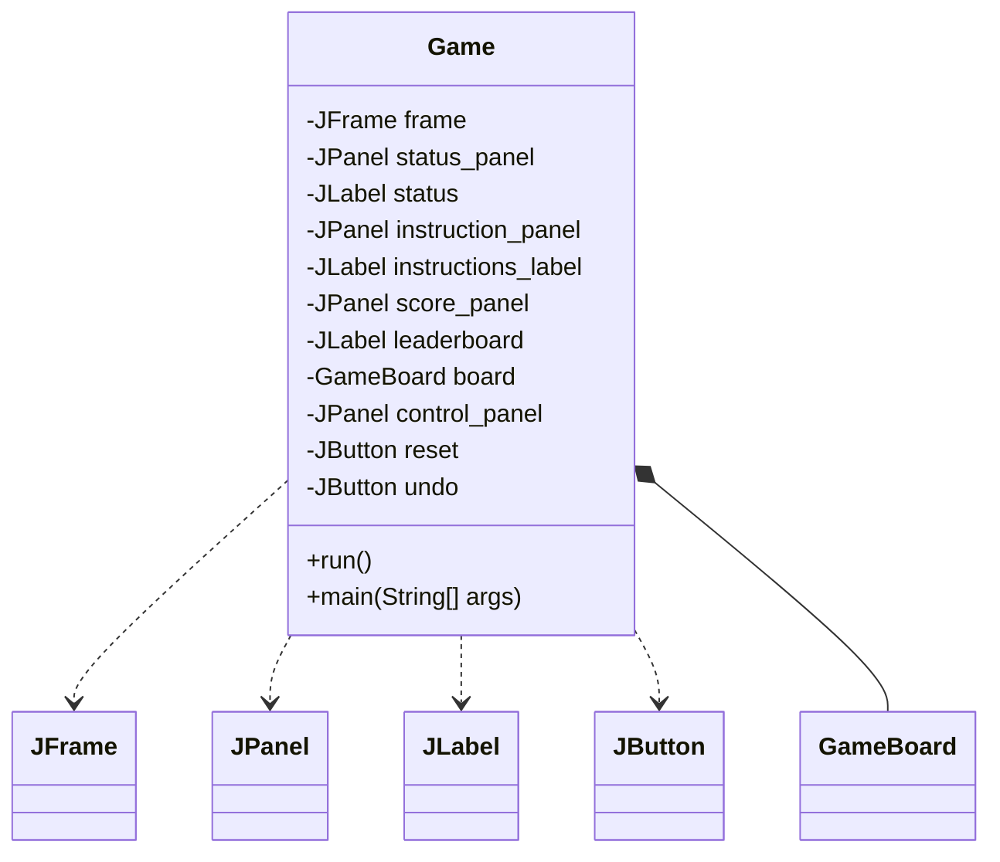
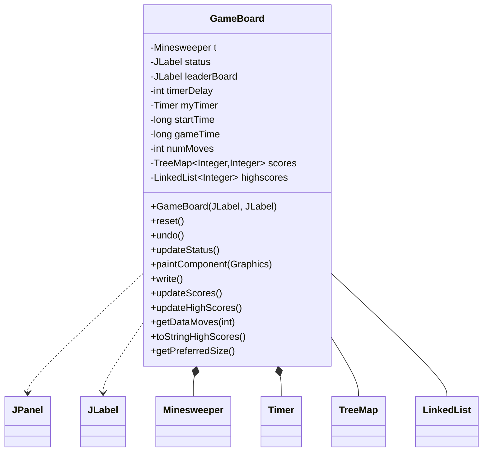
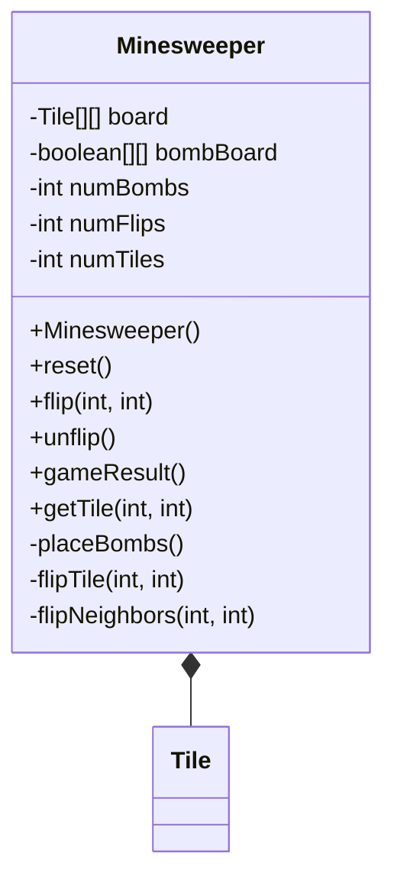
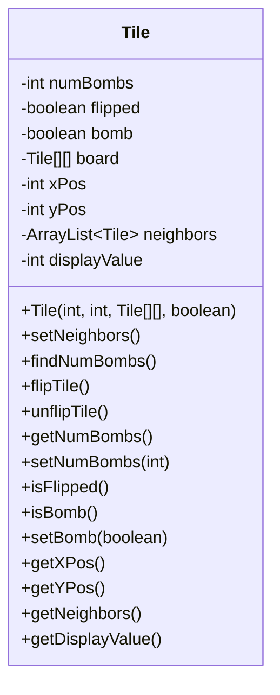
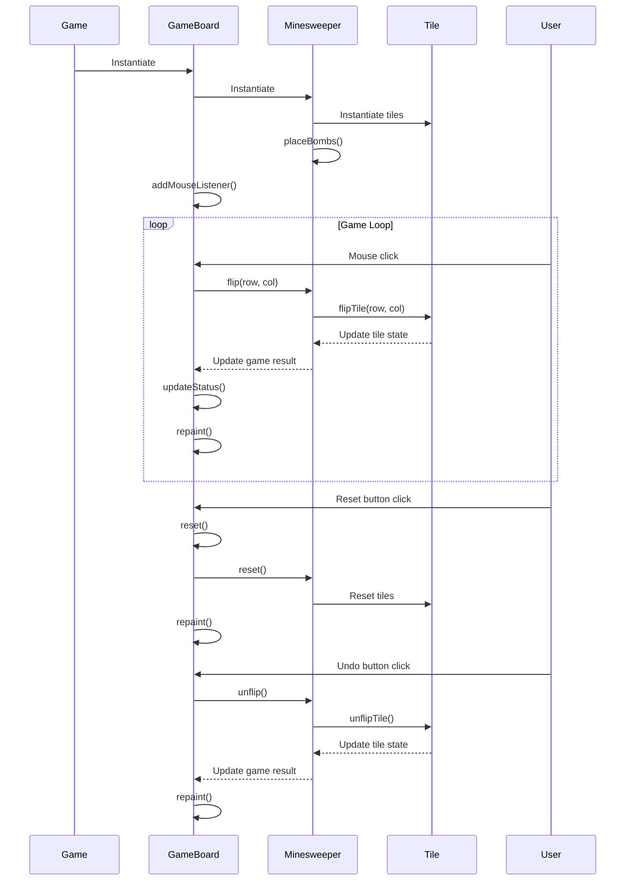
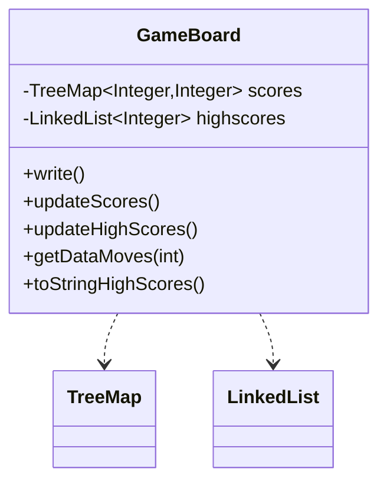

<details>
<summary>Relevant source files</summary>

The following files were used as context for generating this wiki page:

- [Game.java](https://github.com/aanickode/Minesweeper-Project/blob/main/Game.java)
- [GameBoard.java](https://github.com/aanickode/Minesweeper-Project/blob/main/GameBoard.java)
- [Tile.java](https://github.com/aanickode/Minesweeper-Project/blob/main/Tile.java)
- [Minesweeper.java](https://github.com/aanickode/Minesweeper-Project/blob/main/Minesweeper.java)
- [Files/FastestTime.txt](https://github.com/aanickode/Minesweeper-Project/blob/main/Files/FastestTime.txt)

</details>

# Architecture Overview

## Introduction

This project is a Java implementation of the classic Minesweeper game. The game's objective is to flip over all non-bomb tiles on a grid without detonating any bombs. The architecture follows a Model-View-Controller (MVC) design pattern, separating the game logic, user interface, and control flow into distinct components.

The main components of the architecture are:

- `Game`: The top-level class that initializes the game window and UI components.
- `GameBoard`: Handles the game board rendering, user input, and game state updates.
- `Minesweeper`: Represents the game model, managing the board state and game logic.
- `Tile`: Represents an individual tile on the game board, tracking its state (flipped, bomb, neighbors).

Sources: [Game.java](), [GameBoard.java](), [Minesweeper.java](), [Tile.java]()

## Game Initialization and UI

The `Game` class is the entry point of the application and sets up the main game window and UI components. It follows the Runnable interface and is executed by the `main` method.



The `Game` class creates the main `JFrame` window and various `JPanel` and `JLabel` components for displaying the game status, instructions, and leaderboard. It also instantiates the `GameBoard` component, which handles the game logic and rendering. Additionally, it sets up the "Reset" and "Undo" buttons with action listeners to reset and undo moves in the game, respectively.

Sources: [Game.java:31-109]()

## Game Board and Rendering

The `GameBoard` class extends `JPanel` and is responsible for rendering the game board, handling user input (mouse clicks), and updating the game state based on the `Minesweeper` model.



The `GameBoard` class has the following key responsibilities:

1. **Rendering**: The `paintComponent` method draws the game board grid, tiles (with numbers or bombs), and game state.
2. **User Input**: It listens for mouse clicks and updates the `Minesweeper` model accordingly.
3. **Game State**: It updates the game status (`JLabel`), timer, and move count based on the game result from the `Minesweeper` model.
4. **Leaderboard**: It manages a leaderboard of high scores by reading/writing from/to a file (`FastestTime.txt`) and displaying the top 5 scores.

The `GameBoard` class also includes methods for resetting the game, undoing moves, and various helper methods for managing the leaderboard and high scores.

Sources: [GameBoard.java]()

## Game Model and Logic

The `Minesweeper` class represents the game model and encapsulates the game logic and board state.



The `Minesweeper` class maintains the game board as a 2D array of `Tile` objects and a separate boolean array to track bomb locations. It provides methods for:

- **Initializing the game board**: The constructor `Minesweeper()` initializes the board and places bombs randomly.
- **Resetting the game**: The `reset()` method resets the board state for a new game.
- **Flipping tiles**: The `flip(int, int)` method flips a tile at the given coordinates and handles the game logic for revealing neighboring tiles or detonating bombs.
- **Undoing moves**: The `unflip()` method undoes the last move by unflipping the previously flipped tile.
- **Checking game result**: The `gameResult()` method checks if the game is won, lost, or still ongoing based on the current board state.
- **Accessing tiles**: The `getTile(int, int)` method retrieves the `Tile` object at the given coordinates.

The class also includes private helper methods for placing bombs randomly (`placeBombs()`), flipping a single tile (`flipTile(int, int)`), and recursively flipping neighboring tiles (`flipNeighbors(int, int)`).

Sources: [Minesweeper.java]()

## Tile Representation

The `Tile` class represents an individual tile on the game board and encapsulates its state and properties.



The `Tile` class has the following properties and methods:

- **Properties**: `numBombs` (number of adjacent bombs), `flipped` (whether the tile is revealed), `bomb` (whether the tile is a bomb), `board` (reference to the game board), `xPos` and `yPos` (tile coordinates), `neighbors` (list of adjacent tiles), `displayValue` (value to display on the tile).
- **Constructor**: Initializes a `Tile` object with its coordinates, the game board reference, and whether it's a bomb.
- **Neighbor Management**: The `setNeighbors()` method finds and stores the neighboring tiles, and `findNumBombs()` counts the number of adjacent bombs.
- **State Management**: `flipTile()` and `unflipTile()` methods flip/unflip the tile, and various getter/setter methods access the tile's state and properties.

The `Tile` class encapsulates the state and behavior of an individual tile, allowing the `Minesweeper` model to manage the game logic more effectively.

Sources: [Tile.java]()

## Game Flow

The overall game flow can be represented by the following sequence diagram:



The game flow can be summarized as follows:

1. The `Game` class instantiates the `GameBoard`, which in turn instantiates the `Minesweeper` model and its `Tile` objects.
2. The `Minesweeper` model initializes the game board and places bombs randomly.
3. The `GameBoard` sets up a mouse listener to handle user clicks.
4. When the user clicks on a tile, the `GameBoard` updates the `Minesweeper` model by flipping the corresponding tile.
5. The `Minesweeper` model updates the tile state and checks the game result.
6. The `GameBoard` updates the game status and repaints the board based on the updated model.
7. The user can reset the game or undo the last move using the respective buttons, which trigger the corresponding actions in the `GameBoard` and `Minesweeper` model.

Sources: [Game.java](), [GameBoard.java](), [Minesweeper.java](), [Tile.java]()

## Leaderboard and High Scores

The `GameBoard` class manages a leaderboard of high scores by reading and writing game results to a file (`FastestTime.txt`). The high scores are displayed in the game window.



The leaderboard functionality is implemented through the following methods:

- `write()`: Writes the current game's time and move count to the `FastestTime.txt` file.
- `updateScores()`: Reads the `FastestTime.txt` file and populates a `TreeMap` (`scores`) with the game times as keys and move counts as values.
- `updateHighScores()`: Sorts the `scores` `TreeMap` and extracts the top 5 scores into a `LinkedList` (`highscores`).
- `getDataMoves(int)`: Retrieves the move count for a given game time from the `scores` `TreeMap`.
- `toStringHighScores()`: Converts the `highscores` `LinkedList` into a formatted string for display.

The leaderboard is updated and displayed after each game reset, allowing players to track their performance and compete for the fastest times and fewest moves.

Sources: [GameBoard.java:124-199]()

## Configuration and Data Files

The project includes a `Files/FastestTime.txt` file for storing and retrieving high scores. This file is read and written by the `GameBoard` class to manage the leaderboard.

The `FastestTime.txt` file has the following format:

```
<game_time> <move_count>
```

Each line represents a completed game, with the game time (in seconds) and the number of moves taken to win the game.

Example:

```
25 35
18 28
32 40
```

This file is used by the `GameBoard` class to populate the leaderboard and display the top 5 high scores in the game window.

Sources: [Files/FastestTime.txt](), [GameBoard.java:124-199]()

## Conclusion

The Minesweeper project follows a Model-View-Controller architecture, separating the game logic, user interface, and control flow into distinct components. The `Minesweeper` class encapsulates the game model and board state, while the `GameBoard` class handles rendering and user input. The `Tile` class represents individual tiles on the board, and the `Game` class sets up the top-level UI and game loop. The project also includes a leaderboard feature for tracking and displaying high scores based on game time and move count.