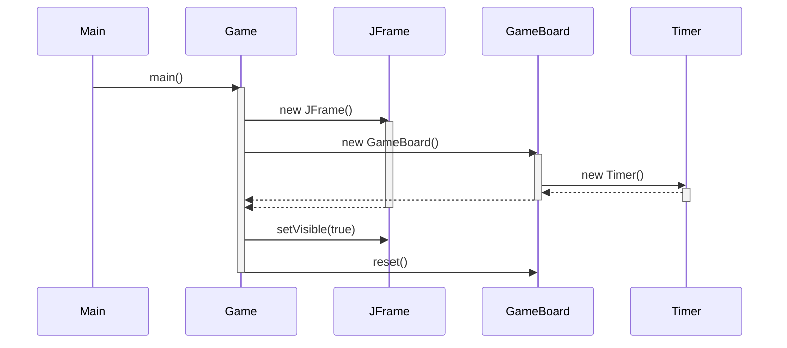
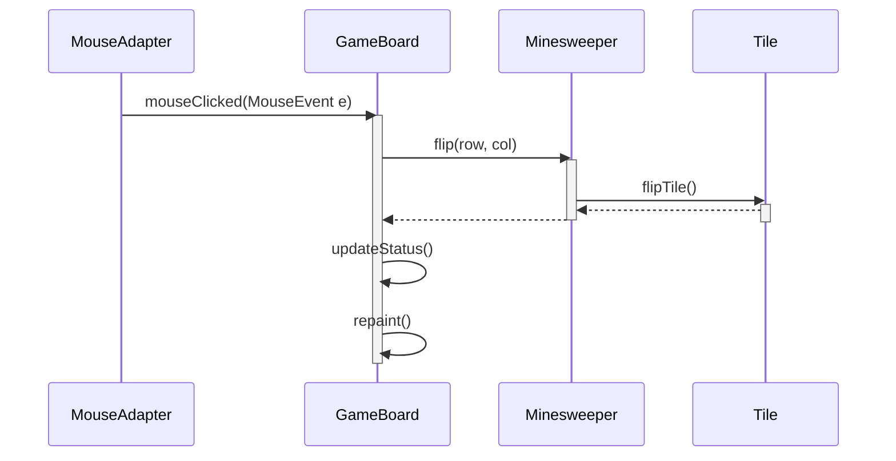
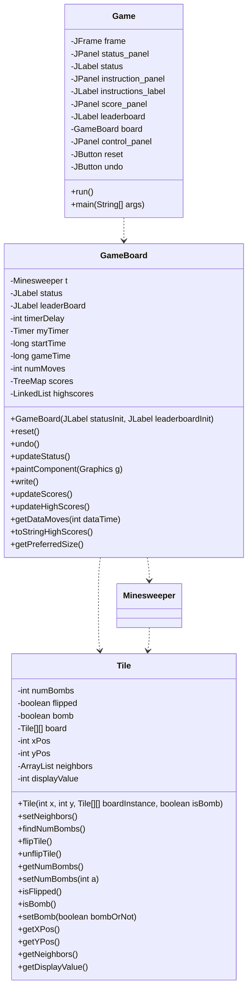

Relevant source files

The following files were used as context for generating this wiki page:

- [Game.java](https://github.com/aanickode/Minesweeper-Project/blob/main/Game.java)
- [GameBoard.java](https://github.com/aanickode/Minesweeper-Project/blob/main/GameBoard.java)
- [Tile.java](https://github.com/aanickode/Minesweeper-Project/blob/main/Tile.java)

# Architecture Overview

## Introduction

This project is a Java implementation of the classic Minesweeper game. The game follows a Model-View-Controller (MVC) architecture pattern, where the game logic and data are separated from the user interface. The main components of the architecture are:

- `Game` class: Initializes the game window and GUI components, including the game board, status panel, and control buttons.
- `GameBoard` class: Handles the game board rendering, user input, and game state management. It interacts with the `Minesweeper` model and updates the view accordingly.
- `Minesweeper` class (not provided): Represents the game model, managing the game board, tiles, and game logic.
- `Tile` class: Represents an individual tile on the game board, storing its state (flipped, bomb, number of adjacent bombs) and position.

The game follows a typical event-driven architecture, where user interactions (mouse clicks) trigger updates to the model, which in turn updates the view (game board) to reflect the new state.

Sources: [Game.java](), [GameBoard.java](), [Tile.java]()

## Game Initialization and GUI Setup

The `Game` class is the entry point of the application and sets up the main game window and GUI components.

### Main Window and Layout

The `Game` class creates a `JFrame` as the main window and sets its layout using `BorderLayout`. The following components are added to the window:

- `GameBoard` panel (center)
- Status panel (south)
- Instructions panel (east)
- High scores panel (north)
- Control panel with "Reset" and "Undo" buttons (west)

The `GameBoard` instance is initialized and added to the center of the window, while the other panels are positioned accordingly.

Sources: [Game.java:26-67]()

### Event Handling

The "Reset" and "Undo" buttons are set up with anonymous `ActionListener` instances that call the corresponding methods (`reset()` and `undo()`) on the `GameBoard` instance when clicked.

Sources: [Game.java:59-67](), [Game.java:70-76]()

## Game Board and User Interaction

The `GameBoard` class handles the game board rendering, user input, and game state management.

### Game Board Rendering

The `paintComponent(Graphics g)` method is overridden to render the game board. It draws the grid lines and tiles based on the current game state retrieved from the `Minesweeper` model.

- Flipped tiles without bombs display the number of adjacent bombs.
- Flipped tiles with bombs display an "X" symbol.

Sources: [GameBoard.java:103-131]()

### User Input Handling

The `GameBoard` class listens for mouse click events using a `MouseAdapter`. When a click occurs, the corresponding tile coordinates are calculated and passed to the `flip(int row, int col)` method of the `Minesweeper` model to update the game state.

Sources: [GameBoard.java:39-51]()

### Game State Management

The `GameBoard` class manages the game state and updates the status label accordingly:

- If the game is won, the timer stops, and the status displays "You won!!!" with the elapsed time and number of moves.
- If the game is lost, the timer stops, and the status displays "You lost" with the elapsed time and number of moves.

The `reset()` method resets the game state, starts a new timer, and clears the move count.

Sources: [GameBoard.java:80-97](), [GameBoard.java:59-77]()

## Tile Representation

The `Tile` class represents an individual tile on the game board.

### Tile Properties

Each `Tile` instance stores the following properties:

- `numBombs`: The number of adjacent bombs (initially set to -1).
- `flipped`: A boolean indicating if the tile is flipped (visible) or not.
- `bomb`: A boolean indicating if the tile contains a bomb.
- `xPos` and `yPos`: The tile's position on the board.
- `neighbors`: A list of neighboring tiles.

Sources: [Tile.java:5-13]()

### Neighbor Calculation

The `setNeighbors()` method calculates the neighboring tiles for a given tile, excluding tiles that are out of bounds or the tile itself. The neighbors are stored in the `neighbors` list.

Sources: [Tile.java:16-30]()

### Bomb Count Calculation

The `findNumBombs()` method iterates through the `neighbors` list and counts the number of tiles that contain bombs. This value is used to set the `numBombs` property of the tile.

Sources: [Tile.java:33-42]()

### Tile State Management

The `Tile` class provides methods to flip (`flipTile()`) and unflip (`unflipTile()`) a tile, as well as getter and setter methods for the tile's properties (`isFlipped()`, `isBomb()`, `getNumBombs()`, `setNumBombs()`, etc.).

Sources: [Tile.java:45-84]()

## Sequence Diagram: Game Initialization

The `main()` method creates an instance of the `Game` class, which initializes the main `JFrame` window and adds the `GameBoard` panel to it. The `GameBoard` constructor sets up a `Timer` for tracking the game time. Finally, the `reset()` method is called on the `GameBoard` to start a new game.

Sources: [Game.java:87-96](), [Game.java:26-83](), [GameBoard.java:27-78]()

## Sequence Diagram: User Interaction and Game Update

When the user clicks on a tile, the `mouseClicked()` event is triggered in the `MouseAdapter` of the `GameBoard`. The corresponding tile coordinates are calculated and passed to the `flip()` method of the `Minesweeper` model, which updates the game state by flipping the tile. The `GameBoard` then updates the status label and repaints the game board to reflect the new state.

Sources: [GameBoard.java:39-51](), [GameBoard.java:80-97]()

## Class Diagram

The class diagram illustrates the relationships between the main classes in the project:

- The `Game` class initializes the main window and GUI components, including the `GameBoard`.
- The `GameBoard` class manages the game state, renders the board, and interacts with the `Minesweeper` model and `Tile` objects.
- The `Minesweeper` class (not provided) represents the game model and likely interacts with `Tile` objects to manage the game board and logic.
- The `Tile` class represents an individual tile on the game board, storing its state and position.

Sources: [Game.java](), [GameBoard.java](), [Tile.java]()

## Key Features and Components

| Feature/Component | Description |
| --- | --- |
| Game Window | The main window that hosts the game board, status panels, and control buttons. |
| Game Board | The panel that renders the game board and handles user interactions. |
| Status Panel | Displays the current game status, elapsed time, and number of moves. |
| Instructions Panel | Provides instructions on how to play the game. |
| High Scores Panel | Displays the top 5 high scores from previous games. |
| Reset Button | Resets the game to its initial state. |
| Undo Button | Undoes the last move made by the player. |
| Timer | Tracks the elapsed time since the start of the game. |
| Tile | Represents an individual tile on the game board, with properties like position, bomb status, and number of adjacent bombs. |
| Minesweeper Model | The core game logic and data model (not provided in the source files). |

Sources: [Game.java](), [GameBoard.java](), [Tile.java]()

## Conclusion

The Minesweeper project follows a Model-View-Controller architecture pattern, separating the game logic, data, and user interface components. The `Game` class sets up the main window and GUI components, while the `GameBoard` class handles the game board rendering, user input, and game state management. The `Tile` class represents individual tiles on the board, storing their state and position. The project utilizes event-driven programming, where user interactions trigger updates to the game model, which in turn updates the view (game board) to reflect the new state.

Sources: [Game.java](), [GameBoard.java](), [Tile.java]()