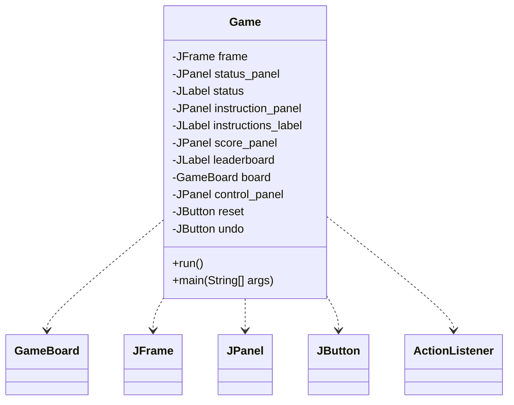
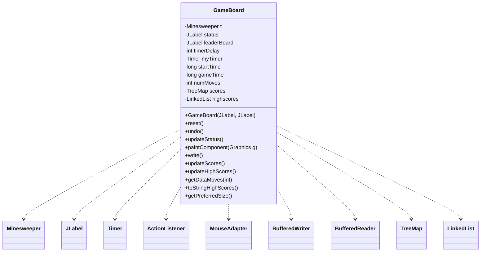
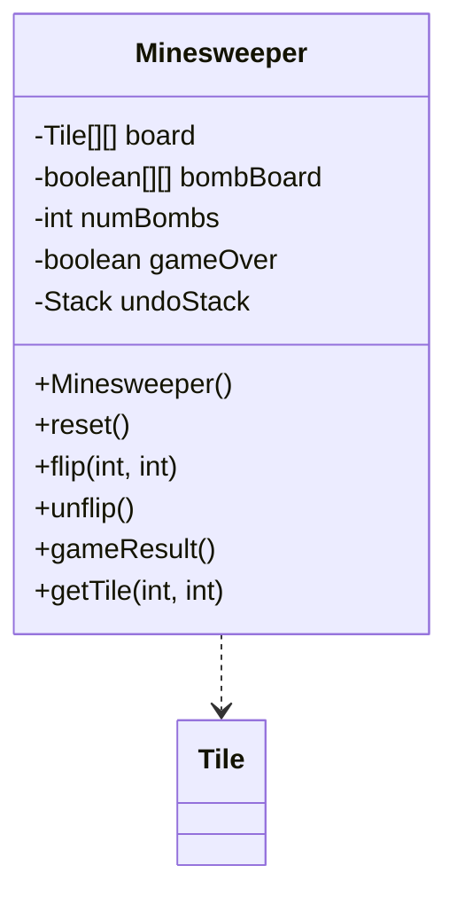
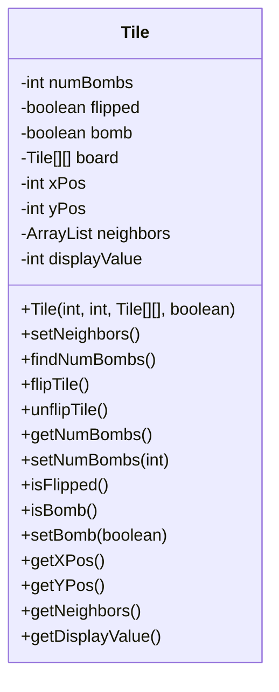
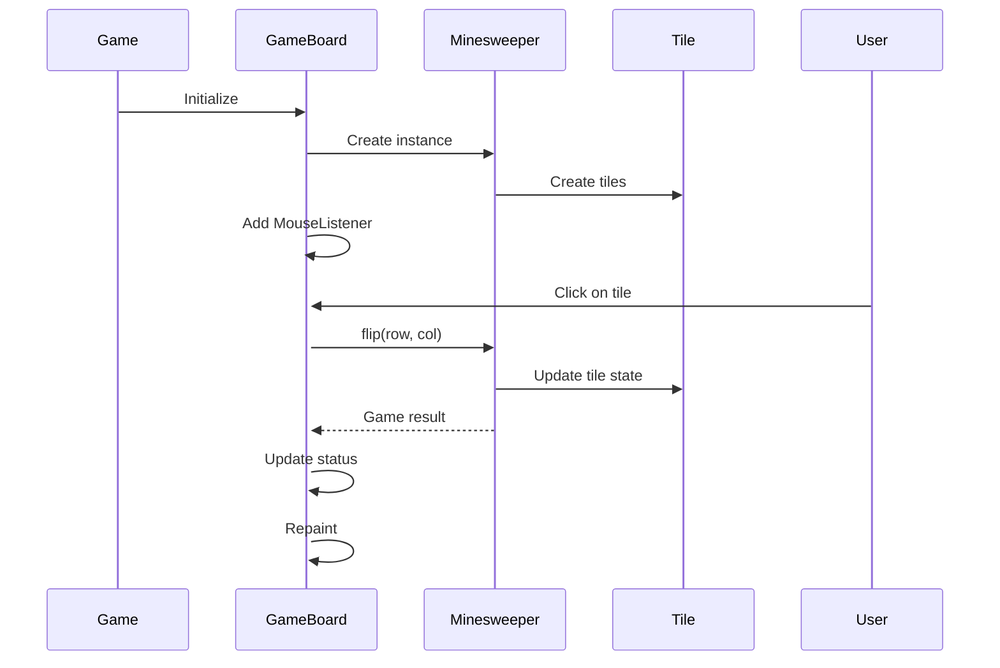
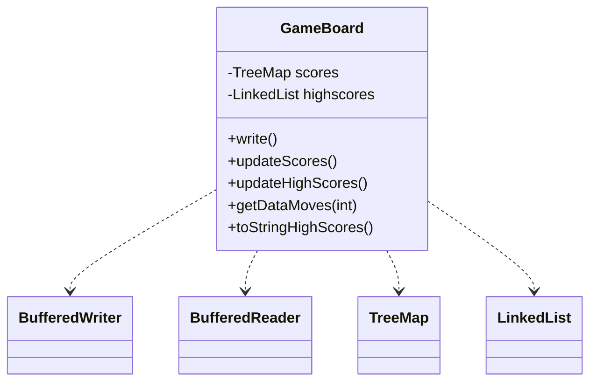

Relevant source files

The following files were used as context for generating this wiki page:

- [Game.java](https://github.com/aanickode/Minesweeper-Project/blob/main/Game.java)
- [GameBoard.java](https://github.com/aanickode/Minesweeper-Project/blob/main/GameBoard.java)
- [Tile.java](https://github.com/aanickode/Minesweeper-Project/blob/main/Tile.java)
- [Minesweeper.java](https://github.com/aanickode/Minesweeper-Project/blob/main/Minesweeper.java)
- [Files/FastestTime.txt](https://github.com/aanickode/Minesweeper-Project/blob/main/Files/FastestTime.txt)

# Architecture Overview

## Introduction

This project is a Java implementation of the classic Minesweeper game. The game's objective is to flip over all non-bomb tiles on a grid while avoiding the hidden bombs. The architecture follows a Model-View-Controller (MVC) design pattern, separating the game logic, user interface, and control flow into distinct components.

The main components of the architecture are:

- `Game`: The top-level class that initializes the GUI and handles user interactions.
- `GameBoard`: The view component that displays the game board and handles user input.
- `Minesweeper`: The model component that manages the game state and logic.
- `Tile`: A class representing individual tiles on the game board.

Sources: [Game.java](), [GameBoard.java](), [Minesweeper.java](), [Tile.java]()

## Game Component

The `Game` class is the entry point of the application and sets up the top-level frame and GUI components. It follows the MVC pattern by initializing the view (`GameBoard`) and providing a controller mechanism through the reset and undo buttons.

Sources: [Game.java]()

## GameBoard Component

The `GameBoard` class is the view component that displays the game board and handles user input. It extends `JPanel` and contains an instance of the `Minesweeper` model. It listens for mouse clicks, updates the model accordingly, and repaints the board based on the updated model state.

Sources: [GameBoard.java]()

## Minesweeper Component

The `Minesweeper` class is the model component that manages the game state and logic. It represents the game board, initializes the tiles, and handles tile flipping and game result calculations.

Sources: [Minesweeper.java]()

## Tile Component

The `Tile` class represents an individual tile on the game board. It stores information about the tile's state (flipped, bomb, number of neighboring bombs) and provides methods to manipulate and access this information.

Sources: [Tile.java]()

## Data Flow

The game follows the typical MVC data flow:

1. The `Game` class initializes the `GameBoard` view and sets up the GUI components.
2. The `GameBoard` creates an instance of the `Minesweeper` model and listens for user input (mouse clicks).
3. When the user clicks on a tile, the `GameBoard` updates the `Minesweeper` model by calling the `flip()` method with the tile coordinates.
4. The `Minesweeper` model updates the game state based on the flipped tile and returns the game result.
5. The `GameBoard` updates the GUI based on the game result and repaints the board.

Sources: [Game.java](), [GameBoard.java](), [Minesweeper.java](), [Tile.java]()

## Score Tracking

The `GameBoard` class also handles score tracking and leaderboard functionality. It reads and writes game scores to a file (`FastestTime.txt`) and maintains a TreeMap of scores and a LinkedList of high scores.

Sources: [GameBoard.java](), [Files/FastestTime.txt]()

## Conclusion

The Minesweeper project follows a well-structured MVC architecture, separating the game logic, user interface, and control flow into distinct components. The `Game` class handles the top-level GUI and user interactions, the `GameBoard` class acts as the view and controller, and the `Minesweeper` and `Tile` classes manage the game state and logic. The project also includes score tracking and leaderboard functionality, which is handled by the `GameBoard` class.