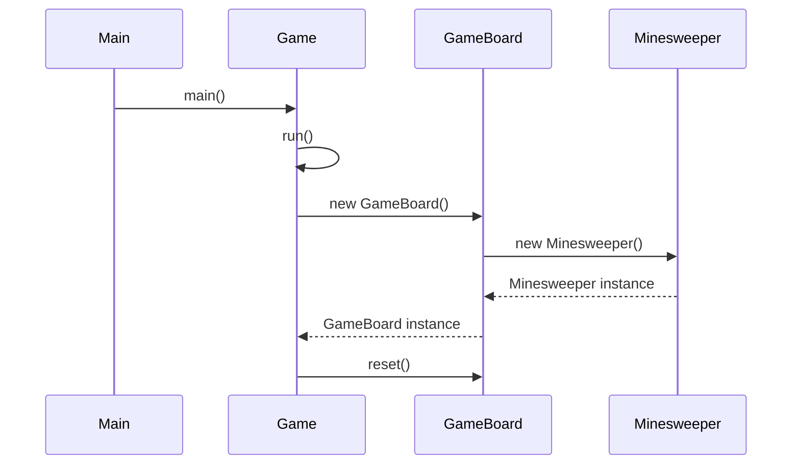
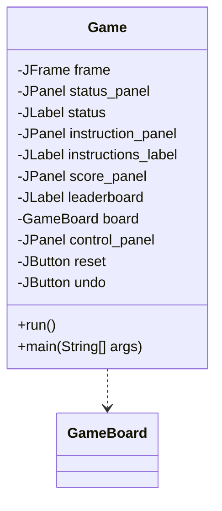
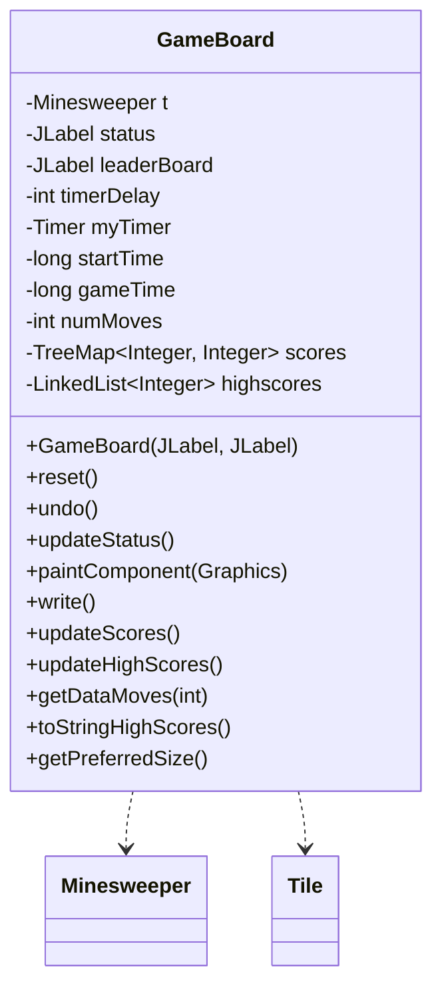
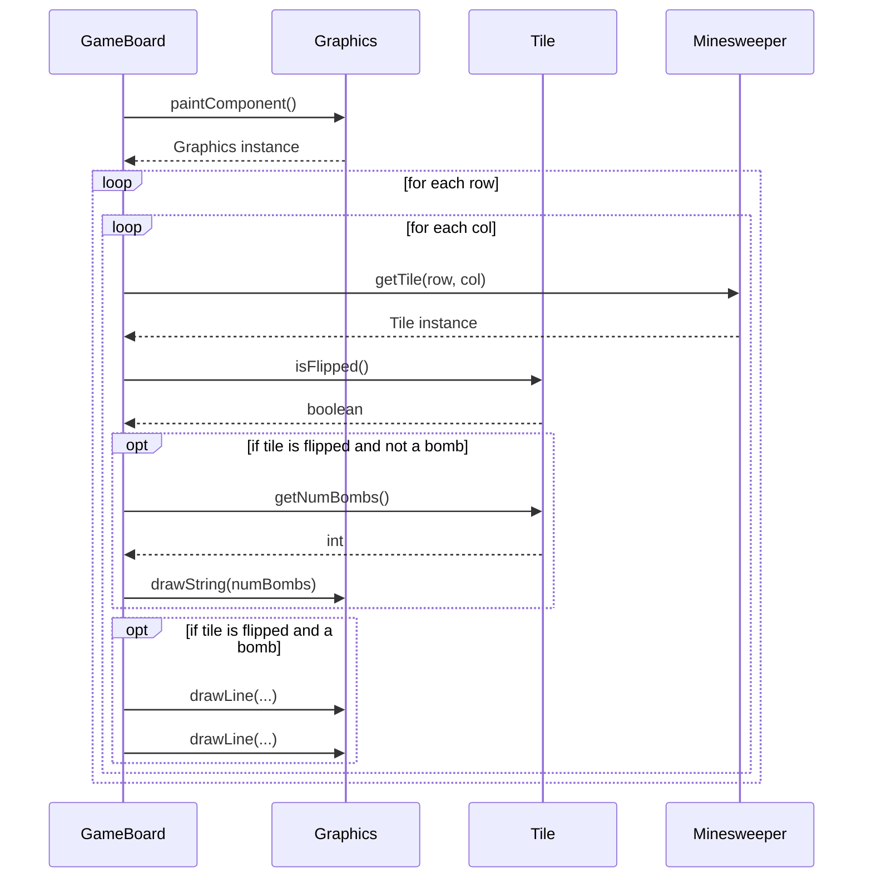
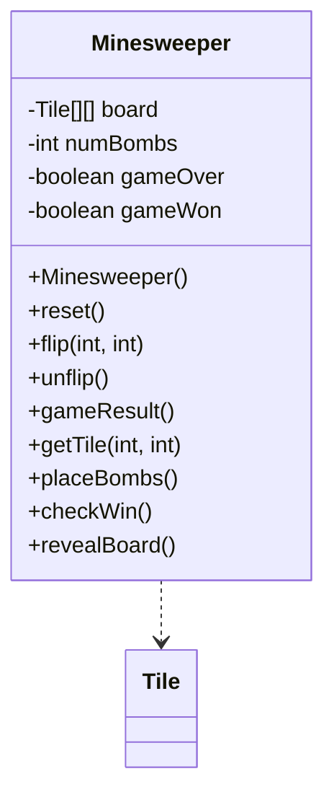
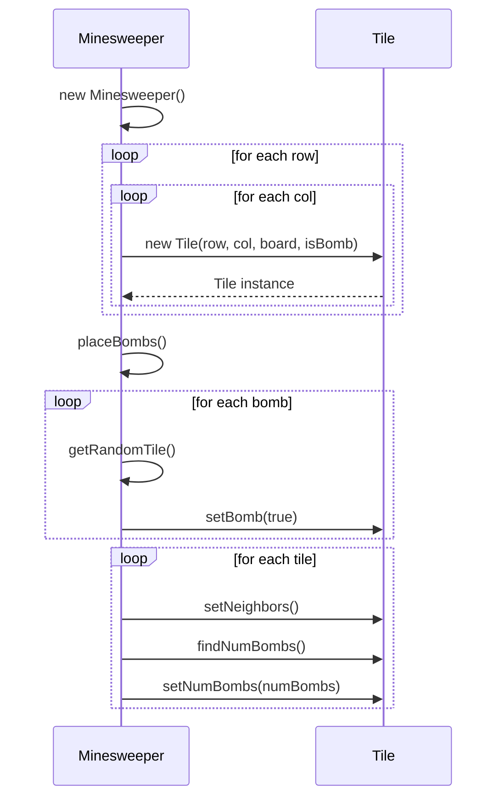
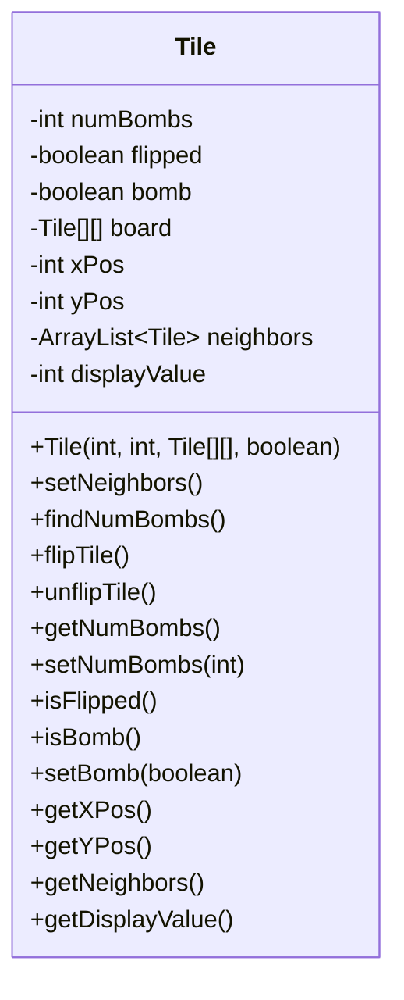
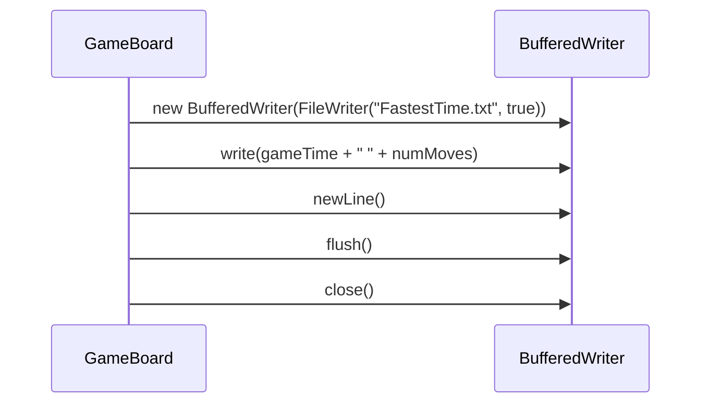
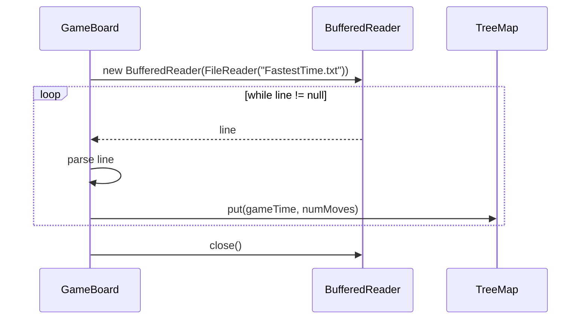
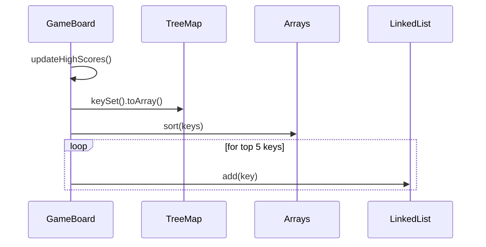

<details>
<summary>Relevant source files</summary>

The following files were used as context for generating this wiki page:

- [Game.java](https://github.com/aanickode/Minesweeper-Project/blob/main/Game.java)
- [GameBoard.java](https://github.com/aanickode/Minesweeper-Project/blob/main/GameBoard.java)
- [Tile.java](https://github.com/aanickode/Minesweeper-Project/blob/main/Tile.java)
- [Minesweeper.java](https://github.com/aanickode/Minesweeper-Project/blob/main/Minesweeper.java)
- [Files/FastestTime.txt](https://github.com/aanickode/Minesweeper-Project/blob/main/Files/FastestTime.txt)

</details>

# Architecture Overview

## Introduction

This project implements a classic Minesweeper game using Java and the Swing GUI toolkit. The game follows a Model-View-Controller (MVC) architecture, where the `Minesweeper` class serves as the model, the `GameBoard` class acts as the view and controller, and the `Game` class initializes the GUI components and game loop.

The game board consists of an 8x8 grid of tiles, with 10 randomly placed bombs. The objective is to flip all non-bomb tiles by clicking on them, while avoiding the bomb tiles. The game provides features like a timer, move counter, undo functionality, and a leaderboard to track high scores.

Sources: [Game.java](https://github.com/aanickode/Minesweeper-Project/blob/main/Game.java), [GameBoard.java](https://github.com/aanickode/Minesweeper-Project/blob/main/GameBoard.java), [Minesweeper.java](https://github.com/aanickode/Minesweeper-Project/blob/main/Minesweeper.java)

## Game Initialization and GUI

The `Game` class is the entry point of the application and sets up the top-level frame and GUI components. It follows the Runnable interface and is executed by the `main` method using `SwingUtilities.invokeLater`.



Sources: [Game.java:17-86](https://github.com/aanickode/Minesweeper-Project/blob/main/Game.java#L17-L86)

The `Game` class creates the main window frame and adds various panels and components, including:

- Status panel: Displays the game status, timer, and move count.
- Instructions panel: Provides game instructions.
- Leaderboard panel: Shows the top 5 high scores.
- Game board panel: The main game board where the tiles are displayed and user interactions occur.
- Control panel: Holds the "Reset" and "Undo" buttons.



Sources: [Game.java:22-80](https://github.com/aanickode/Minesweeper-Project/blob/main/Game.java#L22-L80)

## Game Board and Tile Rendering

The `GameBoard` class extends `JPanel` and serves as the view and controller for the game. It handles user interactions, game logic, and rendering the game board.

### Game Board Initialization

The `GameBoard` constructor initializes the game model (`Minesweeper`), sets up event listeners for mouse clicks, and starts the game timer.



Sources: [GameBoard.java:18-41](https://github.com/aanickode/Minesweeper-Project/blob/main/GameBoard.java#L18-L41), [GameBoard.java:59-84](https://github.com/aanickode/Minesweeper-Project/blob/main/GameBoard.java#L59-L84)

### Game Board Rendering

The `paintComponent` method in `GameBoard` is responsible for rendering the game board. It draws the grid lines and renders the tiles based on their state (flipped, bomb, or number of adjacent bombs).



Sources: [GameBoard.java:128-163](https://github.com/aanickode/Minesweeper-Project/blob/main/GameBoard.java#L128-L163)

## Game Model

The `Minesweeper` class serves as the game model, managing the game state and logic.



Sources: [Minesweeper.java](https://github.com/aanickode/Minesweeper-Project/blob/main/Minesweeper.java)

### Game Board Initialization

The `Minesweeper` constructor initializes an 8x8 board of `Tile` objects and randomly places 10 bombs on the board.



Sources: [Minesweeper.java:14-44](https://github.com/aanickode/Minesweeper-Project/blob/main/Minesweeper.java#L14-L44)

### Game Logic

The `flip` method in `Minesweeper` handles the logic when a tile is clicked. If the tile is a bomb, the game ends. Otherwise, it recursively flips all adjacent non-bomb tiles.

```mermaid
sequenceDiagram
    participant GameBoard
    participant Minesweeper
    participant Tile

    GameBoard->>Minesweeper: flip(row, col)
    Minesweeper->>Minesweeper: getTile(row, col)
    Minesweeper-->>Minesweeper: Tile instance
    opt if tile is a bomb
        Minesweeper->>Minesweeper: revealBoard()
        Minesweeper-->>GameBoard: gameOver = true
    else if tile is not flipped
        Minesweeper->>Tile: flipTile()
        opt if tile has no adjacent bombs
            Minesweeper->>Minesweeper: flipNeighbors(tile)
            loop for each neighbor
                Minesweeper->>Minesweeper: flip(neighbor)
            end
        end
        Minesweeper->>Minesweeper: checkWin()
        opt if all non-bomb tiles are flipped
            Minesweeper-->>GameBoard: gameWon = true
        end
    end
```

Sources: [Minesweeper.java:46-84](https://github.com/aanickode/Minesweeper-Project/blob/main/Minesweeper.java#L46-L84)

The `unflip` method in `Minesweeper` handles the undo functionality by unflipping the last flipped tile.

```mermaid
sequenceDiagram
    participant GameBoard
    participant Minesweeper
    participant Tile

    GameBoard->>Minesweeper: unflip()
    Minesweeper->>Minesweeper: getLastFlippedTile()
    Minesweeper-->>Minesweeper: Tile instance
    opt if tile exists
        Minesweeper->>Tile: unflipTile()
        Minesweeper-->>GameBoard: true
    else
        Minesweeper-->>GameBoard: false
    end
```

Sources: [Minesweeper.java:86-96](https://github.com/aanickode/Minesweeper-Project/blob/main/Minesweeper.java#L86-L96)

## Tile Management

The `Tile` class represents an individual tile on the game board. It keeps track of its state (flipped, bomb, number of adjacent bombs) and provides methods to interact with the tile.



Sources: [Tile.java](https://github.com/aanickode/Minesweeper-Project/blob/main/Tile.java)

The `Tile` class provides methods to:

- Set and get the tile's state (flipped, bomb, number of adjacent bombs).
- Find and set the neighboring tiles.
- Flip and unflip the tile.
- Get the tile's position on the board.

These methods are used by the `Minesweeper` class to manage the game logic and state.

## High Score Management

The `GameBoard` class manages the high score functionality by reading and writing scores to a file (`FastestTime.txt`).

### Writing Scores

The `write` method in `GameBoard` appends the current game's time and move count to the `FastestTime.txt` file if the game is won.



Sources: [GameBoard.java:167-176](https://github.com/aanickode/Minesweeper-Project/blob/main/GameBoard.java#L167-L176)

### Reading Scores

The `updateScores` method in `GameBoard` reads the `FastestTime.txt` file and populates a `TreeMap` with the game times as keys and move counts as values.



Sources: [GameBoard.java:178-204](https://github.com/aanickode/Minesweeper-Project/blob/main/GameBoard.java#L178-L204)

### Updating High Scores

The `updateHighScores` method in `GameBoard` sorts the `TreeMap` keys (game times) and selects the top 5 as high scores.



Sources: [GameBoard.java:206-219](https://github.com/aanickode/Minesweeper-Project/blob/main/GameBoard.java#L206-L219)

The high scores are displayed in the leaderboard panel of the GUI.

## Game Flow

The overall game flow can be summarized as follows:

```mermaid
graph TD
    A[Game starts] --> B[GameBoard initialized]
    B --> C[Minesweeper model initialized]
    C --> D[Tiles created and bombs placed]
    D --> E[Game board rendered]
    E --> F[User clicks tile]
    F --> G[Minesweeper.flip() called]
    G --> H{Tile is bomb?}
    H -->|Yes| I[Game over]
    H -->|No| J[Tile flipped]
    J --> K[Recursive neighbor flipping]
    K --> L[Check win condition]
    L -->|Yes| M[Game won]
    L -->|No| E
    M --> N[Write score to file]
    N --> O[Update high scores]
    I --> P[Reset game]
    P --> B
```

Sources: [Game.java](https://github.com/aanickode/Minesweeper-Project/blob/main/Game.java), [GameBoard.java](https://github.com/aanickode/Minesweeper-Project/blob/main/GameBoard.java), [Minesweeper.java](https://github.com/aanickode/