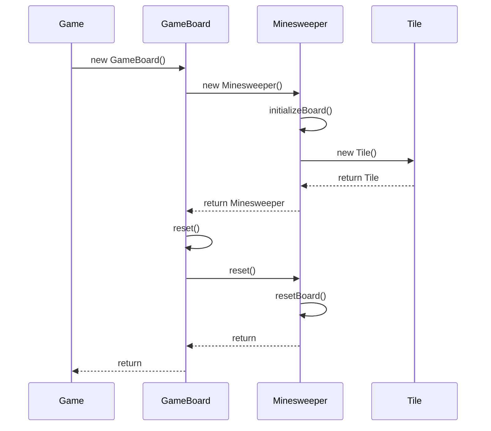
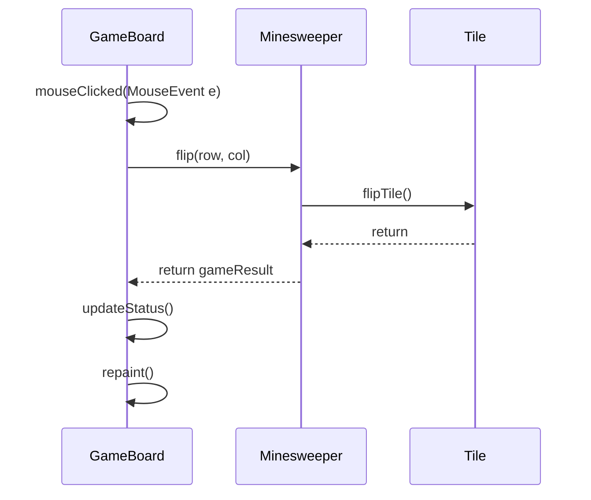
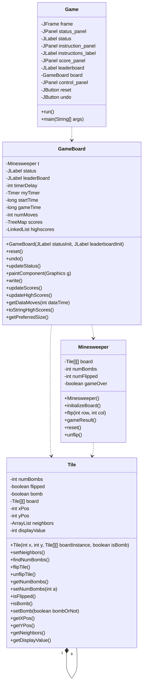

Relevant source files

The following files were used as context for generating this wiki page:

- [Game.java](https://github.com/aanickode/Minesweeper-Project/blob/main/Game.java)
- [GameBoard.java](https://github.com/aanickode/Minesweeper-Project/blob/main/GameBoard.java)
- [Tile.java](https://github.com/aanickode/Minesweeper-Project/blob/main/Tile.java)
- [Minesweeper.java](https://github.com/aanickode/Minesweeper-Project/blob/main/Minesweeper.java)
- [Files/FastestTime.txt](https://github.com/aanickode/Minesweeper-Project/blob/main/Files/FastestTime.txt)

# Architecture Overview

## Introduction

This project implements a Minesweeper game using Java Swing for the graphical user interface (GUI). The game follows the classic Minesweeper rules, where the player must uncover all non-mine tiles on a grid without detonating any mines. The architecture is based on the Model-View-Controller (MVC) design pattern, separating the game logic, user interface, and control flow.

The main components of the architecture are:

- `Game` class: Initializes the GUI components and sets up the game board.
- `GameBoard` class: Handles the game board rendering, user input, and game state updates.
- `Minesweeper` class: Represents the game model, managing the game board, tile states, and game logic.
- `Tile` class: Represents an individual tile on the game board, with properties like position, bomb status, and neighboring tiles.

Sources: [Game.java](https://github.com/aanickode/Minesweeper-Project/blob/main/Game.java), [GameBoard.java](https://github.com/aanickode/Minesweeper-Project/blob/main/GameBoard.java), [Minesweeper.java](https://github.com/aanickode/Minesweeper-Project/blob/main/Minesweeper.java), [Tile.java](https://github.com/aanickode/Minesweeper-Project/blob/main/Tile.java)

## GUI Components

The `Game` class sets up the main game window and its components, including:

- `JFrame`: The top-level window container.
- `JPanel`: Panels for displaying the game board, status, instructions, and control buttons.
- `JLabel`: Labels for displaying the game status, instructions, and leaderboard.
- `JButton`: Buttons for resetting the game and undoing the last move.

The `GameBoard` class extends `JPanel` and handles the rendering of the game board, as well as user input through mouse clicks.

Sources: [Game.java:15-80](https://github.com/aanickode/Minesweeper-Project/blob/main/Game.java#L15-L80), [GameBoard.java:34-43](https://github.com/aanickode/Minesweeper-Project/blob/main/GameBoard.java#L34-L43)

## Game Logic

The `Minesweeper` class represents the game model and contains the core game logic. It manages the game board, tile states, and game rules. Key responsibilities include:

- Initializing the game board with mines and non-mine tiles.
- Flipping tiles based on user input.
- Checking for game win or loss conditions.
- Resetting the game board for a new game.

The `Tile` class represents an individual tile on the game board. It stores information about the tile's position, bomb status, neighboring tiles, and the number of adjacent mines.

Sources: [Minesweeper.java](https://github.com/aanickode/Minesweeper-Project/blob/main/Minesweeper.java), [Tile.java](https://github.com/aanickode/Minesweeper-Project/blob/main/Tile.java)

## Game Flow

The game flow follows the MVC pattern:

1. The `Game` class initializes the GUI components, including the `GameBoard` and the control buttons.
2. The `GameBoard` class sets up the game model (`Minesweeper` instance) and handles user input through mouse clicks.
3. When a tile is clicked, the `GameBoard` updates the game model by calling the `flip` method in the `Minesweeper` class.
4. The `Minesweeper` class updates the tile states based on the game rules and returns the game result (win, loss, or ongoing).
5. The `GameBoard` updates the GUI based on the game result, including the status label and the board rendering.
6. The game continues until the player wins or loses, at which point the game can be reset or the high scores can be updated.

Sources: [Game.java](https://github.com/aanickode/Minesweeper-Project/blob/main/Game.java), [GameBoard.java](https://github.com/aanickode/Minesweeper-Project/blob/main/GameBoard.java), [Minesweeper.java](https://github.com/aanickode/Minesweeper-Project/blob/main/Minesweeper.java)

## High Scores

The game keeps track of high scores based on the time taken to win and the number of moves made. The high scores are stored in a text file (`FastestTime.txt`) and loaded into a `TreeMap` data structure in the `GameBoard` class.

The `GameBoard` class provides methods to:

- Write the current game's score to the text file.
- Read and update the high scores from the text file.
- Display the top 5 high scores in the leaderboard label.

Sources: [GameBoard.java:128-192](https://github.com/aanickode/Minesweeper-Project/blob/main/GameBoard.java#L128-L192), [Files/FastestTime.txt](https://github.com/aanickode/Minesweeper-Project/blob/main/Files/FastestTime.txt)

## Sequence Diagram: Game Start

This sequence diagram illustrates the initialization and setup of the game components when the game starts.

1. The `Game` class creates an instance of `GameBoard`.
2. The `GameBoard` constructor creates an instance of `Minesweeper`.
3. The `Minesweeper` constructor initializes the game board by creating `Tile` instances.
4. After initialization, the `GameBoard` calls its `reset` method, which in turn calls the `reset` method of `Minesweeper` to reset the game board.

Sources: [Game.java:74-80](https://github.com/aanickode/Minesweeper-Project/blob/main/Game.java#L74-L80), [GameBoard.java:34-43](https://github.com/aanickode/Minesweeper-Project/blob/main/GameBoard.java#L34-L43), [GameBoard.java:105-108](https://github.com/aanickode/Minesweeper-Project/blob/main/GameBoard.java#L105-L108), [Minesweeper.java](https://github.com/aanickode/Minesweeper-Project/blob/main/Minesweeper.java), [Tile.java](https://github.com/aanickode/Minesweeper-Project/blob/main/Tile.java)

## Sequence Diagram: Tile Flip

This sequence diagram illustrates the flow when a tile is clicked on the game board.

1. The `GameBoard` receives a `MouseEvent` from the user clicking on a tile.
2. The `GameBoard` calls the `flip` method of `Minesweeper` with the row and column of the clicked tile.
3. The `Minesweeper` class calls the `flipTile` method of the corresponding `Tile` instance.
4. The `Tile` updates its internal state and returns control to `Minesweeper`.
5. The `Minesweeper` class determines the game result (win, loss, or ongoing) and returns it to `GameBoard`.
6. The `GameBoard` updates the game status and repaints the board to reflect the changes.

Sources: [GameBoard.java:49-62](https://github.com/aanickode/Minesweeper-Project/blob/main/GameBoard.java#L49-L62), [GameBoard.java:117-124](https://github.com/aanickode/Minesweeper-Project/blob/main/GameBoard.java#L117-L124), [Minesweeper.java](https://github.com/aanickode/Minesweeper-Project/blob/main/Minesweeper.java), [Tile.java:37-40](https://github.com/aanickode/Minesweeper-Project/blob/main/Tile.java#L37-L40)

## Class Diagram

This class diagram illustrates the relationships between the main classes in the Minesweeper project.

- The `Game` class sets up the GUI components and instantiates the `GameBoard`.
- The `GameBoard` class manages the game board rendering, user input, and game state updates. It has a composition relationship with `Minesweeper` and `Tile`.
- The `Minesweeper` class represents the game model and contains the core game logic. It has a composition relationship with `Tile`.
- The `Tile` class represents an individual tile on the game board. It has an aggregation relationship with other `Tile` instances to represent neighboring tiles.

Sources: [Game.java](https://github.com/aanickode/Minesweeper-Project/blob/main/Game.java), [GameBoard.java](https://github.com/aanickode/Minesweeper-Project/blob/main/GameBoard.java), [Minesweeper.java](https://github.com/aanickode/Minesweeper-Project/blob/main/Minesweeper.java), [Tile.java](https://github.com/aanickode/Minesweeper-Project/blob/main/Tile.java)

## Summary

The Minesweeper project follows the Model-View-Controller (MVC) design pattern, separating the game logic, user interface, and control flow. The `Minesweeper` class represents the game model, managing the game board, tile states, and game rules. The `GameBoard` class handles the rendering of the game board and user input, while the `Game` class sets up the GUI components and initializes the game. The `Tile` class represents an individual tile on the game board, storing information about its position, bomb status, and neighboring tiles. The project also includes functionality for tracking and displaying high scores based on the time taken to win and the number of moves made.

Sources: [Game.java](https://github.com/aanickode/Minesweeper-Project/blob/main/Game.java), [GameBoard.java](https://github.com/aanickode/Minesweeper-Project/blob/main/GameBoard.java), [Minesweeper.java](https://github.com/aanickode/Minesweeper-Project/blob/main/Minesweeper.java), [Tile.java](https://github.com/aanickode/Minesweeper-Project/blob/main/Tile.java)