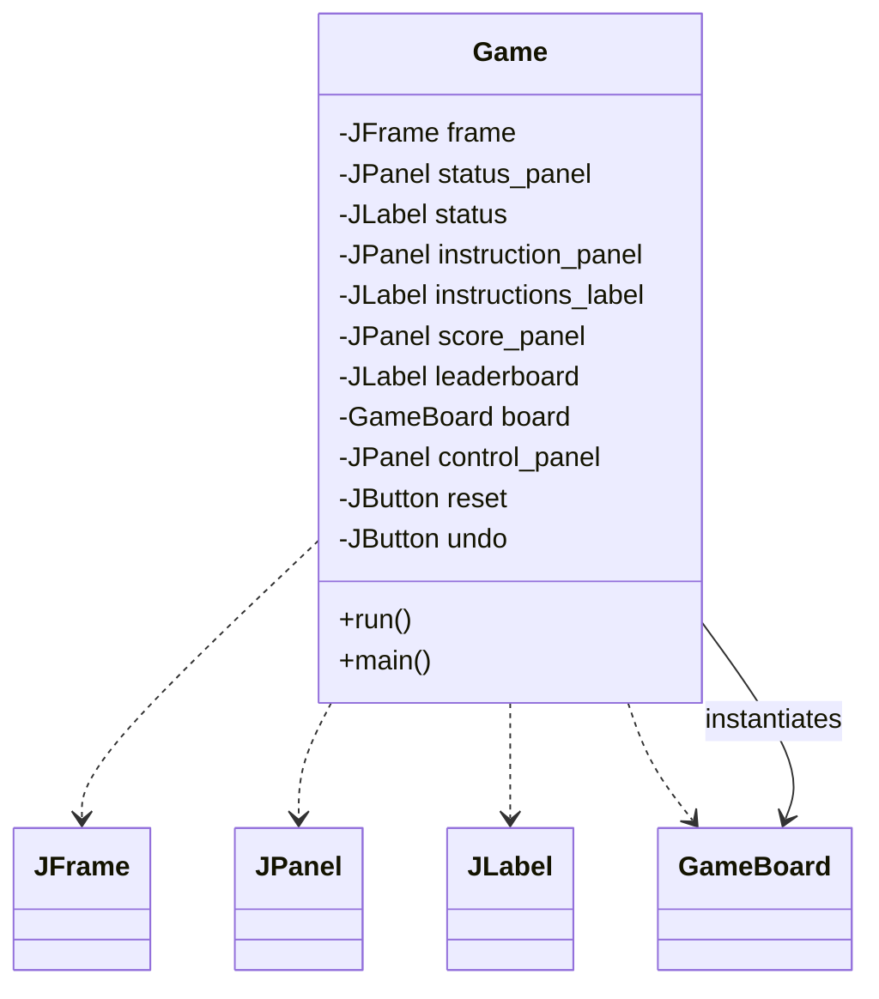
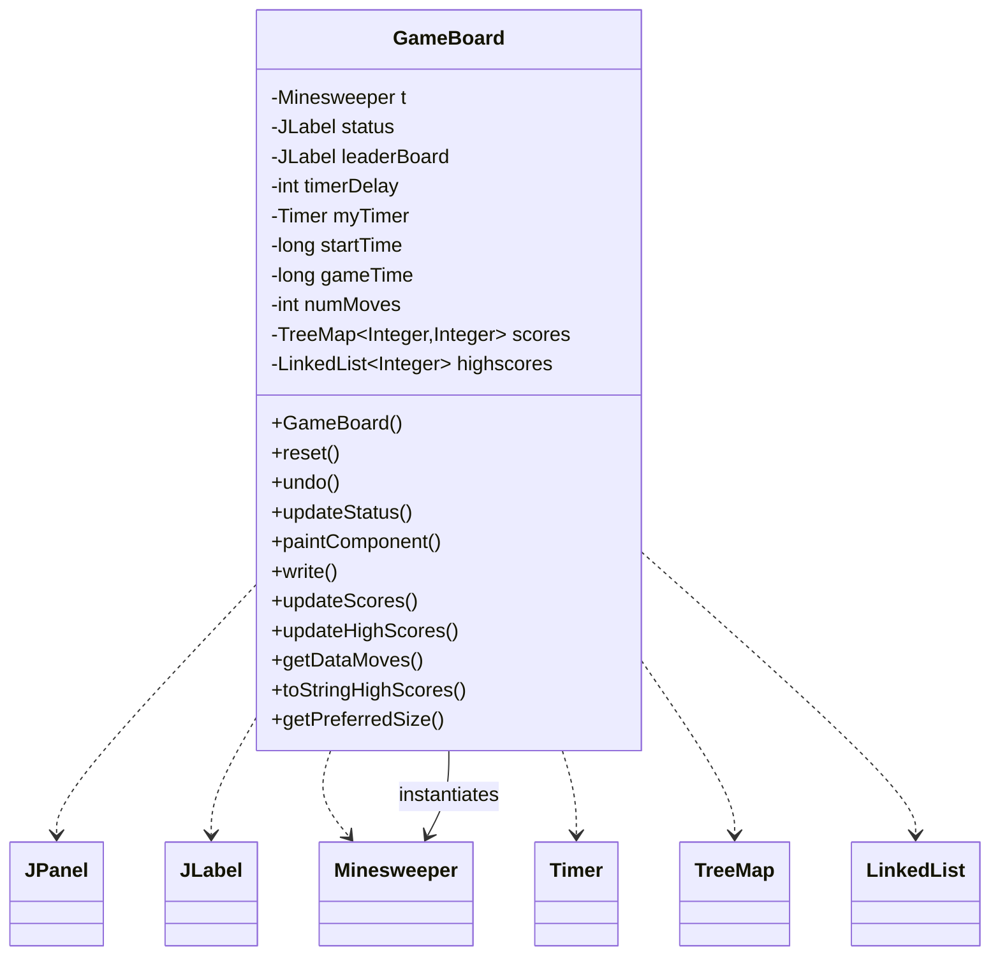
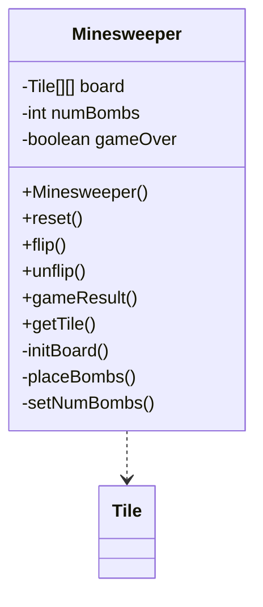
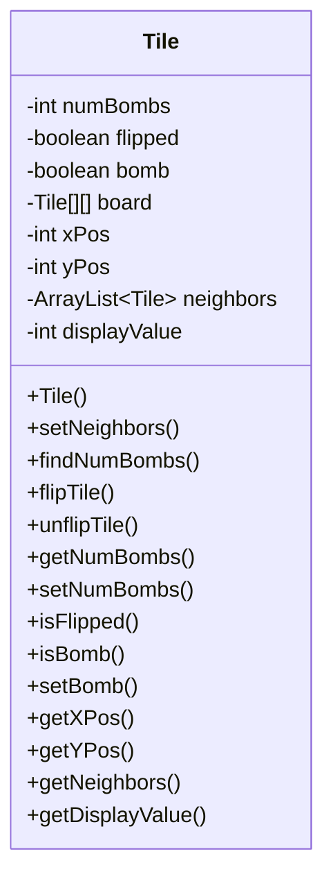
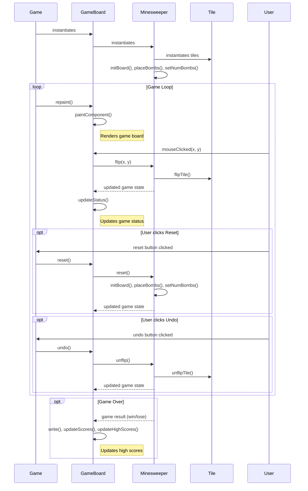

Relevant source files

The following files were used as context for generating this wiki page:

- [Game.java](https://github.com/aanickode/Minesweeper-Project/blob/main/Game.java)
- [GameBoard.java](https://github.com/aanickode/Minesweeper-Project/blob/main/GameBoard.java)
- [Tile.java](https://github.com/aanickode/Minesweeper-Project/blob/main/Tile.java)
- [Minesweeper.java](https://github.com/aanickode/Minesweeper-Project/blob/main/Minesweeper.java)
- [Files/FastestTime.txt](https://github.com/aanickode/Minesweeper-Project/blob/main/Files/FastestTime.txt)

# Architecture Overview

## Introduction

The provided source files implement a Minesweeper game using Java Swing for the graphical user interface (GUI). The game follows the classic Minesweeper rules, where the player must uncover all non-mine tiles on a grid without detonating any mines. The architecture is structured using the Model-View-Controller (MVC) design pattern, separating the game logic, user interface, and control flow.

The main components of the architecture are:

- `Game`: The entry point and top-level container for the GUI components.
- `GameBoard`: Handles the game board rendering, user interactions, and game state updates.
- `Minesweeper`: Represents the game model, managing the board state, tile flipping, and game logic.
- `Tile`: Represents an individual tile on the game board, with properties like its position, neighbor tiles, and whether it's a mine or not.

Sources: [Game.java](https://github.com/aanickode/Minesweeper-Project/blob/main/Game.java), [GameBoard.java](https://github.com/aanickode/Minesweeper-Project/blob/main/GameBoard.java), [Minesweeper.java](https://github.com/aanickode/Minesweeper-Project/blob/main/Minesweeper.java), [Tile.java](https://github.com/aanickode/Minesweeper-Project/blob/main/Tile.java)

## Game Setup and GUI

The `Game` class is the entry point of the application and sets up the top-level GUI components using Java Swing. It creates the main window frame and adds various panels for displaying the game board, status, instructions, and high scores.

The `Game` class also sets up the reset and undo buttons, which trigger the corresponding actions in the `GameBoard` instance.

Sources: [Game.java:13-106](https://github.com/aanickode/Minesweeper-Project/blob/main/Game.java#L13-L106)

## Game Board and Rendering

The `GameBoard` class is responsible for rendering the game board, handling user interactions (mouse clicks), and updating the game state based on the `Minesweeper` model.

The `GameBoard` class handles the following responsibilities:

- Initializing the `Minesweeper` model and game state.
- Rendering the game board grid and tiles using the `paintComponent` method.
- Handling mouse click events and updating the model accordingly.
- Updating the game status (win, lose, or ongoing) and displaying it in the status label.
- Managing the game timer and tracking the number of moves made by the player.
- Providing reset and undo functionality for the game.
- Maintaining a leaderboard of high scores by reading and writing to a file (`FastestTime.txt`).

Sources: [GameBoard.java](https://github.com/aanickode/Minesweeper-Project/blob/main/GameBoard.java)

## Game Model and Logic

The `Minesweeper` class represents the game model and encapsulates the game logic. It manages the board state, tile flipping, and game result determination.

The `Minesweeper` class is responsible for:

- Initializing the game board with tiles and placing mines randomly.
- Flipping and unflipping tiles based on user input.
- Determining the game result (win, lose, or ongoing) based on the board state.
- Providing access to individual tiles on the board.

Sources: [Minesweeper.java](https://github.com/aanickode/Minesweeper-Project/blob/main/Minesweeper.java)

## Tile Representation

The `Tile` class represents an individual tile on the game board. It encapsulates the tile's properties, such as its position, whether it's a mine, whether it's flipped, and the number of neighboring mines.

The `Tile` class provides methods for:

- Determining the neighboring tiles on the board.
- Counting the number of neighboring mines.
- Flipping and unflipping the tile.
- Accessing and modifying the tile's properties.

Sources: [Tile.java](https://github.com/aanickode/Minesweeper-Project/blob/main/Tile.java)

## Data Flow and Interactions

The following sequence diagram illustrates the high-level data flow and interactions between the main components during gameplay:

Sources: [Game.java](https://github.com/aanickode/Minesweeper-Project/blob/main/Game.java), [GameBoard.java](https://github.com/aanickode/Minesweeper-Project/blob/main/GameBoard.java), [Minesweeper.java](https://github.com/aanickode/Minesweeper-Project/blob/main/Minesweeper.java), [Tile.java](https://github.com/aanickode/Minesweeper-Project/blob/main/Tile.java)

## High Scores and File I/O

The `GameBoard` class also handles the management of high scores for the game. It reads and writes high score data from/to a file named `FastestTime.txt`.

| Method | Description |
| --- | --- |
| `write()` | Writes the current game's time and number of moves to the `FastestTime.txt` file. |
| `updateScores()` | Reads the `FastestTime.txt` file and populates a `TreeMap` with the game times as keys and the number of moves as values. |
| `updateHighScores()` | Sorts the `TreeMap` and selects the top 5 scores to be displayed as high scores. |
| `getDataMoves(int dataTime)` | Retrieves the number of moves for a given game time from the `TreeMap`. |
| `toStringHighScores()` | Converts the high scores list to a formatted string for display. |

Sources: [GameBoard.java:149-221](https://github.com/aanickode/Minesweeper-Project/blob/main/GameBoard.java#L149-L221), [Files/FastestTime.txt](https://github.com/aanickode/Minesweeper-Project/blob/main/Files/FastestTime.txt)

## Conclusion

The Minesweeper game implementation follows the Model-View-Controller (MVC) design pattern, separating the game logic, user interface, and control flow. The `Minesweeper` class serves as the game model, managing the board state and game logic. The `GameBoard` class acts as the view and controller, handling user interactions, rendering the game board, and updating the game state based on the model. The `Game` class sets up the top-level GUI components and provides entry points for user actions like reset and undo. The `Tile` class represents individual tiles on the game board, encapsulating their properties and behaviors. The architecture also includes file I/O operations to manage high scores and game statistics.