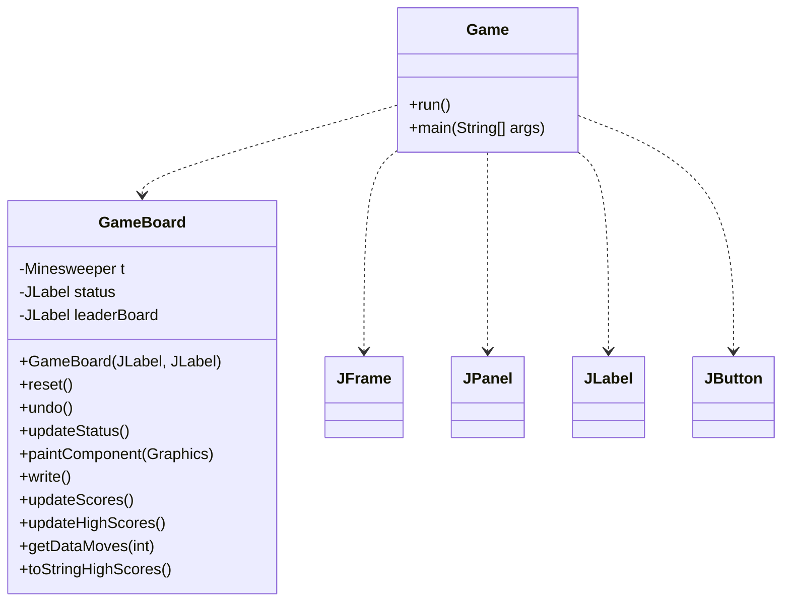
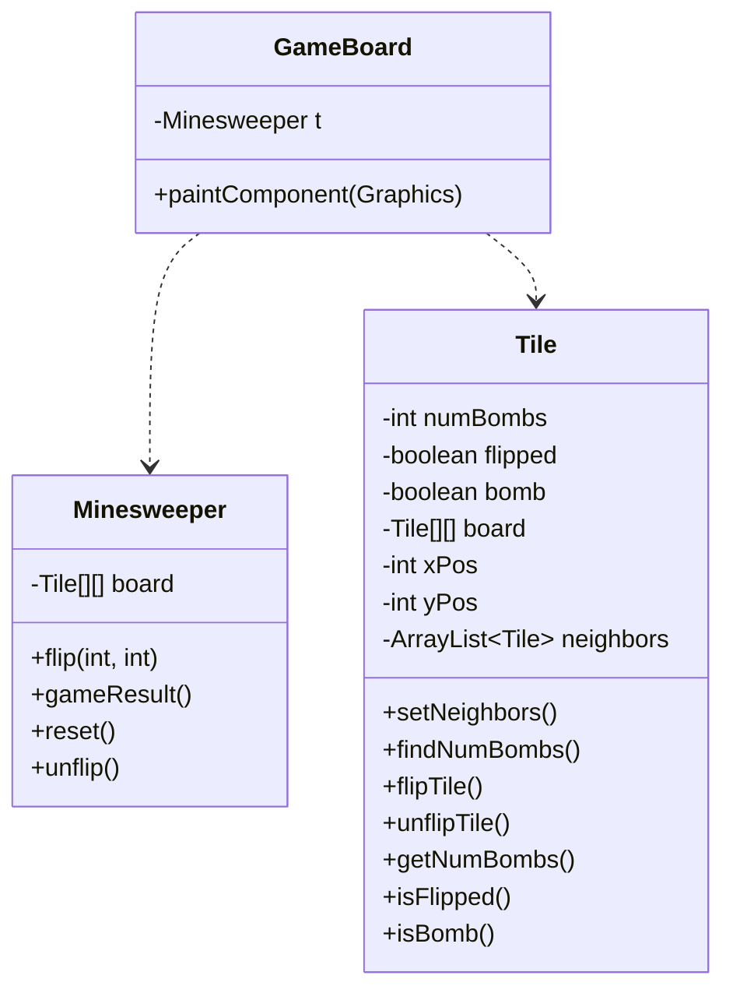
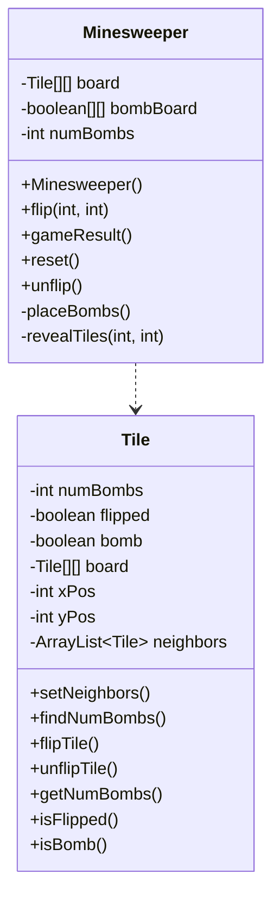
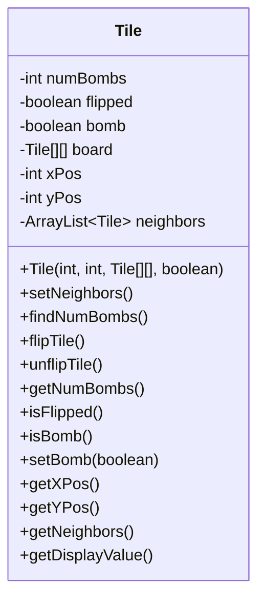
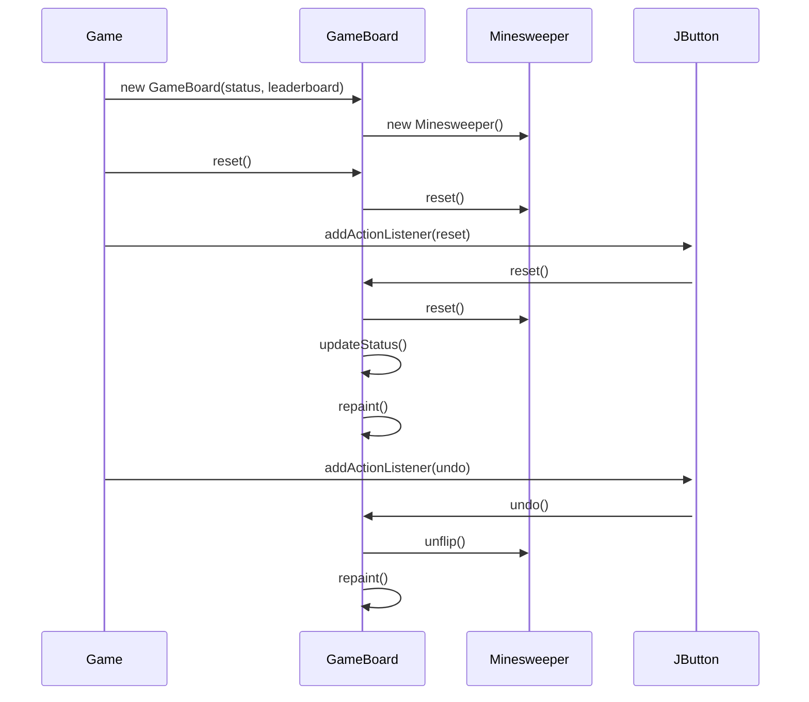
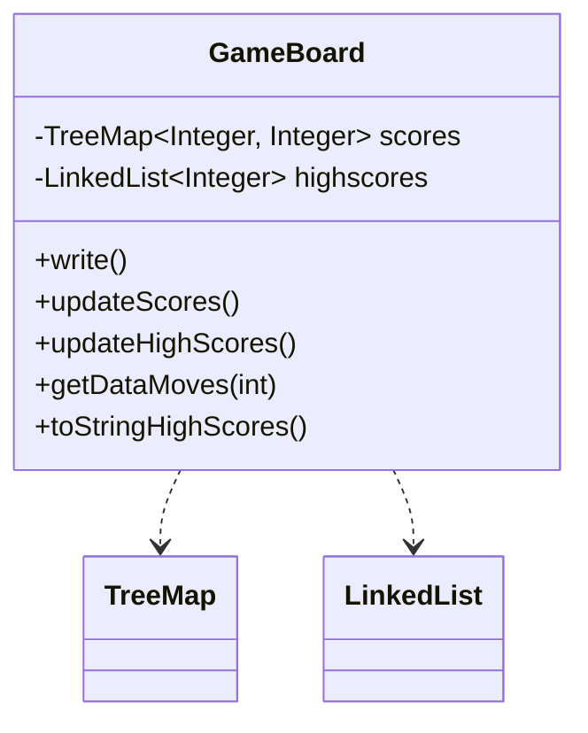

Relevant source files

The following files were used as context for generating this wiki page:

- [Game.java](https://github.com/aanickode/Minesweeper-Project/blob/main/Game.java)
- [GameBoard.java](https://github.com/aanickode/Minesweeper-Project/blob/main/GameBoard.java)
- [Tile.java](https://github.com/aanickode/Minesweeper-Project/blob/main/Tile.java)
- [Minesweeper.java](https://github.com/aanickode/Minesweeper-Project/blob/main/Minesweeper.java)
- [Files/FastestTime.txt](https://github.com/aanickode/Minesweeper-Project/blob/main/Files/FastestTime.txt)

# Architecture Overview

## Introduction

This project is a Java implementation of the classic Minesweeper game. The game's objective is to flip over all non-bomb tiles on a grid without detonating any bombs. The architecture follows a Model-View-Controller (MVC) design pattern, separating the game logic, user interface, and control flow into distinct components.

The main components of the architecture are:

- `Game`: The top-level class that initializes the GUI and handles user interactions.
- `GameBoard`: The view component that displays the game board and handles user input.
- `Minesweeper`: The model component that encapsulates the game logic and board state.
- `Tile`: A class representing individual tiles on the game board.

Sources: [Game.java](), [GameBoard.java](), [Minesweeper.java](), [Tile.java]()

## Game Initialization and GUI

The `Game` class serves as the entry point and sets up the top-level frame and GUI components. It follows the MVC pattern by initializing the view (`GameBoard`) and controller (`Game` itself).

Sources: [Game.java](), [GameBoard.java:14-200]()

## Game Board and Rendering

The `GameBoard` class is responsible for rendering the game board and handling user input (mouse clicks). It maintains an instance of the `Minesweeper` model and updates the board based on the model's state.

Sources: [GameBoard.java:58-142](), [Minesweeper.java](), [Tile.java]()

## Game Logic and Board State

The `Minesweeper` class encapsulates the game logic and maintains the state of the game board. It manages the placement of bombs, flipping tiles, and determining the game's outcome.

Sources: [Minesweeper.java](), [Tile.java]()

## Tile Management

The `Tile` class represents an individual tile on the game board. It keeps track of its state (flipped, bomb, number of adjacent bombs) and provides methods for manipulating and querying its properties.

Sources: [Tile.java]()

## Game Flow and User Interactions

The `Game` class sets up the initial game state and handles user interactions through button clicks (Reset and Undo).

Sources: [Game.java:33-81](), [GameBoard.java:14-200](), [Minesweeper.java]()

## Score Tracking and Leaderboard

The `GameBoard` class manages score tracking and leaderboard functionality. It reads and writes game scores to a file (`FastestTime.txt`) and maintains a list of high scores.

Sources: [GameBoard.java:21-28, 143-200](), [Files/FastestTime.txt]()

## Conclusion

The Minesweeper project follows a well-structured MVC architecture, separating concerns and promoting code reusability and maintainability. The `Game` class handles the top-level GUI and user interactions, while the `GameBoard` class manages the game board rendering and score tracking. The `Minesweeper` class encapsulates the game logic and board state, and the `Tile` class represents individual tiles on the board. The project leverages various data structures and algorithms to implement the game's functionality effectively.