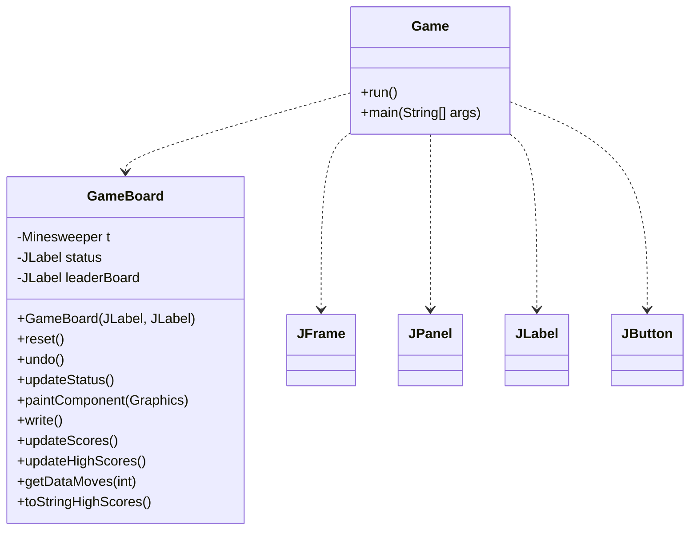
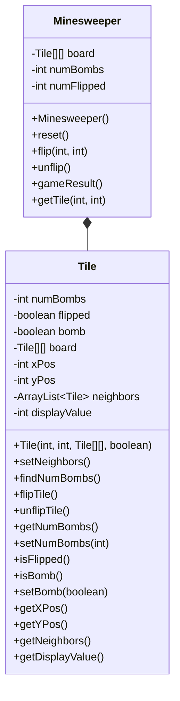
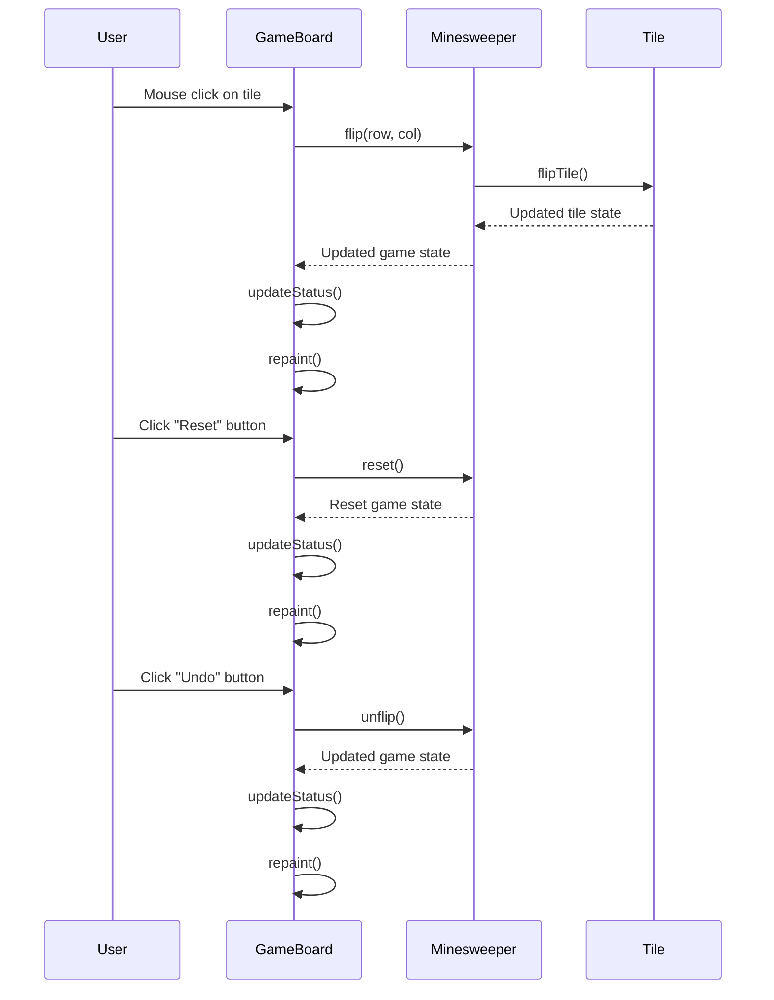
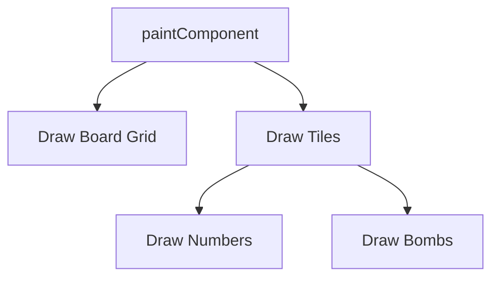
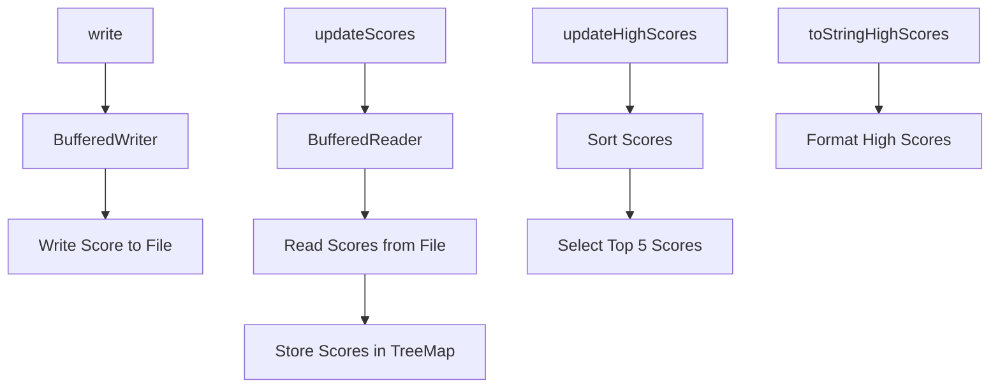

Relevant source files

The following files were used as context for generating this wiki page:

- [Game.java](https://github.com/aanickode/Minesweeper-Project/blob/main/Game.java)
- [GameBoard.java](https://github.com/aanickode/Minesweeper-Project/blob/main/GameBoard.java)
- [Tile.java](https://github.com/aanickode/Minesweeper-Project/blob/main/Tile.java)
- [Minesweeper.java](https://github.com/aanickode/Minesweeper-Project/blob/main/Minesweeper.java)
- [Files/FastestTime.txt](https://github.com/aanickode/Minesweeper-Project/blob/main/Files/FastestTime.txt)

# Architecture Overview

## Introduction

This project is a Java implementation of the classic Minesweeper game. The game's objective is to flip over all non-bomb tiles on a grid-based board without detonating any bombs. The architecture follows the Model-View-Controller (MVC) design pattern, separating the game logic, user interface, and control flow into distinct components.

The main components of the architecture are:

- `Game`: The top-level class that initializes the game window and sets up the user interface components.
- `GameBoard`: Handles the game's view and controller logic, including rendering the board, processing user input, and updating the game status.
- `Minesweeper`: Represents the game's model, managing the board state, tile flipping, and game result evaluation.
- `Tile`: Encapsulates the state and behavior of individual tiles on the game board.

Sources: [Game.java](https://github.com/aanickode/Minesweeper-Project/blob/main/Game.java), [GameBoard.java](https://github.com/aanickode/Minesweeper-Project/blob/main/GameBoard.java), [Minesweeper.java](https://github.com/aanickode/Minesweeper-Project/blob/main/Minesweeper.java), [Tile.java](https://github.com/aanickode/Minesweeper-Project/blob/main/Tile.java)

## Game Initialization and User Interface

The `Game` class is the entry point of the application. It sets up the main game window (`JFrame`) and initializes the user interface components, including the game board, status panel, instructions panel, and control buttons (Reset and Undo).

The `GameBoard` class is responsible for rendering the game board and handling user interactions. It initializes the `Minesweeper` model and sets up event listeners for mouse clicks and timer updates. The `reset()` and `undo()` methods allow the user to restart the game or undo the last move, respectively.

Sources: [Game.java:11-121](https://github.com/aanickode/Minesweeper-Project/blob/main/Game.java#L11-L121), [GameBoard.java:22-233](https://github.com/aanickode/Minesweeper-Project/blob/main/GameBoard.java#L22-L233)

## Game Model and Tile Management

The `Minesweeper` class represents the game's model, managing the board state, tile flipping, and game result evaluation. It maintains a 2D array of `Tile` objects, which encapsulate the state and behavior of individual tiles on the game board.

The `Tile` class encapsulates the state and behavior of individual tiles, including their position, bomb status, neighboring tiles, and display value. It provides methods for flipping/unflipping tiles, calculating the number of surrounding bombs, and managing the tile's state.

Sources: [Minesweeper.java](https://github.com/aanickode/Minesweeper-Project/blob/main/Minesweeper.java), [Tile.java](https://github.com/aanickode/Minesweeper-Project/blob/main/Tile.java)

## Game Flow and User Interactions

The game flow and user interactions are handled by the `GameBoard` class, which acts as the controller in the MVC architecture.

When the user clicks on a tile, the `GameBoard` class processes the mouse event and calls the `flip()` method of the `Minesweeper` model, passing the row and column coordinates. The `Minesweeper` class then updates the tile's state by calling the `flipTile()` method of the corresponding `Tile` object. After the tile is flipped, the `Minesweeper` class updates the game state and notifies the `GameBoard` of the changes.

The `GameBoard` class then updates the game status (`updateStatus()`) and repaints the board (`repaint()`) to reflect the new game state.

The "Reset" and "Undo" buttons trigger the `reset()` and `undo()` methods of the `GameBoard` class, respectively. These methods interact with the `Minesweeper` model to reset or undo the game state, and then update the user interface accordingly.

Sources: [GameBoard.java:44-62, 71-84, 86-97, 99-119, 121-139](https://github.com/aanickode/Minesweeper-Project/blob/main/GameBoard.java#L44-L62,L71-L84,L86-L97,L99-L119,L121-L139)

## Game Rendering and Graphics

The `GameBoard` class is responsible for rendering the game board and its components using the `paintComponent()` method. This method draws the grid lines, flipped tiles (with numbers or bomb symbols), and any other visual elements on the game board.

The `paintComponent()` method follows these steps:

1. Draw the board grid lines using `Graphics.drawLine()` calls.
2. Iterate over each tile on the board:
   - If the tile is flipped and not a bomb, draw the number of surrounding bombs using `Graphics.drawString()`.
   - If the tile is flipped and a bomb, draw an "X" symbol using two intersecting lines.

Sources: [GameBoard.java:141-173](https://github.com/aanickode/Minesweeper-Project/blob/main/GameBoard.java#L141-L173)

## High Score Management

The `GameBoard` class also handles the management of high scores for the game. It reads and writes high score data from/to a file named `FastestTime.txt`.

The `write()` method writes the current game's score (time and number of moves) to the `FastestTime.txt` file using a `BufferedWriter`.

The `updateScores()` method reads the scores from the `FastestTime.txt` file using a `BufferedReader` and stores them in a `TreeMap` with the time as the key and the number of moves as the value.

The `updateHighScores()` method sorts the scores in the `TreeMap` and selects the top 5 scores to be displayed as high scores.

The `toStringHighScores()` method formats the high scores into a string for display in the user interface.

Sources: [GameBoard.java:175-233](https://github.com/aanickode/Minesweeper-Project/blob/main/GameBoard.java#L175-L233), [Files/FastestTime.txt](https://github.com/aanickode/Minesweeper-Project/blob/main/Files/FastestTime.txt)

## Conclusion

The Minesweeper project follows the Model-View-Controller (MVC) design pattern, separating the game logic, user interface, and control flow into distinct components. The `Minesweeper` class serves as the game's model, managing the board state and game logic. The `GameBoard` class handles the view and controller responsibilities, rendering the game board and processing user interactions. The `Tile` class encapsulates the state and behavior of individual tiles on the game board. The project also includes features for managing high scores and providing a user-friendly interface with instructions and game status updates.