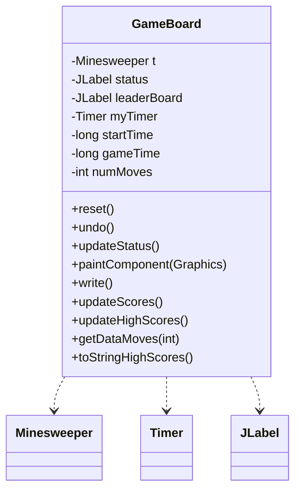
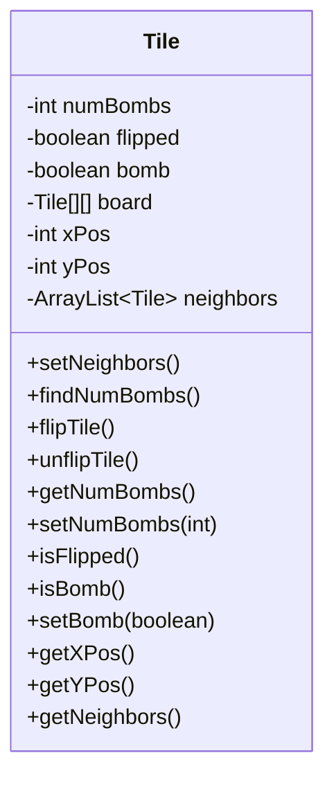
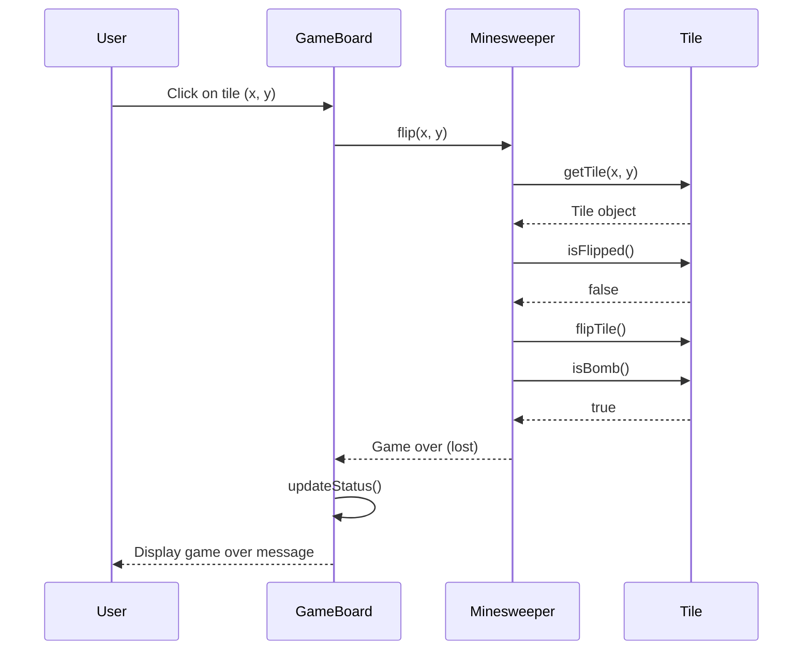

<details>
<summary>Relevant source files</summary>

The following files were used as context for generating this wiki page:

- [Minesweeper.java](https://github.com/aanickode/Minesweeper-Project/blob/main/Minesweeper.java)
- [GameBoard.java](https://github.com/aanickode/Minesweeper-Project/blob/main/GameBoard.java)
- [Tile.java](https://github.com/aanickode/Minesweeper-Project/blob/main/Tile.java)

</details>

# Architecture Overview

## Introduction

The provided source files implement a Minesweeper game, a classic puzzle game where the player aims to uncover all safe tiles on a grid without detonating any hidden mines. The architecture consists of three main components: `Minesweeper`, `GameBoard`, and `Tile`.

- `Minesweeper` is the core game logic class, responsible for managing the game board, tracking game state, and handling tile flipping operations.
- `GameBoard` is the graphical user interface (GUI) component, rendering the game board and handling user interactions.
- `Tile` represents an individual tile on the game board, storing its state (safe or mined) and neighboring tile information.

Sources: [Minesweeper.java](https://github.com/aanickode/Minesweeper-Project/blob/main/Minesweeper.java), [GameBoard.java](https://github.com/aanickode/Minesweeper-Project/blob/main/GameBoard.java), [Tile.java](https://github.com/aanickode/Minesweeper-Project/blob/main/Tile.java)

## Game Board Initialization

The `Minesweeper` class is responsible for initializing the game board, generating mines, and setting up the initial game state.

```mermaid
flowchart TD
    subgraph Minesweeper
        init[Constructor]
        reset[reset()]
        generateBombs[generateBombs()]
        generateBombsForTest[generateBombsForTest()]
    end

    init --> reset
    reset --> generateBombs
    reset --> generateBombsForTest

    subgraph generateBombs
        placeBombs[Place 10 bombs randomly]
        placeSafeTiles[Place remaining safe tiles]
        setNeighbors[Set neighbors for each tile]
        setNumBombs[Set number of bombs for each tile]
    end

    generateBombs --> placeBombs
    placeBombs --> placeSafeTiles
    placeSafeTiles --> setNeighbors
    setNeighbors --> setNumBombs
```

The `generateBombs()` method generates a new 8x8 game board with 10 randomly placed mines and 54 safe tiles. It first places the mines, then fills the remaining tiles as safe tiles. For each tile, it sets the neighboring tiles and calculates the number of adjacent mines.

Sources: [Minesweeper.java:65-126](https://github.com/aanickode/Minesweeper-Project/blob/main/Minesweeper.java#L65-L126)

## Tile Flipping

The `flip()` method in the `Minesweeper` class handles the logic of flipping a tile and updating the game state accordingly.

```mermaid
flowchart TD
    subgraph Minesweeper
        flip[flip(row, col)]
    end

    flip --> checkValidFlip{Is tile valid to flip?}
    checkValidFlip -->|Yes| flipTile[Flip the tile]
    flipTile --> checkBomb{Is the tile a bomb?}
    checkBomb -->|Yes| endGame[End game (lost)]
    checkBomb -->|No| checkNeighbors{Does the tile have no adjacent bombs?}
    checkNeighbors -->|Yes| flipNeighbors[Recursively flip neighboring tiles]
    flipNeighbors --> updateSafeTiles[Decrement safe tiles count]
    updateSafeTiles --> checkWin{Are all safe tiles flipped?}
    checkWin -->|Yes| endGame[End game (won)]
```

The `flip()` method first checks if the tile is valid to flip (not already flipped and the game is not over). If valid, it flips the tile and adds it to the `flipTrack` list for potential undo operations. If the flipped tile is a bomb, the game ends with a loss. Otherwise, if the tile has no adjacent bombs, it recursively flips all neighboring safe tiles. After each flip, it decrements the count of remaining safe tiles. If all safe tiles are flipped, the game ends with a win.

Sources: [Minesweeper.java:27-54](https://github.com/aanickode/Minesweeper-Project/blob/main/Minesweeper.java#L27-L54)

## Undo Flipping

The `unflip()` method in the `Minesweeper` class allows the player to undo the most recent tile flip, but only if the flipped tile was a bomb.

```mermaid
flowchart TD
    subgraph Minesweeper
        unflip[unflip()]
    end

    unflip --> getMostRecentTile[Get the most recently flipped tile]
    getMostRecentTile --> checkFlipped{Is the tile flipped?}
    checkFlipped -->|No| returnFalse[Return false (no tile to unflip)]
    checkFlipped -->|Yes| checkBomb{Is the tile a bomb?}
    checkBomb -->|No| returnFalse[Return false (cannot unflip safe tile)]
    checkBomb -->|Yes| unflipTile[Unflip the tile]
    unflipTile --> removeFromTrack[Remove tile from flipTrack]
    removeFromTrack --> resetGameOver[Reset gameOver to 0 (ongoing game)]
    removeFromTrack --> returnTrue[Return true (unflip successful)]
```

The `unflip()` method retrieves the most recently flipped tile from the `flipTrack` list. If the tile is flipped and is a bomb, it unflips the tile, removes it from the `flipTrack` list, and resets the `gameOver` state to 0 (ongoing game). If the tile is not flipped or is a safe tile, it returns false, indicating an unsuccessful unflip operation.

Sources: [Minesweeper.java:56-71](https://github.com/aanickode/Minesweeper-Project/blob/main/Minesweeper.java#L56-L71)

## Game Board Rendering

The `GameBoard` class is responsible for rendering the game board and handling user interactions.



The `GameBoard` class holds references to the `Minesweeper` game logic, a `Timer` for tracking game time, and `JLabel` components for displaying game status and leaderboard. It provides methods for resetting the game, undoing the last move, updating the game status, rendering the game board, and managing high scores.

Sources: [GameBoard.java](https://github.com/aanickode/Minesweeper-Project/blob/main/GameBoard.java)

## Tile Representation

The `Tile` class represents an individual tile on the game board, storing its state and neighboring tile information.



The `Tile` class stores information about a tile's position, whether it's a bomb or safe, its flipped state, and the number of adjacent bombs. It provides methods for setting and getting tile properties, flipping/unflipping the tile, and finding neighboring tiles and the number of adjacent bombs.

Sources: [Tile.java](https://github.com/aanickode/Minesweeper-Project/blob/main/Tile.java)

## Sequence Diagram: Tile Flipping



This sequence diagram illustrates the flow of interactions when a user clicks on a tile to flip it:

1. The user clicks on a tile at position (x, y) on the `GameBoard`.
2. The `GameBoard` calls the `flip(x, y)` method on the `Minesweeper` instance.
3. The `Minesweeper` retrieves the `Tile` object at the given position.
4. The `Minesweeper` checks if the `Tile` is already flipped and if the game is not over.
5. If valid, the `Minesweeper` flips the `Tile` and checks if it's a bomb.
6. If the `Tile` is a bomb, the `Minesweeper` notifies the `GameBoard` that the game is over (lost).
7. The `GameBoard` updates the game status and displays the game over message to the user.

Sources: [Minesweeper.java:27-54](https://github.com/aanickode/Minesweeper-Project/blob/main/Minesweeper.java#L27-L54), [GameBoard.java:60-73](https://github.com/aanickode/Minesweeper-Project/blob/main/GameBoard.java#L60-L73)

## Conclusion

The Minesweeper game architecture follows a modular design, separating the game logic, user interface, and tile representation into distinct components. The `Minesweeper` class manages the core game logic, including board initialization, tile flipping, and game state tracking. The `GameBoard` class handles user interactions, rendering the game board, and managing game timers and high scores. The `Tile` class encapsulates the state and properties of individual tiles on the game board.

This architecture allows for clear separation of concerns and facilitates maintainability and extensibility of the codebase. The use of object-oriented principles and modular design promotes code reusability and testability.

Sources: [Minesweeper.java](https://github.com/aanickode/Minesweeper-Project/blob/main/Minesweeper.java), [GameBoard.java](https://github.com/aanickode/Minesweeper-Project/blob/main/GameBoard.java), [Tile.java](https://github.com/aanickode/Minesweeper-Project/blob/main/Tile.java)