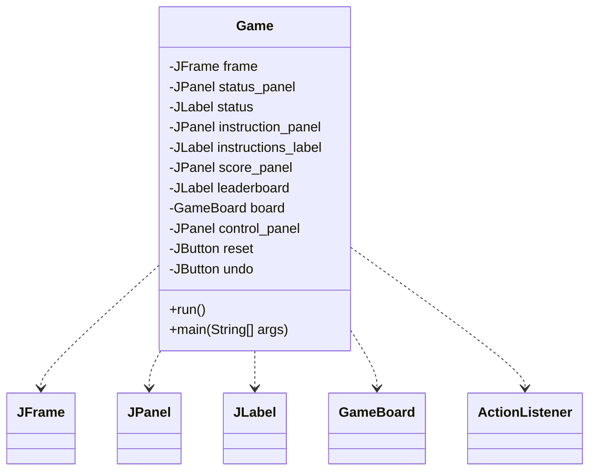
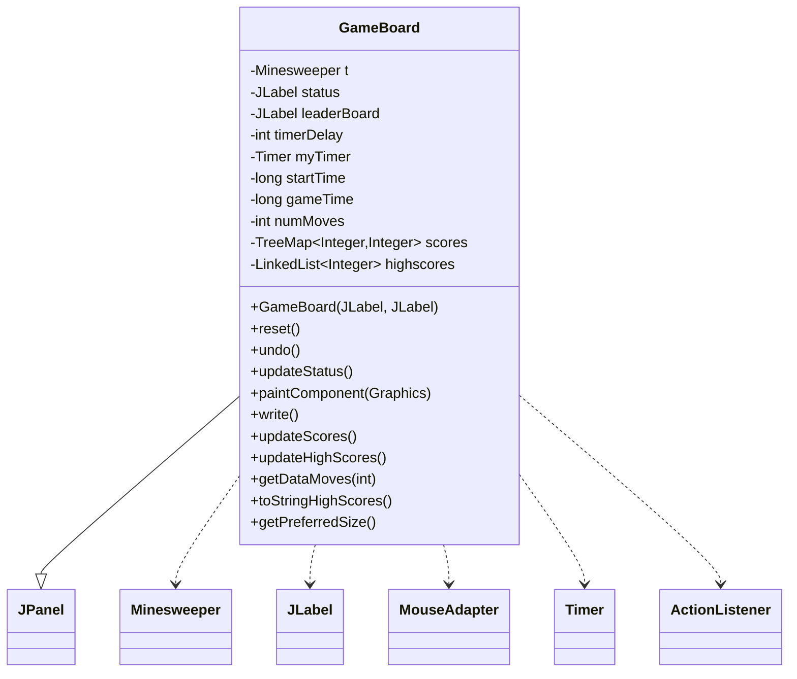
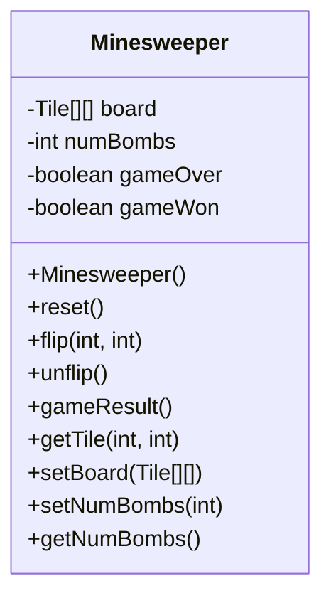
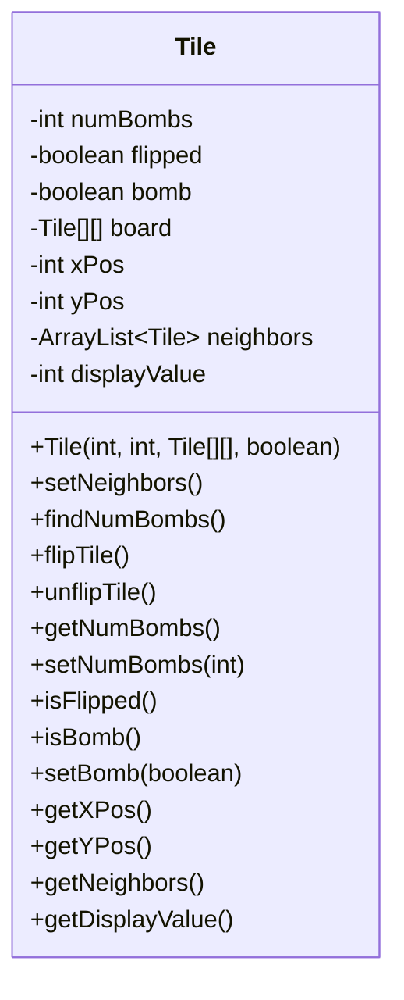
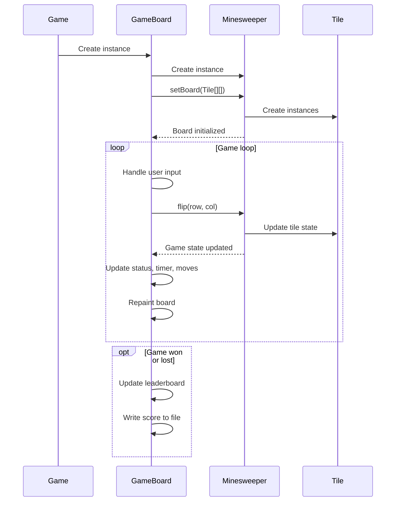

Relevant source files

The following files were used as context for generating this wiki page:

- [Game.java](https://github.com/aanickode/Minesweeper-Project/blob/main/Game.java)
- [GameBoard.java](https://github.com/aanickode/Minesweeper-Project/blob/main/GameBoard.java)
- [Tile.java](https://github.com/aanickode/Minesweeper-Project/blob/main/Tile.java)
- [Minesweeper.java](https://github.com/aanickode/Minesweeper-Project/blob/main/Minesweeper.java)
- [Files/FastestTime.txt](https://github.com/aanickode/Minesweeper-Project/blob/main/Files/FastestTime.txt)

# Class Hierarchy

## Introduction

The provided source files implement a Minesweeper game using Java Swing for the graphical user interface (GUI). The game follows the classic Minesweeper rules, where the player must uncover all non-mine tiles on a grid without detonating any mines. The project utilizes a Model-View-Controller (MVC) architecture pattern to separate the game logic, user interface, and control flow.

The key classes involved in the class hierarchy are:

- `Game`: Responsible for setting up the top-level frame and GUI components, including the game board, status panel, and control buttons.
- `GameBoard`: Handles the game board rendering, user input (mouse clicks), and game state updates.
- `Minesweeper`: Represents the game model, managing the game board, tile states, and game logic.
- `Tile`: Encapsulates the state and behavior of individual tiles on the game board.

Sources: [Game.java](https://github.com/aanickode/Minesweeper-Project/blob/main/Game.java), [GameBoard.java](https://github.com/aanickode/Minesweeper-Project/blob/main/GameBoard.java), [Minesweeper.java](https://github.com/aanickode/Minesweeper-Project/blob/main/Minesweeper.java), [Tile.java](https://github.com/aanickode/Minesweeper-Project/blob/main/Tile.java)

## Game Class

The `Game` class is the entry point of the application and sets up the main game window and GUI components. It follows the `Runnable` interface and is responsible for creating the top-level `JFrame`, along with various panels and labels for displaying the game board, status, instructions, and leaderboard.

The `run()` method sets up the GUI components, including the `GameBoard` instance, and adds action listeners to the "Reset" and "Undo" buttons. The `main()` method is the entry point of the application, invoking the `Game` instance on the Swing event dispatch thread.

Sources: [Game.java](https://github.com/aanickode/Minesweeper-Project/blob/main/Game.java)

## GameBoard Class

The `GameBoard` class extends `JPanel` and serves as the main game board component. It handles rendering the game board, processing user input (mouse clicks), updating the game state, and managing the game timer and move counter.

The `GameBoard` class has the following key responsibilities:

- Initializing the `Minesweeper` model instance (`t`) and setting up event listeners for mouse clicks and timer updates.
- Handling user input (mouse clicks) by updating the game model and repaint the board.
- Managing the game timer and move counter.
- Rendering the game board, including the grid, tiles, and game status.
- Resetting the game and updating the leaderboard.
- Providing an "Undo" functionality to revert the last move.
- Reading and writing game scores to a file (`FastestTime.txt`).
- Updating and displaying the leaderboard with the top 5 scores.

Sources: [GameBoard.java](https://github.com/aanickode/Minesweeper-Project/blob/main/GameBoard.java), [Files/FastestTime.txt](https://github.com/aanickode/Minesweeper-Project/blob/main/Files/FastestTime.txt)

## Minesweeper Class

The `Minesweeper` class represents the game model and encapsulates the game logic and board state. It manages the game board, tile states, and determines the game outcome.

The `Minesweeper` class has the following key responsibilities:

- Initializing the game board with tiles and randomly placing mines.
- Handling tile flips (revealing tiles) based on user input.
- Providing an "Undo" functionality to revert the last tile flip.
- Determining the game outcome (win, lose, or ongoing).
- Resetting the game board and state for a new game.

Sources: [Minesweeper.java](https://github.com/aanickode/Minesweeper-Project/blob/main/Minesweeper.java)

## Tile Class

The `Tile` class represents an individual tile on the game board. It encapsulates the tile's state, such as whether it's a mine, flipped, or the number of adjacent mines.

The `Tile` class has the following key responsibilities:

- Storing and managing the tile's state (mine, flipped, number of adjacent mines).
- Identifying and storing neighboring tiles.
- Calculating the number of adjacent mines for non-mine tiles.
- Providing methods to flip/unflip the tile and access its state.

Sources: [Tile.java](https://github.com/aanickode/Minesweeper-Project/blob/main/Tile.java)

## Data Flow

The data flow in the Minesweeper game follows the Model-View-Controller (MVC) architecture pattern:

1. The `Game` class sets up the main window and GUI components, including the `GameBoard` instance.
2. The `GameBoard` class initializes the `Minesweeper` model instance and sets up event listeners for user input (mouse clicks) and timer updates.
3. When the user clicks on a tile, the `GameBoard` class updates the `Minesweeper` model by calling the `flip()` method with the tile coordinates.
4. The `Minesweeper` class updates the game board state and tile states based on the user input.
5. The `GameBoard` class updates the game status, move counter, and timer, and repaints the game board to reflect the updated state.
6. If the game is won or lost, the `GameBoard` class updates the leaderboard and writes the game score to the `FastestTime.txt` file.

Sources: [Game.java](https://github.com/aanickode/Minesweeper-Project/blob/main/Game.java), [GameBoard.java](https://github.com/aanickode/Minesweeper-Project/blob/main/GameBoard.java), [Minesweeper.java](https://github.com/aanickode/Minesweeper-Project/blob/main/Minesweeper.java), [Tile.java](https://github.com/aanickode/Minesweeper-Project/blob/main/Tile.java)

## Conclusion

The Minesweeper game project follows a well-structured class hierarchy and adheres to the Model-View-Controller (MVC) architecture pattern. The separation of concerns between the game logic (`Minesweeper`), user interface (`GameBoard` and `Game`), and individual tile state (`Tile`) promotes code organization, maintainability, and extensibility. The project also incorporates features like a leaderboard, game timer, and move counter to enhance the user experience.