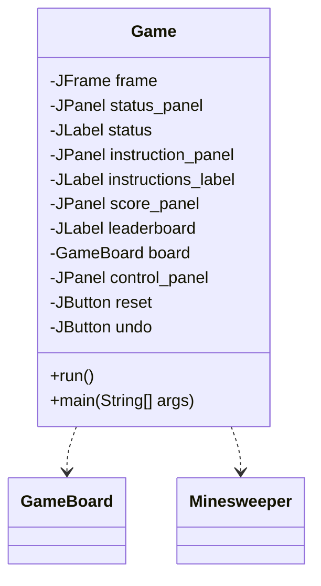
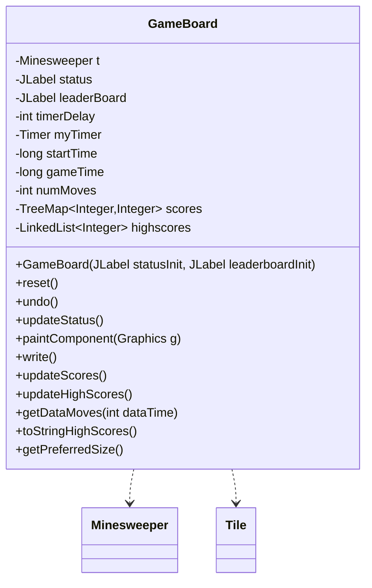
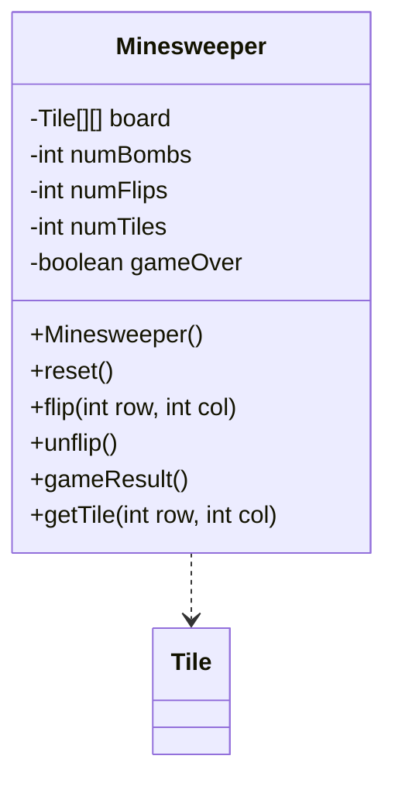
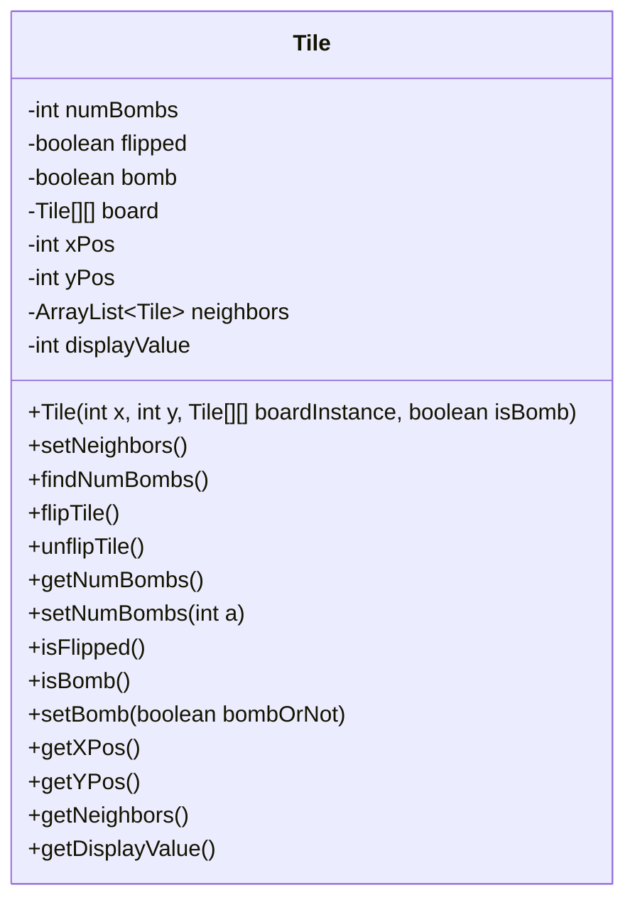
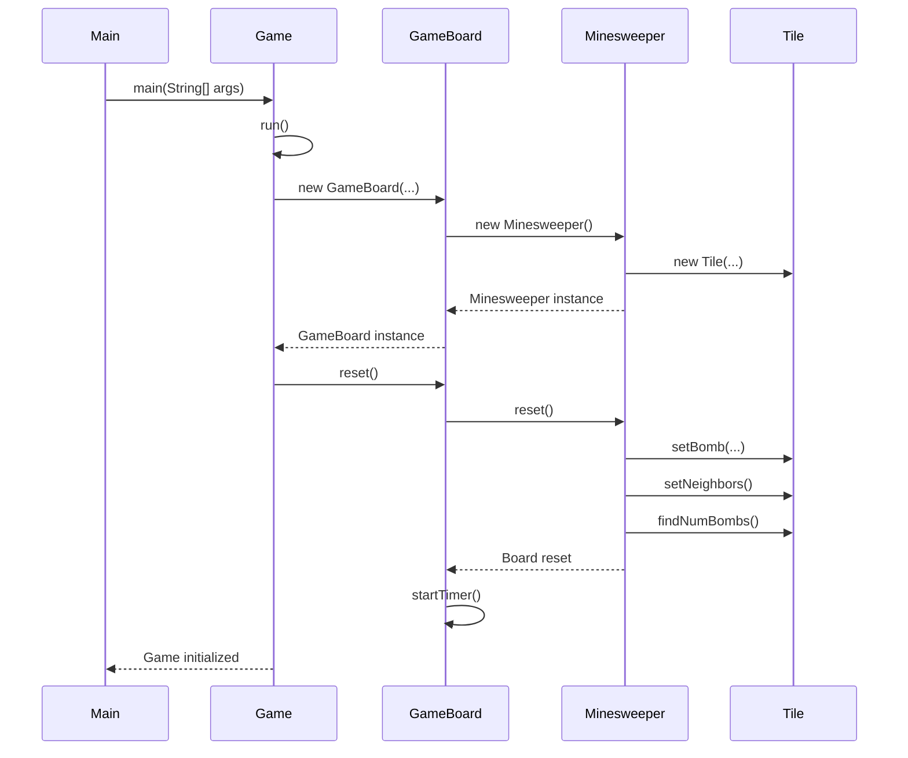
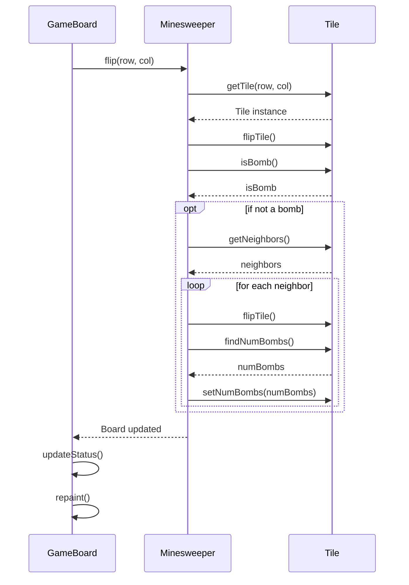

Relevant source files

The following files were used as context for generating this wiki page:

- [Game.java](https://github.com/aanickode/Minesweeper-Project/blob/main/Game.java)
- [GameBoard.java](https://github.com/aanickode/Minesweeper-Project/blob/main/GameBoard.java)
- [Tile.java](https://github.com/aanickode/Minesweeper-Project/blob/main/Tile.java)
- [Minesweeper.java](https://github.com/aanickode/Minesweeper-Project/blob/main/Minesweeper.java)

# Class Hierarchy

## Introduction

The provided source files implement a Minesweeper game using Java Swing for the graphical user interface (GUI). The game follows the classic Minesweeper rules, where the player must uncover all non-mine tiles on a grid while avoiding mines. The class hierarchy consists of several key components that work together to create the game's functionality and user experience.

The main classes involved are:

- [`Game`](#game-class): Responsible for setting up the top-level frame and GUI components, including the game board, status panel, and control buttons.
- [`GameBoard`](#gameboard-class): Handles the game board rendering, mouse input, and game logic integration.
- [`Minesweeper`](#minesweeper-class): Represents the game model, managing the board state, tile flipping, and win/loss conditions.
- [`Tile`](#tile-class): Encapsulates the state and behavior of individual tiles on the game board.

Additionally, the project includes functionality for tracking high scores and providing an undo feature.

Sources: [Game.java](https://github.com/aanickode/Minesweeper-Project/blob/main/Game.java), [GameBoard.java](https://github.com/aanickode/Minesweeper-Project/blob/main/GameBoard.java), [Minesweeper.java](https://github.com/aanickode/Minesweeper-Project/blob/main/Minesweeper.java), [Tile.java](https://github.com/aanickode/Minesweeper-Project/blob/main/Tile.java)

## Game Class

The `Game` class is the entry point of the application and sets up the top-level frame and GUI components. It follows the Model-View-Controller (MVC) design pattern, where `Game` acts as the controller, initializing the view (`GameBoard`) and the model (`Minesweeper`).

The `run()` method sets up the main window, creates the game board, status panel, instructions panel, score panel, and control buttons (reset and undo). It also adds action listeners to the reset and undo buttons, which call the corresponding methods in the `GameBoard` class.

Sources: [Game.java](https://github.com/aanickode/Minesweeper-Project/blob/main/Game.java)

## GameBoard Class

The `GameBoard` class is responsible for rendering the game board, handling mouse input, and integrating with the game model (`Minesweeper`). It extends the `JPanel` class and implements the game logic and user interface.

The `GameBoard` class has the following key responsibilities:

- Initializing the game model (`Minesweeper`) and setting up mouse listeners for user input.
- Rendering the game board, including the grid, tiles, and game status.
- Handling game reset, undo, and status updates.
- Managing the game timer and move counter.
- Implementing high score tracking and file I/O operations.

The `paintComponent()` method is responsible for drawing the game board, including the grid lines, revealed tiles, and bomb markers.

Sources: [GameBoard.java](https://github.com/aanickode/Minesweeper-Project/blob/main/GameBoard.java)

## Minesweeper Class

The `Minesweeper` class represents the game model and manages the board state, tile flipping, and win/loss conditions.

The `Minesweeper` class has the following responsibilities:

- Initializing the game board with tiles and randomly placed bombs.
- Handling tile flipping and updating the board state accordingly.
- Determining the game result (win, loss, or ongoing) based on the board state.
- Providing access to individual tiles on the board.
- Resetting the game to its initial state.

The `flip()` method is responsible for revealing a tile and propagating the reveal to neighboring tiles if the clicked tile is not a bomb. The `unflip()` method allows undoing the last move.

Sources: [Minesweeper.java](https://github.com/aanickode/Minesweeper-Project/blob/main/Minesweeper.java)

## Tile Class

The `Tile` class represents an individual tile on the game board and encapsulates its state and behavior.

The `Tile` class has the following responsibilities:

- Storing the tile's state, including whether it is a bomb, flipped, and the number of neighboring bombs.
- Providing methods to flip/unflip the tile and set its bomb state.
- Calculating the number of neighboring bombs for non-bomb tiles.
- Maintaining a list of neighboring tiles for efficient neighbor calculations.

The `setNeighbors()` method populates the list of neighboring tiles, and `findNumBombs()` calculates the number of neighboring bombs for non-bomb tiles.

Sources: [Tile.java](https://github.com/aanickode/Minesweeper-Project/blob/main/Tile.java)

## Sequence Diagram: Game Initialization

The sequence diagram illustrates the initialization process of the Minesweeper game:

1. The `main()` method in the `Main` class is executed, which creates an instance of the `Game` class and calls its `run()` method.
2. The `Game` class creates an instance of the `GameBoard` class, passing in the necessary UI components.
3. The `GameBoard` constructor creates an instance of the `Minesweeper` class, which represents the game model.
4. The `Minesweeper` class creates instances of the `Tile` class to represent individual tiles on the game board.
5. The `Minesweeper` instance is returned to the `GameBoard`.
6. The `GameBoard` instance is returned to the `Game` class.
7. The `Game` class calls the `reset()` method on the `GameBoard` to initialize the game.
8. The `GameBoard` calls the `reset()` method on the `Minesweeper` instance.
9. The `Minesweeper` class sets up the game board by creating tiles, placing bombs, and calculating neighboring bomb counts for each tile.
10. The `GameBoard` starts the game timer and updates the UI.
11. The game is now initialized and ready to be played.

Sources: [Game.java](https://github.com/aanickode/Minesweeper-Project/blob/main/Game.java), [GameBoard.java](https://github.com/aanickode/Minesweeper-Project/blob/main/GameBoard.java), [Minesweeper.java](https://github.com/aanickode/Minesweeper-Project/blob/main/Minesweeper.java), [Tile.java](https://github.com/aanickode/Minesweeper-Project/blob/main/Tile.java)

## Sequence Diagram: Tile Flipping

The sequence diagram illustrates the process of flipping a tile on the game board:

1. The `GameBoard` class receives a mouse click event and calls the `flip()` method on the `Minesweeper` instance, passing the row and column of the clicked tile.
2. The `Minesweeper` class retrieves the `Tile` instance at the specified row and column using the `getTile()` method.
3. The `Minesweeper` class calls the `flipTile()` method on the retrieved `Tile` instance to flip it.
4. The `Minesweeper` class checks if the flipped tile is a bomb by calling the `isBomb()` method on the `Tile` instance.
5. If the flipped tile is not a bomb, the following steps are executed:
   - The `Minesweeper` class retrieves the list of neighboring tiles by calling the `getNeighbors()` method on the `Tile` instance.
   - For each neighboring tile, the `Minesweeper` class calls the `flipTile()` method to reveal the neighbor.
   - The `Minesweeper` class calculates the number of neighboring bombs for each revealed neighbor by calling the `findNumBombs()` method on the `Tile` instance.
   - The `Minesweeper` class updates the number of neighboring bombs for each revealed neighbor by calling the `setNumBombs()` method on the `Tile` instance.
6. The `Minesweeper` class returns the updated board state to the `GameBoard` class.
7. The `GameBoard` class updates the game status by calling the `updateStatus()` method.
8. The `GameBoard` class repaints the game board by calling the `repaint()` method, which triggers the `paintComponent()` method to redraw the board with the updated tile states.

Sources: [GameBoard.java](https://github.com/aanickode/Minesweeper-Project/blob/main/GameBoard.java), [Minesweeper.java](https://github.com/aanickode/Minesweeper-Project/blob/main/Minesweeper.java), [Tile.java](https://github.com/aanickode/Minesweeper-Project/blob/main/Tile.java)

## Conclusion

The Minesweeper game implementation follows a modular design with clear separation of concerns. The `Game` class acts as the controller, setting up the GUI and handling user interactions. The `GameBoard` class manages the game board rendering and integrates with the `Minesweeper` class, which represents the game model. The `Tile` class encapsulates the state and behavior of individual tiles on the board.

The class hierarchy and interactions between the components allow for efficient game logic implementation, board rendering, and user input handling. The use of the MVC pattern promotes code organization and maintainability, making it easier to extend or modify the game's functionality in the future.

Sources: [Game.java](https://github.com/aanickode/Minesweeper-Project/blob/main/Game.java), [GameBoard.java](https://github.com/aanickode/Minesweeper-Project/blob/main/GameBoard.java), [Minesweeper.java](https://github.com/aanickode/Minesweeper-Project/blob/main/Minesweeper.java), [Tile.java](https://github.com/aanickode/Minesweeper-Project/blob/main/Tile.java)