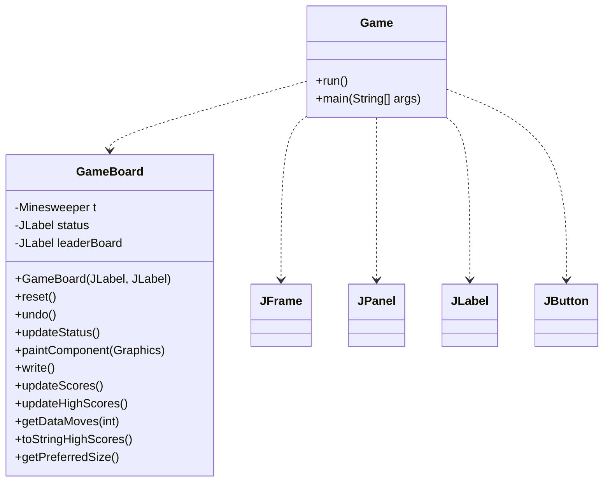
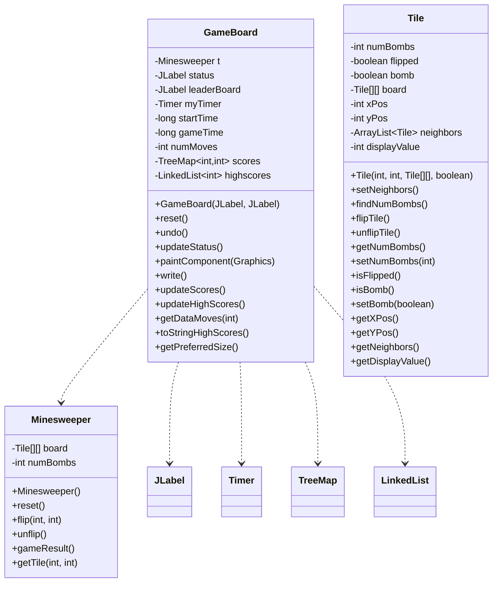
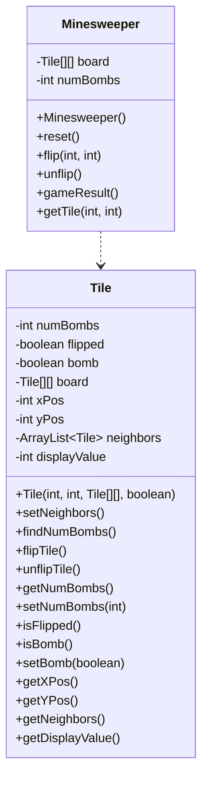
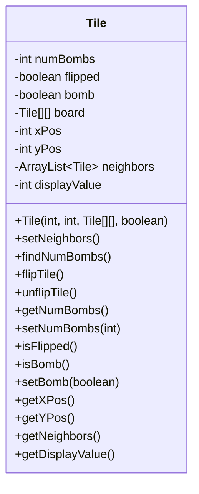
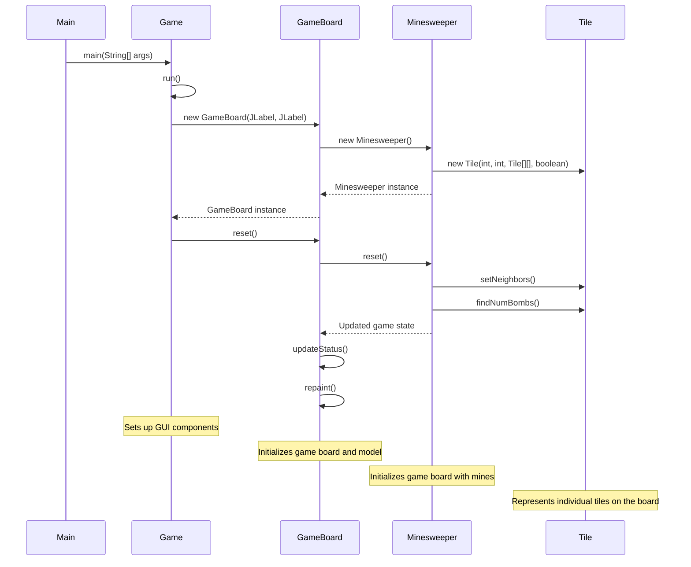
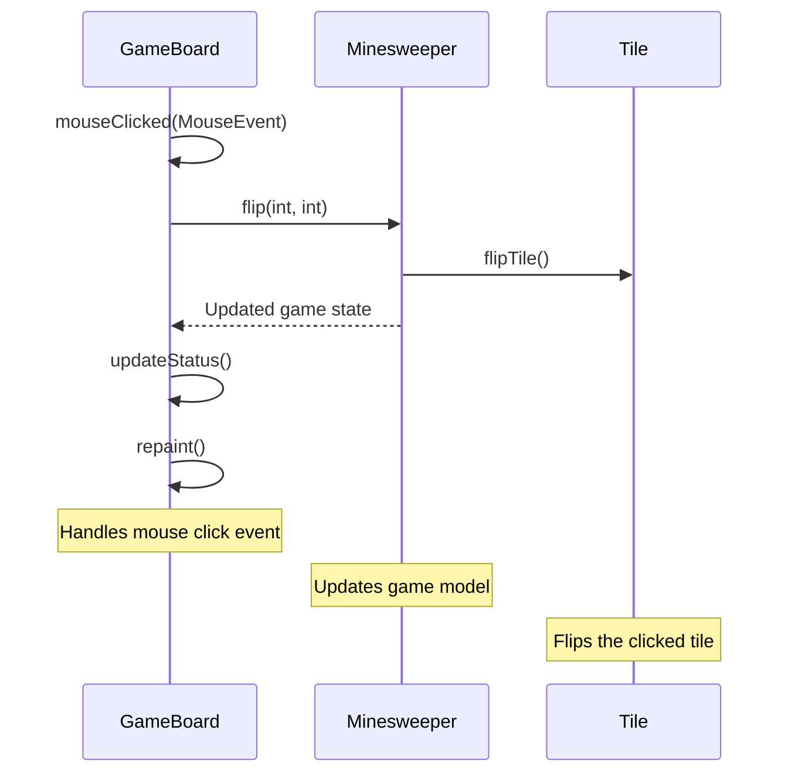
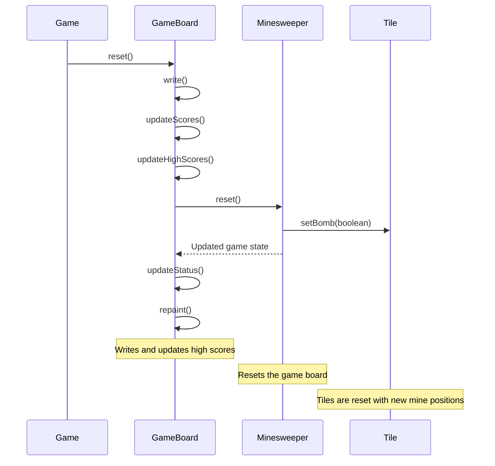
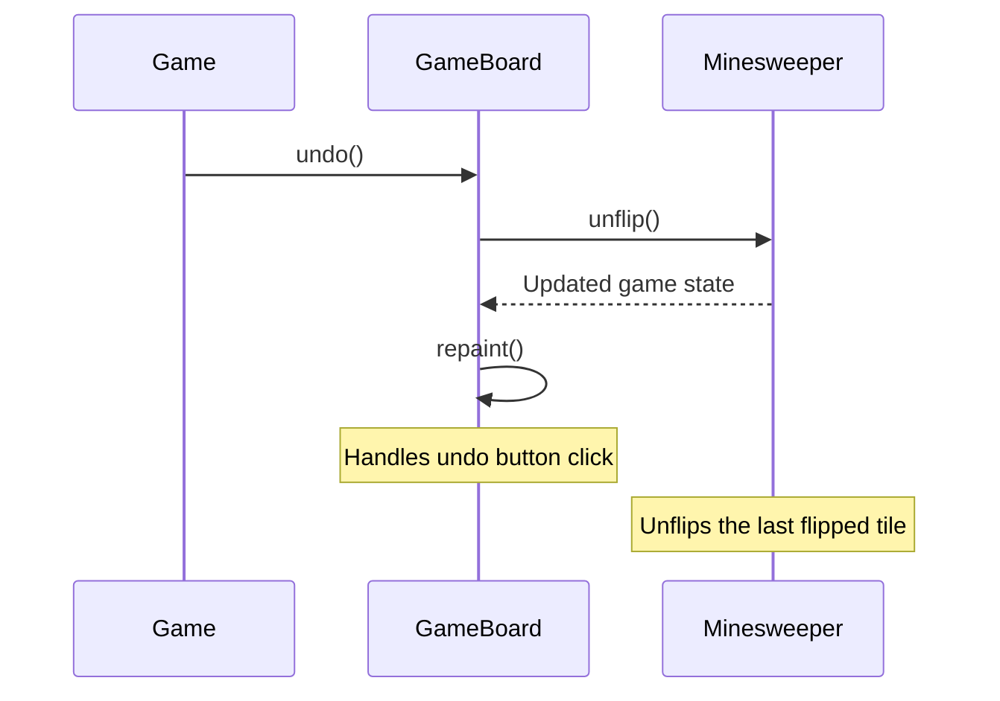

Relevant source files

The following files were used as context for generating this wiki page:

- [Game.java](https://github.com/aanickode/Minesweeper-Project/blob/main/Game.java)
- [GameBoard.java](https://github.com/aanickode/Minesweeper-Project/blob/main/GameBoard.java)
- [Tile.java](https://github.com/aanickode/Minesweeper-Project/blob/main/Tile.java)
- [Minesweeper.java](https://github.com/aanickode/Minesweeper-Project/blob/main/Minesweeper.java)
- [Files/FastestTime.txt](https://github.com/aanickode/Minesweeper-Project/blob/main/Files/FastestTime.txt)

# Class Hierarchy

## Introduction

The provided source files implement a Minesweeper game with a graphical user interface (GUI). The game follows the classic Minesweeper rules, where the player must uncover all non-mine tiles on a grid without detonating any mines. The project utilizes a Model-View-Controller (MVC) architecture, separating the game logic, user interface, and control flow into distinct components.

The core classes involved in the class hierarchy are:

- [`Game`](#game-class): Initializes the GUI components and sets up the game.
- [`GameBoard`](#gameboard-class): Handles the game board rendering, user input, and game state management.
- [`Minesweeper`](#minesweeper-class): Represents the game model, managing the game board and game logic.
- [`Tile`](#tile-class): Represents an individual tile on the game board, storing its state and neighboring information.

Additionally, the project utilizes a file (`FastestTime.txt`) to store and retrieve high scores.

Sources: [Game.java](), [GameBoard.java](), [Minesweeper.java](), [Tile.java](), [Files/FastestTime.txt]()

## Game Class

The `Game` class is responsible for setting up the top-level frame and widgets for the GUI. It follows the Model-View-Controller (MVC) design pattern, where it initializes the view components and instantiates the `GameBoard` class, which handles the rest of the game's view and controller functionality.

The `Game` class sets up the following components:

- Top-level `JFrame` for the game window.
- `JPanel` for displaying the game status.
- `JLabel` for displaying game instructions.
- `JPanel` for displaying the high scores leaderboard.
- `GameBoard` instance for rendering the game board and handling user interactions.
- `JPanel` with `JButton`s for resetting and undoing moves in the game.

The `run()` method initializes and sets up the GUI components, while the `main()` method is the entry point for the application.

Sources: [Game.java]()

## GameBoard Class

The `GameBoard` class is a subclass of `JPanel` and serves as the main controller and view component for the Minesweeper game. It handles rendering the game board, processing user input, updating the game state, and managing the game timer and high scores.

The `GameBoard` class has the following responsibilities:

1. **Initializing the Game Model**: It creates an instance of the `Minesweeper` class, which represents the game model.
2. **Rendering the Game Board**: The `paintComponent()` method draws the game board grid and updates the visual representation of the tiles based on their state (e.g., uncovered, flagged, or containing a number).
3. **Processing User Input**: It listens for mouse clicks on the game board and updates the game model accordingly by calling the `flip()` method of the `Minesweeper` class.
4. **Updating Game Status**: The `updateStatus()` method updates the game status label based on the current game state (e.g., win, lose, or ongoing).
5. **Game Timer**: It manages a timer that tracks the elapsed time since the start of the game.
6. **Move Counter**: It keeps track of the number of moves made by the player.
7. **Reset and Undo**: It provides functionality to reset the game or undo the last move.
8. **High Scores Management**: It reads and writes high scores to a file (`FastestTime.txt`) and maintains a leaderboard of the top 5 scores.

The `GameBoard` class interacts with the `Minesweeper` class to update the game model and retrieve the current game state. It also utilizes various Java Swing components (`JLabel`, `Timer`) and data structures (`TreeMap`, `LinkedList`) to manage the game UI, timer, and high scores.

Sources: [GameBoard.java](), [Minesweeper.java](), [Tile.java]()

## Minesweeper Class

The `Minesweeper` class represents the game model and encapsulates the game logic for the Minesweeper game. It manages the game board, tile states, and game rules.

The `Minesweeper` class has the following responsibilities:

1. **Game Board Initialization**: It creates a 2D array of `Tile` objects, representing the game board, and initializes the board with a fixed number of mines (10 in this implementation).
2. **Game Reset**: The `reset()` method resets the game board to its initial state, placing mines randomly on the board.
3. **Tile Flipping**: The `flip()` method flips a tile at the specified coordinates, revealing its state (mine or number of adjacent mines).
4. **Tile Unflipping**: The `unflip()` method unflips the last flipped tile, allowing the player to undo their previous move.
5. **Game Result Evaluation**: The `gameResult()` method evaluates the current game state and returns an integer value indicating whether the game is won (1), lost (-1), or ongoing (0).
6. **Tile Retrieval**: The `getTile()` method retrieves a specific `Tile` object from the game board based on its row and column coordinates.

The `Minesweeper` class collaborates with the `Tile` class to manage the state of individual tiles on the game board.

Sources: [Minesweeper.java](), [Tile.java]()

## Tile Class

The `Tile` class represents an individual tile on the Minesweeper game board. It encapsulates the state and properties of a tile, such as whether it is a mine, the number of adjacent mines, and its position on the board.

The `Tile` class has the following responsibilities:

1. **Tile Initialization**: The constructor `Tile(int, int, Tile[][], boolean)` initializes a tile with its position on the board (`xPos`, `yPos`), a reference to the game board (`board`), and whether it is a mine (`bomb`).
2. **Neighbor Identification**: The `setNeighbors()` method identifies and stores the neighboring tiles for a given tile.
3. **Adjacent Mine Counting**: The `findNumBombs()` method counts the number of adjacent mines for a tile.
4. **Tile Flipping and Unflipping**: The `flipTile()` and `unflipTile()` methods flip or unflip the tile, respectively, updating its `flipped` state.
5. **Tile State Retrieval**: Various getter methods (`getNumBombs()`, `isFlipped()`, `isBomb()`, `getXPos()`, `getYPos()`, `getNeighbors()`, `getDisplayValue()`) provide access to the tile's state and properties.
6. **Tile State Modification**: The `setNumBombs()` and `setBomb()` methods allow modifying the tile's state, such as setting the number of adjacent mines or marking it as a mine.

The `Tile` class is used by the `Minesweeper` class to represent and manage the individual tiles on the game board.

Sources: [Tile.java]()

## Sequence Diagrams

### Game Initialization

Sources: [Game.java](), [GameBoard.java](), [Minesweeper.java](), [Tile.java]()

### Tile Flipping

Sources: [GameBoard.java](), [Minesweeper.java](), [Tile.java]()

### Game Reset

Sources: [Game.java](), [GameBoard.java](), [Minesweeper.java](), [Tile.java]()

### Undo Move

Sources: [Game.java](), [GameBoard.java](), [Minesweeper.java]()

## Tables

### Tile State

| Property | Type | Description |
| --- | --- | --- |
| `numBombs` | `int` | The number of adjacent mines around the tile. |
| `flipped` | `boolean` | Indicates whether the tile is flipped (revealed) or not. |
| `bomb` | `boolean` | Indicates whether the tile is a mine or not. |
| `board` | `Tile[][]` | A reference to the game board. |
| `xPos`