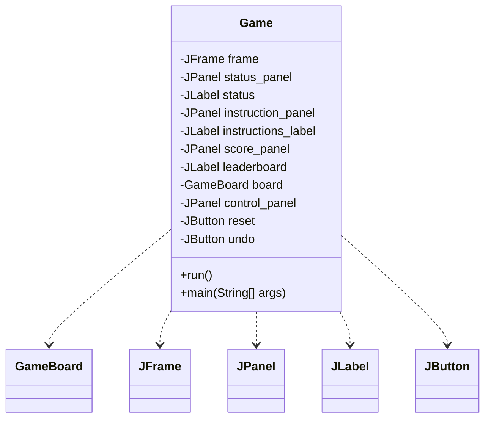
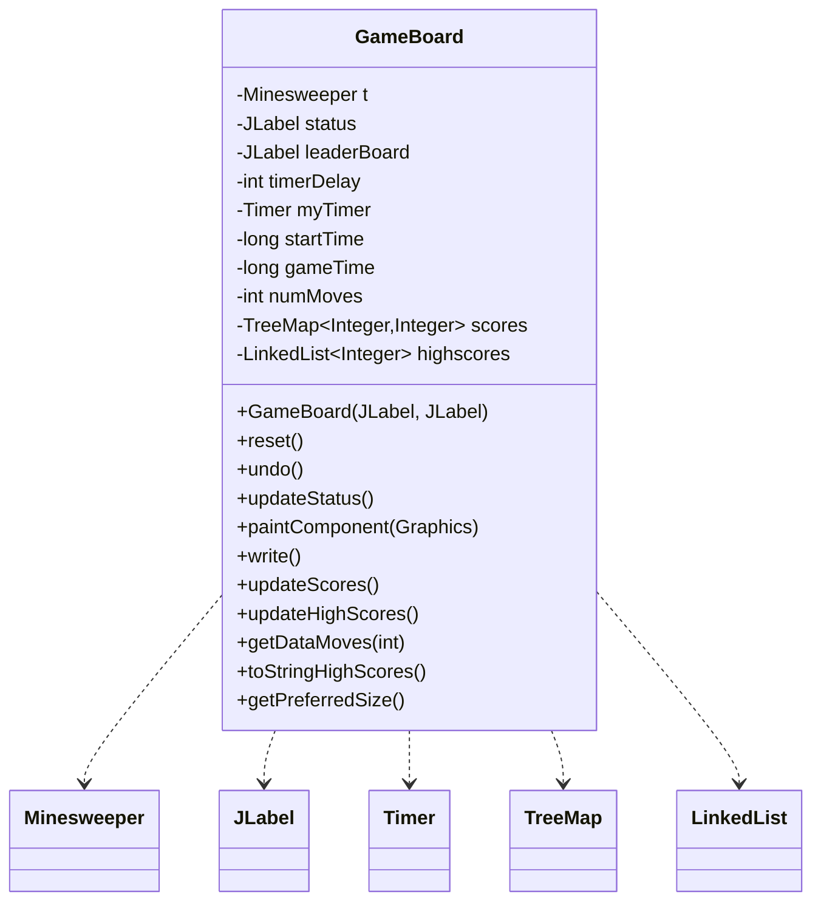
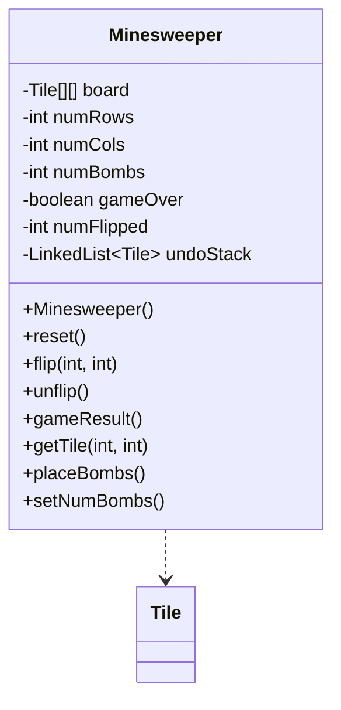
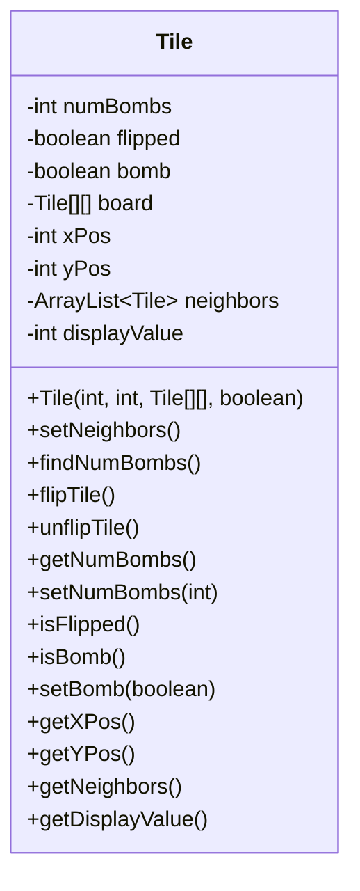
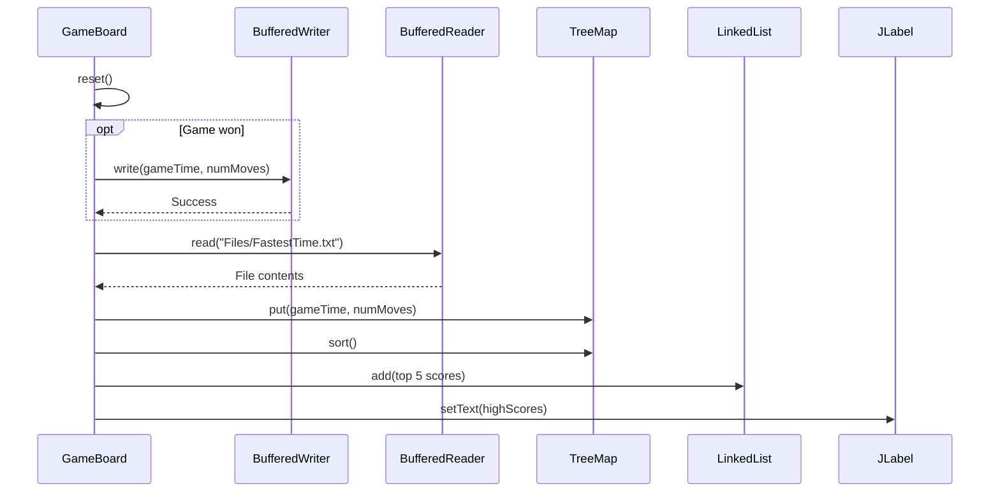
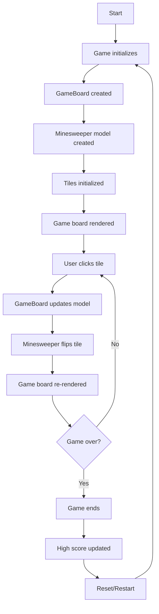

Relevant source files

The following files were used as context for generating this wiki page:

- [Game.java](https://github.com/aanickode/Minesweeper-Project/blob/main/Game.java)
- [GameBoard.java](https://github.com/aanickode/Minesweeper-Project/blob/main/GameBoard.java)
- [Tile.java](https://github.com/aanickode/Minesweeper-Project/blob/main/Tile.java)
- [Minesweeper.java](https://github.com/aanickode/Minesweeper-Project/blob/main/Minesweeper.java)
- [Files/FastestTime.txt](https://github.com/aanickode/Minesweeper-Project/blob/main/Files/FastestTime.txt)

# Class Hierarchy

## Introduction

The provided source files implement a Minesweeper game, a classic puzzle game where the objective is to uncover all non-mine tiles on a grid without detonating any mines. The game follows a Model-View-Controller (MVC) architecture pattern, separating the game logic, user interface, and control flow into distinct components.

The core classes involved in the class hierarchy are:

- `Game`: Responsible for setting up the game window, UI components, and initializing the `GameBoard`.
- `GameBoard`: Handles the game board rendering, user input, and game state management. It interacts with the `Minesweeper` model.
- `Minesweeper`: Represents the game model, managing the game board, tile states, and game logic.
- `Tile`: Represents an individual tile on the game board, tracking its state (flipped, bomb, neighbors, etc.).

Additionally, there is a `Files/FastestTime.txt` file used to store and retrieve high scores.

## Game Class

The `Game` class is the entry point of the application and sets up the main game window and UI components. It follows the MVC pattern by initializing the view (`JFrame`, `JPanel`, `JLabel`, etc.) and instantiating the `GameBoard` controller.

Sources: [Game.java](https://github.com/aanickode/Minesweeper-Project/blob/main/Game.java)

## GameBoard Class

The `GameBoard` class acts as the controller in the MVC pattern, handling user input (mouse clicks), updating the game model (`Minesweeper`), and rendering the game board. It also manages the game timer, move count, and high score functionality.

Sources: [GameBoard.java](https://github.com/aanickode/Minesweeper-Project/blob/main/GameBoard.java)

## Minesweeper Class

The `Minesweeper` class represents the game model, managing the game board, tile states, and game logic. It is responsible for initializing the game board, placing mines, flipping tiles, and determining the game result.

Sources: [Minesweeper.java](https://github.com/aanickode/Minesweeper-Project/blob/main/Minesweeper.java)

## Tile Class

The `Tile` class represents an individual tile on the game board, tracking its state (flipped, bomb, neighbors, etc.) and providing methods to manipulate its state.

Sources: [Tile.java](https://github.com/aanickode/Minesweeper-Project/blob/main/Tile.java)

## High Score Management

The `GameBoard` class also handles high score management by reading and writing game scores to the `Files/FastestTime.txt` file. The scores are stored in a `TreeMap` with the time taken to win as the key and the number of moves as the value. The top 5 scores are displayed in the game window.

Sources: [GameBoard.java:write()](https://github.com/aanickode/Minesweeper-Project/blob/main/GameBoard.java#L193-L204), [GameBoard.java:updateScores()](https://github.com/aanickode/Minesweeper-Project/blob/main/GameBoard.java#L206-L241), [GameBoard.java:updateHighScores()](https://github.com/aanickode/Minesweeper-Project/blob/main/GameBoard.java#L243-L259), [GameBoard.java:toStringHighScores()](https://github.com/aanickode/Minesweeper-Project/blob/main/GameBoard.java#L271-L277)

## Game Flow

The overall game flow can be summarized as follows:

Sources: [Game.java](https://github.com/aanickode/Minesweeper-Project/blob/main/Game.java), [GameBoard.java](https://github.com/aanickode/Minesweeper-Project/blob/main/GameBoard.java), [Minesweeper.java](https://github.com/aanickode/Minesweeper-Project/blob/main/Minesweeper.java), [Tile.java](https://github.com/aanickode/Minesweeper-Project/blob/main/Tile.java)

## Conclusion

The Minesweeper game implementation follows a well-structured MVC architecture, separating concerns between the game logic, user interface, and control flow. The `Game` class sets up the UI, the `GameBoard` handles user input and rendering, the `Minesweeper` class manages the game model, and the `Tile` class represents individual tiles on the board. The high score functionality is also integrated into the `GameBoard` class, persisting and retrieving scores from a file.