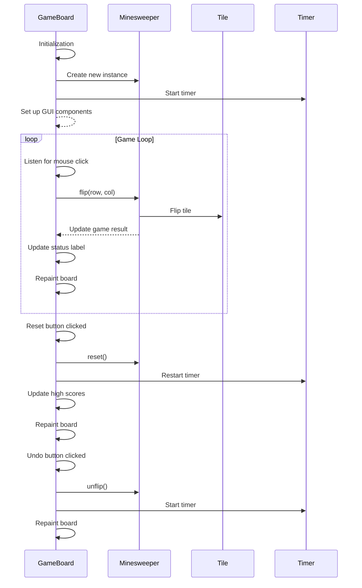
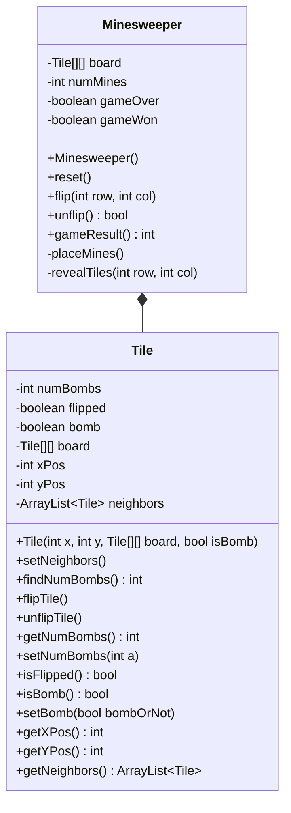
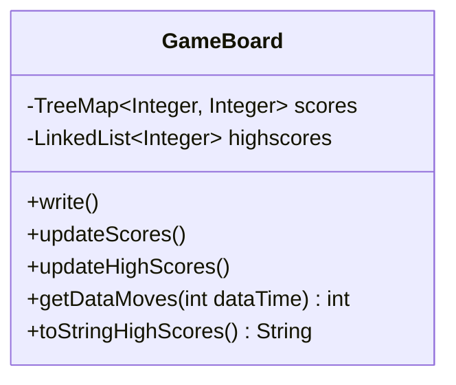
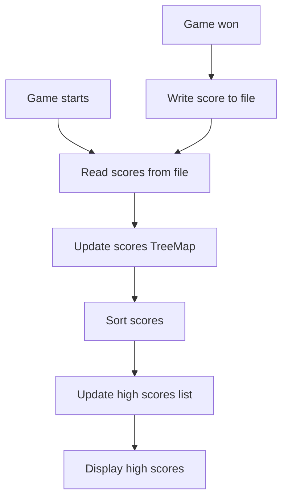

Relevant source files

The following files were used as context for generating this wiki page:

- [Game.java](https://github.com/aanickode/Minesweeper-Project/blob/main/Game.java)
- [GameBoard.java](https://github.com/aanickode/Minesweeper-Project/blob/main/GameBoard.java)
- [Tile.java](https://github.com/aanickode/Minesweeper-Project/blob/main/Tile.java)
- [Minesweeper.java](https://github.com/aanickode/Minesweeper-Project/blob/main/Minesweeper.java)
- [Files/FastestTime.txt](https://github.com/aanickode/Minesweeper-Project/blob/main/Files/FastestTime.txt)

# Class Hierarchy

## Introduction

The provided source files implement a Minesweeper game, a classic puzzle game where the player must uncover all non-mine tiles on a grid without detonating any mines. The game follows a Model-View-Controller (MVC) architecture pattern, separating the game logic, user interface, and control flow into distinct components.

The core classes involved in the class hierarchy are:

- `Game`: The main entry point and top-level container for the game's GUI components.
- `GameBoard`: Handles the game board's rendering, user input, and game state updates.
- `Minesweeper`: Represents the game model, managing the game board, tiles, and game logic.
- `Tile`: Represents an individual tile on the game board, tracking its state (flipped, bomb, neighbors).

Additionally, there is a `Files/FastestTime.txt` file used for storing and retrieving high scores.

Sources: [Game.java](), [GameBoard.java](), [Minesweeper.java](), [Tile.java](), [Files/FastestTime.txt]()

## Game Class

The `Game` class is the entry point of the application and sets up the top-level frame and GUI components. It follows the MVC pattern by initializing the view (`JFrame`, `JPanel`, `JLabel`) and controller (`JButton` with action listeners), and instantiating the `GameBoard` component, which handles the game's logic and rendering.

Sources: [Game.java]()

## GameBoard Class

The `GameBoard` class is a crucial component that acts as both the view and controller in the MVC pattern. It extends `JPanel` and is responsible for rendering the game board, handling user input (mouse clicks), and updating the game state based on the `Minesweeper` model.

### Key Responsibilities

- Initializes the `Minesweeper` model instance.
- Renders the game board by drawing tiles, grid lines, and game elements.
- Listens for mouse click events and updates the model accordingly.
- Updates the game status (`JLabel`) based on the game result.
- Manages the game timer and move counter.
- Handles game reset, undo, and high score tracking.

### Game Flow

The game flow within the `GameBoard` class can be represented by the following sequence diagram:

Sources: [GameBoard.java]()

## Minesweeper Class

The `Minesweeper` class represents the game model, managing the game board, tiles, and game logic. It is responsible for initializing the game board, placing mines, updating tile states, and determining the game result.

### Key Responsibilities

- Initializes the game board with tiles and mines.
- Manages the game state (ongoing, won, lost).
- Flips tiles and updates their states based on user input.
- Determines the game result based on the board state.
- Provides methods for resetting and undoing moves.

### Class Diagram

The `Minesweeper` class manages an 8x8 grid of `Tile` objects, representing the game board. Each `Tile` object stores its state (flipped, bomb, number of adjacent bombs) and coordinates on the board.

Sources: [Minesweeper.java](), [Tile.java]()

## High Score Tracking

The `GameBoard` class also handles high score tracking and persistence. It reads and writes game scores to the `Files/FastestTime.txt` file, using a `TreeMap` to store scores sorted by time, and maintains a list of the top 5 high scores.

The high score tracking flow can be represented as follows:

Sources: [GameBoard.java](), [Files/FastestTime.txt]()

## Conclusion

The Minesweeper game follows a well-structured MVC architecture, with clear separation of concerns between the game logic, user interface, and control flow. The `Minesweeper` class encapsulates the game model, while the `GameBoard` class handles the view and controller responsibilities. The `Tile` class represents individual game board tiles, and the `Files/FastestTime.txt` file is used for persisting and retrieving high scores.

The class hierarchy and interactions between these components ensure a modular and maintainable codebase, allowing for future enhancements or modifications to the game logic or user interface without affecting the entire system.