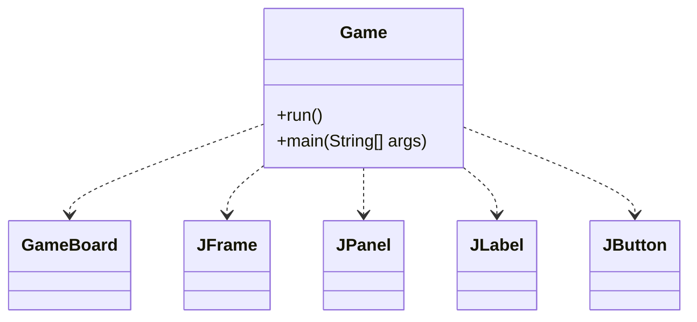
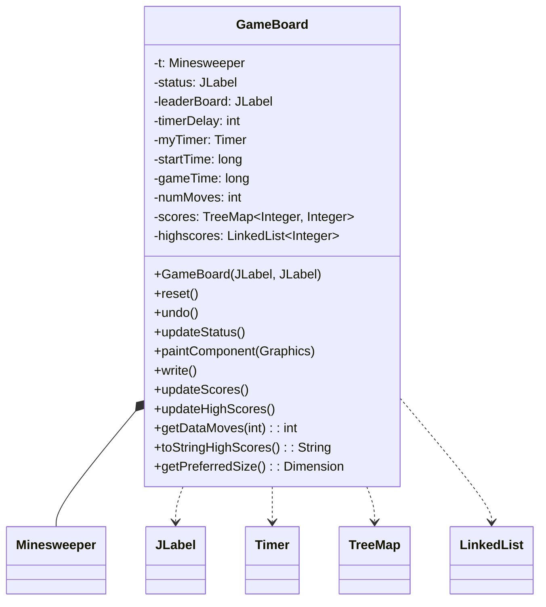
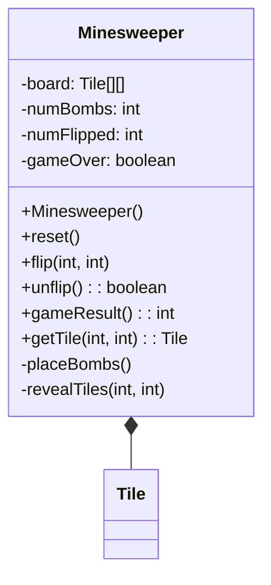
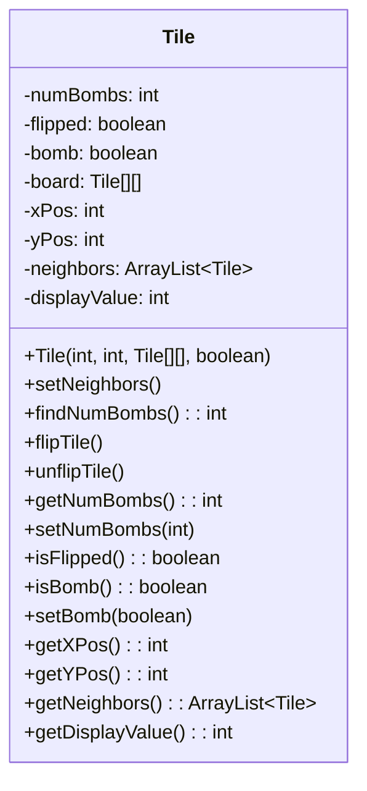
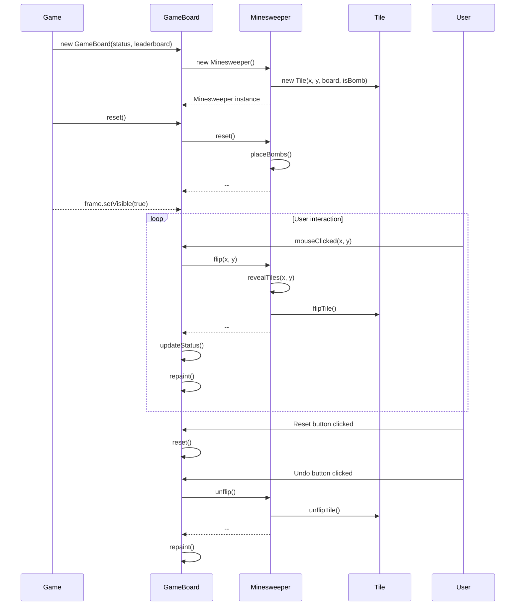

Relevant source files

The following files were used as context for generating this wiki page:

- [Game.java](https://github.com/aanickode/Minesweeper-Project/blob/main/Game.java)
- [GameBoard.java](https://github.com/aanickode/Minesweeper-Project/blob/main/GameBoard.java)
- [Tile.java](https://github.com/aanickode/Minesweeper-Project/blob/main/Tile.java)
- [Minesweeper.java](https://github.com/aanickode/Minesweeper-Project/blob/main/Minesweeper.java)

# Class Hierarchy

## Introduction

The provided source files implement a Minesweeper game using Java Swing for the graphical user interface (GUI). The game follows the classic Minesweeper rules, where the player must uncover all non-mine tiles on a grid without detonating any mines.

The class hierarchy consists of the following main components:

- `Game`: The top-level class that sets up the main game window, UI components, and initializes the `GameBoard`.
- `GameBoard`: Handles the game logic, rendering the board, and user interactions.
- `Minesweeper`: Represents the game model, managing the board state and game rules.
- `Tile`: Represents an individual tile on the game board, tracking its state (revealed, mine, neighbors, etc.).

The game follows the Model-View-Controller (MVC) design pattern, where `Minesweeper` acts as the Model, `GameBoard` serves as the Controller, and the Swing components make up the View.

Sources: [Game.java](https://github.com/aanickode/Minesweeper-Project/blob/main/Game.java), [GameBoard.java](https://github.com/aanickode/Minesweeper-Project/blob/main/GameBoard.java), [Minesweeper.java](https://github.com/aanickode/Minesweeper-Project/blob/main/Minesweeper.java), [Tile.java](https://github.com/aanickode/Minesweeper-Project/blob/main/Tile.java)

## Game Class

The `Game` class is responsible for setting up the main game window and initializing the `GameBoard`. It creates the top-level `JFrame` and adds various UI components, such as the status panel, instructions panel, score panel, and control panel with reset and undo buttons.

The `run()` method sets up the game window and components, while the `main()` method is the entry point of the application, invoking the `run()` method on the Swing event dispatch thread.

Sources: [Game.java](https://github.com/aanickode/Minesweeper-Project/blob/main/Game.java)

## GameBoard Class

The `GameBoard` class is the central component of the game, handling the game logic, rendering the board, and user interactions. It extends `JPanel` and contains an instance of the `Minesweeper` class, which represents the game model.

The `GameBoard` class has the following key responsibilities:

- Initializing the game model (`Minesweeper` instance) and UI components.
- Handling mouse click events and updating the game model accordingly.
- Rendering the game board by overriding the `paintComponent()` method.
- Managing the game timer and displaying the elapsed time and move count.
- Resetting the game and handling the undo functionality.
- Updating and displaying the high scores using a `TreeMap` and `LinkedList`.
- Writing the game score to a file and reading from the file to update the high scores.

Sources: [GameBoard.java](https://github.com/aanickode/Minesweeper-Project/blob/main/GameBoard.java)

## Minesweeper Class

The `Minesweeper` class represents the game model, managing the board state and game rules. It is responsible for initializing the board, placing mines, revealing tiles, and determining the game outcome.

The `Minesweeper` class has the following key responsibilities:

- Initializing the game board with a 2D array of `Tile` objects.
- Placing a fixed number of mines randomly on the board.
- Flipping (revealing) tiles based on user input.
- Undoing the last move (unflipping a tile).
- Determining the game outcome (win, lose, or ongoing).
- Providing access to individual `Tile` objects on the board.

Sources: [Minesweeper.java](https://github.com/aanickode/Minesweeper-Project/blob/main/Minesweeper.java)

## Tile Class

The `Tile` class represents an individual tile on the game board. It keeps track of the tile's state, such as whether it is a mine, revealed, and the number of adjacent mines.

The `Tile` class has the following key responsibilities:

- Storing the tile's state (revealed, mine, number of adjacent mines).
- Calculating and storing the neighboring tiles.
- Flipping (revealing) and unflipping the tile.
- Providing access to the tile's state and position on the board.

Sources: [Tile.java](https://github.com/aanickode/Minesweeper-Project/blob/main/Tile.java)

## Game Flow

The game flow follows the sequence diagram below:

The game flow can be summarized as follows:

1. The `Game` class initializes the `GameBoard`, which in turn initializes the `Minesweeper` model and `Tile` objects.
2. The `GameBoard` sets up event listeners for mouse clicks and button actions.
3. When the user clicks on a tile, the `GameBoard` updates the `Minesweeper` model by calling the `flip()` method.
4. The `Minesweeper` model updates the tile states by calling the `flipTile()` method on the corresponding `Tile` objects.
5. The `GameBoard` updates the UI based on the new game state and repaints the board.
6. The user can reset the game or undo the last move using the respective buttons.
7. The game continues until the user wins (all non-mine tiles revealed) or loses (a mine is revealed).

Sources: [Game.java](https://github.com/aanickode/Minesweeper-Project/blob/main/Game.java), [GameBoard.java](https://github.com/aanickode/Minesweeper-Project/blob/main/GameBoard.java), [Minesweeper.java](https://github.com/aanickode/Minesweeper-Project/blob/main/Minesweeper.java), [Tile.java](https://github.com/aanickode/Minesweeper-Project/blob/main/Tile.java)

## Conclusion

The provided source files implement a Minesweeper game using Java Swing and follow the Model-View-Controller design pattern. The `Game` class sets up the main window and UI components, the `GameBoard` class handles the game logic and rendering, the `Minesweeper` class represents the game model, and the `Tile` class represents individual tiles on the board. The classes interact with each other to provide the game functionality, handle user input, and update the game state accordingly.