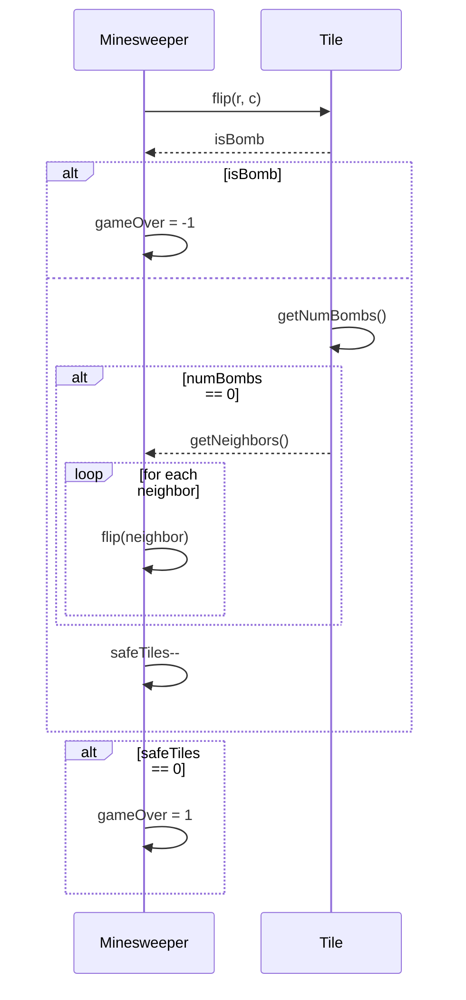
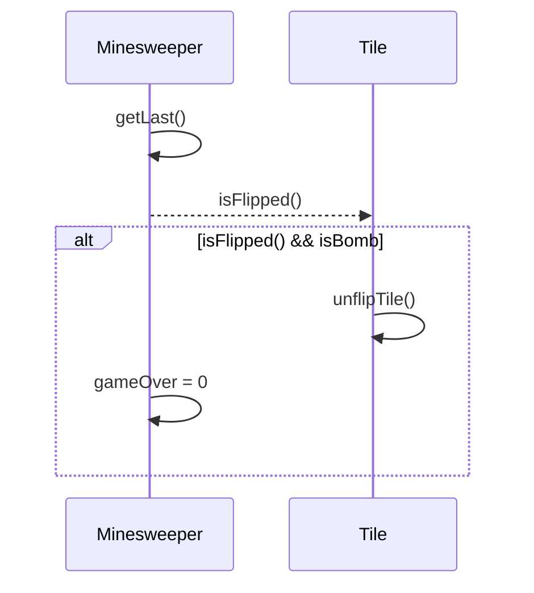
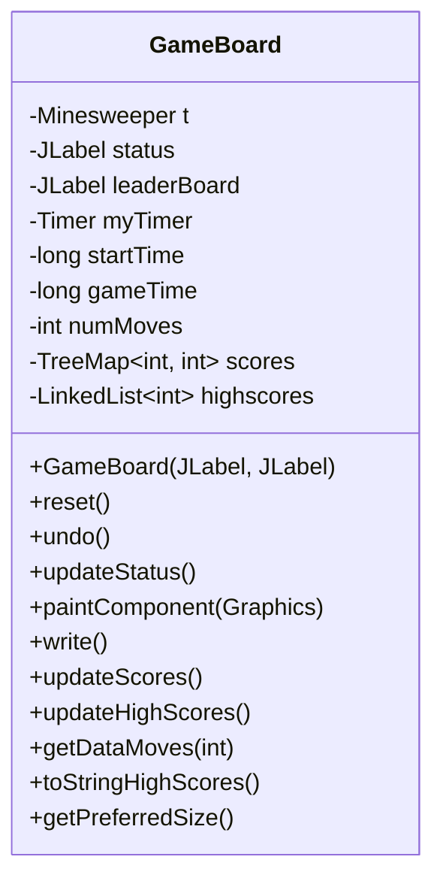
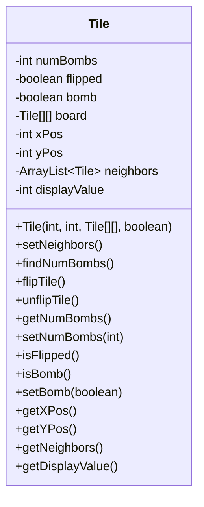
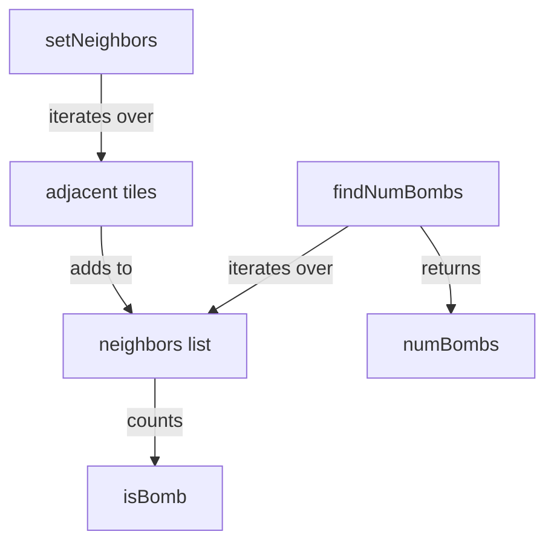

<details>
<summary>Relevant source files</summary>

The following files were used as context for generating this wiki page:

- [Minesweeper.java](https://github.com/aanickode/Minesweeper-Project/blob/main/Minesweeper.java)
- [GameBoard.java](https://github.com/aanickode/Minesweeper-Project/blob/main/GameBoard.java)
- [Tile.java](https://github.com/aanickode/Minesweeper-Project/blob/main/Tile.java)

</details>

# Class Hierarchy

## Introduction

The provided source files implement a Minesweeper game, a classic puzzle game where the player aims to uncover all non-mine tiles on a grid without detonating any mines. The game's core functionality revolves around the class hierarchy, which defines the relationships and interactions between various components.

The main classes involved in the class hierarchy are:

- `Minesweeper`: Represents the game itself, managing the game board, game state, and tile interactions.
- `GameBoard`: Handles the graphical user interface (GUI) and user interactions with the game board.
- `Tile`: Represents an individual tile on the game board, which can be either a mine or a safe tile with a number indicating the adjacent mines.

The class hierarchy is designed to separate concerns, with `Minesweeper` handling the game logic, `GameBoard` managing the GUI and user interactions, and `Tile` encapsulating the state and behavior of individual tiles.

Sources: [Minesweeper.java](), [GameBoard.java](), [Tile.java]()

## Minesweeper Class

The `Minesweeper` class is the core of the game logic, responsible for managing the game board, game state, and tile interactions.

### Game Board Initialization

The `Minesweeper` class initializes the game board, a 2D array of `Tile` objects, using the `generateBombs()` and `generateBombsforTest()` methods. These methods randomly place a specified number of mines (10 in this case) on the board and create safe tiles for the remaining positions.

```mermaid
graph TD
    A[Minesweeper] -->|creates| B[Tile[][]]
    B -->|contains| C[Tile]
    C -->|has| D[isBomb]
    C -->|has| E[numBombs]
    C -->|has| F[isFlipped]
    C -->|has| G[neighbors]
```

Sources: [Minesweeper.java:39-102](), [Tile.java]()

### Tile Flipping

The `flip(int r, int c)` method is responsible for flipping a tile at the specified row and column. It checks the game state, updates the tile's flipped status, and handles the game logic based on whether the flipped tile is a mine or a safe tile.



Sources: [Minesweeper.java:24-56](), [Tile.java:44-50](), [Tile.java:60-67]()

### Tile Unflipping

The `unflip()` method allows the player to unflip the most recently flipped tile if it was a mine. This feature enables the player to continue playing even after losing.



Sources: [Minesweeper.java:59-71](), [Tile.java:36-38]()

### Game State Management

The `Minesweeper` class also provides methods to reset the game (`reset()`, `resetForTest()`), retrieve the game result (`gameResult()`), and print the game board (`printBoard()`).

Sources: [Minesweeper.java:74-102](), [Minesweeper.java:107-119]()

## GameBoard Class

The `GameBoard` class handles the graphical user interface (GUI) and user interactions with the game board.

### GUI Initialization

The `GameBoard` constructor initializes the GUI components, including the game board panel, status label, and leader board label. It also sets up event listeners for mouse clicks and a timer for tracking the game time and number of moves.



Sources: [GameBoard.java:22-116]()

### Game Board Rendering

The `paintComponent(Graphics g)` method is responsible for rendering the game board, including the grid lines, flipped tiles (with numbers or mines), and unflipped tiles.

```mermaid
graph TD
    A[paintComponent] -->|draws| B[grid lines]
    A -->|iterates over| C[Tile[][]]
    C -->|draws| D[numbers for safe tiles]
    C -->|draws| E[X for mines]
```

Sources: [GameBoard.java:128-163]()

### Game State Management

The `GameBoard` class provides methods to reset the game (`reset()`), undo the last move (`undo()`), and update the game status (`updateStatus()`). It also handles writing the game scores to a file (`write()`), updating the scores and high scores (`updateScores()`, `updateHighScores()`), and displaying the high scores (`toStringHighScores()`).

Sources: [GameBoard.java:117-126](), [GameBoard.java:164-206]()

## Tile Class

The `Tile` class represents an individual tile on the game board, encapsulating its state and behavior.

### Tile Properties

Each `Tile` object has the following properties:

- `numBombs`: The number of adjacent mines around the tile.
- `flipped`: A boolean indicating whether the tile is flipped or not.
- `bomb`: A boolean indicating whether the tile is a mine or a safe tile.
- `board`: A reference to the 2D array of tiles (the game board).
- `xPos` and `yPos`: The tile's coordinates on the game board.
- `neighbors`: A list of neighboring tiles.
- `displayValue`: The value to be displayed on the tile (not used in the provided code).



Sources: [Tile.java:5-22]()

### Tile Initialization

The `Tile` constructor initializes the tile's properties, including its position, bomb status, and reference to the game board.

Sources: [Tile.java:24-29]()

### Neighbor and Bomb Count Calculation

The `setNeighbors()` method finds all neighboring tiles for a given tile, excluding mines. The `findNumBombs()` method counts the number of mines among the neighboring tiles.



Sources: [Tile.java:31-50](), [Tile.java:52-62]()

### Tile Flipping

The `flipTile()` and `unflipTile()` methods toggle the `flipped` state of the tile.

Sources: [Tile.java:64-70]()

### Tile Accessors and Mutators

The `Tile` class provides getter and setter methods to access and modify the tile's properties, such as `getNumBombs()`, `setNumBombs(int)`, `isFlipped()`, `isBomb()`, `setBomb(boolean)`, `getXPos()`, `getYPos()`, `getNeighbors()`, and `getDisplayValue()`.

Sources: [Tile.java:72-104]()

## Conclusion

The class hierarchy in the provided Minesweeper project is designed to separate concerns and encapsulate the game logic, GUI, and tile-specific behavior. The `Minesweeper` class manages the game board and game state, the `GameBoard` class handles the GUI and user interactions, and the `Tile` class represents individual tiles on the board. This structure promotes code organization, maintainability, and extensibility.

Sources: [Minesweeper.java](), [GameBoard.java](), [Tile.java]()