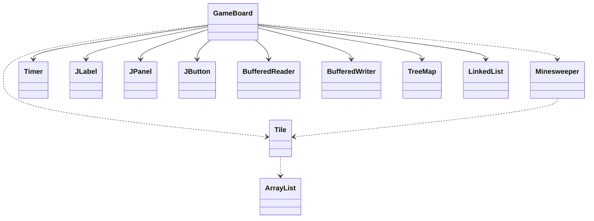
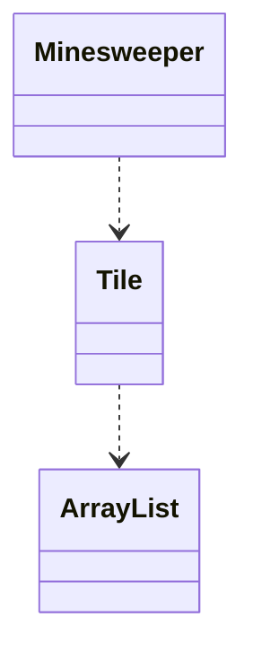
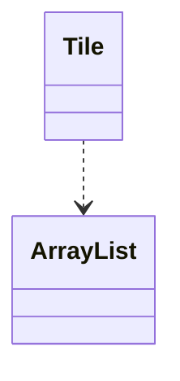
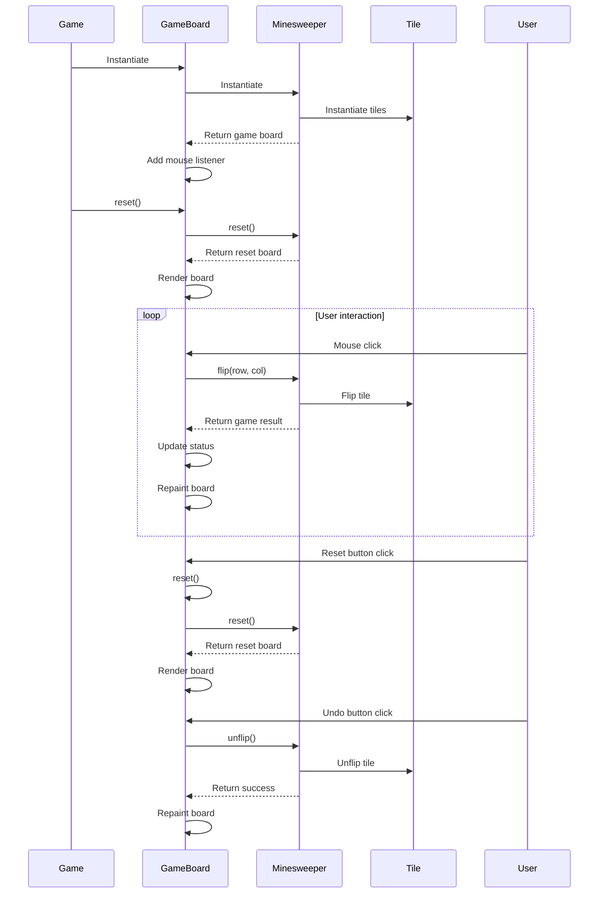
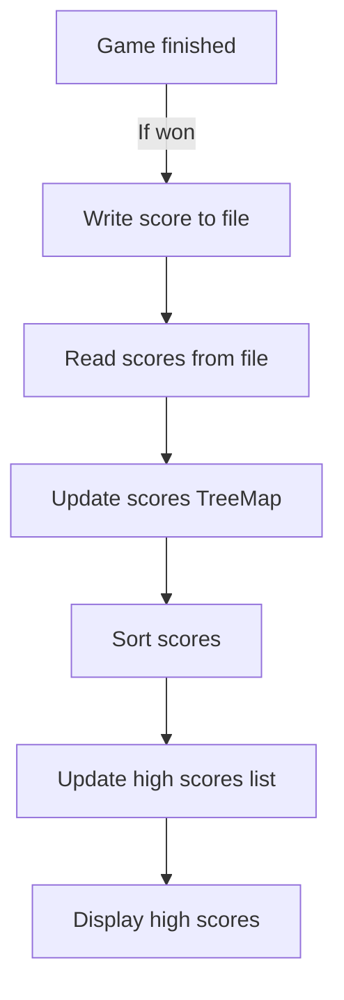

Relevant source files

The following files were used as context for generating this wiki page:

- [Game.java](https://github.com/aanickode/Minesweeper-Project/blob/main/Game.java)
- [GameBoard.java](https://github.com/aanickode/Minesweeper-Project/blob/main/GameBoard.java)
- [Tile.java](https://github.com/aanickode/Minesweeper-Project/blob/main/Tile.java)
- [Minesweeper.java](https://github.com/aanickode/Minesweeper-Project/blob/main/Minesweeper.java)
- [Files/FastestTime.txt](https://github.com/aanickode/Minesweeper-Project/blob/main/Files/FastestTime.txt)

# Class Hierarchy

## Introduction

The provided source files implement a Minesweeper game with a graphical user interface (GUI). The game follows the classic Minesweeper rules, where the player must uncover all non-mine tiles on a grid without detonating any mines. The project utilizes the Model-View-Controller (MVC) design pattern, separating the game logic, user interface, and control flow.

The class hierarchy consists of the following key classes:

- `Game`: Initializes the top-level GUI frame and components, including the game board, status panel, and control buttons.
- `GameBoard`: Handles the game board rendering, user input, and game state management.
- `Minesweeper`: Represents the game model, managing the game board, tile states, and win/lose conditions.
- `Tile`: Represents an individual tile on the game board, storing its state (flipped, bomb, neighbors) and position.

Sources: [Game.java](https://github.com/aanickode/Minesweeper-Project/blob/main/Game.java), [GameBoard.java](https://github.com/aanickode/Minesweeper-Project/blob/main/GameBoard.java), [Minesweeper.java](https://github.com/aanickode/Minesweeper-Project/blob/main/Minesweeper.java), [Tile.java](https://github.com/aanickode/Minesweeper-Project/blob/main/Tile.java)

## Game Class

The `Game` class is the entry point of the application and sets up the top-level GUI frame and components. It follows the MVC pattern by initializing the view (GUI components) and instantiating the `GameBoard` class, which handles the controller and model aspects.

### Key Responsibilities

- Create the main JFrame window and layout components (status panel, instruction panel, score panel, control panel).
- Add action listeners to the "Reset" and "Undo" buttons, which trigger the corresponding actions in the `GameBoard` class.
- Start the game by calling the `reset()` method on the `GameBoard` instance.

Sources: [Game.java](https://github.com/aanickode/Minesweeper-Project/blob/main/Game.java)

## GameBoard Class

The `GameBoard` class is the central component of the MVC architecture, acting as both the controller and view. It handles user input, updates the game state, and renders the game board on the GUI.

### Key Responsibilities

- Initialize the `Minesweeper` model instance.
- Add a mouse listener to handle user clicks on the game board tiles.
- Implement the `reset()` and `undo()` methods to reset or undo the game state, respectively.
- Update the status label with the current game status (win, lose, time, moves).
- Render the game board by drawing the grid, tiles, and their respective states (flipped, bomb, number of adjacent bombs).
- Manage the game timer and move counter.
- Handle high score tracking by reading/writing scores from/to a file and displaying the top 5 scores.

### Class Diagram

Sources: [GameBoard.java](https://github.com/aanickode/Minesweeper-Project/blob/main/GameBoard.java), [Minesweeper.java](https://github.com/aanickode/Minesweeper-Project/blob/main/Minesweeper.java), [Tile.java](https://github.com/aanickode/Minesweeper-Project/blob/main/Tile.java)

## Minesweeper Class

The `Minesweeper` class represents the game model, managing the game board, tile states, and win/lose conditions.

### Key Responsibilities

- Initialize the game board with a fixed number of bombs (10) randomly placed on the board.
- Provide methods to flip/unflip tiles based on user input.
- Determine the game result (win, lose, or ongoing) based on the current board state.
- Reset the game board to its initial state.

### Class Diagram

Sources: [Minesweeper.java](https://github.com/aanickode/Minesweeper-Project/blob/main/Minesweeper.java), [Tile.java](https://github.com/aanickode/Minesweeper-Project/blob/main/Tile.java)

## Tile Class

The `Tile` class represents an individual tile on the game board, storing its state (flipped, bomb, neighbors) and position.

### Key Responsibilities

- Store the tile's state (flipped, bomb, number of adjacent bombs).
- Maintain a list of neighboring tiles.
- Provide methods to flip/unflip the tile.
- Calculate the number of adjacent bombs for non-bomb tiles.

### Class Diagram

Sources: [Tile.java](https://github.com/aanickode/Minesweeper-Project/blob/main/Tile.java)

## Game Flow

The game flow follows the MVC pattern, with the `Game` class initializing the GUI components and the `GameBoard` class handling user input, updating the game state, and rendering the game board.

### Sequence Diagram

Sources: [Game.java](https://github.com/aanickode/Minesweeper-Project/blob/main/Game.java), [GameBoard.java](https://github.com/aanickode/Minesweeper-Project/blob/main/GameBoard.java), [Minesweeper.java](https://github.com/aanickode/Minesweeper-Project/blob/main/Minesweeper.java), [Tile.java](https://github.com/aanickode/Minesweeper-Project/blob/main/Tile.java)

## High Score Tracking

The `GameBoard` class implements high score tracking functionality by reading and writing game scores to a file (`FastestTime.txt`). The scores are stored in a `TreeMap` data structure, with the time taken to win the game as the key and the number of moves as the value.

### High Score Tracking Flow

Sources: [GameBoard.java](https://github.com/aanickode/Minesweeper-Project/blob/main/GameBoard.java), [Files/FastestTime.txt](https://github.com/aanickode/Minesweeper-Project/blob/main/Files/FastestTime.txt)

## Key Components

| Component | Description |
| --- | --- |
| `Game` | Initializes the top-level GUI frame and components, including the game board, status panel, and control buttons. |
| `GameBoard` | Handles the game board rendering, user input, and game state management. |
| `Minesweeper` | Represents the game model, managing the game board, tile states, and win/lose conditions. |
| `Tile` | Represents an individual tile on the game board, storing its state (flipped, bomb, neighbors) and position. |
| `Timer` | Manages the game timer and updates the status label with the elapsed time. |
| `JLabel` | Used for displaying the game status, instructions, and high scores. |
| `JPanel` | Used for organizing and laying out the GUI components. |
| `JButton` | Represents the "Reset" and "Undo" buttons for controlling the game flow. |
| `BufferedReader` | Used for reading high scores from the `FastestTime.txt` file. |
| `BufferedWriter` | Used for writing the current game score to the `FastestTime.txt` file. |
| `TreeMap` | Used for storing and sorting the high scores based on the time taken to win the game. |
| `LinkedList` | Used for maintaining the list of top 5 high scores. |

Sources: [Game.java](https://github.com/aanickode/Minesweeper-Project/blob/main/Game.java), [GameBoard.java](https://github.com/aanickode/Minesweeper-Project/blob/main/GameBoard.java), [Minesweeper.java](https://github.com/aanickode/Minesweeper-Project/blob/main/Minesweeper.java), [Tile.java](https://github.com/aanickode/Minesweeper-Project/blob/main/Tile.java), [Files/FastestTime.txt](https://github.com/aanickode/Minesweeper-Project/blob/main/Files/FastestTime.txt)

## Conclusion

The provided source files implement a Minesweeper game with a graphical user interface, following the Model-View-Controller design pattern. The `Game` class sets up the GUI components, the `GameBoard` class handles user input and game state management, the `Minesweeper` class represents the game model, and the `Tile` class represents individual tiles on the game board. The project also includes high score tracking functionality by reading and writing scores to a file.

Sources: [Game.java](https://github.com/aanickode/Minesweeper-Project/blob/main/Game.java), [GameBoard.java](https://github.com/aanickode/Minesweeper-Project/blob/main/GameBoard.java), [Minesweeper.java](https://github.com/aanickode/Minesweeper-Project/blob/main/Minesweeper.java), [Tile.java](https://github.com/aanickode/Minesweeper-Project/blob/main/Tile.java), [Files/FastestTime.txt](https://github.com/aanickode/Minesweeper-Project/blob/main/Files/FastestTime.txt)