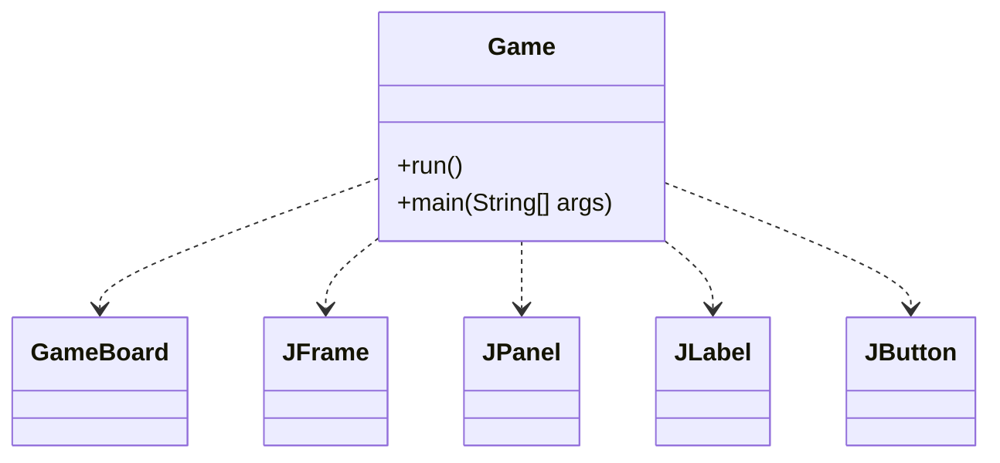
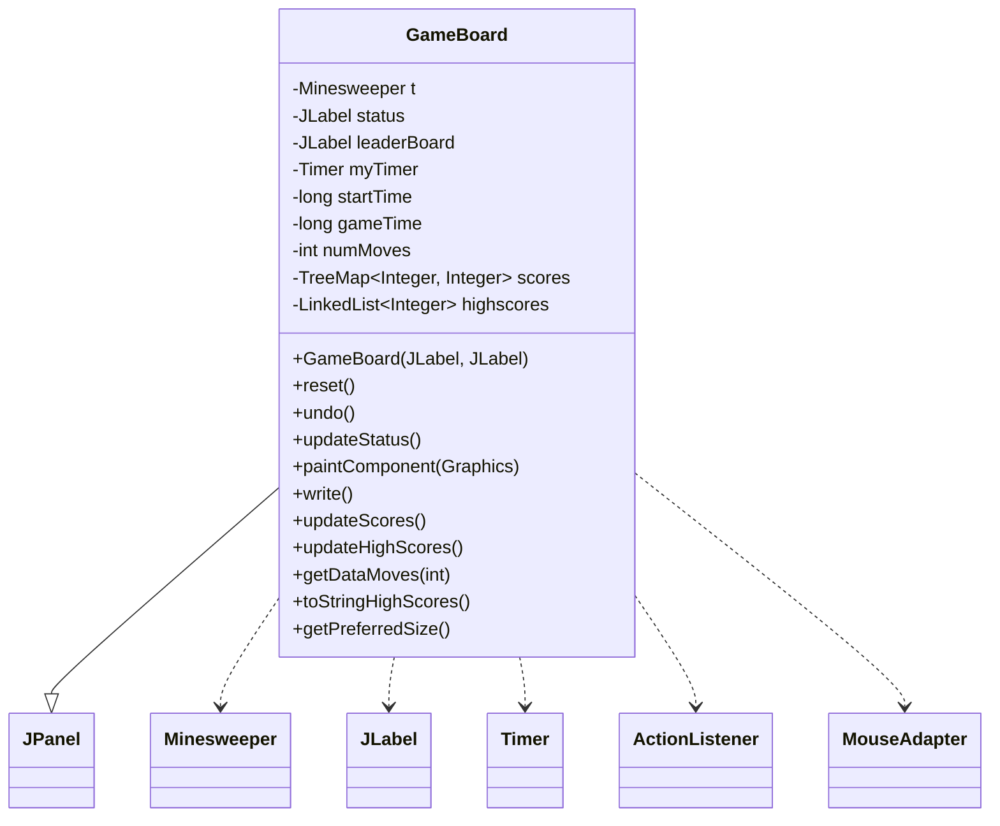
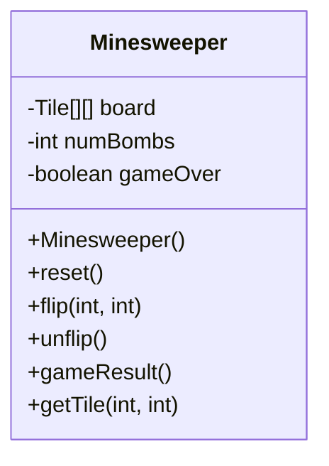
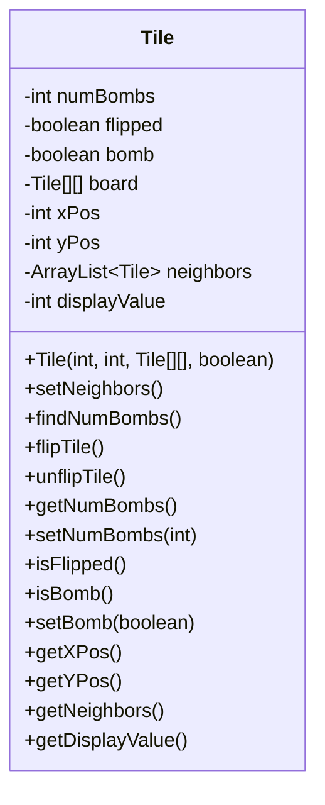
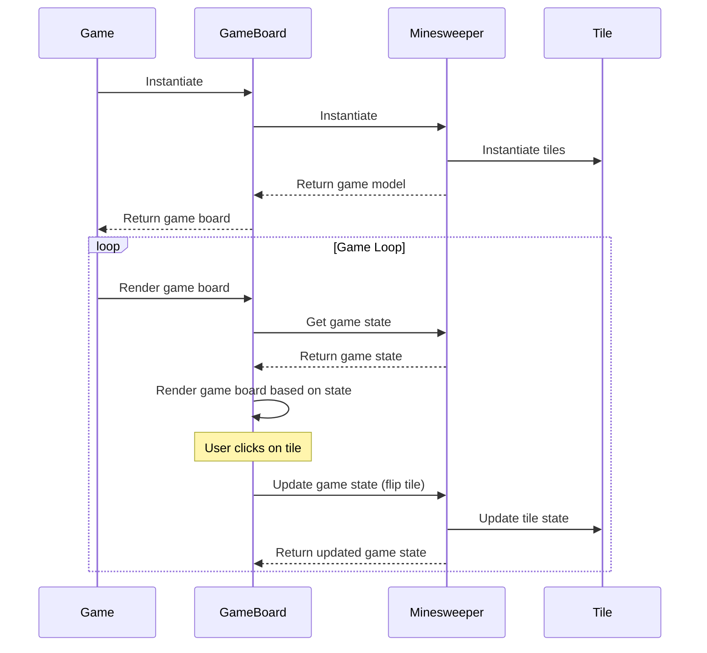
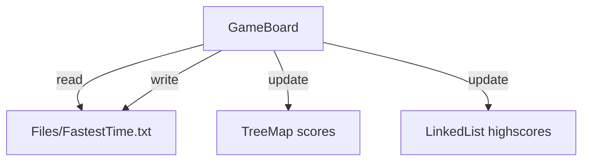

Relevant source files

The following files were used as context for generating this wiki page:

- [Game.java](https://github.com/aanickode/Minesweeper-Project/blob/main/Game.java)
- [GameBoard.java](https://github.com/aanickode/Minesweeper-Project/blob/main/GameBoard.java)
- [Tile.java](https://github.com/aanickode/Minesweeper-Project/blob/main/Tile.java)
- [Minesweeper.java](https://github.com/aanickode/Minesweeper-Project/blob/main/Minesweeper.java)
- [Files/FastestTime.txt](https://github.com/aanickode/Minesweeper-Project/blob/main/Files/FastestTime.txt)

# Class Hierarchy

## Introduction

The provided source files implement a Minesweeper game using Java Swing for the graphical user interface (GUI). The game follows a Model-View-Controller (MVC) architecture pattern, where the `Minesweeper` class represents the game model, the `GameBoard` class acts as the view and controller, and the `Game` class sets up the top-level frame and components.

The class hierarchy consists of the following main classes:

- `Game`: Initializes the GUI components and sets up the game board.
- `GameBoard`: Handles the game board rendering, user interactions, and game logic.
- `Minesweeper`: Represents the game model, managing the game state and board configuration.
- `Tile`: Represents an individual tile on the game board, tracking its state (flipped, bomb, neighbors, etc.).

Additionally, there is a `Files/FastestTime.txt` file used for storing and retrieving high scores.

## Game Class

The `Game` class is responsible for setting up the top-level frame and widgets for the GUI. It follows the MVC design pattern, initializing the view (`GameBoard`) and implementing some controller functionality through the reset button.

Sources: [Game.java](https://github.com/aanickode/Minesweeper-Project/blob/main/Game.java)

## GameBoard Class

The `GameBoard` class extends `JPanel` and serves as both the view and controller for the game. It handles rendering the game board, processing user interactions (mouse clicks), updating the game status, and managing the game timer.

Sources: [GameBoard.java](https://github.com/aanickode/Minesweeper-Project/blob/main/GameBoard.java)

## Minesweeper Class

The `Minesweeper` class represents the game model, managing the game state and board configuration. It handles operations such as flipping tiles, checking for game completion, and resetting the game.

Sources: [Minesweeper.java](https://github.com/aanickode/Minesweeper-Project/blob/main/Minesweeper.java)

## Tile Class

The `Tile` class represents an individual tile on the game board. It tracks the tile's state (flipped, bomb, neighbors, etc.) and provides methods for manipulating and querying its properties.

Sources: [Tile.java](https://github.com/aanickode/Minesweeper-Project/blob/main/Tile.java)

## Data Flow

The game follows the MVC pattern, where the `Game` class initializes the `GameBoard` view and controller. The `GameBoard` class manages the game state through the `Minesweeper` model and handles user interactions (mouse clicks) by updating the model and rendering the updated game board.

Sources: [Game.java](https://github.com/aanickode/Minesweeper-Project/blob/main/Game.java), [GameBoard.java](https://github.com/aanickode/Minesweeper-Project/blob/main/GameBoard.java), [Minesweeper.java](https://github.com/aanickode/Minesweeper-Project/blob/main/Minesweeper.java), [Tile.java](https://github.com/aanickode/Minesweeper-Project/blob/main/Tile.java)

## High Score Management

The `GameBoard` class manages high scores by reading and writing to a `Files/FastestTime.txt` file. It uses a `TreeMap` to store scores (time as key, moves as value) and a `LinkedList` to keep track of the top 5 high scores.

Sources: [GameBoard.java](https://github.com/aanickode/Minesweeper-Project/blob/main/GameBoard.java), [Files/FastestTime.txt](https://github.com/aanickode/Minesweeper-Project/blob/main/Files/FastestTime.txt)

## Key Components

| Component | Description |
| --- | --- |
| `Game` | Initializes the GUI components and sets up the game board. |
| `GameBoard` | Handles the game board rendering, user interactions, and game logic. |
| `Minesweeper` | Represents the game model, managing the game state and board configuration. |
| `Tile` | Represents an individual tile on the game board, tracking its state. |
| `Files/FastestTime.txt` | File used for storing and retrieving high scores. |

Sources: [Game.java](https://github.com/aanickode/Minesweeper-Project/blob/main/Game.java), [GameBoard.java](https://github.com/aanickode/Minesweeper-Project/blob/main/GameBoard.java), [Minesweeper.java](https://github.com/aanickode/Minesweeper-Project/blob/main/Minesweeper.java), [Tile.java](https://github.com/aanickode/Minesweeper-Project/blob/main/Tile.java), [Files/FastestTime.txt](https://github.com/aanickode/Minesweeper-Project/blob/main/Files/FastestTime.txt)

## Conclusion

The provided source files implement a Minesweeper game using Java Swing and following the Model-View-Controller architecture pattern. The `Game` class sets up the GUI, the `GameBoard` class handles the game board rendering and user interactions, the `Minesweeper` class represents the game model, and the `Tile` class represents individual tiles on the board. The game also includes functionality for managing high scores by reading and writing to a `Files/FastestTime.txt` file.