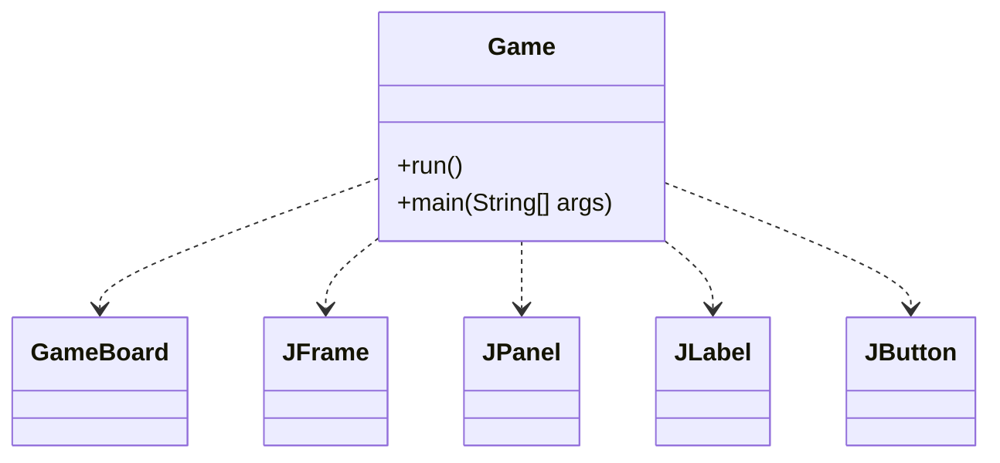
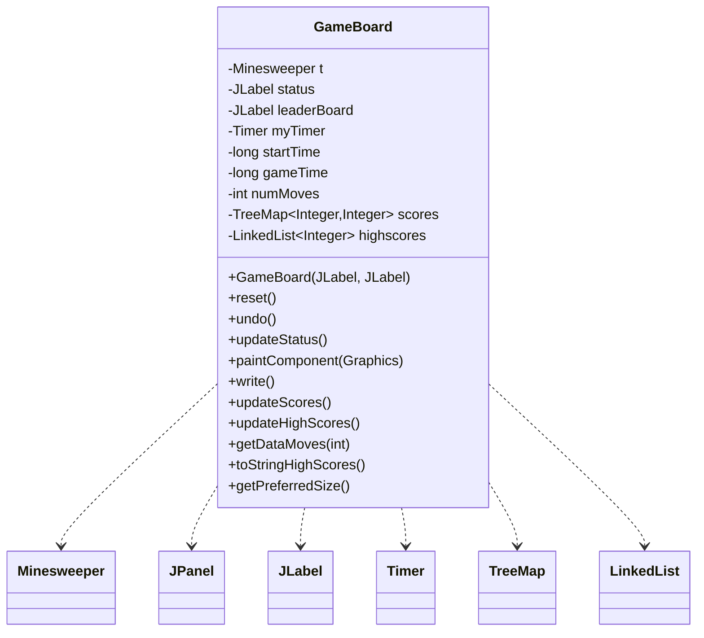
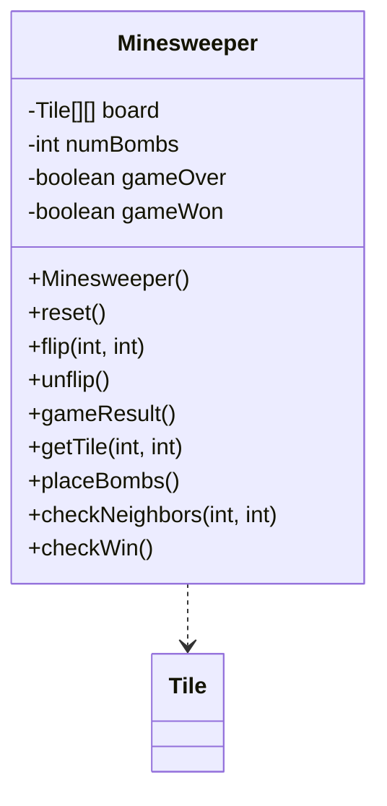
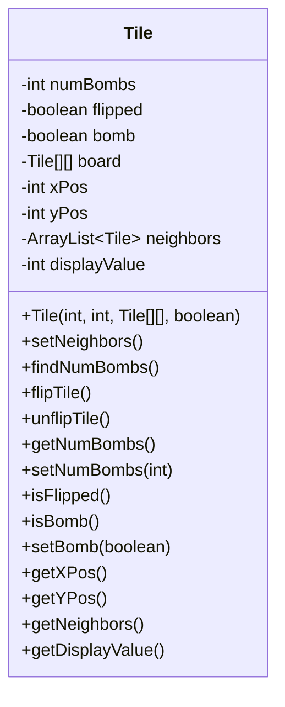
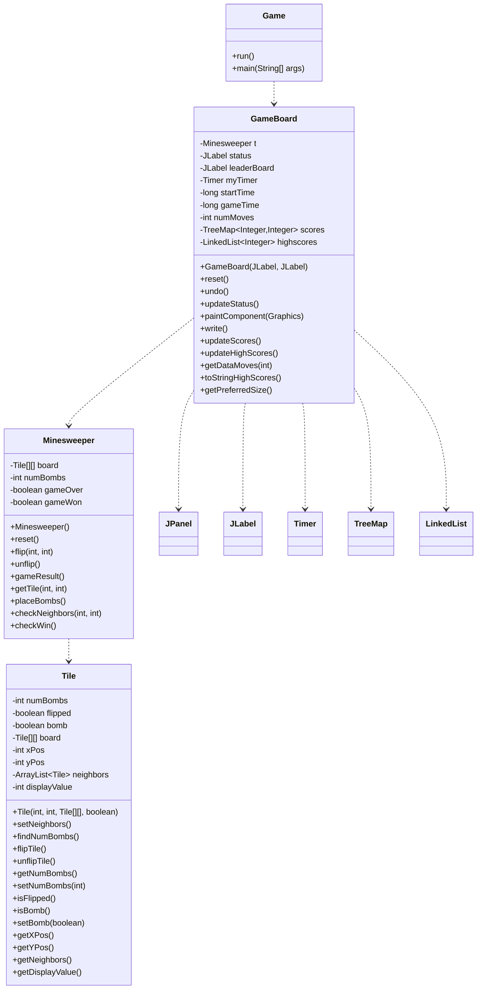

Relevant source files

The following files were used as context for generating this wiki page:

- [Game.java](https://github.com/aanickode/Minesweeper-Project/blob/main/Game.java)
- [GameBoard.java](https://github.com/aanickode/Minesweeper-Project/blob/main/GameBoard.java)
- [Tile.java](https://github.com/aanickode/Minesweeper-Project/blob/main/Tile.java)
- [Minesweeper.java](https://github.com/aanickode/Minesweeper-Project/blob/main/Minesweeper.java)
- [Files/FastestTime.txt](https://github.com/aanickode/Minesweeper-Project/blob/main/Files/FastestTime.txt)

# Class Relationships

## Introduction

This project is a Java implementation of the classic Minesweeper game. The game involves a grid of tiles, some of which are mines (bombs). The objective is to flip all non-mine tiles without detonating any mines. The game provides features like a timer, move counter, high score tracking, and undo functionality.

The core classes involved in this project are `Game`, `GameBoard`, `Minesweeper`, and `Tile`. The `Game` class sets up the GUI and initializes the game board. The `GameBoard` class handles the game logic, user interactions, and rendering. The `Minesweeper` class represents the game model, managing the board state and game rules. The `Tile` class encapsulates the properties and behavior of individual tiles on the board.

Sources: [Game.java](https://github.com/aanickode/Minesweeper-Project/blob/main/Game.java), [GameBoard.java](https://github.com/aanickode/Minesweeper-Project/blob/main/GameBoard.java), [Minesweeper.java](https://github.com/aanickode/Minesweeper-Project/blob/main/Minesweeper.java), [Tile.java](https://github.com/aanickode/Minesweeper-Project/blob/main/Tile.java)

## Game Class

The `Game` class is the entry point of the application. It sets up the main game window, including the game board, status panel, instructions panel, and control buttons (Reset and Undo).

The `run()` method creates the main `JFrame` and adds various components to it, such as the `GameBoard`, status panel, instructions panel, and control buttons. The `main()` method is the entry point of the application, which invokes the `run()` method using `SwingUtilities.invokeLater()` to ensure the GUI is initialized on the Event Dispatch Thread.

Sources: [Game.java](https://github.com/aanickode/Minesweeper-Project/blob/main/Game.java)

## GameBoard Class

The `GameBoard` class is responsible for handling the game logic, user interactions, and rendering the game board.

The `GameBoard` class has the following key responsibilities:

1. **Game Initialization**: The constructor initializes the game model (`Minesweeper`), status labels, timer, and event listeners for mouse clicks.
2. **Game Reset**: The `reset()` method resets the game state, updates the high scores, and repaints the board.
3. **Undo Move**: The `undo()` method allows the player to undo the last move.
4. **Game Status Update**: The `updateStatus()` method updates the game status label based on the current game state (won, lost, or ongoing).
5. **Board Rendering**: The `paintComponent()` method renders the game board, including the grid, tiles, and their states (flipped, bomb, or number of adjacent bombs).
6. **High Score Management**: The `write()`, `updateScores()`, `updateHighScores()`, `getDataMoves()`, and `toStringHighScores()` methods handle writing, reading, and displaying high scores from a file (`FastestTime.txt`).

The `GameBoard` class interacts with the `Minesweeper` class to manage the game state and the `Tile` class to represent individual tiles on the board.

Sources: [GameBoard.java](https://github.com/aanickode/Minesweeper-Project/blob/main/GameBoard.java), [Files/FastestTime.txt](https://github.com/aanickode/Minesweeper-Project/blob/main/Files/FastestTime.txt)

## Minesweeper Class

The `Minesweeper` class represents the game model, managing the board state and game rules.

The `Minesweeper` class has the following key responsibilities:

1. **Board Initialization**: The constructor initializes the game board with tiles and places bombs randomly.
2. **Game Reset**: The `reset()` method resets the game state and board.
3. **Tile Flipping**: The `flip()` method flips a tile at the specified coordinates and handles the game logic, such as revealing adjacent tiles or ending the game if a bomb is flipped.
4. **Undo Move**: The `unflip()` method allows the player to undo the last move by unflipping the previously flipped tile.
5. **Game Result**: The `gameResult()` method returns the current game state (won, lost, or ongoing).
6. **Tile Access**: The `getTile()` method provides access to a specific tile on the board.
7. **Bomb Placement**: The `placeBombs()` method randomly places bombs on the board.
8. **Neighbor Checking**: The `checkNeighbors()` method checks and updates the number of adjacent bombs for a given tile.
9. **Win Condition**: The `checkWin()` method checks if the player has won the game by flipping all non-bomb tiles.

The `Minesweeper` class interacts with the `Tile` class to represent and manipulate individual tiles on the board.

Sources: [Minesweeper.java](https://github.com/aanickode/Minesweeper-Project/blob/main/Minesweeper.java), [Tile.java](https://github.com/aanickode/Minesweeper-Project/blob/main/Tile.java)

## Tile Class

The `Tile` class represents an individual tile on the game board.

The `Tile` class has the following key responsibilities:

1. **Tile Initialization**: The constructor initializes a tile with its position, reference to the board, and whether it is a bomb or not.
2. **Neighbor Management**: The `setNeighbors()` method finds and stores the neighboring tiles for a given tile.
3. **Adjacent Bomb Count**: The `findNumBombs()` method calculates the number of adjacent bombs for a non-bomb tile.
4. **Tile Flipping**: The `flipTile()` and `unflipTile()` methods flip or unflip the tile, respectively.
5. **Tile Properties**: Various getter and setter methods provide access to the tile's properties, such as its position, bomb status, number of adjacent bombs, and display value.

The `Tile` class is used by the `Minesweeper` class to represent and manipulate individual tiles on the game board.

Sources: [Tile.java](https://github.com/aanickode/Minesweeper-Project/blob/main/Tile.java)

## Class Relationships Diagram

The following diagram illustrates the relationships between the core classes in the Minesweeper project:

The `Game` class creates and initializes the `GameBoard`, which in turn creates and manages the `Minesweeper` game model. The `Minesweeper` class interacts with the `Tile` class to represent and manipulate individual tiles on the game board.

Sources: [Game.java](https://github.com/aanickode/Minesweeper-Project/blob/main/Game.java), [GameBoard.java](https://github.com/aanickode/Minesweeper-Project/blob/main/GameBoard.java), [Minesweeper.java](https://github.com/aanickode/Minesweeper-Project/blob/main/Minesweeper.java), [Tile.java](https://github.com/aanickode/Minesweeper-Project/blob/main/Tile.java)

## Conclusion

The Minesweeper project follows a Model-View-Controller (MVC) architecture, where the `Minesweeper` class represents the model, the `GameBoard` class acts as the controller and part of the view, and the `Game` class sets up the main view components. The `Tile` class encapsulates the properties and behavior of individual tiles on the game board. The project also includes features like high score tracking, a timer, move counter, and undo functionality.