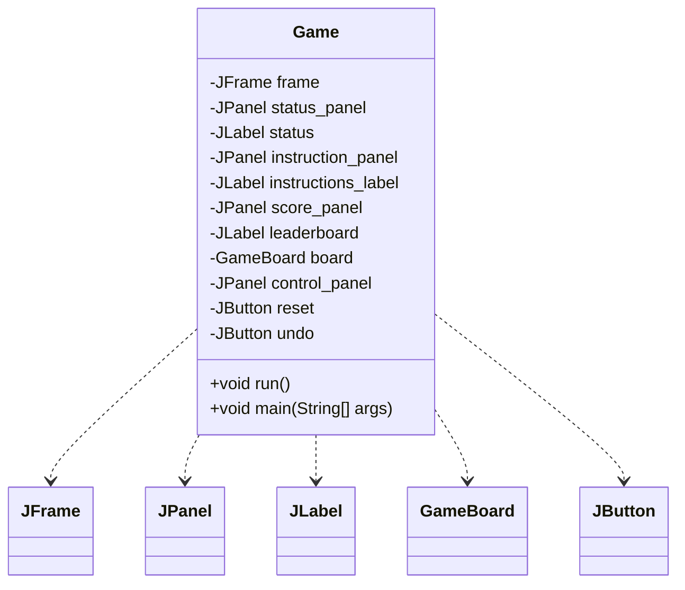
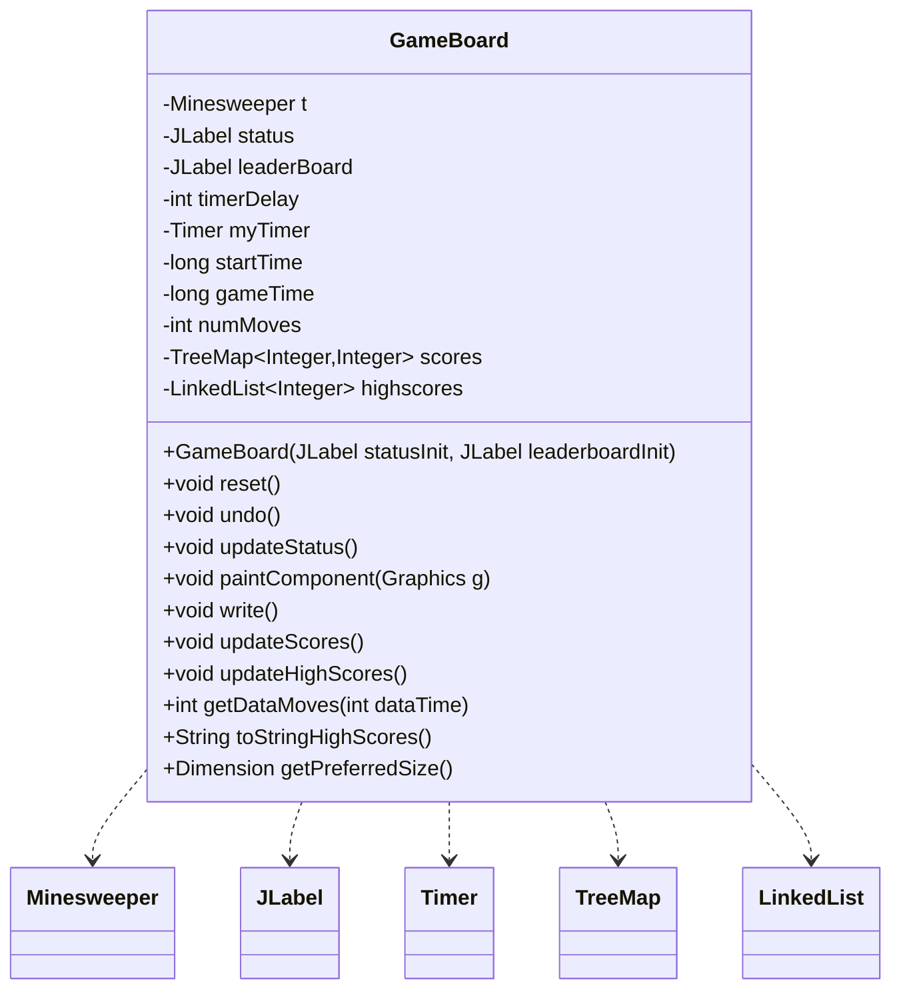
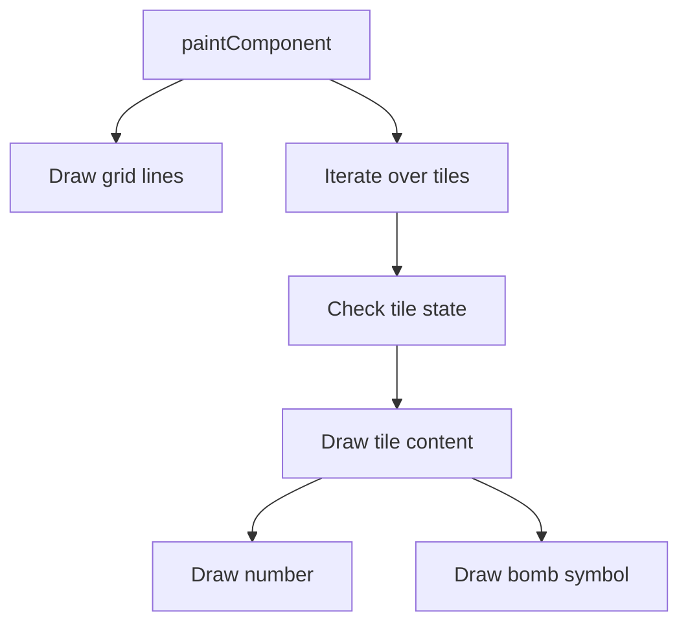
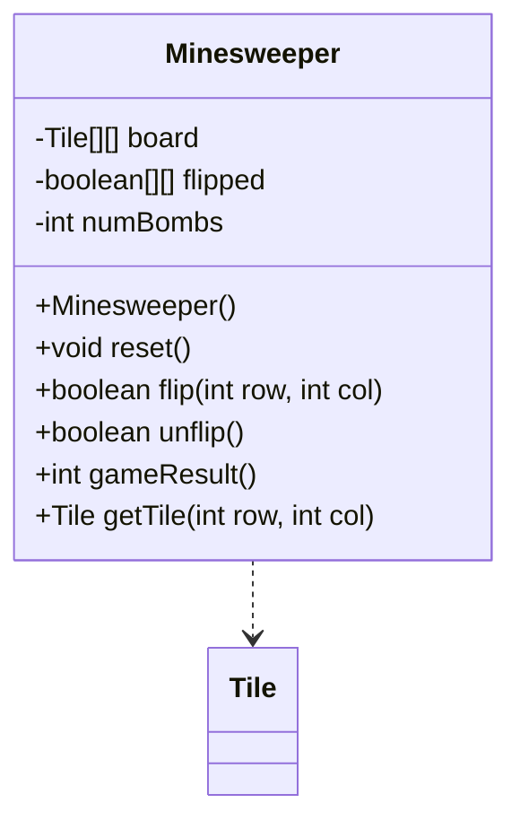
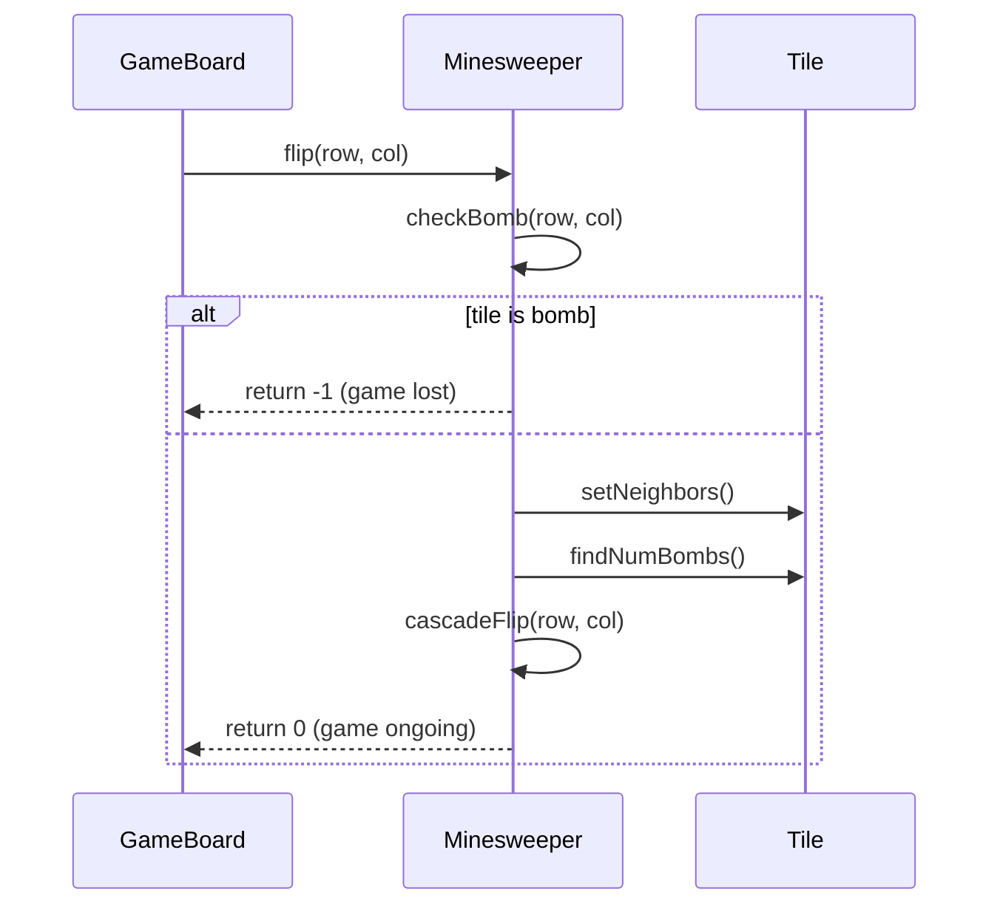
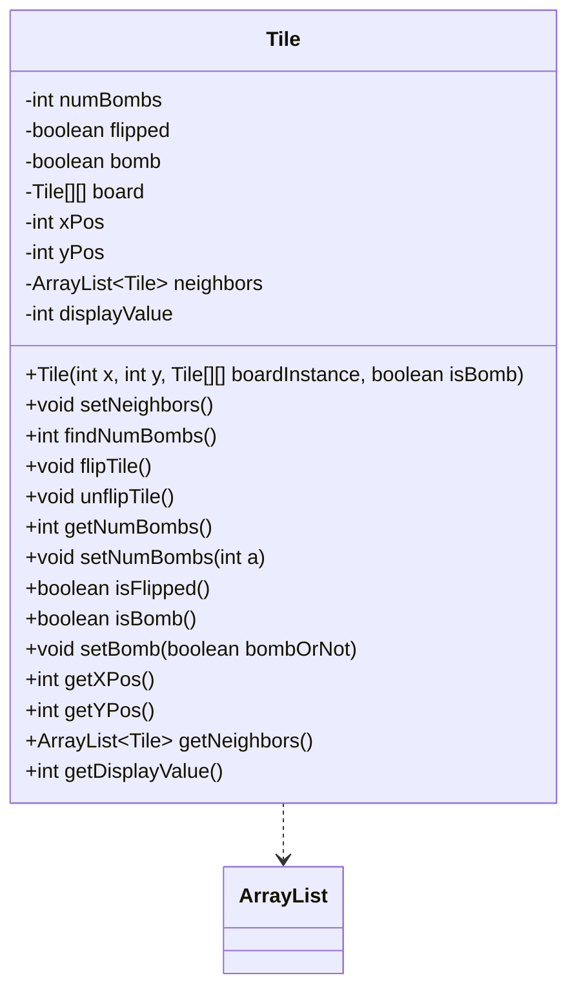
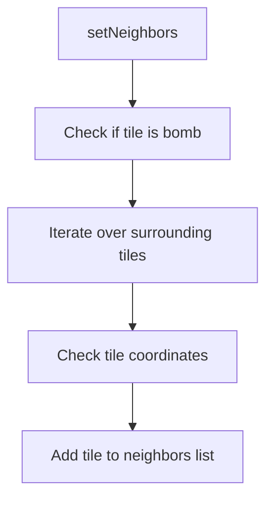
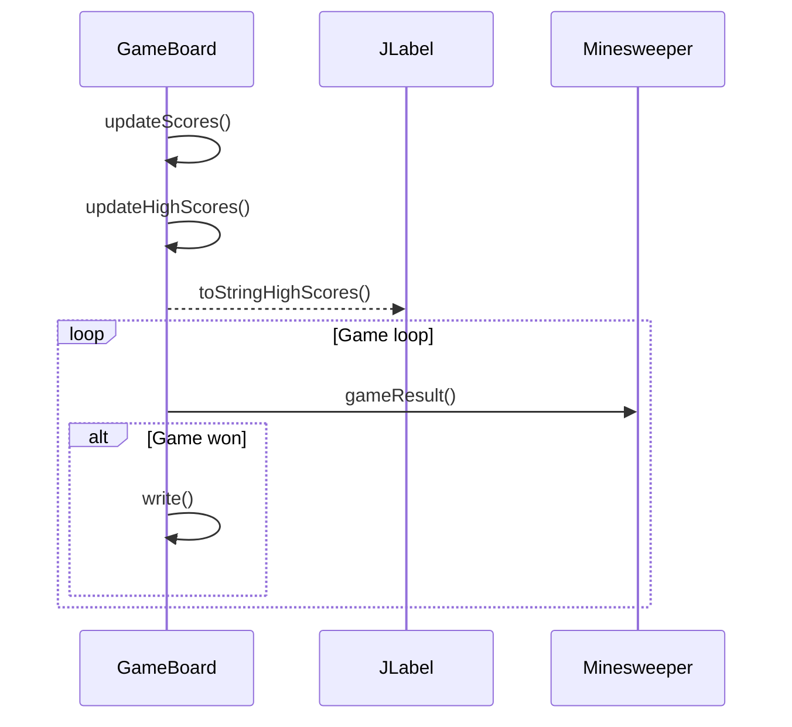
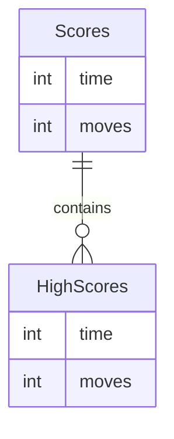

Relevant source files

The following files were used as context for generating this wiki page:

- [Game.java](https://github.com/aanickode/Minesweeper-Project/blob/main/Game.java)
- [GameBoard.java](https://github.com/aanickode/Minesweeper-Project/blob/main/GameBoard.java)
- [Tile.java](https://github.com/aanickode/Minesweeper-Project/blob/main/Tile.java)
- [Minesweeper.java](https://github.com/aanickode/Minesweeper-Project/blob/main/Minesweeper.java)
- [Files/FastestTime.txt](https://github.com/aanickode/Minesweeper-Project/blob/main/Files/FastestTime.txt)

# Class Relationships

## Introduction

This project implements a Minesweeper game using Java Swing for the graphical user interface (GUI). The game follows the classic Minesweeper rules, where the player must uncover all non-mine tiles on a grid without detonating any mines. The project is structured using the Model-View-Controller (MVC) architectural pattern, separating the game logic, user interface, and control flow.

The key classes involved in this project are `Game`, `GameBoard`, `Minesweeper`, and `Tile`. The `Game` class sets up the top-level frame and GUI components, while the `GameBoard` class handles the game board rendering and user interactions. The `Minesweeper` class encapsulates the game logic and acts as the model, while the `Tile` class represents individual tiles on the game board.

Sources: [Game.java](), [GameBoard.java](), [Minesweeper.java](), [Tile.java]()

## Game Class

The `Game` class is responsible for initializing the top-level frame and GUI components for the Minesweeper game. It follows the MVC pattern by setting up the view components and instantiating the `GameBoard` class, which handles the controller and view logic.

### Key Components

- `JFrame`: The top-level window container for the game.
- `JPanel`: Panels for displaying the status, instructions, and score.
- `JLabel`: Labels for displaying the game status, instructions, and leaderboard.
- `GameBoard`: The main game board component.
- `JButton`: Buttons for resetting and undoing moves.

Sources: [Game.java]()

### Class Diagram

Sources: [Game.java]()

## GameBoard Class

The `GameBoard` class is the central component of the Minesweeper game. It extends `JPanel` and handles the game board rendering, user interactions, and game logic coordination with the `Minesweeper` model class.

### Key Components

- `Minesweeper`: The game model instance.
- `JLabel`: Labels for displaying the game status and leaderboard.
- `Timer`: A timer for tracking the game time.
- `TreeMap`: A data structure for storing and managing high scores.
- `LinkedList`: A data structure for storing the top high scores.

Sources: [GameBoard.java]()

### Class Diagram

Sources: [GameBoard.java]()

### Game Board Rendering

The `paintComponent` method in the `GameBoard` class is responsible for rendering the game board. It draws the grid lines and tiles based on the current game state retrieved from the `Minesweeper` model.

Sources: [GameBoard.java:151-184]()

## Minesweeper Class

The `Minesweeper` class encapsulates the game logic and acts as the model in the MVC pattern. It manages the game board, tile states, and game rules.

### Key Components

- `Tile[][]`: A 2D array representing the game board tiles.
- `boolean[][]`: A 2D array tracking the flipped state of tiles.
- `int numBombs`: The number of bombs on the game board.

Sources: [Minesweeper.java]()

### Class Diagram

Sources: [Minesweeper.java]()

### Game Logic Flow

The `flip` method in the `Minesweeper` class handles the logic for flipping a tile on the game board. It checks if the tile is a bomb or if it should trigger a cascade of flips for adjacent tiles.

Sources: [Minesweeper.java:50-97](), [Tile.java:15-49]()

## Tile Class

The `Tile` class represents an individual tile on the game board. It encapsulates the tile's state, such as whether it's a bomb, flipped, or the number of adjacent bombs.

### Key Components

- `int numBombs`: The number of adjacent bombs.
- `boolean flipped`: The flipped state of the tile.
- `boolean bomb`: Whether the tile is a bomb or not.
- `Tile[][] board`: A reference to the game board.
- `int xPos`, `int yPos`: The tile's coordinates on the board.
- `ArrayList<Tile> neighbors`: A list of neighboring tiles.
- `int displayValue`: The value to be displayed on the tile.

Sources: [Tile.java]()

### Class Diagram

Sources: [Tile.java]()

### Tile Neighbor Calculation

The `setNeighbors` method in the `Tile` class calculates the neighboring tiles for a given tile on the game board. It iterates over the surrounding tiles and adds them to the `neighbors` list if they are within the board boundaries.

Sources: [Tile.java:15-30]()

## High Score Management

The `GameBoard` class manages the high score functionality by reading and writing scores to a file named `FastestTime.txt`. The scores are stored in a `TreeMap` data structure, with the time taken to win the game as the key and the number of moves as the value.

### High Score Flow

Sources: [GameBoard.java:185-250]()

### High Score Data Structure

The high scores are stored in a `TreeMap` data structure, where the key is the time taken to win the game, and the value is the number of moves required to win. The `updateHighScores` method sorts the scores and selects the top 5 scores to be displayed as the high scores.

Sources: [GameBoard.java:185-250]()

## Conclusion

The Minesweeper project follows the Model-View-Controller architectural pattern, separating the game logic, user interface, and control flow. The `Minesweeper` class acts as the model, encapsulating the game board and game rules. The `GameBoard` class handles the view and controller responsibilities, rendering the game board and processing user interactions. The `Tile` class represents individual tiles on the game board, managing their state and neighboring relationships. The project also includes functionality for tracking and displaying high scores, providing a leaderboard for players to compete for the fastest game completion time with the least number of moves.

Sources: [Game.java](), [GameBoard.java](), [Minesweeper.java](), [Tile.java](), [Files/FastestTime.txt]()