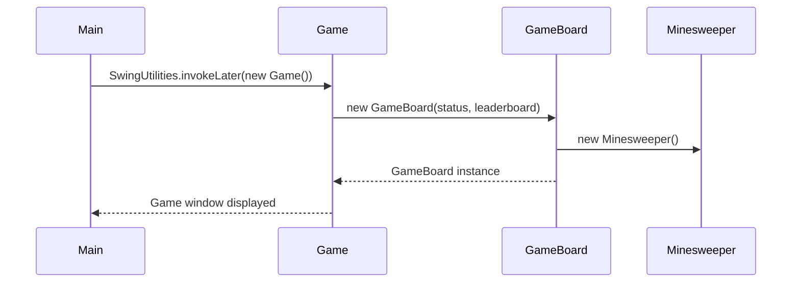
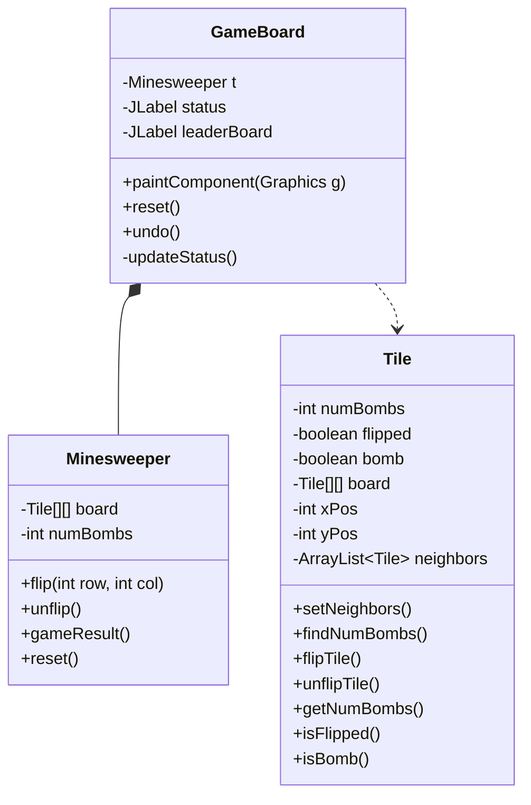
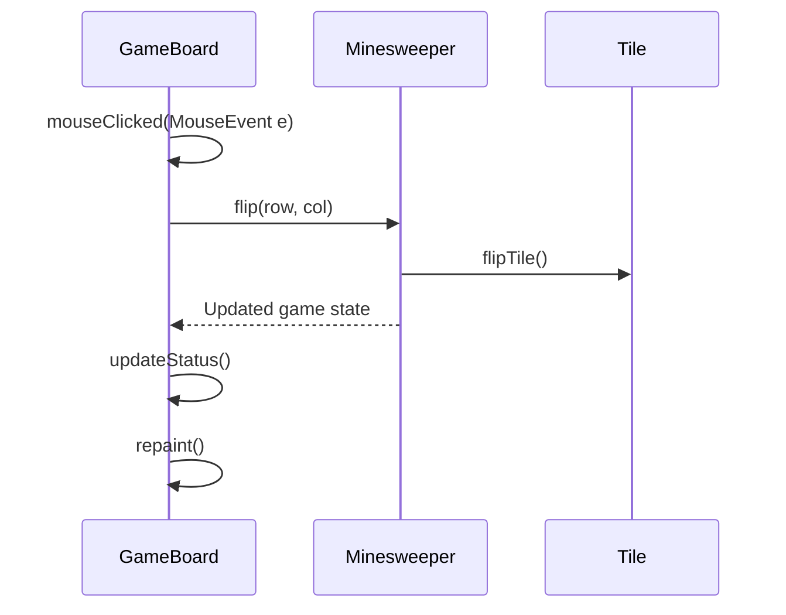
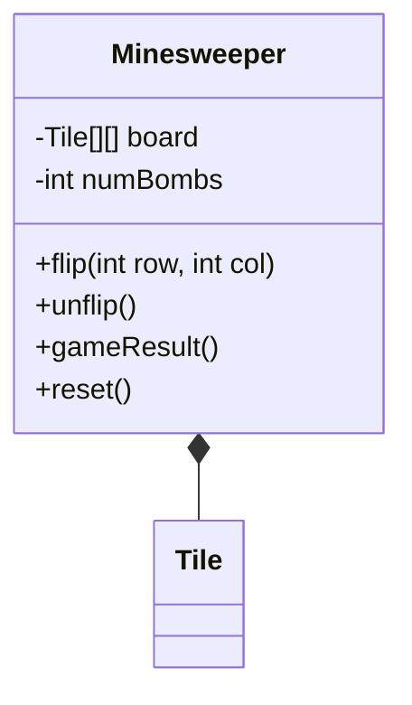
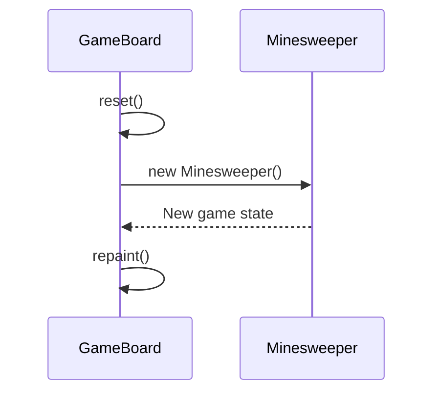
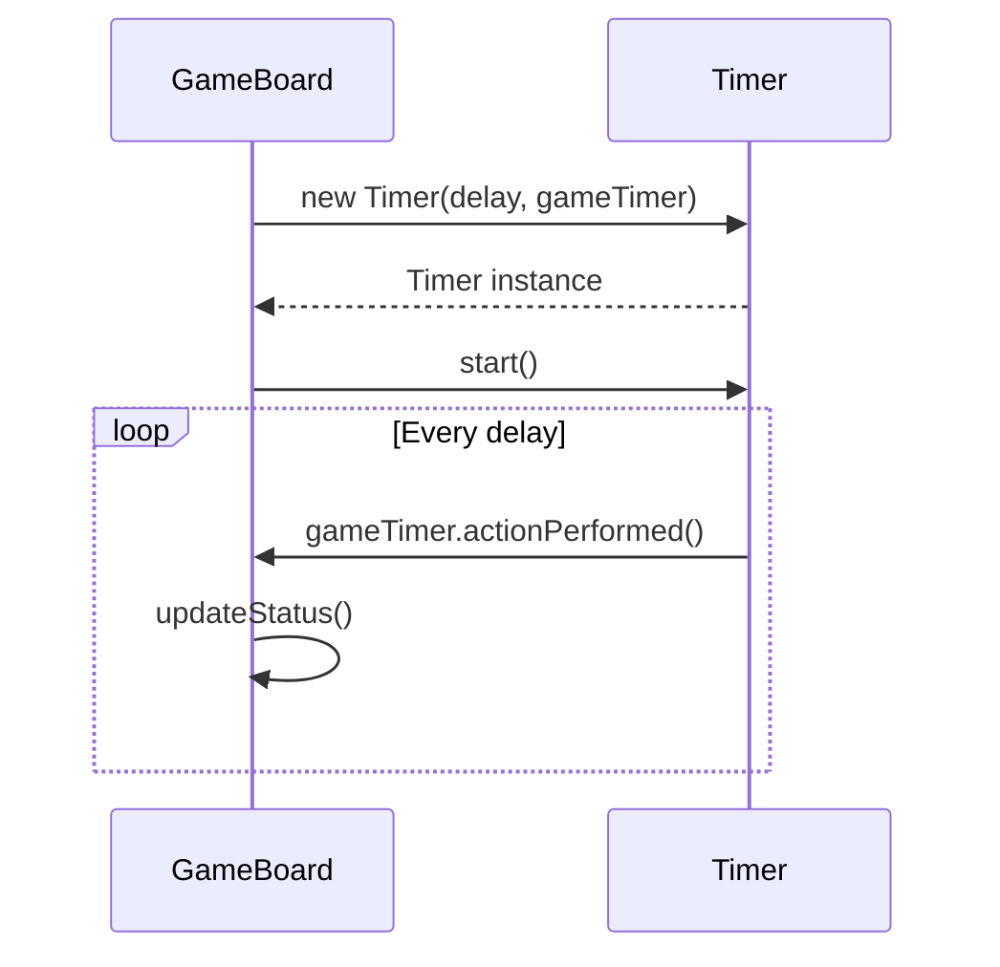
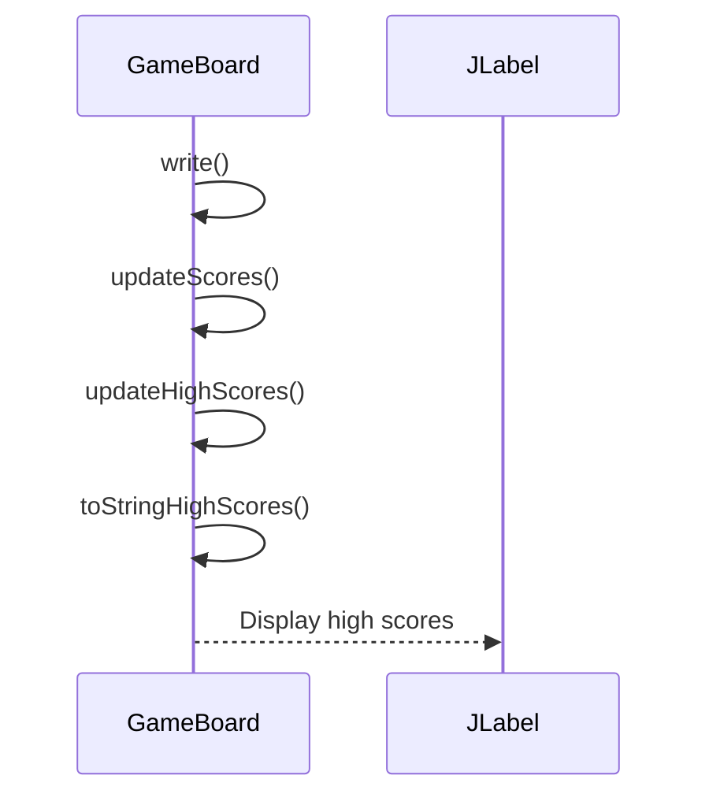

Relevant source files

The following files were used as context for generating this wiki page:

- [Game.java](https://github.com/aanickode/Minesweeper-Project/blob/main/Game.java)
- [GameBoard.java](https://github.com/aanickode/Minesweeper-Project/blob/main/GameBoard.java)
- [Tile.java](https://github.com/aanickode/Minesweeper-Project/blob/main/Tile.java)
- [Minesweeper.java](https://github.com/aanickode/Minesweeper-Project/blob/main/Minesweeper.java)
- [Files/FastestTime.txt](https://github.com/aanickode/Minesweeper-Project/blob/main/Files/FastestTime.txt)

# Data Flow

## Introduction

The data flow in this Minesweeper game project revolves around the interaction between the game's Model-View-Controller (MVC) components. The `Minesweeper` class serves as the model, responsible for maintaining the game state and logic. The `GameBoard` class acts as the view and controller, handling user input, updating the game board's visual representation, and communicating with the model.

Sources: [Game.java](https://github.com/aanickode/Minesweeper-Project/blob/main/Game.java), [GameBoard.java](https://github.com/aanickode/Minesweeper-Project/blob/main/GameBoard.java), [Minesweeper.java](https://github.com/aanickode/Minesweeper-Project/blob/main/Minesweeper.java)

## Game Initialization

The game initialization process sets up the main window, game board, and user interface components. The `Game` class is responsible for creating the top-level frame and initializing the `GameBoard` instance, which handles the game logic and rendering.

Sources: [Game.java:52-97](https://github.com/aanickode/Minesweeper-Project/blob/main/Game.java#L52-L97), [GameBoard.java:35-71](https://github.com/aanickode/Minesweeper-Project/blob/main/GameBoard.java#L35-L71)

## Game Board Rendering

The `GameBoard` class is responsible for rendering the game board and updating its visual state based on the model's data. It uses the `Tile` class to represent individual tiles on the board and the `Minesweeper` class to access the game state.

The `paintComponent` method in `GameBoard` is responsible for rendering the game board by iterating over the `Tile` objects and drawing their respective states (e.g., bombs, numbers).

Sources: [GameBoard.java](https://github.com/aanickode/Minesweeper-Project/blob/main/GameBoard.java), [Tile.java](https://github.com/aanickode/Minesweeper-Project/blob/main/Tile.java), [Minesweeper.java](https://github.com/aanickode/Minesweeper-Project/blob/main/Minesweeper.java)

## User Input Handling

The `GameBoard` class listens for mouse click events and updates the game state accordingly. When a user clicks on a tile, the `GameBoard` communicates with the `Minesweeper` model to flip the corresponding tile and update the game state.

Sources: [GameBoard.java:47-62](https://github.com/aanickode/Minesweeper-Project/blob/main/GameBoard.java#L47-L62), [Minesweeper.java:61-84](https://github.com/aanickode/Minesweeper-Project/blob/main/Minesweeper.java#L61-L84), [Tile.java:32-35](https://github.com/aanickode/Minesweeper-Project/blob/main/Tile.java#L32-L35)

## Game State Management

The `Minesweeper` class manages the game state, including the board configuration, bomb placements, and game logic. It provides methods for flipping tiles, checking the game result, and resetting the game.

The `flip` method in `Minesweeper` updates the state of the corresponding `Tile` object and performs additional logic, such as revealing neighboring tiles if the flipped tile is not a bomb.

Sources: [Minesweeper.java](https://github.com/aanickode/Minesweeper-Project/blob/main/Minesweeper.java), [Tile.java](https://github.com/aanickode/Minesweeper-Project/blob/main/Tile.java)

## Game Reset and Undo

The `GameBoard` class provides functionality for resetting the game and undoing the last move. The `reset` method resets the game state by creating a new instance of the `Minesweeper` model and updating the game board's visual representation.

The `undo` method in `GameBoard` communicates with the `Minesweeper` model to unflip the last flipped tile and updates the game board accordingly.

Sources: [GameBoard.java:77-86](https://github.com/aanickode/Minesweeper-Project/blob/main/GameBoard.java#L77-L86), [GameBoard.java:88-93](https://github.com/aanickode/Minesweeper-Project/blob/main/GameBoard.java#L88-L93), [Minesweeper.java:86-93](https://github.com/aanickode/Minesweeper-Project/blob/main/Minesweeper.java#L86-L93)

## Game Timer and Move Tracking

The `GameBoard` class manages a timer and keeps track of the number of moves made by the player. The timer is implemented using a `Timer` object and an `ActionListener`, which updates the game status label with the elapsed time and the number of moves.

The `updateStatus` method in `GameBoard` updates the game status label based on the game result, elapsed time, and the number of moves made.

Sources: [GameBoard.java:35-71](https://github.com/aanickode/Minesweeper-Project/blob/main/GameBoard.java#L35-L71), [GameBoard.java:96-108](https://github.com/aanickode/Minesweeper-Project/blob/main/GameBoard.java#L96-L108)

## High Score Management

The `GameBoard` class manages high scores by reading and writing to a file named `FastestTime.txt`. When the player wins a game, the elapsed time and the number of moves are written to the file. The high scores are then updated and displayed on the game board.

The `write` method appends the current game's elapsed time and the number of moves to the `FastestTime.txt` file. The `updateScores` method reads the file and populates a `TreeMap` with the scores. The `updateHighScores` method sorts the scores and selects the top 5 scores, which are then displayed on the game board using the `toStringHighScores` method.

Sources: [GameBoard.java:123-126](https://github.com/aanickode/Minesweeper-Project/blob/main/GameBoard.java#L123-L126), [GameBoard.java:128-165](https://github.com/aanickode/Minesweeper-Project/blob/main/GameBoard.java#L128-L165), [GameBoard.java:167-183](https://github.com/aanickode/Minesweeper-Project/blob/main/GameBoard.java#L167-L183), [GameBoard.java:185-191](https://github.com/aanickode/Minesweeper-Project/blob/main/GameBoard.java#L185-L191), [Files/FastestTime.txt](https://github.com/aanickode/Minesweeper-Project/blob/main/Files/FastestTime.txt)

## Conclusion

The data flow in this Minesweeper game project follows the Model-View-Controller (MVC) design pattern. The `Minesweeper` class acts as the model, managing the game state and logic. The `GameBoard` class serves as the view and controller, handling user input, rendering the game board, and communicating with the model. The `Tile` class represents individual tiles on the game board. The project also includes functionality for tracking game time, moves, and high scores, which are managed by the `GameBoard` class.