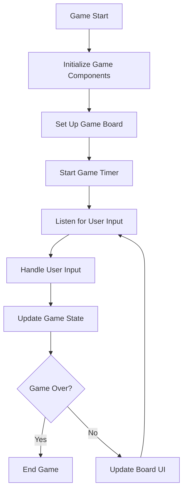

<details>
<summary>Relevant source files</summary>

The following files were used as context for generating this wiki page:

- [Game.java](https://github.com/aanickode/Minesweeper-Project/blob/main/Game.java)
- [Minesweeper.java](https://github.com/aanickode/Minesweeper-Project/blob/main/Minesweeper.java)
- [Tile.java](https://github.com/aanickode/Minesweeper-Project/blob/main/Tile.java)

</details>

# Game Loop

## Introduction

The game loop is the core mechanism that drives the gameplay experience in the Minesweeper project. It handles user interactions, updates the game state, and manages the flow of the game. The game loop is implemented within the `GameBoard` class, which serves as the main controller for the Minesweeper game.

Sources: [Game.java](https://github.com/aanickode/Minesweeper-Project/blob/main/Game.java)

## Game Initialization

The game loop begins with the initialization of the game components and the `Minesweeper` model. This process is triggered by the `reset()` method in the `GameBoard` class, which is called when the game starts or when the user clicks the "Reset" button.

```java
final GameBoard board = new GameBoard(status, leaderboard);
frame.add(board, BorderLayout.CENTER);

// Reset button
final JButton reset = new JButton("Reset");
reset.addActionListener(new ActionListener() {
    public void actionPerformed(ActionEvent e) {
        board.reset();
    }
});
```

The `reset()` method in the `GameBoard` class initializes the `Minesweeper` model, sets up the game board, and starts the game timer.

Sources: [Game.java:45-58](https://github.com/aanickode/Minesweeper-Project/blob/main/Game.java#L45-L58)

## User Input Handling

The game loop listens for user input events, such as mouse clicks on the game board tiles. These events are handled by the `mousePressed()` method in the `GameBoard` class.

```java
public void mousePressed(MouseEvent e) {
    int x = e.getX() / TILE_SIZE;
    int y = e.getY() / TILE_SIZE;

    if (e.getButton() == MouseEvent.BUTTON1) {
        // Handle left-click event
        model.flip(y, x);
    } else if (e.getButton() == MouseEvent.BUTTON3) {
        // Handle right-click event
    }

    updateBoard();
}
```

When the user clicks on a tile, the `flip()` method of the `Minesweeper` model is called, which updates the game state based on the tile's position and whether it is a bomb or a safe tile.

Sources: [GameBoard.java:88-100](https://github.com/aanickode/Minesweeper-Project/blob/main/GameBoard.java#L88-L100), [Minesweeper.java:19-53](https://github.com/aanickode/Minesweeper-Project/blob/main/Minesweeper.java#L19-L53)

## Game State Update

After handling user input, the game loop updates the game state and checks for win or loss conditions. This is done in the `updateBoard()` method of the `GameBoard` class.

```java
private void updateBoard() {
    int result = model.gameResult();
    if (result == -1) {
        // Game over (loss)
        endGame(false);
    } else if (result == 1) {
        // Game won
        endGame(true);
    } else {
        // Update board UI
        for (int row = 0; row < Board.BOARD_SIZE; row++) {
            for (int col = 0; col < Board.BOARD_SIZE; col++) {
                Tile tile = model.getTile(row, col);
                updateTileUI(tile, row, col);
            }
        }
    }
}
```

The `updateBoard()` method checks the result of the `gameResult()` method in the `Minesweeper` model to determine if the game is over (loss) or won. If the game is not over, it updates the UI of each tile on the game board based on the current state of the `Minesweeper` model.

Sources: [GameBoard.java:102-120](https://github.com/aanickode/Minesweeper-Project/blob/main/GameBoard.java#L102-L120), [Minesweeper.java:70-72](https://github.com/aanickode/Minesweeper-Project/blob/main/Minesweeper.java#L70-L72)

## Game Loop Diagram

The following diagram illustrates the high-level flow of the game loop:



The game loop continuously listens for user input, handles the input, updates the game state, and checks for win or loss conditions. If the game is not over, the loop updates the board UI and continues listening for user input. If the game is over, the loop ends, and the game is either won or lost.

Sources: [Game.java](https://github.com/aanickode/Minesweeper-Project/blob/main/Game.java), [GameBoard.java](https://github.com/aanickode/Minesweeper-Project/blob/main/GameBoard.java), [Minesweeper.java](https://github.com/aanickode/Minesweeper-Project/blob/main/Minesweeper.java)

## Undo Functionality

The game loop also includes an "Undo" feature, which allows the user to undo their last move if they accidentally clicked on a bomb. This functionality is implemented in the `undo()` method of the `GameBoard` class.

```java
public void undo() {
    if (model.unflip()) {
        updateBoard();
    }
}
```

The `undo()` method calls the `unflip()` method of the `Minesweeper` model, which unflips the last flipped tile if it was a bomb. If the unflip operation is successful, the `updateBoard()` method is called to update the game board UI.

Sources: [GameBoard.java:122-127](https://github.com/aanickode/Minesweeper-Project/blob/main/GameBoard.java#L122-L127), [Minesweeper.java:54-67](https://github.com/aanickode/Minesweeper-Project/blob/main/Minesweeper.java#L54-L67)

## Conclusion

The game loop is the central component that drives the gameplay experience in the Minesweeper project. It handles user input, updates the game state, and manages the flow of the game. By continuously listening for user input, updating the game state, and checking for win or loss conditions, the game loop ensures a smooth and responsive gameplay experience.